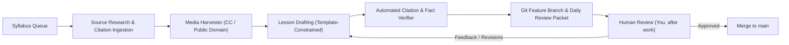

# Instructabot 🤖📚

> **Autonomous AI-Authored, Human-Reviewed State-of-the-Art Robotics Curriculum**  
> *Designed for high school and college students with zero coding, mechanical engineering, or electrical engineering background.*

---

## 🌟 Vision & Purpose
Robotics is the ultimate cross-disciplinary engineering field—requiring software engineering, electronics, mechanics, physics, and control systems. Traditional robotics curricula often require steep university prerequisites in multivariable calculus, linear algebra, C++, and circuit analysis, alienating beginners.

**Instructabot** bridges this chasm by constructing a **zero-floor, high-ceiling** curriculum:
1. **Zero Coding / ME / EE Experience Required**: Every concept starts with physical intuition, interactive visual models, and zero-cost browser simulations (Tinkercad, Wokwi, Webots).
2. **Path to State-of-the-Art**: Students progress steadily through digital electronics, microcontrollers, kinematics, and computer vision, culminating in industry-standard **ROS 2**, **SLAM**, and **Modern AI Foundation Models**.
3. **Zero Hallucination / 100% Cited**: Every scientific principle, formula, and technical specification is cited directly to verified public educational sources (MIT OpenCourseWare, NASA, IEEE, Open Robotics).
4. **Public Domain & Creative Commons Media**: All diagrams, photos, and video embeds are verified open educational assets tracked in a version-controlled manifest.
5. **Autonomous Authoring with Human-in-the-Loop Review**: The AI agent conducts deep research, pulls sources, and drafts lessons in Git branches while you are away. You review, approve, or refine each lesson when you return.

---

## 🗺️ Master Curriculum Syllabus

The curriculum is structured across 11 comprehensive units (Units 0 through 10):

| Unit | Title | Level | Hands-On Simulation | Capstone Milestone | Status |
| :--- | :--- | :--- | :--- | :--- | :--- |
| [**Unit 0**](curriculum/SYLLABUS.md#unit-0-the-robotic-mindset--anatomy-of-systems) | **The Robotic Mindset & Anatomy of Systems** | Beginner | Systems Decomposition | Reverse-engineer real robots (Curiosity, Roomba) | ✅ [Reviewed](reviews/2026-10-04-unit-00-lesson-01-review.md) |
| [**Unit 1**](curriculum/SYLLABUS.md#unit-1-the-spark-electricity--electronics-from-scratch) | **The Spark: Electricity & Electronics from Scratch** | Beginner | Tinkercad Circuits / PhET | Autonomously triggered nightlight circuit (no code) | ✅ [Reviewed](reviews/2026-10-04-unit-01-electronics-review.md) |
| [**Unit 2**](curriculum/SYLLABUS.md#unit-2-the-brain-computational-thinking--microcontrollers) | **The Brain: Computational Thinking & Microcontrollers** | Beginner | Wokwi (ESP32/Pico) & Python | Multi-state smart traffic & pedestrian crosswalk | ✅ [Reviewed](reviews/2026-10-04-unit-02-the-brain-review.md) |
| [**Unit 3**](curriculum/SYLLABUS.md#unit-3-the-senses-sensors-signals--perception) | **The Senses: Sensors, Signals, & Perception** | Intermediate | Wokwi & Python | Ultrasonic radar scanner with noise filter | ✅ [Reviewed](reviews/2026-10-04-unit-03-the-senses-review.md) |
| [**Unit 4**](curriculum/SYLLABUS.md#unit-4-the-muscles-motors-actuation--power-electronics) | **The Muscles: Motors, Actuation, & Power Electronics** | Intermediate | Wokwi (PWM & H-Bridges) | Bi-directional motor controller with soft acceleration | ✅ [Reviewed](reviews/2026-10-04-unit-04-the-muscles-review.md) |
| [**Unit 5**](curriculum/SYLLABUS.md#unit-5-the-bones-mechanics-kinematics--cad-modeling) | **The Bones: Mechanics, Kinematics, & CAD Modeling** | Intermediate | Onshape CAD / Web Visualizer | 3D-modeled 2-DOF robotic arm with torque sizing | ✅ [Reviewed](reviews/2026-10-04-unit-05-the-bones-review.md) |
| [**Unit 6**](curriculum/SYLLABUS.md#unit-6-movement--mobile-robotics-driving-the-physical-world) | **Movement & Mobile Robotics: Driving the Physical World** | Advanced | Webots Robotics Simulator | Maze-navigating differential-drive mobile robot | ✅ [Reviewed](reviews/2026-10-04-unit-06-mobile-robotics-review.md) |
| [**Unit 7**](curriculum/SYLLABUS.md#unit-7-vision-giving-robots-sight-with-opencv) | **Vision: Giving Robots Sight with OpenCV** | Advanced | Python, OpenCV, Webots | Color-tracking & ArUco fiducial marker targeting turret | ✅ [Reviewed](reviews/2026-10-04-unit-07-robot-vision-review.md) |
| [**Unit 8**](curriculum/SYLLABUS.md#unit-8-ros-2-the-industry-standard-robot-operating-system) | **ROS 2: The Industry Standard Robot Operating System** | Professional | ROS 2 (Humble/Iron) & RViz | Distributed multi-node robotic control pipeline | ✅ [Reviewed](reviews/2026-10-04-unit-08-ros2-middleware-review.md) |
| [**Unit 9**](curriculum/SYLLABUS.md#unit-9-autonomous-navigation-slam--path-planning) | **Autonomous Navigation: SLAM & Path Planning** | Professional | ROS 2 Nav2 & Webots / Gazebo | Autonomous warehouse mapping and waypoint navigation | ✅ [Reviewed](reviews/2026-10-04-unit-09-autonomous-navigation-review.md) |
| [**Unit 10**](curriculum/SYLLABUS.md#unit-10-state-of-the-art-modern-ai-foundation-models--sim2real) | **State of the Art: Modern AI, Foundation Models, & S2R** | SOTA | PyTorch, YOLO, Sim2Real | Semantic object-sorting robot with deep learning | ✅ [Reviewed](reviews/2026-10-04-unit-10-modern-ai-sim2real-review.md) |

👉 Read the full [Master Syllabus & Unit Breakdown](curriculum/SYLLABUS.md).

---

## 📁 Repository Structure

```text
Instructabot/
├── README.md                        # Project mission, overview, and workflow
├── .gitignore                       # Git ignore rules
├── curriculum/
│   ├── SYLLABUS.md                  # Complete master syllabus and unit breakdown
│   ├── LESSON_TEMPLATE.md           # Standardized template for authoring lessons
│   ├── unit-00-foundations/         # Unit 0 lessons and labs
│   ├── unit-01-electronics/         # Unit 1 lessons and labs
│   └── ...
├── sources/
│   └── source_index.json            # Registry of verified public citations & textbooks
├── media/
│   ├── assets/                      # Diagrams, schematics, and photos
│   └── media_manifest.json          # License, URL, and attribution for every asset
├── agent/                           # Autonomous research, authoring, and verification tools
└── reviews/                         # Daily review summaries generated for human approval
```

---

## 🔄 Autonomous Workflow: "While You're at Work"



1. **Autonomous Drafting**: The agent picks the next lesson from `SYLLABUS.md`, retrieves authoritative sources, and drafts the lesson strictly grounded in those sources.
2. **Citation Verification**: An automated check validates that all claims reference registered sources in `sources/source_index.json` and all media has verified licenses in `media/media_manifest.json`.
3. **Daily Review Packet**: The agent commits to a branch and leaves a review summary in `reviews/` detailing the newly drafted lesson, core analogies used, and citations for you to inspect.
4. **Your Approval**: You review the git diff, test or inspect the simulation steps, and approve or request adjustments.
