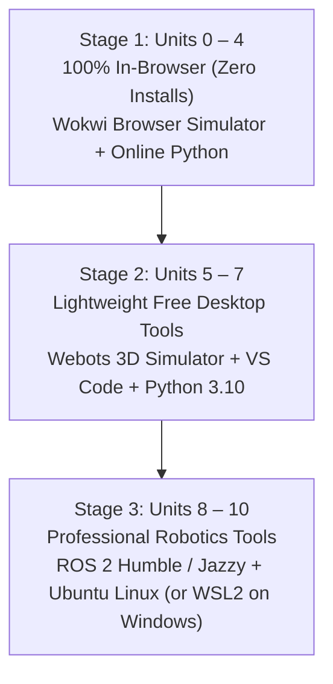

# 🚀 Getting Started with Instructabot

> **Welcome to Robotics!**  
> If you have never written a single line of code, never held a soldering iron, and never taken physics—**you are in the right place.**

---

## 🌟 The First-Day Guarantee
You will make a virtual electronic circuit work in your web browser **within 5 minutes of opening this page**, with **zero software to install**.

### ⚡ Step 1: Open Your First Circuit (Zero Installs)
1. Open the [Unit 1 Interactive Nightlight Simulator](https://wokwi.com).
2. Click the green **Play** button in the simulator toolbar.
3. Drag the simulated flashlight icon to shine light on the photoresistor:
   - When light shines on the sensor $\to$ The LED automatically turns **OFF**.
   - When you pull the flashlight away into darkness $\to$ The LED turns **ON**.
4. 🎉 **Congratulations! You just analyzed your first autonomous sensor-actuator robotic circuit!**

---

## 🗺️ Choose Your Learning Track

Not everyone learns at the same pace or has the same goals. Choose the track that fits your schedule:

| Track | Who It's For | Weekly Commitment | Path Highlights |
| :--- | :--- | :--- | :--- |
| **🎒 High School / Explorer Track** | High school students, curious beginners, after-school robotics clubs. | 2–3 hours / week | Units 0 through 4 (Electronics, MicroPython, Sensors, Motors). Focus on hands-on Wokwi circuits and intuitive mechanical analogies. |
| **🎓 College / Engineering Track** | Undergraduate CS/ME/EE students, STEM majors, career transitioners. | 5–8 hours / week | Units 0 through 10 (Full Curriculum). Deep dive into C++/Python, kinematics, ROS 2 middleware, SLAM, and YOLO computer vision. |
| **🛠️ Weekend Maker Track** | Adults and hobbyists building practical physical projects. | 3–4 hours / week | Units 1, 2, 4, 6, 7. Focus on physical motor control, 3D printing/CAD, and OpenCV pan-tilt turrets. |

---

## 🖥️ Software Environment: Zero-Friction Progression

Instructabot is designed so you only install software **when you genuinely need it**:

1. **Units 0 – 4 (Foundations, Electronics, Brain, Senses, Motors)**:
   - Requires only a modern web browser (Chrome, Edge, Firefox, Safari).
   - All labs run in **Wokwi** and web Python. Works seamlessly on Chromebooks, MacBooks, and Windows laptops!
2. **Units 5 – 7 (Mechanics, Mobile Robotics, Computer Vision)**:
   - Install **[Webots Robot Simulator](https://cyberbotics.com)** (Free, open-source 3D physics simulator for Windows, Mac, and Linux).
   - Install **[Python 3.10+](https://www.python.org)** and **VS Code**.
3. **Units 8 – 10 (ROS 2, Autonomous SLAM, SOTA AI Foundation Models)**:
   - Run **ROS 2 Humble / Jazzy** natively on Ubuntu Linux, or inside **Windows Subsystem for Linux (WSL2)**, or using our pre-configured Docker container.

---

## 🛑 How to Get Unstuck: The "Three-Step Rule"

Whenever code throws an error or a circuit doesn't respond:
1. **Check the Common Pitfalls Section**: Every lesson includes a dedicated `[!WARNING]` troubleshooting guide addressing the most frequent beginner mistakes.
2. **Check the Plain-English Glossary**: If a technical term feels confusing, look it up in the [Robotics Glossary](glossary.md) for an everyday mechanical analogy.
3. **Consult the AI Editorial Board**: Run `python agent/reviewers/persona_tester.py` to evaluate your lab code against student friction metrics.
