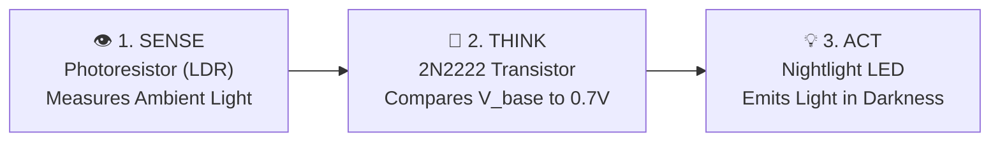
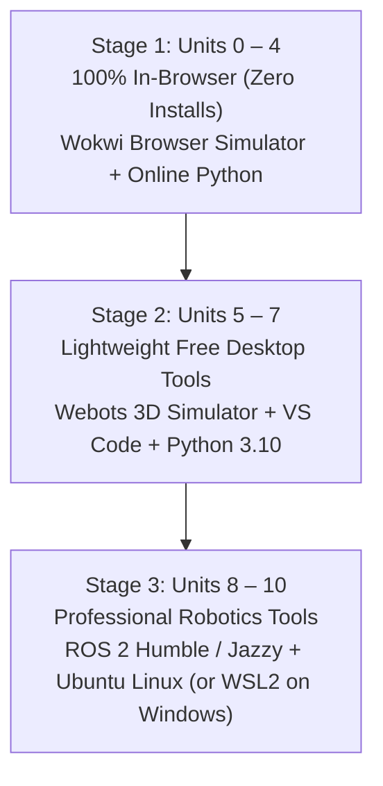

# 🚀 Getting Started with Instructabot

> **Welcome to Robotics!**  
> If you have never written a single line of code, never held a soldering iron, and never taken physics—**you are in the right place.**

---

## 🌟 The First-Day Guarantee
You will make a virtual electronic circuit work in your web browser **within 5 minutes of opening this page**, with **zero software to install**.

### ⚡ Step 1: Open Your First Circuit (Zero Installs)

> [!TIP] **Launch the Interactive Web Simulator**  
> We host a standalone interactive circuit simulator that runs directly in your browser with zero logins or software installations:  
> 🚀 **[Click Here to Launch the Live Interactive Nightlight Simulator](https://jscottvogel.github.io/Instructabot/simulator.html)**

#### How the Autonomous Sense-Think-Act Loop Operates:

| Environmental State | Sensor Resistance ($R_{\text{LDR}}$) | Transistor Base Voltage ($V_b$) | Transistor Switch State | Nightlight LED |
| :--- | :--- | :--- | :--- | :--- |
| **☀️ Bright Daylight / Flashlight ON** | Very Low ($\approx 500\,\Omega$) | Drops to **$< 0.7\,\text{V}$** | **OPEN** (Cutoff — No Current) | **OFF (Dark)** |
| **🌙 Midnight Darkness / Flashlight OFF** | Very High ($> 200\,\text{k}\Omega$) | Rises to **$\ge 0.7\,\text{V}$** | **CLOSED** (Saturation — Conducting) | **ON (Glowing!)** |

#### Step-by-Step Instructions:
1. **Launch the Simulation**:
   - Open the **[Live In-Browser Nightlight Simulator](https://jscottvogel.github.io/Instructabot/simulator.html)**.
   - Or open [Autodesk Tinkercad Circuits](https://www.tinkercad.com/circuits) for the hands-on virtual breadboard wiring lab.
2. **Interact with the Sensor**:
   - Drag the ambient light / flashlight slider back and forth.
   - **Shine light on the sensor** $\to$ Watch Base Voltage drop below $0.7\,\text{V}$ $\to$ The LED automatically turns **OFF**.
   - **Pull the light into darkness** $\to$ Watch Base Voltage exceed $0.7\,\text{V}$ $\to$ The LED instantly illuminates **ON**.
3. 🎉 **Congratulations! You just analyzed your first autonomous sensor-actuator robotic circuit!**

---

### 🛠️ Next: Build the Full Physical Circuit on a Breadboard
Ready to wire the components together yourself?
- Follow the full step-by-step breadboard assembly guide in [Lab 1: The Zero-Code Light-Sensitive Nightlight](unit-01-electronics/lab-01-zero-code-nightlight.md).
- In Unit 2, we introduce programmable microcontrollers using Wokwi with pre-configured project files in [`simulations/wokwi/`](https://github.com/jscottvogel/Instructabot/tree/main/simulations/wokwi).

---

## 🗺️ Choose Your Learning Track

Not everyone learns at the same pace or has the same goals. Pick the track that fits your schedule and click **Start Track** to begin your journey immediately:

| Track | Who It's For | Weekly Commitment | Coverage | Immediate Action |
| :--- | :--- | :--- | :--- | :--- |
| [**🎒 High School / Explorer Track**](#track-1) | High school students, curious beginners, robotics teams (FIRST/VEX). | 2–3 hrs / wk (10 weeks) | Units 0 – 4 (Electronics, MicroPython, Senses, Muscles) | [**▶️ Start Track 1**](unit-00-foundations/01-what-is-a-robot.md) |
| [**🎓 College / Engineering Track**](#track-2) | Undergraduate CS/ME/EE students, STEM majors, career transitioners. | 5–8 hrs / wk (15 weeks) | Units 0 – 10 (Full Curriculum: ROS 2, SLAM, Vision, AI) | [**▶️ Start Track 2**](unit-00-foundations/01-what-is-a-robot.md) |
| [**🛠️ Weekend Maker Track**](#track-3) | Adult hobbyists, tinkerers, and builders creating physical hardware. | 3–4 hrs / wk (6 weeks) | Units 1, 2, 4, 6, 7 (Practical Circuits, Motors, 3D CAD, Vision) | [**▶️ Start Track 3**](unit-01-electronics/01-intuitive-electrical-physics.md) |

---

### 🎒 Track 1: High School / Explorer Track (Units 0 – 4)
*Goal: Build an intuitive foundation in electronics, programming, sensors, and motors without software headaches.*  
**Environment**: 100% In-Browser (Wokwi & In-Browser Python). Zero software installation required.

> 🚀 **Ready to begin? [Click Here to Start Lesson 0.1: What Makes a Robot a Robot? →](unit-00-foundations/01-what-is-a-robot.md)**

#### Sequential Track Checklist:
- [ ] **Unit 0: Foundations & Systems Thinking**
  - [x] [Module 0.1: What Makes a Robot a Robot? (Sense-Think-Act)](unit-00-foundations/01-what-is-a-robot.md)
  - [ ] [Module 0.2: The Five Subsystems of Any Robot](unit-00-foundations/02-the-five-subsystems.md)
  - [ ] [Module 0.3: Engineering Notebooks, Safety, and Ethics](unit-00-foundations/03-safety-ethics-notebook.md)
  - [ ] [Lab 0: Reverse-Engineering Systems Decomposition](unit-00-foundations/lab-00-systems-decomposition.md)
- [ ] **Unit 1: Electricity & Electronics from Scratch**
  - [ ] [Module 1.1: Intuitive Electrical Physics](unit-01-electronics/01-intuitive-electrical-physics.md)
  - [ ] [Module 1.2: Circuit Components & Breadboarding](unit-01-electronics/02-circuit-components-breadboarding.md)
  - [ ] [Module 1.3: Power Delivery & Voltage Regulators](unit-01-electronics/03-power-delivery-and-regulators.md)
  - [ ] [Lab 1: The Zero-Code Light-Sensitive Nightlight](unit-01-electronics/lab-01-zero-code-nightlight.md)
- [ ] **Unit 2: Computational Thinking & Microcontrollers**
  - [ ] [Module 2.1: Algorithmic Logic & Flowcharts](unit-02-the-brain/01-algorithmic-logic-and-flowcharts.md)
  - [ ] [Module 2.2: Python for Robotics (MicroPython on Raspberry Pi Pico)](unit-02-the-brain/02-python-for-robotics.md)
  - [ ] [Module 2.3: Microcontrollers vs. Single-Board Computers](unit-02-the-brain/03-microcontrollers-vs-sbcs.md)
  - [ ] [Lab 2: Autonomous Traffic Intersection Controller](unit-02-the-brain/lab-02-intersection-controller.md)
- [ ] **Unit 3: Sensors, Signals, & Perception**
  - [ ] [Module 3.1: Analog vs. Digital Signals](unit-03-the-senses/01-analog-vs-digital-signals.md)
  - [ ] [Module 3.2: Distance & Proximity Sensing](unit-03-the-senses/02-distance-and-proximity.md)
  - [ ] [Module 3.3: Motion & Orientation IMUs](unit-03-the-senses/03-motion-and-orientation-imus.md)
  - [ ] [Module 3.4: Noise & Signal Conditioning](unit-03-the-senses/04-noise-and-signal-conditioning.md)
  - [ ] [Lab 3: Ultrasonic Sonar Radar Scanner](unit-03-the-senses/lab-03-sonar-radar-scanner.md)
- [ ] **Unit 4: Motors, Actuation, & Power Electronics**
  - [ ] [Module 4.1: Electric Motors Compared](unit-04-the-muscles/01-electric-motors-compared.md)
  - [ ] [Module 4.2: H-Bridge Motor Driving](unit-04-the-muscles/02-h-bridge-motor-driving.md)
  - [ ] [Module 4.3: Speed, Direction & Soft-Start Acceleration](unit-04-the-muscles/03-speed-direction-soft-start.md)
  - [ ] [Lab 4: PWM Motor Driver & S-Curve Profiling](unit-04-the-muscles/lab-04-motor-drive-acceleration.md)

---

### 🎓 Track 2: College / Engineering Undergraduate Track (Units 0 – 10)
*Goal: Master end-to-end autonomous robotics engineering, from circuit breadboarding and kinematics to industry-standard ROS 2, LiDAR SLAM, and modern AI vision.*  
**Environment**: Progressive 3-Stage Setup (Browser $\to$ Free Webots 3D Physics Simulator $\to$ Ubuntu Linux / ROS 2 Humble).

> 🚀 **Ready to begin? [Click Here to Start Module 0.1: What Makes a Robot a Robot? →](unit-00-foundations/01-what-is-a-robot.md)**

#### Track Milestones:
1. **Stage 1 (Units 0 – 4)**: Mechatronic Hardware & Microcontroller Firmware Foundations (In-Browser).
2. **Stage 2 (Units 5 – 7)**: 3D CAD Modeling, Closed-Loop PID Control, and OpenCV Vision in Webots:
   - [Unit 5: Mechanics, Kinematics, & CAD Modeling](unit-05-the-bones/01-structural-fundamentals.md)
   - [Unit 6: Driving the Physical World & Webots 3D Simulation](unit-06-mobile-robotics/01-drive-architectures.md)
   - [Unit 7: Computer Vision with OpenCV & Pan-Tilt Turret](unit-07-robot-vision/01-digital-images-matrices.md)
3. **Stage 3 (Units 8 – 10)**: Industry Middleware & Autonomous AI Agents:
   - [Unit 8: ROS 2 Middleware Architecture & Nodes](unit-08-ros2-middleware/01-why-middleware-ros2.md)
   - [Unit 9: Autonomous Navigation & LiDAR SLAM](unit-09-autonomous-navigation/01-fundamental-problem-of-slam.md)
   - [Unit 10: Modern AI, Foundation Models, & Sim2Real Capstone](unit-10-modern-ai-sim2real/01-classical-vs-ai-robotics.md)
- 🗺️ Review the comprehensive syllabus: [**Open Master Syllabus (51 Modules & Labs)**](SYLLABUS.md).

---

### 🛠️ Track 3: Weekend Maker / Hobbyist Track (Units 1, 2, 4, 6, 7)
*Goal: Fast-track to physical maker builds—learn how to wire sensors, control motors, design 3D parts, and track objects with computer vision.*  
**Environment**: Raspberry Pi Pico, standard breadboard components, Webots 3D sim, and Python.

> 🚀 **Ready to begin? [Click Here to Start Unit 1: Intuitive Electrical Physics →](unit-01-electronics/01-intuitive-electrical-physics.md)**

#### Curated 5-Project Fast-Track:
1. **Project 1: Analog Circuits & Autonomous Nightlight**
   - [Module 1.1: Intuitive Electrical Physics](unit-01-electronics/01-intuitive-electrical-physics.md)
   - [Module 1.2: Breadboarding & Circuit Schematics](unit-01-electronics/02-circuit-components-breadboarding.md)
   - [Lab 1: Build the Zero-Code Autonomous Nightlight](unit-01-electronics/lab-01-zero-code-nightlight.md)
2. **Project 2: MicroPython Firmware & State Machines**
   - [Module 2.1: Algorithmic Logic & Flowcharts](unit-02-the-brain/01-algorithmic-logic-and-flowcharts.md)
   - [Module 2.2: Python for Robotics on Raspberry Pi Pico](unit-02-the-brain/02-python-for-robotics.md)
   - [Lab 2: Program an Autonomous Traffic Intersection](unit-02-the-brain/lab-02-intersection-controller.md)
3. **Project 3: High-Power Motor Driving & PWM**
   - [Module 4.1: DC Motors, Servos, and Steppers](unit-04-the-muscles/01-electric-motors-compared.md)
   - [Module 4.2: H-Bridge Motor Drivers](unit-04-the-muscles/02-h-bridge-motor-driving.md)
   - [Lab 4: Smooth S-Curve Motor Acceleration Profile](unit-04-the-muscles/lab-04-motor-drive-acceleration.md)
4. **Project 4: 3D CAD Modeling & Robotic Arm Sizing**
   - [Module 5.4: CAD Modeling for 3D Printing & Laser Cutting](unit-05-the-bones/04-cad-modeling-for-robotics.md)
   - [Lab 5: Design and Size a 3-DOF Robotic Arm](unit-05-the-bones/lab-05-robotic-arm-cad-sizing.md)
5. **Project 5: Computer Vision & Color / Face Tracking Turret**
   - [Module 7.2: OpenCV Python Foundations](unit-07-robot-vision/02-opencv-python-foundations.md)
   - [Lab 7: Autonomous Pan-Tilt Visual Tracking Turret](unit-07-robot-vision/lab-07-pan-tilt-visual-turret.md)

---

## 🖥️ Software Environment: Zero-Friction Progression

Instructabot is designed so you only install software **when you genuinely need it**:

1. **Units 0 – 4 (Foundations, Electronics, Brain, Senses, Motors)**:
   - Requires only a modern web browser (Chrome, Edge, Firefox, Safari).
   - All labs run in **Wokwi** and web Python. Works seamlessly on Chromebooks, MacBooks, and Windows laptops!
2. **Units 5 – 7 (Mechanics, Mobile Robotics, Computer Vision)**:
   - Install **[Webots Robot Simulator](https://cyberbotics.com)** (Free, open-source 3D physics simulator for Windows, Mac, and Linux).
   - Install **[Python 3.10+](https://www.python.org)** and **VS Code**.
3. **Units 8 – 10 (ROS 2, Autonomous SLAM, SOTA AI Foundation Models)**:
   - Run **ROS 2 Humble / Jazzy** natively on Ubuntu Linux, or inside **Windows Subsystem for Linux (WSL2)**, or using our pre-configured Docker container.

---

## 🛑 How to Get Unstuck: The "Three-Step Rule"

Whenever code throws an error or a circuit doesn't respond:
1. **Check the Common Pitfalls Section**: Every lesson includes a dedicated `[!WARNING]` troubleshooting guide addressing the most frequent beginner mistakes.
2. **Check the Plain-English Glossary**: If a technical term feels confusing, look it up in the [Robotics Glossary](glossary.md) for an everyday mechanical analogy.
3. **Consult the AI Editorial Board**: Run `python agent/reviewers/persona_tester.py` to evaluate your lab code against student friction metrics.
