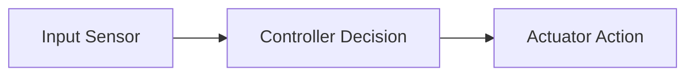

# Lesson Template: [Unit X.Y - Lesson Title]

> **Prerequisites**: [List any prior modules or None]  
> **Estimated Time**: [e.g., 45 minutes]  
> **Simulation Platform**: [e.g., Tinkercad / Wokwi / Webots / Python]  
> **Target Audience**: High School & College Students (Zero Coding / Engineering Background)

---

## 1. Learning Objectives
By the end of this lesson, you will be able to:
- [ ] **Explain**: [Core physical intuition in plain English]
- [ ] **Identify**: [Key components, formulas, or code structures]
- [ ] **Build / Simulate**: [Hands-on milestone in the simulator]
- [ ] **Debug**: [Diagnose a common failure or edge case]

---

## 2. Intuitive Big Picture (No Jargon)
*Start with an everyday analogy, interactive mental model, or real-world robotics scenario.*

- What problem does this solve in the physical world?
- Visual metaphor: [e.g., Water pressure for voltage, recipe for algorithms]
- Real-world robot example: [e.g., How the Mars Curiosity rover uses this]

---

## 3. The Core Concept Explained

### 3.1 The Underlying Physics / Computer Science
*Clear, step-by-step breakdown. Avoid unmotivated equations. Explain variables with physical meaning.*

### 3.2 Schematics / Code Architecture
*Include ASCII diagrams, Mermaid flowcharts, or annotated breadboard diagrams.*



---

## 4. Hands-On Simulation Lab

### Lab Title: [Interactive Exercise Name]
*Zero-cost, browser-accessible or simulator-based.*

#### Materials / Simulator Link
- Simulator: [Link / Tool name]
- Virtual components needed:
  1. [Component 1]
  2. [Component 2]

#### Step-by-Step Instructions
1. **Setup**: [Step 1]
2. **Wiring / Code**: [Step 2]
3. **Verification**: [Step 3 - What should happen when you run it]

```python
# Code snippet with exhaustive, clear comments for complete beginners
```

---

## 5. Troubleshooting & "Why Didn't It Work?" Checklist
Common pitfalls beginners face:
- [ ] **Common Error 1**: [Symptom $\rightarrow$ Cause $\rightarrow$ Fix]
- [ ] **Common Error 2**: [Symptom $\rightarrow$ Cause $\rightarrow$ Fix]

---

## 6. Real-World Applications & Next Steps
- How industry robots use this concept today.
- Sneak peek at the next lesson: `[Link to Next Lesson]`.

---

## 7. Sources & Media Provenance

### Cited References
1. [^1]: Author / Organization, *"Title of Resource"*, Publisher/Source, Year. URL: `https://...` (Accessed: YYYY-MM-DD).
2. [^2]: ...

### Media Manifest
| Asset Name | Media Type | Source / Repository | License | Author / Attribution |
| :--- | :--- | :--- | :--- | :--- |
| `example-diagram.svg` | Diagram | Wikimedia Commons | CC BY-SA 4.0 | User / Link |
