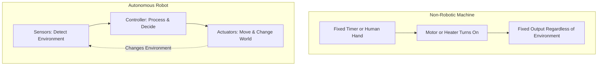
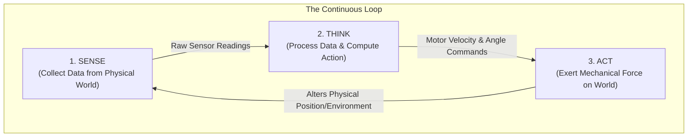

# Unit 0: The Robotic Mindset & Anatomy of Systems
# Module 0.1: What Makes a Robot a Robot?

> **Prerequisites**: None (Zero programming, physics, or engineering experience assumed)  
> **Estimated Time**: 40 minutes  
> **Interactive Activity**: Interactive Systems Decomposition & The Sense-Think-Act Mapping  
> **Target Audience**: High School & College Students  

---

## 1. Learning Objectives

By the end of this module, you will be able to:
- [ ] **Define** what constitutes a robot using international engineering standards (ISO 8373:2021) without confusing it with simple appliances or remote-controlled gadgets [^1].
- [ ] **Contrast** the difference between *automation*, *teleoperation* (remote control), and *true autonomy* [^2].
- [ ] **Explain** the universal **Sense $\rightarrow$ Think $\rightarrow$ Act** feedback loop and trace it through any robotic system [^3].
- [ ] **Deconstruct** a real-world robot (such as a Mars rover or an autonomous warehouse transporter) into its primary subsystems [^2] [^4].

---

## 2. Intuitive Big Picture: The Living Machine

Imagine three different machines in your house:
1. **A standard toaster**: You push down a mechanical lever. A heating element glows red for two minutes. A bimetallic strip or simple timer pops the toast up. Does it care if the bread is already burnt to a crisp or frozen solid? No. It has no idea what is happening to the bread.
2. **A remote-controlled toy drone**: You hold a joystick. When you push forward, radio waves travel to the drone's motors and spin the propellers faster. If you let go of the controls right as a gust of wind blows, the drone crashes into a tree unless you react quickly. Who did the thinking? You did.
3. **An autonomous vacuum cleaner (like a Roomba)**: You press start and walk out the door. It rolls forward. An infrared sensor notices a staircase drop-off. An internal microprocessor calculates: *"Cliff detected on front bumper! Stop wheels immediately, back up 5 cm, rotate 45 degrees left, and resume cleaning."* It adapts to unexpected physical reality without human help.

The difference between a machine and a **robot** is the ability to **interact intelligently with an unpredictable physical world**. A robot does not merely follow a blind sequence of instructions; it perceives what is happening around it, makes an informed computational decision, and physically acts upon that decision [^3].

---

## 3. The Core Concept Explained

### 3.1 The Formal Engineering Definition

According to the **International Organization for Standardization (ISO 8373:2021)**, a robot is formally defined as:

> *"An actuated mechanism programmable in two or more axes with a degree of autonomy, moving within its environment, to perform intended tasks."* [^1]

Breaking this down into plain English:
1. **Actuated mechanism**: It has physical parts that exert force and move (motors, pistons, wheels, grippers). Software running alone on a screen is an AI or algorithm, but it is not a *robot* until it is embodied in the physical world.
2. **Programmable in two or more axes**: It can be commanded to move along multiple paths or rotational directions (e.g., forward/backward plus left/right, or shoulder plus elbow rotation).
3. **Degree of autonomy**: It can carry out tasks based on current state and sensing without continuous real-time human intervention [^1].

Historically, the **Robotic Industries Association (RIA)** formulated a similar milestone definition: *"A reprogrammable, multifunctional manipulator designed to move material, parts, tools, or specialized devices through variable programmed motions."*

---

### 3.2 The Spectrum: Automation vs. Teleoperation vs. Autonomy

Robotics exists along a continuous spectrum of human involvement. Understanding where a system falls on this spectrum is critical for an engineer:

| Category | How It Operates | Who Does the "Thinking"? | Real-World Example |
| :--- | :--- | :--- | :--- |
| **Fixed Automation** | Repeats a blind, pre-timed sequence. Does not adapt to external changes. | The original human programmer. | A kitchen microwave or classic washing machine cycle. |
| **Teleoperation** | A human pilot operates joysticks or switches in real time. Commands are transmitted via wire or radio. | The human operator (in real time). | Bomb disposal robots, surgical arms (da Vinci), underwater ROVs. |
| **Supervisory Autonomy** | Humans issue high-level goals (*"Drive to crater edge"*); the robot plans and executes the path safely on its own. | Shared: Human sets goals, robot handles real-time execution. | Mars Curiosity & Perseverance rovers (AutoNav) [^4]. |
| **Full Autonomy** | The system senses its surroundings, plans routes, handles unexpected obstacles, and fulfills missions entirely on its own. | The onboard robotic software architecture. | Warehouse autonomous mobile robots (AMRs), self-navigating inspection drones. |

> [!NOTE]
> **Why Teleoperation Fails in Deep Space**:
> Mars is between 55 million and 400 million kilometers from Earth. Radio signals traveling at the speed of light take anywhere from **4 to 24 minutes one way** [^4]. If a Mars rover relied on a human with a joystick, driving 1 meter would require sending a command, waiting 20 minutes to see if it hit a rock, and waiting another 20 minutes to stop. NASA rovers must possess autonomous perception (**AutoNav**) to map terrain and steer around hazards independently [^4].

---

### 3.3 The Heart of Robotics: The Sense-Think-Act Loop

Pioneered in robotics education at institutions like MIT [^3], every autonomous robotic system operates on a continuous feedback loop:

1. **Sense (Input)**:
   - Sensors convert physical energy (light waves, sound vibrations, pressure, magnetic fields) into digital numbers the computer can read.
   - *Examples*: Camera image pixels, ultrasonic echo timing, infrared distance measurements, wheel encoder tick counts.
2. **Think (Computation & Decision Making)**:
   - The computer (microcontroller, single-board computer, or industrial PLC) runs algorithms to answer three questions:
     - *Where am I?* (Localization)
     - *What is around me?* (Perception & Mapping)
     - *What should I do next?* (Planning & Control)
3. **Act (Output & Actuation)**:
   - The controller sends signals to actuators (motors, solenoids, pneumatic valves) to generate physical force.
   - The action changes the robot's physical position or manipulates an object in the world.
   - **Crucial**: Because the physical world changed, the sensors immediately capture a new state, and the cycle repeats tens or hundreds of times every second.

---

### 3.4 Deconstructing Real-World Robots

To see how the Sense-Think-Act loop manifests across different industries, consider these two foundational robotics benchmarks:

#### Case Study A: The Mars Curiosity / Perseverance Rover [^2] [^4]
- **Mission**: Navigate extraterrestrial rocky terrain, analyze geological samples.
- **Senses**: Hazard Avoidance Cameras (Hazcams), Navigation Stereo Cameras (Navcams), Inertial Measurement Units (IMUs).
- **Thinks**: Onboard radiation-hardened RAD750 processor running autonomous navigation software (AutoNav) to build 3D mesh maps of rocks and calculate wheel traversability [^4].
- **Acts**: Six motorized wheels with rocker-bogie suspension, robotic arm drill and turret, mast pan-tilt motors.

#### Case Study B: Warehouse Mobile Logistics Robot (e.g., Kiva / Amazon AMR)
- **Mission**: Pick up multi-ton shelving pods in fulfillment centers and navigate crowded floors.
- **Senses**: Downward-pointing cameras reading floor fiducial 2D barcodes, 360-degree safety LiDAR, optical wheel encoders.
- **Thinks**: Central fleet management assigns pod destination; local microcomputer runs obstacle avoidance and PID speed control.
- **Acts**: Dual brushless drive motors for differential steering, hydraulic or screw lift to raise shelves.

---

## 4. Hands-On Systems Decomposition Lab

### Lab Objective
In this exercise, you will reverse-engineer a familiar automated system and determine whether it qualifies as a robot. You will decompose its components into the **Sense-Think-Act** paradigm.

### The System: An Autonomous Sump Pump vs. An Autonomous Lawn Mower

Compare these two devices:
- **Device 1**: A basement sump pump with a hollow plastic float switch. When water rises, the float rises mechanically, closing electrical contacts to turn on the pump. When water falls, the float drops, opening the circuit.
- **Device 2**: An autonomous robotic lawn mower with boundary wire sensors, collision bumpers, rain sensor, and twin drive motors.

#### Step 1: Trace the Sense-Think-Act Loop
Fill in the analysis table:

| Subsystem Component | Device 1 (Sump Pump) | Device 2 (Robotic Lawn Mower) |
| :--- | :--- | :--- |
| **What does it Sense?** | Water height (via buoyant float) | Boundary wire frequency, bumper impact, rain moisture |
| **How does it Think?** | *None* (Direct mechanical contact closure) | Microprocessor checks boundary signal, computes random or spiral mowing path, checks battery state |
| **How does it Act?** | AC water pump impeller turns | Left/right wheel brushless motors steer; spinning cutting blade motor |
| **Can it adapt if something unexpected happens?** | No. If the pipe is clogged, it burns itself out. | Yes. If it hits an obstacle, it stops the blades, backs up, and tries a new heading. |
| **Is it a Robot?** | **No** (It is a mechanical feedback appliance) | **Yes** (It fulfills the ISO 8373 criteria) |

#### Step 2: Thought Experiment — Upgrading an Appliance into a Robot
Take a standard household appliance (e.g., a toaster or an electric desk fan). In your engineering notes:
1. What **sensor** would you add? (e.g., optical color sensor to inspect toast darkness, or thermal camera to find where a person is sitting).
2. What **computing logic** would the controller run? (e.g., *"If toast surface hits RGB value `#8B4513` (golden brown), trigger eject"*).
3. What **actuator** does the controller command? (e.g., motorized servo to raise toast gently instead of an uncontrolled spring).

---

## 5. Troubleshooting & Conceptual Pitfalls

Here are common misconceptions beginners encounter when learning robotics:

> [!WARNING]
> **Pitfall 1: "Does a robot have to look like a human?"**  
> **Reality**: No. Less than 1% of the world's working robots are humanoid. The dominant forms are multi-axis articulated arms (car manufacturing), wheeled mobile platforms (warehouses), and gantry systems (3D printers and CNC machines). Humanoid form factors are only useful when environments were strictly built for human bodies (like climbing stairs or using human door handles).

> [!WARNING]
> **Pitfall 2: "Is ChatGPT or software AI a robot?"**  
> **Reality**: No. An artificial intelligence model running purely in a data center or browser is an **algorithm** or a **software agent**. A robot requires physical embodiment: it must interact with mass, momentum, friction, and physical forces through actuators [^1]. When AI software is loaded onto a physical body with sensors and actuators, it becomes an **embodied AI** or **autonomous robot**.

> [!WARNING]
> **Pitfall 3: "Is my remote control drone or car a robot?"**  
> **Reality**: In pure manual mode, it is a **teleoperated vehicle**. However, modern drones often feature flight controllers with gyroscopes, accelerometers, and barometers that automatically stabilize the aircraft hundreds of times per second against wind gusts. That stabilization layer *is* an autonomous robotic control loop!

---

## 6. Real-World Applications & Next Steps

Robots are transforming every major sector of human society:
- **Medicine**: Surgical robots translating surgeon hand tremors into sub-millimeter precision sutures.
- **Space Exploration**: Autonomous rovers and rotorcraft (like the Ingenuity Mars Helicopter) operating millions of miles away from Earth.
- **Agriculture**: Autonomous tractors identifying and laser-weeding specific plants while leaving crops unharmed.

In the next module, **Module 0.2: The Five Subsystems of Any Robot**, we will open up the robot chassis and examine the five vital systems that keep every robot alive and functioning: Structure, Power, Actuators, Sensors, and Computation.

---

## 7. Sources & Media Provenance

### Cited References
[^1]: **ISO/TC 299 Robotics Technical Committee**, *"ISO 8373:2021 Robotics — Vocabulary"*, International Organization for Standardization, 2021. Available: [ISO Standard 8373:2021](https://www.iso.org/standard/75338.html).  
[^2]: **NASA Robotics Alliance Project**, *"Robotics Overview and Subsystems Reference"*, National Aeronautics and Space Administration. Available: [NASA RAP Educational Resources](https://robotics.nasa.gov/educational-resources/).  
[^3]: **Leslie Kaelbling, Tomas Lozano-Perez, Dennis Freeman**, *"Introduction to Electrical Engineering and Computer Science I (6.01SC)"*, MIT OpenCourseWare, Spring 2011. License: CC BY-NC-SA 4.0. Available: [MIT OCW 6.01SC](https://ocw.mit.edu/courses/6-01sc-introduction-to-electrical-engineering-and-computer-science-i-spring-2011/).  
[^4]: **Mark Maimone, Yang Cheng, Larry Matthies**, *"Autonomous Planetary Rover Navigation: The Mars Exploration Rovers, Curiosity, and Perseverance"*, NASA Jet Propulsion Laboratory / IEEE Aerospace Conference. Public Domain (U.S. Government Work). Available: [NASA Technical Reports Server 2014/37656](https://trs.jpl.nasa.gov/handle/2014/37656).

### Media Manifest
| Asset Name | Media Type | Source / Repository | License | Attribution |
| :--- | :--- | :--- | :--- | :--- |
| `sense-think-act.svg` | Vector Graphic / Diagram | Instructabot Educational Team | CC BY-SA 4.0 | Instructabot Project / Open Courseware |
| `curiosity-rover-annotated.jpg` | Photograph / Schematic | NASA / Jet Propulsion Laboratory | Public Domain | NASA/JPL-Caltech [^4] |
| `unimate-1961.jpg` | Historical Photograph | Smithsonian Institution / USPTO | Public Domain | George Devol / Unimation / GM Archives |
| `teleop-vs-autonomy.svg` | Systems Diagram | Instructabot Educational Team | CC BY-SA 4.0 | Instructabot Project |
