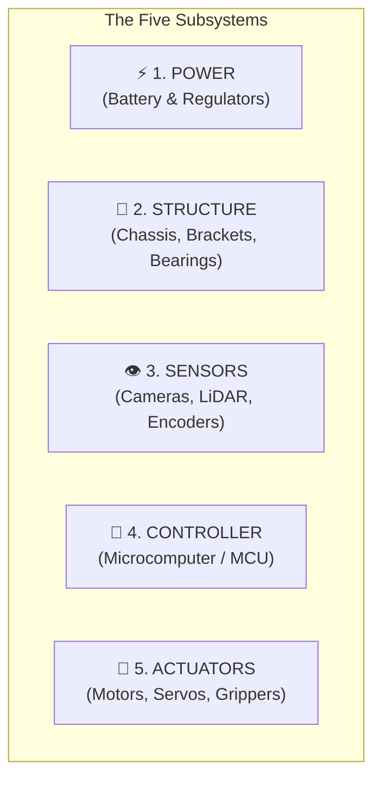
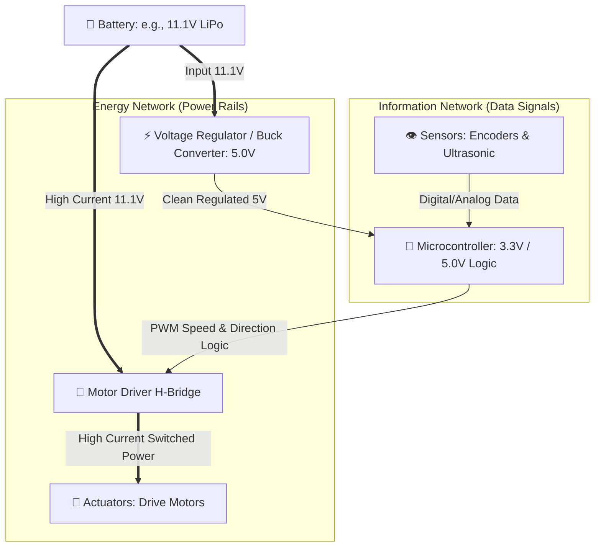

# Unit 0: The Robotic Mindset & Anatomy of Systems
# Module 0.2: The Five Subsystems of Any Robot

> **Prerequisites**: Module 0.1 (What Makes a Robot a Robot?)  
> **Estimated Time**: 45 minutes  
> **Interactive Activity**: Subsystem Architecture Mapping & The Brownout Diagnostics Lab  
> **Target Audience**: High School & College Students (Zero Prior Engineering Experience)  

---

## 1. Learning Objectives

By the end of this module, you will be able to:
- [ ] **Identify** the five essential subsystems present in every functional robot: Structure, Power, Actuators, Sensors, and Controller [^1].
- [ ] **Trace** the two foundational flows through any robotic system: **Energy Flow** vs. **Information Flow** [^2].
- [ ] **Explain** the critical principle of *power isolation* and why motors and microcontrollers must be carefully managed to prevent system crashes [^2] [^3].
- [ ] **Map** a real-world open-hardware robotics platform (the TurtleBot3) across all five subsystems [^4].

---

## 2. Intuitive Big Picture: The Robot as an Organism

When engineers design complex robots, they do not view the machine as a chaotic tangle of wires and metal. They think in terms of **subsystems**—specialized organs that work in concert.

The easiest way to understand this is through the analogy of the human body:

| Human Biological System | Robotic Equivalent | Primary Purpose in the Robot |
| :--- | :--- | :--- |
| **Skeleton & Bones** | **Structure** | Provides rigidity, mounting points, and mechanical protection. |
| **Muscles & Tendons** | **Actuators** | Converts stored energy into physical force, rotation, and motion. |
| **Heart & Blood Vessels** | **Power System** | Stores energy (battery) and distributes regulated electrical power. |
| **Eyes, Ears, & Nerve Endings** | **Sensors** | Measures physical reality and translates it into electrical signals. |
| **Brain & Spinal Cord** | **Controller** | Runs algorithms, processes sensor data, and issues movement commands. |



If **any single subsystem fails**, the entire robot ceases to function. A robot with a brilliant controller but a flimsy structure will wobble uncontrollably; a robot with strong actuators but no power regulation will reboot the moment a motor turns on [^1] [^2].

---

## 3. The Core Concept Explained

### 3.1 Detailed Subsystem Breakdown

#### 1. Structure (The Skeleton)
The physical frame that holds everything together and absorbs forces.
- **Key Components**: Chassis plates, aluminum extrusions (such as 2020 T-slot rails), 3D-printed brackets, standoffs, ball bearings, wheels, and fasteners (screws and locknuts).
- **Engineering Job**: Must be rigid enough to resist bending under payload weight, yet light enough for motors to move efficiently.

#### 2. Power (The Circulatory System)
The energy source that feeds both high-current motors and sensitive microchips.
- **Key Components**: Rechargeable battery packs (Lithium Polymer / LiPo, Lithium Iron Phosphate / LiFePO4, or NiMH), Power Distribution Boards (PDB), fuses, and voltage regulators (Buck converters to step down voltage).
- **Engineering Job**: Deliver stable voltage (e.g., exactly 5.0V or 3.3V) to computing chips while supplying large surge currents (tens of Amperes) to motors.

#### 3. Sensors (The Senses)
Devices that convert physical phenomena into electrical signals.
- **Key Components**: Optical wheel encoders, ultrasonic transceivers, LiDAR range finders, cameras, inertial measurement units (IMUs), limit switches.
- **Engineering Job**: Provide clean, accurate, and rapid measurements of both the robot's internal state (e.g., motor speed) and external environment (e.g., obstacle distance).

#### 4. Controller (The Brain & Nervous System)
The embedded computer that executes software and coordinates behavior.
- **Key Components**: Microcontrollers (Raspberry Pi Pico, ESP32, Arduino) for real-time sensor reading and motor pulsing; Single-Board Computers (Raspberry Pi 5, NVIDIA Jetson) for computer vision and high-level navigation.
- **Engineering Job**: Ingest sensor streams, calculate kinematic equations or path plans, and generate control signals (such as Pulse Width Modulation / PWM) at precise millisecond intervals.

#### 5. Actuators (The Muscles)
The mechanical transducers that convert electrical energy into physical work.
- **Key Components**: Direct Current (DC) gear motors, servo motors, stepper motors, motor driver H-bridges (e.g., L298N, TB6612FNG).
- **Engineering Job**: Apply torque to turn wheels, extend linear slides, or close mechanical grippers.

---

### 3.2 The Dual Flow: Energy vs. Information

Every functioning robot is governed by two simultaneous, interconnected networks [^2]:
1. **The Energy Network (High Power)**: Unidirectional flow of electrical current from the battery to actuators and electronics.
2. **The Information Network (Low Power Data)**: Bidirectional flow of sensor data into the controller and control pulses out to motor drivers.



> [!IMPORTANT]
> **The Golden Rule of Robotics Power**:
> Notice that the **Controller never powers a motor directly**! Microcontroller pins can typically supply only 20 to 40 milliamperes ($0.02\text{A}$ to $0.04\text{A}$). A typical DC motor demands between $1\text{A}$ and $10\text{A}$ under load. Attempting to power a motor directly from a computer pin will instantly destroy the microcontroller. Instead, the controller sends a **tiny logic signal** to a **motor driver**, which acts like an electronic valve opening high-current battery power directly to the motor [^2].

---

### 3.3 Case Study: Mapping an Open-Source Robot (TurtleBot3 Burger)

The **TurtleBot3 Burger** is the world’s most widely used educational research platform for ROS (Robot Operating System) [^4]. Here is how its real hardware maps directly to our five subsystems:

```text
       [ 360° LiDAR Sensor ]  <--- (Sensors)
              |
      [ Raspberry Pi 4 ]      <--- (High-Level Controller)
              |
     [ OpenCR Control Board ] <--- (Real-Time Controller & Power Management)
              |
     [ DYNAMIXEL Servos ]     <--- (Actuators: Smart Motors with built-in encoders)
              |
    [ Modular Tiered Plates ] <--- (Structure: Polycarbonate chassis & wheels)
              |
      [ 11.1V LiPo Battery ]  <--- (Power: 1800 mAh rechargeable pack)
```

1. **Structure**: Three stacked circular plates made of high-strength engineering plastic, supported by aluminum standoffs and rolling on two modular wheels plus a rear ball caster.
2. **Power**: An 11.1V 3S Lithium-Polymer battery managed by built-in battery protection circuitry on the OpenCR board.
3. **Sensors**: A planar $360^\circ$ LDS-01 laser distance sensor (LiDAR) on the top tier and magnetic quadrature encoders embedded inside each motor.
4. **Controller**: A dual-brain setup—an ARM Cortex-M7 (OpenCR) handles sub-millisecond motor timing, while a Raspberry Pi 4 runs Linux and ROS 2.
5. **Actuators**: Two DYNAMIXEL XL430-W250 smart servomotors capable of continuous $360^\circ$ velocity-controlled rotation with built-in temperature and current sensing.

---

## 4. Hands-On Subsystem Diagnostic Lab

### Lab Title: The "Mystery Bug" Systems Diagnosis
*No physical hardware required.*

Read the following three real-world engineering disaster scenarios. Using your knowledge of the five subsystems and the Energy/Information flows, diagnose which subsystem failed and how to resolve the issue:

#### Scenario A: The Amnesia Robot
*Symptom*: A student builds an obstacle-avoiding rover. Everything works on their desk when propped up on blocks. However, when placed on the carpet, the moment the wheels turn to push against the floor, the microcontroller's LEDs flash off, it restarts, and it plays its startup chime repeatedly.
- **Diagnose the Subsystem**: **Power Subsystem**.
- **The Physical Cause**: Carpet creates high rolling resistance. The motors draw heavy current to overcome friction. Because the battery resistance or voltage regulator was inadequate, the battery voltage momentarily plummeted below the microcontroller's minimum operating voltage ($4.5\text{V}$). This is known as a **Brownout Reset (BOR)** [^2].
- **The Fix**: Separate the motor power rail from the logic power rail, or add a dedicated buck converter with large reservoir smoothing capacitors.

#### Scenario B: The Drifting Turret
*Symptom*: A camera turret is commanded to rotate precisely $90^\circ$ to track an object. After 10 cycles back and forth, the camera is pointing $40^\circ$ off target into an empty wall, but the code still thinks it is centered.
- **Diagnose the Subsystem**: **Sensors / Actuators Subsystem**.
- **The Physical Cause**: The system used open-loop DC motors without positional feedback (no encoders), or the structural mounting shaft slipped on the motor axle.
- **The Fix**: Upgrade to a closed-loop actuator (a servo with internal feedback or adding an optical quadrature encoder) and add a structural D-shaft flat or set-screw clamp.

---

## 5. Troubleshooting & Engineering Pitfalls

> [!WARNING]
> **Pitfall 1: The Missing "Common Ground"**  
> Beginners often power their microcontroller with a 5V USB cable and their motors with a separate 12V battery pack. If the robot behaves erratically or ignores motor commands, check the ground connection! Voltage is not an absolute number; it is an electrical potential *difference* between two points. Unless the Ground (`GND`) pin of the microcontroller is physically connected to the negative terminal (`-`) of the battery pack, the control signals have no electrical reference point and will read as random noise.

> [!WARNING]
> **Pitfall 2: Neglecting Center of Gravity (Structure)**  
> Placing heavy batteries on the top tier of a mobile robot raises the center of mass. When the robot brakes suddenly, inertia causes it to tip forward. Always mount the heaviest components (batteries and heavy gearmotors) as low and as central to the wheelbase as physically possible.

---

## 6. Real-World Applications & Next Steps

Understanding subsystems is how multi-disciplinary engineering teams collaborate in the real world:
- Mechanical engineers optimize the **Structure** for strength and lightness.
- Electrical engineers design the **Power** buses and **Actuator** drivers.
- Software engineers write the algorithms for the **Controller** and filter data from the **Sensors**.

In our next module, **Module 0.3: Engineering Notebooks, Safety, and Ethics**, we will establish professional engineering hygiene: how to document designs, battery and mechanical safety protocols, and the ethical responsibilities of building autonomous systems.

---

## 7. Sources & Media Provenance

### Cited References
[^1]: **NASA Robotics Alliance Project**, *"Robotics Subsystems Overview"*, National Aeronautics and Space Administration. Available: [NASA RAP Resources](https://robotics.nasa.gov/educational-resources/).  
[^2]: **Leslie Kaelbling, Tomas Lozano-Perez, Dennis Freeman**, *"Introduction to Electrical Engineering and Computer Science I (6.01SC)"*, MIT OpenCourseWare, Spring 2011. License: CC BY-NC-SA 4.0. Available: [MIT OCW 6.01SC Architecture](https://ocw.mit.edu/courses/6-01sc-introduction-to-electrical-engineering-and-computer-science-i-spring-2011/).  
[^3]: **Kevin M. Lynch, Frank C. Park**, *"Modern Robotics: Mechanics, Planning, and Control"*, Cambridge University Press / Northwestern University, 2017. License: CC BY-NC-ND 4.0. Available: [Modern Robotics Chapter 1](https://modernrobotics.northwestern.edu/).  
[^4]: **ROBOTIS Co., Ltd.**, *"TurtleBot3 Hardware Specifications & Architecture Overview"*, ROBOTIS e-Manual. Available: [ROBOTIS TurtleBot3 Manual](https://emanual.robotis.com/docs/en/platform/turtlebot3/overview/).

### Media Manifest
| Asset Name | Media Type | Source / Repository | License | Attribution |
| :--- | :--- | :--- | :--- | :--- |
| `five-subsystems-flow.svg` | Vector Graphic / Flowchart | Instructabot Educational Team | CC BY-SA 4.0 | Instructabot Project |
| `turtlebot3-subsystems.png` | Engineering Schematic | ROBOTIS Co., Ltd. Open Hardware | CC BY 4.0 | ROBOTIS e-Manual [^4] |
| `sense-think-act.svg` | Vector Diagram | Instructabot Educational Team | CC BY-SA 4.0 | Instructabot Project |
