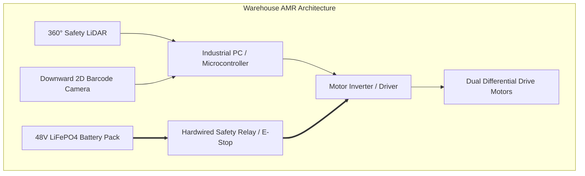

# Unit 0: The Robotic Mindset & Anatomy of Systems
# Lab 0: Reverse-Engineering Systems Decomposition

> **Prerequisites**: Modules 0.1, 0.2, and 0.3  
> **Estimated Time**: 60 minutes  
> **Platform**: Interactive Systems Viewer / NASA 3D Web Explorer (Zero Cost / Browser-Based)  
> **Deliverable**: Version-Controlled Engineering Notebook Entry  
> **Target Audience**: High School & College Students (Zero Prior Engineering Experience)  

---

## 1. Learning Objectives

By completing this hands-on capstone lab, you will be able to:
- [ ] **Systematically dissect** any complex real-world robot into its five fundamental subsystems: Structure, Power, Actuators, Sensors, and Controller [^1].
- [ ] **Map the dual flows** (Energy Distribution vs. Information Signaling) across physical hardware [^2].
- [ ] **Analyze safety critical mechanisms** (fail-safes, protective stop circuits, and thermal management) in extreme operational environments [^3] [^4].
- [ ] **Author a formal Engineering Log entry** in Markdown and track it using Git version control [^1].

---

## 2. Lab Overview & Tools

In professional engineering, before designing a new robotic system, engineers conduct a **teardown and benchmark analysis** of existing systems. This ensures you do not reinvent the wheel and prevents costly design oversights.

For this lab, you will use free public web tools to explore the 3D geometry and engineering schematics of the **NASA Mars 2020 Perseverance Rover** and an **Industrial Autonomous Mobile Robot (AMR)**:
- **Interactive Tool**: [NASA Eyes on the Solar System: Perseverance 3D Model](https://eyes.nasa.gov/apps/solar-system/#/sc_perseverance) (Interactive 3D model, freely accessible in any modern web browser) [^2].


---

## 3. Step-by-Step Lab Instructions

### Step 1: The Mars Perseverance Rover Teardown

Load the 3D model of the Perseverance Rover. Zoom in on its structural chassis, wheel suspension, mast, and robotic arm. Complete the subsystem matrix:

| Subsystem | Specific Physical Components on Perseverance | Engineering Role on Mars |
| :--- | :--- | :--- |
| **Structure** | Titanium tubing chassis, Rocker-Bogie 6-wheel suspension, deployable mast | Absorbs rough Martian terrain shocks; keeps chassis level over rocks without springs [^2]. |
| **Power** | Multi-Mission Radioisotope Thermoelectric Generator (MMRTG) + two Lithium-ion batteries | Converts decay heat of Plutonium-238 into 110W continuous electrical power [^2]. |
| **Sensors** | Navcams (mast stereo cameras), Hazcams (chassis hazard cameras), RIMFAX (ground-penetrating radar), MEDA (weather station), wheel encoders | Measures 3D terrain geometry, detects rocks larger than 35 cm, tracks wheel slip [^4]. |
| **Controller** | Dual BAE RAD750 radiation-hardened processors ($133\text{ MHz}$) running VxWorks RTOS and AutoNav | Executes autonomous stereo vision processing, costmap generation, and driving commands [^4]. |
| **Actuators** | Brushless DC drive motors inside wheel hubs, steering actuators, 5-DOF robotic arm motors, turret coring drill | Propels the rover, steers wheels, positions scientific instruments with sub-millimeter precision. |

#### Analysis Question:
*Why does Perseverance use a "Rocker-Bogie" mechanical suspension with no springs?*  
> **Key Insight**: Springs cause bouncing and store elastic energy, which could tip a rover over on low-gravity Mars. The rocker-bogie mechanism uses a differential pivot that forces wheels on one side down when wheels on the other side lift, maintaining all 6 wheels in contact with the ground at all times [^2].

---

### Step 2: The Industrial Warehouse Robot Teardown

Now analyze an indoor autonomous warehouse robot (e.g., an Amazon Proteus or OTTO AMR) operating alongside human warehouse workers:



Fill in the warehouse subsystem analysis:

1. **Structure**: Low-profile steel and aluminum unibody chassis designed to slip underneath multi-ton pallet racks with high-friction polyurethane drive wheels.
2. **Power**: 48V Lithium Iron Phosphate (LiFePO4) high-density battery capable of rapid opportunity charging and $>3,000$ charge cycles.
3. **Sensors**: Dual Class 1 safety LiDAR scanners creating a $360^\circ$ planar safety curtain at ankle height; downward optical camera reading floor QR matrix codes.
4. **Controller**: High-reliability industrial PC running Linux/ROS 2 for localization, communicating over industrial CAN bus to a motor safety controller.
5. **Actuators**: Dual high-torque brushless DC motors with electromagnetic holding brakes, plus a hydraulic or motorized screw scissor lift.

---

### Step 3: Comparative Analysis — Deep Space vs. Factory Floor

Complete the comparative systems evaluation table:

| Comparison Metric | NASA Mars Perseverance Rover | Industrial Warehouse AMR |
| :--- | :--- | :--- |
| **Primary Safety Concern** | Mission loss / trapped in Martian sand (No human rescue possible) | Human worker collision / kinetic crush hazard [^3] |
| **Communication Latency** | 4 to 24 minutes one-way (Autonomy mandatory) [^4] | Milliseconds over local Wi-Fi / Industrial 5G |
| **Emergency Stop (E-Stop)** | Autonomous watchdog software; no physical human reachable | Hardwired dual-channel safety bumper + red latching mushroom switch [^3] |
| **Power Source** | Nuclear MMRTG (Continuous heat decay) [^2] | Rechargeable chemical battery (Opportunity docking) |

---

### Step 4: Author Your Engineering Notebook Entry

In your digital engineering notes, create a new entry documenting your findings. Copy and complete the following markdown template:

```markdown
# Engineering Log: Systems Decomposition Benchmark
**Date**: 2026-10-04  
**Author**: [Your Name / Student ID]  
**Topic**: Reverse-Engineering Real-World Robots across the Five Subsystems  

### 1. Objective
Systematically analyze the mechanical, electrical, and computational subsystems of two distinct autonomous platforms: a deep-space planetary rover and an industrial logistics mobile robot.

### 2. The Sense-Think-Act Loop Trace
- **Planetary Rover (Perseverance)**:
  - *Sense*: Navcam stereo cameras capture dual images of a boulder field 10 meters ahead.
  - *Think*: AutoNav computes 3D depth disparity, marks boulders over 30 cm as impassable obstacles, and evaluates 15 candidate driving arcs.
  - *Act*: Commands wheel motors to execute the lowest-cost steering arc.
- **Warehouse AMR**:
  - *Sense*: Front safety LiDAR detects a worker stepping into the travel aisle at a range of 2.1 meters.
  - *Think*: Safety PLC calculates time-to-impact; determines velocity exceeds safe stopping distance.
  - *Act*: Cuts power to motor drivers, engages electromagnetic friction brakes, and flashes yellow warning strobe.

### 3. Safety & Design Lessons Learned
- Software cannot be the single point of failure in safety-critical robotics.
- Battery selection dictates operational life: LiFePO4 for indoor cycle life; nuclear MMRTG for deep space cold where sunlight is weak.
- Common ground and power isolation are mandatory to prevent motor electromagnetic interference (EMI) from corrupting sensor data.
```

---

## 4. Assessment Rubric & Verification Checklist

To verify your work, review your engineering log against these criteria:
- [ ] **Completeness**: All five subsystems identified for both robotic platforms.
- [ ] **Sense-Think-Act Clarity**: Both loops trace actual physical inputs, algorithmic steps, and mechanical outputs.
- [ ] **Safety Rigor**: Distinct safety mechanisms explained (watchdog timers vs. hardwired safety relays).
- [ ] **Version Control**: The engineering log entry is saved, staged, and committed to your Git repository with a descriptive commit message.

---

## 5. Sources & Media Provenance

### Cited References
[^1]: **NASA Robotics Alliance Project**, *"Robotics Subsystems Overview and Engineering Notebook Standards"*, National Aeronautics and Space Administration. Available: [NASA RAP Resources](https://robotics.nasa.gov/educational-resources/).  
[^2]: **NASA Jet Propulsion Laboratory**, *"Mars 2020 Perseverance Rover Science and Technology Architecture"*, NASA/JPL-Caltech. Public Domain (U.S. Government Work). Available: [NASA Perseverance Overview](https://photojournal.jpl.nasa.gov/).  
[^3]: **Robotics Industries Association (RIA) / ANSI**, *"ANSI/RIA R15.06-2012: Industrial Robots and Robot Systems — Safety Requirements"*, Association for Advancing Automation (A3). Available: [A3 Robot Safety Standard](https://www.automate.org/a3-content/ansi-ria-r15-06-2012-robot-safety-standard).  
[^4]: **Mark Maimone, Yang Cheng, Larry Matthies**, *"Autonomous Planetary Rover Navigation: The Mars Exploration Rovers, Curiosity, and Perseverance"*, NASA Jet Propulsion Laboratory / IEEE Aerospace Conference. Available: [NASA Technical Reports Server 2014/37656](https://trs.jpl.nasa.gov/handle/2014/37656).

### Media Manifest
| Asset Name | Media Type | Source / Repository | License | Attribution |
| :--- | :--- | :--- | :--- | :--- |
| `curiosity-rover-annotated.jpg` | Photograph / Schematic | NASA / Jet Propulsion Laboratory | Public Domain | NASA/JPL-Caltech [^2] |
| `estop-circuit.svg` | Schematic Diagram | Instructabot Educational Team | CC BY-SA 4.0 | Instructabot Project [^3] |
| `five-subsystems-flow.svg` | Vector Diagram | Instructabot Educational Team | CC BY-SA 4.0 | Instructabot Project |

---

## 🏆 Milestone Achieved: Unit 0 Foundations Capstone Complete!

🎉 You have deconstructed real autonomous robots and established NASA/JPL-standard engineering logs and safety protocols.

> 💡 **What's Next?** In **Unit 1: The Spark**, you will wire your first circuits and build autonomous solid-state hardware from scratch!

---

## 🧭 Lesson Navigation

| ⬅️ Previous Lesson | 🗺️ Course Hub | ➡️ Next Lesson |
| :--- | :---: | ---: |
| [← Module 0.3: Engineering Notebooks, Safety, and Ethics](03-safety-ethics-notebook.md) | [**Master Syllabus**](../SYLLABUS.md) • [**Getting Started**](../GETTING_STARTED.md) | [**Module 1.1: Intuitive Electrical Physics →**](../unit-01-electronics/01-intuitive-electrical-physics.md) |
