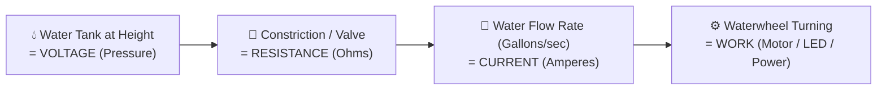
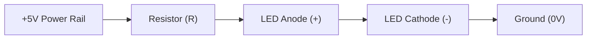

# Unit 1: The Spark: Electricity & Electronics from Scratch
# Module 1.1: Intuitive Electrical Physics

> **Prerequisites**: Unit 0 (The Robotic Mindset & Anatomy of Systems)  
> **Estimated Time**: 45 minutes  
> **Interactive Activity**: PhET Circuit Construction Kit (DC) Virtual Lab  
> **Target Audience**: High School & College Students (Zero Prior Physics or Math Background)  

---

## 1. Learning Objectives

By the end of this module, you will be able to:
- [ ] **Explain** the relationship between Voltage, Current, and Resistance using the physical fluid dynamics analogy [^1] [^2].
- [ ] **Apply** Ohm's Law ($V = I \cdot R$) and the Electrical Power equation ($P = V \cdot I$) to solve real robotics hardware challenges [^1].
- [ ] **Calculate** the exact protective resistor needed to prevent an LED from burning out [^2].
- [ ] **Identify** a short circuit, explain why it causes catastrophic battery failure, and take preventative measures [^1] [^3].

---

## 2. Intuitive Big Picture: The Water Tower Analogy

Electricity can feel intimidating because you cannot see electrons moving inside a copper wire. However, electricity behaves almost identically to water flowing through pressurized pipes [^1].

Imagine a water tower connected to a pipe driving a waterwheel:



Here are the three foundational quantities of all robotics electronics:

1. **Voltage ($V$, measured in Volts)**:
   - *Physical Meaning*: Electrical pressure or potential energy difference.
   - *Water Analogy*: The height of the water tower. A 100-foot tower creates much higher water pressure at the bottom than a 5-foot bucket. In robotics, a $12\text{V}$ battery pushes electrons with much more force than a $1.5\text{V}$ AA battery.
2. **Current ($I$, measured in Amperes or Amps, $\text{A}$)**:
   - *Physical Meaning*: The volume or rate of electrical charge flowing past a point per second ($1\text{ Ampere} = 1\text{ Coulomb per second} \approx 6.24 \times 10^{18}\text{ electrons/sec}$).
   - *Water Analogy*: The flow rate (gallons per second) pouring through the pipe.
3. **Resistance ($R$, measured in Ohms, $\Omega$)**:
   - *Physical Meaning*: How strongly a material opposes the flow of electric charge.
   - *Water Analogy*: A narrowing or valve in the pipe. A wide-open pipe offers almost zero resistance; a tiny straw offers high resistance, choking the flow down to a trickle.

---

## 3. The Core Concept Explained

### 3.1 Ohm’s Law: The Fundamental Formula of Robotics

Discovered experimentally by Georg Ohm in 1827 [^1], **Ohm’s Law** ties these three quantities together in a direct mathematical relationship:

$$\text{Voltage} = \text{Current} \times \text{Resistance} \quad \implies \quad V = I \cdot R$$

You can rearrange this equation depending on what you need to discover:

$$\text{To find Current: } I = \frac{V}{R} \qquad\qquad \text{To find Resistance: } R = \frac{V}{I}$$

```text
       [  V  ]
      ---------
      [ I * R ]
```

#### What Happens When Resistance Goes to Zero? (The Short Circuit)
Look closely at the formula $I = \frac{V}{R}$.
- If you have a $12\text{V}$ battery and connect a $100\,\Omega$ resistor, the current is:
  $$I = \frac{12\text{V}}{100\,\Omega} = 0.12\text{ Amperes (120 mA) — Safe and stable.}$$
- What if you connect a bare copper wire directly from the positive terminal to the negative terminal? A copper wire has virtually zero resistance ($R \approx 0.001\,\Omega$):
  $$I = \frac{12\text{V}}{0.001\,\Omega} = 12,000\text{ Amperes!}$$

> [!CAUTION]
> **The Danger of a Short Circuit**:
> When $R \to 0$, current surges toward infinity until something physically melts. The wire will glow red-hot, the insulation will vaporize into toxic fumes, and the battery pack can swell and catch fire. **Never connect a power terminal directly to ground without a load (resistor, motor, or circuit) in between!** [^1] [^3]

---

### 3.2 Electrical Power & Heat ($P = V \cdot I$)

When current is pushed through a resistance, the resisted energy doesn't disappear—it is converted into **heat** or light. The rate of electrical energy consumption is called **Power ($P$)**, measured in **Watts ($\text{W}$)** [^1]:

$$P = V \cdot I$$

Using Ohm's Law, we can also write:

$$P = I^2 \cdot R = \frac{V^2}{R}$$

Every electronic component has a **Power Rating**:
- Standard hobby resistors are rated for $0.25\text{W}$ ($1/4\text{ Watt}$). If you force $1.0\text{W}$ of power through a $1/4\text{W}$ resistor, it will scorch black and fail.
- High-power robot motor drivers have aluminum **heatsinks** to radiate excess heat away into the air.

---

### 3.3 Practical Robotics Math: Sizing an LED Resistor

A Light Emitting Diode (LED) is a semiconductor that emits light when current passes through it. Unlike a simple resistor, an LED has **almost zero internal resistance once it turns on** [^2]. If you connect an LED directly to a $5\text{V}$ battery, it will draw hundreds of Amps for a microsecond and instantly pop with a flash of smoke.

To protect the LED, we must place a **current-limiting resistor** in series with it:



#### Step-by-Step Calculation:
1. **Supply Voltage ($V_s$)**: $5.0\text{V}$ (standard USB / microcontroller voltage).
2. **LED Forward Voltage ($V_f$)**: Most standard red LEDs require about $2.0\text{V}$ to illuminate [^2].
3. **Safe LED Current ($I$)**: Standard indicator LEDs operate brightly and safely at $20\text{ milliamperes}$ ($20\text{mA} = 0.020\text{A}$).
4. **Find the Voltage the Resistor Must Absorb**:
   $$V_R = V_s - V_f = 5.0\text{V} - 2.0\text{V} = 3.0\text{V}$$
5. **Apply Ohm's Law to Find the Required Resistance**:
   $$R = \frac{V_R}{I} = \frac{3.0\text{V}}{0.020\text{A}} = 150\,\Omega$$

Because $150\,\Omega$ is the minimum, roboticists typically use a standard, widely available **$220\,\Omega$** or **$330\,\Omega$** resistor. This gives plenty of brightness while running the LED cooler and extending its lifespan [^2].

---

### 3.4 Direct Current (DC) vs. Alternating Current (AC)

- **Alternating Current (AC)**: Electrons oscillate back and forth like a wave (60 times per second in North America, $60\text{ Hz}$). AC is ideal for transmitting power over hundreds of miles from power plants to wall outlets.
- **Direct Current (DC)**: Electrons march continuously in a single direction, from negative to positive.
- **Why Robots Run on DC**: Microchips, digital transistors, and mobile batteries operate strictly on steady DC voltages ($3.3\text{V}$, $5\text{V}$, $12\text{V}$). Wall power chargers convert AC from your home outlet into safe, low-voltage DC [^1].

---

## 4. Hands-On Virtual Simulation Lab

### Lab Objective
In this exercise, you will build and test a virtual circuit in your browser using the free **PhET Interactive Circuit Simulator**, observing electron flow in real time.

### Simulator Setup:
1. Open your browser and navigate to the free [PhET Circuit Construction Kit (DC)](https://phet.colorado.edu/en/simulations/circuit-construction-kit-dc) [^3].
2. Click **Intro**.

```text
   [ Battery: 9V ] ---- ( Switch ) ---- [ Resistor: 100 Ω ]
          |                                      |
          +---------------- ( Light Bulb ) ------+
```

### Lab Instructions:
1. **Build a Simple Loop**:
   - Drag out a **Battery**, a **Switch**, a **Resistor**, and a **Light Bulb**.
   - Connect them in a closed circle using wires.
2. **Observe Electron Flow**:
   - Close the switch. Notice the blue spheres (electrons) drifting through the circuit.
   - Click on the Battery and adjust the voltage slider from $9\text{V}$ up to $20\text{V}$. Notice how the electrons move faster and the bulb shines brighter.
3. **Test Ohm's Law with a Voltmeter**:
   - Drag the digital **Voltmeter** from the toolbox.
   - Place the black probe on one side of the resistor and the red probe on the other side.
   - Note the voltage drop. Notice how the sum of voltage drops across the resistor and bulb equals the total battery voltage!
4. **Trigger a Virtual Short Circuit (Safely)**:
   - Connect a single wire directly from the positive battery terminal to the negative battery terminal.
   - Watch the virtual battery catch on fire. Notice the flames and maximum current alarm. Open the circuit immediately.

---

## 5. Troubleshooting & Circuit Pitfalls

> [!WARNING]
> **Pitfall 1: LED Polarity (Anode vs. Cathode)**  
> Unlike resistors, LEDs are **diodes**—one-way electric valves. Current can only flow from the **Anode (+, long leg)** to the **Cathode (-, short leg / flat edge)**. If an LED refuses to light up, gently pull it out, rotate it $180^\circ$, and plug it back in.

> [!WARNING]
> **Pitfall 2: Confusing Voltage and Current**  
> A common mistake is saying *"A battery pushes 10 Amps into a circuit."* A battery supplies a fixed **Voltage** ($5\text{V}$, $12\text{V}$). The circuit's total **Resistance** dictates how many **Amperes** are drawn! If you plug a low-resistance motor into your battery, it draws high current. If you plug a high-resistance sensor into the same battery, it draws tiny current.

---

## 6. Real-World Applications & Next Steps

Understanding Ohm's law and current limits is the fundamental prerequisite for designing robot electronics:
- Sizing wires so they don't overheat under motor acceleration.
- Calculating how many hours a battery will last ($\text{Battery Life} = \frac{\text{Capacity in mAh}}{\text{Average Current in mA}}$).

In our next module, **Module 1.2: Essential Circuit Components & Breadboarding**, we will transition from wires in space to the engineer's ultimate rapid prototyping tool: the solderless breadboard!

---

## 7. Sources & Media Provenance

### Cited References
[^1]: **Tony R. Kuphaldt**, *"Lessons In Electric Circuits, Volume I — DC (Chapter 2: Ohm's Law)"*, Open Textbook Library / All About Circuits. Open Educational Resource. Available: [Lessons In Electric Circuits](https://open.umn.edu/opentextbooks/textbooks/lessons-in-electric-circuits-volume-i-dc).  
[^2]: **Leslie Kaelbling, Tomas Lozano-Perez, Dennis Freeman**, *"Introduction to Electrical Engineering and Computer Science I (6.01SC) — Circuits and Op-Amps"*, MIT OpenCourseWare. License: CC BY-NC-SA 4.0. Available: [MIT OCW 6.01SC Circuits](https://ocw.mit.edu/courses/6-01sc-introduction-to-electrical-engineering-and-computer-science-i-spring-2011/).  
[^3]: **PhET Interactive Simulations Team**, *"Circuit Construction Kit (DC) Interactive Simulation"*, University of Colorado Boulder. License: CC BY 4.0. Available: [PhET Interactive Simulations](https://phet.colorado.edu/en/simulations/circuit-construction-kit-dc).

### Media Manifest
| Asset Name | Media Type | Source / Repository | License | Attribution |
| :--- | :--- | :--- | :--- | :--- |
| `water-pipe-electricity.svg` | Vector Graphic / Analogy | Instructabot Educational Team | CC BY-SA 4.0 | Instructabot Project [^1] |
| `tinkercad-nightlight.png` | Circuit Schematic | Tinkercad Circuits / Instructabot | CC BY 4.0 | Autodesk Tinkercad / Instructabot |
| `five-subsystems-flow.svg` | Vector Diagram | Instructabot Educational Team | CC BY-SA 4.0 | Instructabot Project |

---

## 🧭 Lesson Navigation

| ⬅️ Previous Lesson | 🗺️ Course Hub | ➡️ Next Lesson |
| :--- | :---: | ---: |
| [← Lab 0: Reverse-Engineering Systems Decomposition](../unit-00-foundations/lab-00-systems-decomposition.md) | [**Master Syllabus**](../SYLLABUS.md) • [**Getting Started**](../GETTING_STARTED.md) | [**Module 1.2: Essential Circuit Components & Breadboarding →**](02-circuit-components-breadboarding.md) |
