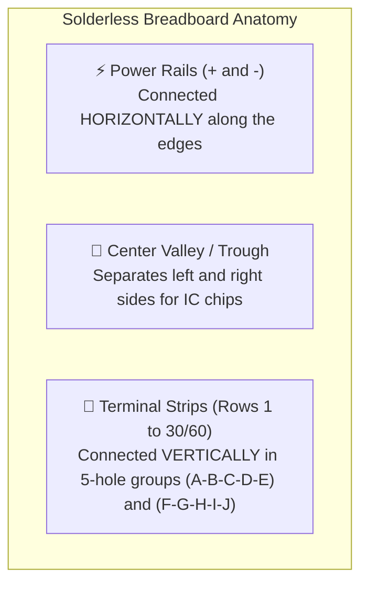
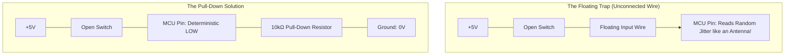
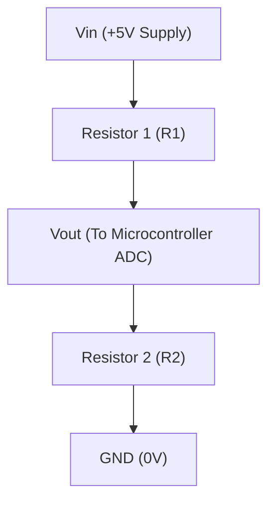

# Unit 1: The Spark: Electricity & Electronics from Scratch
# Module 1.2: Essential Circuit Components & Breadboarding

> **Prerequisites**: Module 1.1 (Intuitive Electrical Physics)  
> **Estimated Time**: 45 minutes  
> **Interactive Activity**: Tinkercad Circuits Breadboard Prototyping Lab  
> **Target Audience**: High School & College Students (Zero Prior Engineering Experience)  

---

## 1. Learning Objectives

By the end of this module, you will be able to:
- [ ] **Navigate** the internal metal clip connections of a solderless breadboard without short-circuiting components [^1].
- [ ] **Decode** 4-band and 5-band resistor color codes to identify resistance values instantly [^2].
- [ ] **Explain** the "floating pin" hazard and solve it using pull-up and pull-down resistors [^1] [^3].
- [ ] **Calculate** and build a **Voltage Divider** circuit ($V_{\text{out}} = V_{\text{in}} \cdot \frac{R_2}{R_1 + R_2}$) to interface sensors with computers [^2] [^3].

---

## 2. Intuitive Big Picture: The Circuit Playground

In the early days of electronics, hobbyists and engineers literally hammered copper nails into wooden bread-slicing cutting boards to solder wires together—giving rise to the term **"breadboard"** [^1].

Today, we use **solderless breadboards**. A breadboard is a reusable plastic grid filled with hundreds of spring-loaded spring-bronze clips hidden underneath the surface. When you push a wire or component leg into a hole, the metal clip grips the lead firmly, completing an electrical circuit instantly without hot soldering irons or melted lead [^1].



---

## 3. The Core Concept Explained

### 3.1 The Hidden Anatomy of a Breadboard

If you peel the sticky foam off the back of a breadboard, you will see stamped metal spring tracks arranged in a very specific pattern [^1]:

```text
       (+) [ o---o---o---o---o---o---o---o---o---o ] (+)  <-- Power Bus Rail (All connected horizontally)
       (-) [ o---o---o---o---o---o---o---o---o---o ] (-)  <-- Ground Bus Rail (All connected horizontally)
             A   B   C   D   E       F   G   H   I   J
       01    [ o===o===o===o===o ]   [ o===o===o===o===o ] 01 <-- Row 1: A-B-C-D-E are connected vertically!
       02    [ o===o===o===o===o ]   [ o===o===o===o===o ] 02
       03    [ o===o===o===o===o ]   [ o===o===o===o===o ] 03
                     ^                       ^
                     |--- Center Ravine -----|
                          (Not Connected)
```

1. **Power Bus Rails (Long Edges)**:
   - Marked with red (`+` positive voltage) and blue/black (`-` ground).
   - The holes run in a continuous line **horizontally along the length of the board**. You plug your battery or 5V power supply here once, and then tap power anywhere along the board.
2. **Terminal Rows (Main Grid)**:
   - Marked with numbers ($1, 2, 3...$) and letters ($A, B, C, D, E$ on one side; $F, G, H, I, J$ on the other).
   - In each numbered row, holes $A-B-C-D-E$ are connected together on a single metal clip **vertically**.
   - **Crucial**: Row 1 is *not* connected to Row 2.
3. **The Center Trough (Ravine)**:
   - The deep groove down the middle divides side $A-E$ from side $F-J$.
   - This ravine is sized to fit Dual In-line Package (DIP) integrated circuits (chips). When a chip straddles the center ravine, pin 1 on side $A-E$ is electrically isolated from pin 14 on side $F-J$ [^1].

---

### 3.2 Reading Resistor Color Codes

Because resistors are tiny cylinders, printing numbers like "$47,000\,\Omega$" on them would require a microscope to read. Instead, manufacturers mark them with colored bands [^2]:

```text
    [ Color Band 1 ] [ Color Band 2 ] [ Multiplier Band ] [ Tolerance Band ]
           |                |                 |                   |
        1st Digit        2nd Digit         x 10^N             +/- % (Gold = 5%)
```

| Color | Digit Value | Multiplier ($10^n$) | Easy Memory Mnemonic |
| :--- | :--- | :--- | :--- |
| **Black** | 0 | $\times 1$ | **B**lack |
| **Brown** | 1 | $\times 10$ | **B**rown |
| **Red** | 2 | $\times 100$ | **R**ed |
| **Orange** | 3 | $\times 1,000$ ($1\text{k}\Omega$) | **O**range |
| **Yellow** | 4 | $\times 10,000$ ($10\text{k}\Omega$) | **Y**ellow |
| **Green** | 5 | $\times 100,000$ | **G**reen |
| **Blue** | 6 | $\times 1,000,000$ ($1\text{M}\Omega$) | **B**lue |
| **Violet** | 7 | $\times 10^7$ | **V**iolet |
| **Gray** | 8 | $\times 10^8$ | **G**ray |
| **White** | 9 | $\times 10^9$ | **W**hite |
| **Gold** | — | — | **5% Tolerance** (Precision) |

#### Practice Examples:
1. **Brown - Black - Red - Gold**:
   - Digit 1: Brown ($1$)
   - Digit 2: Black ($0$)
   - Multiplier: Red ($\times 100$)
   - Value: $10 \times 100 = \mathbf{1,000\,\Omega = 1\text{k}\Omega}$ ($\pm 5\%$).
2. **Red - Red - Brown - Gold**:
   - Digit 1: Red ($2$)
   - Digit 2: Red ($2$)
   - Multiplier: Brown ($\times 10$)
   - Value: $22 \times 10 = \mathbf{220\,\Omega}$ ($\pm 5\%$) — The standard LED resistor!

---

### 3.3 The "Floating Pin" Mystery: Pull-Up & Pull-Down Resistors

When connecting a pushbutton to a microcontroller, beginners often connect one side of the button to $+5\text{V}$ and the other side to a digital input pin.

- When you press the button, the pin connects to $+5\text{V}$ and reads `HIGH` ($1$).
- When you release the button, what does the pin read?



> [!WARNING]
> **The Floating Pin Hazard**:
> When a switch opens, the input wire is connected to **nothing at all**. It acts like an antenna, picking up electromagnetic radio interference from Wi-Fi, lights, and human fingers. The pin will fluctuate wildly between `0` and `1`! [^1] [^3]

To fix this, we add a **Pull-Down Resistor** (typically $10\text{k}\Omega$) connecting the pin to Ground ($0\text{V}$). 
- When the button is unpressed, the $10\text{k}\Omega$ resistor gently drains charge away to ground, ensuring a solid, stable `LOW` ($0\text{V}$).
- When the button is pressed, electricity takes the path of least resistance directly from $+5\text{V}$, pulling the pin to `HIGH`. The $10\text{k}\Omega$ resistance is large enough that almost no current ($0.5\text{mA}$) leaks to ground [^3].

---

### 3.4 The Voltage Divider: Turning Physical State into Numbers

Microcontrollers often cannot safely read high voltages, and sensors like light-dependent photoresistors (LDRs) change their resistance rather than outputting a voltage directly.

The solution is the **Voltage Divider**—one of the most famous circuits in electrical engineering [^2] [^3]:



#### The Voltage Divider Equation:

$$V_{\text{out}} = V_{\text{in}} \cdot \left( \frac{R_2}{R_1 + R_2} \right)$$

#### How It Works:
- If $R_1 = 10\text{k}\Omega$ and $R_2 = 10\text{k}\Omega$:
  $$V_{\text{out}} = 5\text{V} \cdot \left( \frac{10\text{k}}{10\text{k} + 10\text{k}} \right) = 5\text{V} \cdot 0.5 = \mathbf{2.5\text{V}}$$
- If $R_2$ is a photoresistor whose resistance drops to $2\text{k}\Omega$ in bright sunlight:
  $$V_{\text{out}} = 5\text{V} \cdot \left( \frac{2\text{k}}{10\text{k} + 2\text{k}} \right) = 5\text{V} \cdot 0.166 = \mathbf{0.83\text{V}}$$

As light changes, $V_{\text{out}}$ changes smoothly from $0.8\text{V}$ to $4.5\text{V}$. A microcontroller can measure this voltage and instantly calculate how bright the room is [^2] [^3]!

---

## 4. Hands-On Breadboard Prototyping Lab

### Lab Objective
In this exercise, you will wire a clean voltage divider circuit using a solderless breadboard in **Autodesk Tinkercad Circuits** (free in any browser).

### Setup:
1. Open [Autodesk Tinkercad](https://www.tinkercad.com/) and create a new **Circuit**.
2. From the component panel on the right, drag into the workspace:
   - $1\times$ **Small Solderless Breadboard**
   - $1\times$ **9V Battery**
   - $2\times$ **Resistors** (Set $R_1 = 10\text{k}\Omega$, $R_2 = 10\text{k}\Omega$)
   - $1\times$ **Multimeter**

```text
   (+) Battery Rail -------------------+
                                       |
                                    [ R1: 10k ]
                                       |
                   [ Multimeter (+) ]--+-- (Vout)
                                       |
                                    [ R2: 10k ]
                                       |
   (-) Battery Rail -------------------+-- [ Multimeter (-) ]
```

### Wiring Steps:
1. **Power Rails**:
   - Connect the red battery wire to the breadboard's positive (`+`) rail.
   - Connect the black battery wire to the breadboard's negative (`-`) rail.
2. **Component Placement**:
   - Place $R_1$ between the positive rail (`+`) and Row 10, column $A$.
   - Place $R_2$ between Row 10, column $B$ and the negative rail (`-`).
   - Notice that both resistors now touch Row 10! Because Row 10 holes $A-B-C-D-E$ are connected internally, you have created the center junction ($V_{\text{out}}$).
3. **Measurement**:
   - Connect the Multimeter's positive (red) probe to Row 10, column $C$.
   - Connect the Multimeter's negative (black) probe to the negative (`-`) rail.
4. **Run Simulation**:
   - Click **Start Simulation**.
   - The multimeter will read exactly **$4.50\text{V}$** (half of the $9\text{V}$ battery).
   - Change $R_2$ to $20\text{k}\Omega$. Observe how $V_{\text{out}}$ jumps to $6.00\text{V}$ ($9\text{V} \cdot \frac{20}{30} = 6\text{V}$).

---

## 5. Troubleshooting & Common Breadboard Errors

> [!WARNING]
> **Pitfall 1: Plugging Both Legs into the Same Row**  
> Beginners often plug both wire legs of a resistor into Row 5 (e.g., hole $5A$ and hole $5C$). Because all holes in Row 5 are connected by a single strip of metal, current flows through the metal strip and completely bypasses the resistor! This is an unintended short circuit across the component. A resistor must span **two different rows** (e.g., Row 5 to Row 10) [^1].

> [!WARNING]
> **Pitfall 2: Split Power Rails**  
> On full-size (830-tie-point) breadboards, the long power rails down the sides are often split in half at the midpoint. If your circuit has power on the top half but nothing works on the bottom half, look for a break in the colored line. You must add two small jumper wires across the center gap to link the top and bottom rails.

---

## 6. Real-World Applications & Next Steps

Breadboarding and voltage dividers are fundamental building blocks in robotics:
- Microcontrollers like the Raspberry Pi run on $3.3\text{V}$ logic, while sensors often output $5.0\text{V}$. A two-resistor voltage divider safely steps a $5\text{V}$ signal down to $3.3\text{V}$ so your computer doesn't get fried.
- Pushbuttons in industrial control panels use pull-up resistors to prevent false machine triggers caused by factory motor noise.

In our next module, **Module 1.3: Power Delivery & Regulators**, we will solve the biggest cause of robot failures: how to tame noisy batteries and voltage drops using voltage regulators!

---

## 7. Sources & Media Provenance

### Cited References
[^1]: **SparkFun Education Team**, *"How to Use a Breadboard"*, SparkFun Electronics. License: CC BY-SA 4.0. Available: [SparkFun Breadboard Guide](https://learn.sparkfun.com/tutorials/how-to-use-a-breadboard).  
[^2]: **Tony R. Kuphaldt**, *"Lessons In Electric Circuits, Volume I — DC (Chapter 5: Series and Parallel Circuits)"*, Open Textbook Library / All About Circuits. Available: [Lessons In Electric Circuits](https://open.umn.edu/opentextbooks/textbooks/lessons-in-electric-circuits-volume-i-dc).  
[^3]: **Leslie Kaelbling, Tomas Lozano-Perez, Dennis Freeman**, *"Introduction to Electrical Engineering and Computer Science I (6.01SC) — Circuits and Op-Amps"*, MIT OpenCourseWare. License: CC BY-NC-SA 4.0. Available: [MIT OCW 6.01SC Circuits](https://ocw.mit.edu/courses/6-01sc-introduction-to-electrical-engineering-and-computer-science-i-spring-2011/).

### Media Manifest
| Asset Name | Media Type | Source / Repository | License | Attribution |
| :--- | :--- | :--- | :--- | :--- |
| `breadboard-internals.svg` | Vector Graphic / X-Ray Diagram | Instructabot Educational Team | CC BY-SA 4.0 | Instructabot Project [^1] |
| `voltage-divider.svg` | Schematic Diagram | Instructabot Educational Team | CC BY-SA 4.0 | Instructabot Project [^2] |
| `tinkercad-nightlight.png` | Circuit Schematic | Tinkercad Circuits / Instructabot | CC BY 4.0 | Autodesk Tinkercad / Instructabot |

---

## 🧭 Lesson Navigation

| ⬅️ Previous Lesson | 🗺️ Course Hub | ➡️ Next Lesson |
| :--- | :---: | ---: |
| [← Module 1.1: Intuitive Electrical Physics](01-intuitive-electrical-physics.md) | [**Master Syllabus**](../SYLLABUS.md) • [**Getting Started**](../GETTING_STARTED.md) | [**Module 1.3: Power Delivery, Voltage Regulators, & Brownout Prevention →**](03-power-delivery-and-regulators.md) |
