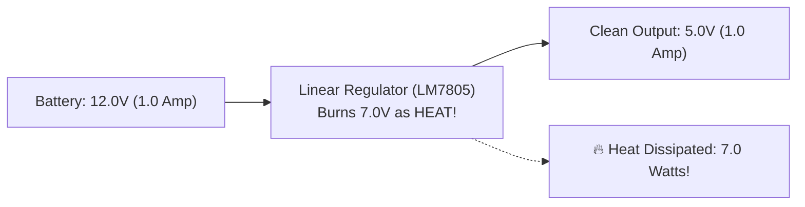
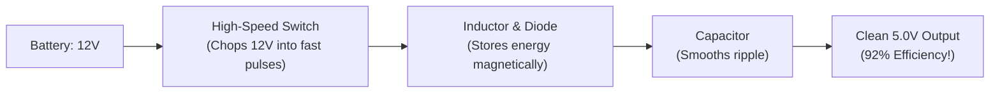
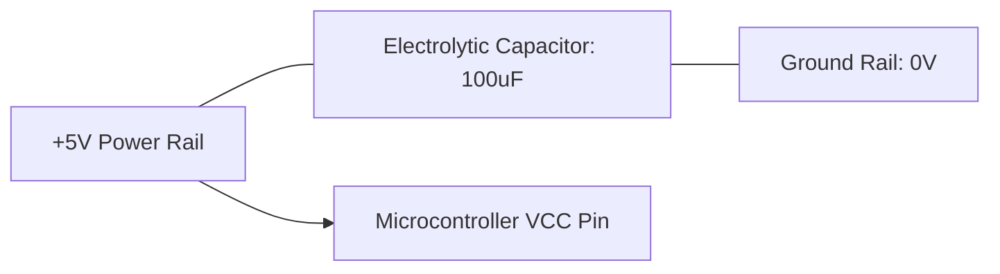
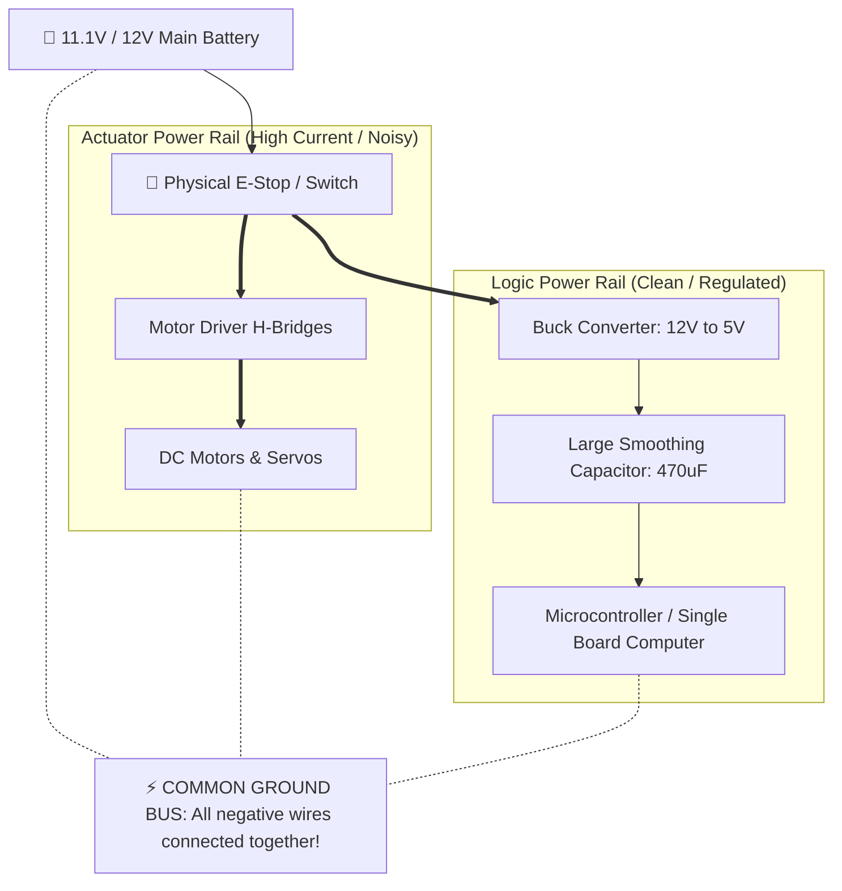

# Unit 1: The Spark: Electricity & Electronics from Scratch
# Module 1.3: Power Delivery, Voltage Regulators, & Brownout Prevention

> **Prerequisites**: Module 1.1 (Intuitive Electrical Physics), Module 1.2 (Circuit Components & Breadboarding)  
> **Estimated Time**: 45 minutes  
> **Interactive Activity**: Power Budgeting & Thermal Efficiency Analysis Lab  
> **Target Audience**: High School & College Students (Zero Prior Engineering Experience)  

---

## 1. Learning Objectives

By the end of this module, you will be able to:
- [ ] **Explain** why raw battery voltage varies constantly and why microchips require precisely regulated voltage rails ($5.0\text{V}$ and $3.3\text{V}$) [^1] [^2].
- [ ] **Contrast** Linear Regulators (LDOs) with Switching Regulators (Buck Converters) in terms of thermal heat dissipation and electrical efficiency [^1].
- [ ] **Calculate** the power wasted as heat in a power supply ($P_{\text{loss}} = (V_{\text{in}} - V_{\text{out}}) \cdot I$) [^1] [^2].
- [ ] **Architect** a dual-rail power distribution system with decoupling capacitors to prevent robot motor brownouts [^1] [^3].

---

## 2. Intuitive Big Picture: The Unruly Battery

Beginners often imagine that an "11.1V battery" simply provides a constant $11.1\text{V}$ forever. In reality, a battery's voltage is a moving target:
- A $3\text{S}$ Lithium Polymer battery starts at **$12.60\text{V}$** fresh off the charger ($4.20\text{V}/\text{cell}$).
- Mid-way through operation, it hovers around **$11.10\text{V}$** ($3.70\text{V}/\text{cell}$).
- When almost depleted, it drops to **$10.20\text{V}$** ($3.40\text{V}/\text{cell}$).
- When your robot accelerates from a standstill, the sudden surge in motor current causes the battery voltage to momentarily sag even lower!

```text
 [ 12.6V Full ] ---> [ 11.1V Nominal ] ---> [ 10.2V Depleted ] ---> [ 8.5V Surge Sag! ]
```

Meanwhile, modern microcontrollers (ESP32, Raspberry Pi, Arduino) have internal silicon transistors that **can only survive within a narrow window**:
- If a $5.0\text{V}$ chip receives $6.0\text{V}$, the microscopic insulation inside the silicon burns out permanently.
- If it receives $4.2\text{V}$, it triggers a **Brownout Reset (BOR)** and instantly reboots [^1] [^3].

To connect an unruly, sagging battery to a delicate microcontroller, every robot requires a **Voltage Regulator** [^1].

---

## 3. The Core Concept Explained

### 3.1 Linear Regulators: The Wasteful Resistor

The simplest type of voltage regulator is a **Linear Regulator** (such as the classic LM7805 or AMS1117) [^2].

A linear regulator behaves like an automated, self-adjusting variable resistor. It constantly measures its output voltage and absorbs all the excess voltage, burning it off as **pure heat** [^1] [^2].



#### Calculating Heat Loss in a Linear Regulator:

$$P_{\text{loss}} = (V_{\text{in}} - V_{\text{out}}) \times I_{\text{load}}$$

#### The Efficiency Trap:
Imagine your robot is powered by a $12\text{V}$ battery, and your computer draws $1.0\text{A}$ at $5.0\text{V}$:
1. **Power delivered to computer**:
   $$P_{\text{useful}} = 5.0\text{V} \times 1.0\text{A} = 5.0\text{ Watts}$$
2. **Power wasted as burning heat**:
   $$P_{\text{loss}} = (12.0\text{V} - 5.0\text{V}) \times 1.0\text{A} = \mathbf{7.0\text{ Watts of pure heat!}}$$
3. **Efficiency**:
   $$\text{Efficiency} = \frac{5.0\text{W}}{12.0\text{W}} \approx \mathbf{41.7\%}$$

More than **half of your battery energy** is converted into useless heat that can melt your robot's plastic chassis! Furthermore, without a heavy aluminum heatsink, the linear regulator will quickly exceed $125^\circ\text{C}$ and shut itself off to prevent catching fire [^1] [^2].

---

### 3.2 Switching Regulators (Buck Converters): The High-Efficiency Valve

Modern robotics solves this thermal problem using a **DC-DC Buck Converter** (Switching Regulator) [^1].

Instead of burning off excess voltage as continuous heat, a Buck converter uses a high-speed semiconductor switch (MOSFET) that turns on and off hundreds of thousands of times per second ($100\text{ kHz} - 2\text{ MHz}$). It rapidly chops the $12\text{V}$ supply into tiny bursts and stores the energy in an **inductor** (magnetic coil) and a **capacitor** (reservoir) [^1]:



#### Why Buck Converters Rule Robotics:
- **Efficiency**: Typically **$88\% \text{ to } 96\%$**!
- **Virtually No Heat**: Stepping $12\text{V}$ down to $5\text{V}$ at $1.0\text{A}$ only loses about $0.4\text{W}$ of heat instead of $7.0\text{W}$.
- **Longer Battery Life**: Because power is conserved ($P_{\text{in}} \approx P_{\text{out}}$), drawing $1.0\text{A}$ at $5\text{V}$ only pulls about **$0.45\text{A}$** from your $12\text{V}$ battery [^1]!

| Feature | Linear Regulator (LDO) | Switching Regulator (Buck) |
| :--- | :--- | :--- |
| **Typical Efficiency** | $30\% - 50\%$ (Poor) | $85\% - 95\%$ (Excellent) |
| **Heat Generated** | Very High (Requires large heatsink) | Very Low (Runs cool) |
| **Circuit Complexity** | 3 pins, zero external coils | Requires inductor, diode, capacitors |
| **Electrical Noise** | Extremely quiet (clean analog signal) | Slight high-frequency switching ripple |
| **Best Robotics Use** | Sensitive analog sensors ($<100\text{mA}$) | Microcomputers, main logic, servos ($>500\text{mA}$) |

---

### 3.3 The Decoupling Capacitor: Energy Reservoirs

When a DC motor suddenly starts spinning, it demands a massive spike in current for a few milliseconds (stall current). This sudden surge causes the voltage on the power rail to dip sharply [^3].

To shield sensitive microchips from this dip, engineers place **Decoupling / Smoothing Capacitors** directly across the power pins of the chip:



- A **capacitor** acts like a miniature rechargeable water tank right next to the chip.
- During steady operation, the capacitor charges up to $5.0\text{V}$.
- The microsecond a motor starts and the power rail dips, the capacitor instantly discharges its stored electrons into the chip, holding the voltage steady above the brownout reset threshold [^3].

---

### 3.4 Dual-Rail Power Architecture

To build a robot that never brownouts, follow this standard robotics power distribution topology [^1] [^3]:



---

## 4. Hands-On Power Budgeting Lab

### Lab Objective
In this exercise, you will calculate the **Power Budget** and **Thermal Heat Loss** for a mobile robot equipped with a camera and motors.

### System Specifications:
- **Battery**: $11.1\text{V}$ LiPo ($2200\text{ mAh}$ capacity)
- **Actuators**: Two DC motors drawing $0.8\text{A}$ average each at $11.1\text{V}$
- **Single-Board Computer (Raspberry Pi)**: Requires $5.0\text{V}$ and draws $1.5\text{A}$ continuous

#### Calculation Step 1: Compare Linear Regulator vs. Buck Converter
1. **If using a Linear Regulator (LM7805)**:
   - Voltage dropped: $V_{\text{drop}} = 11.1\text{V} - 5.0\text{V} = 6.1\text{V}$
   - Waste heat power: $P_{\text{waste}} = 6.1\text{V} \times 1.5\text{A} = \mathbf{9.15\text{ Watts!}}$
   - *Verdict*: Without a fan and massive heatsink, the regulator will overheat in seconds and shut down.
2. **If using a 90% Efficient Buck Converter**:
   - Power needed by Pi: $P_{\text{useful}} = 5.0\text{V} \times 1.5\text{A} = 7.5\text{W}$
   - Total battery power pulled: $P_{\text{batt}} = \frac{7.5\text{W}}{0.90} \approx 8.33\text{W}$
   - Current pulled from battery: $I_{\text{batt}} = \frac{8.33\text{W}}{11.1\text{V}} = \mathbf{0.75\text{A}}$ (Only half the current drawn from the battery!)
   - Waste heat: Only $8.33\text{W} - 7.5\text{W} = \mathbf{0.83\text{ Watts}}$.

#### Calculation Step 2: Estimate Total Robot Runtime
- Total average battery current = Motors ($0.8\text{A} + 0.8\text{A}$) + Buck converter ($0.75\text{A}$) = **$2.35\text{ Amperes}$** ($2350\text{mA}$).
- Usable battery capacity: $2200\text{mAh} \times 0.80\text{ (Safe 80% discharge)} = 1760\text{mAh}$.
- Estimated run time:
  $$\text{Runtime} = \frac{1760\text{ mAh}}{2350\text{ mA}} \approx 0.75\text{ hours} \approx \mathbf{45\text{ minutes of continuous driving}}.$$

---

## 5. Troubleshooting & Power Pitfalls

> [!WARNING]
> **Pitfall 1: Powering Servos Directly from Microcontroller 5V Pins**  
> Beginners often plug 2 or 3 hobby servos directly into the $5\text{V}$ pin of an Arduino or Raspberry Pi. An onboard regulator can only supply about $0.5\text{A}$. A single moving servo can pull $1.0\text{A}$ stall current. The moment the servo tries to move, the onboard regulator overloads, the $5\text{V}$ rail crashes, and the computer reboots endlessly. Always power servos from a dedicated external Buck converter!

> [!WARNING]
> **Pitfall 2: Forgetting the Common Ground Wire**  
> If your motors are powered by a 12V battery and your computer is powered by a 5V power bank, you **must connect the negative (-) terminal of both supplies together**. Without a common ground reference, the control signals from the computer cannot establish an electrical circuit with the motor driver.

---

## 6. Real-World Applications & Next Steps

Power delivery is the unsung hero of aerospace and robotics engineering:
- The NASA Perseverance Rover manages its 110W nuclear generator using switching power converters to charge its lithium batteries while distributing isolated power rails to science instruments.
- Autonomous electric cars use high-voltage DC-DC converters to step 400V or 800V traction battery power down to 12V for onboard autonomous computers and safety sensors.

In our capstone for this unit, **Lab 1: The Zero-Code Light-Sensitive Nightlight**, we will wire our first autonomous sensor circuit on a breadboard—using a photoresistor and transistor to automatically turn on an LED in darkness without writing a single line of software!

---

## 7. Sources & Media Provenance

### Cited References
[^1]: **Everett Rogers**, *"Basic Calculation of a Buck Converter's Power Stage (Application Report SLVA477B)"*, Texas Instruments. Available: [Texas Instruments Application Report SLVA477B](https://www.ti.com/lit/an/slva477b/slva477b.pdf).  
[^2]: **Tony R. Kuphaldt**, *"Lessons In Electric Circuits, Volume I — DC (Chapter 3: Electrical Safety and Power Supplies)"*, Open Textbook Library / All About Circuits. Available: [Lessons In Electric Circuits](https://open.umn.edu/opentextbooks/textbooks/lessons-in-electric-circuits-volume-i-dc).  
[^3]: **Leslie Kaelbling, Tomas Lozano-Perez, Dennis Freeman**, *"Introduction to Electrical Engineering and Computer Science I (6.01SC) — Circuits and Op-Amps"*, MIT OpenCourseWare. License: CC BY-NC-SA 4.0. Available: [MIT OCW 6.01SC Circuits](https://ocw.mit.edu/courses/6-01sc-introduction-to-electrical-engineering-and-computer-science-i-spring-2011/).

### Media Manifest
| Asset Name | Media Type | Source / Repository | License | Attribution |
| :--- | :--- | :--- | :--- | :--- |
| `linear-vs-buck.svg` | Vector Graphic / Flowchart | Instructabot Educational Team | CC BY-SA 4.0 | Instructabot Project [^1] |
| `five-subsystems-flow.svg` | Vector Diagram | Instructabot Educational Team | CC BY-SA 4.0 | Instructabot Project |
| `tinkercad-nightlight.png` | Circuit Schematic | Tinkercad Circuits / Instructabot | CC BY 4.0 | Autodesk Tinkercad / Instructabot |

---

## 🧭 Lesson Navigation

| ⬅️ Previous Lesson | 🗺️ Course Hub | ➡️ Next Lesson |
| :--- | :---: | ---: |
| [← Module 1.2: Essential Circuit Components & Breadboarding](02-circuit-components-breadboarding.md) | [**Master Syllabus**](../SYLLABUS.md) • [**Getting Started**](../GETTING_STARTED.md) | [**Lab 1: The Zero-Code Light-Sensitive Nightlight →**](lab-01-zero-code-nightlight.md) |
