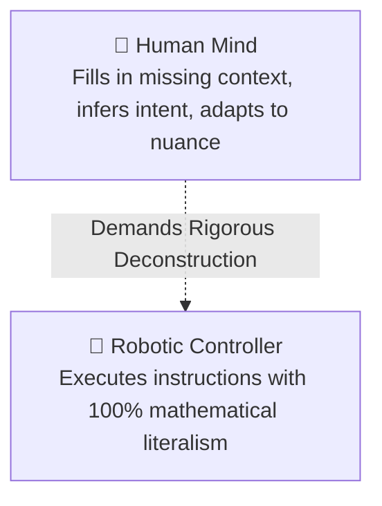
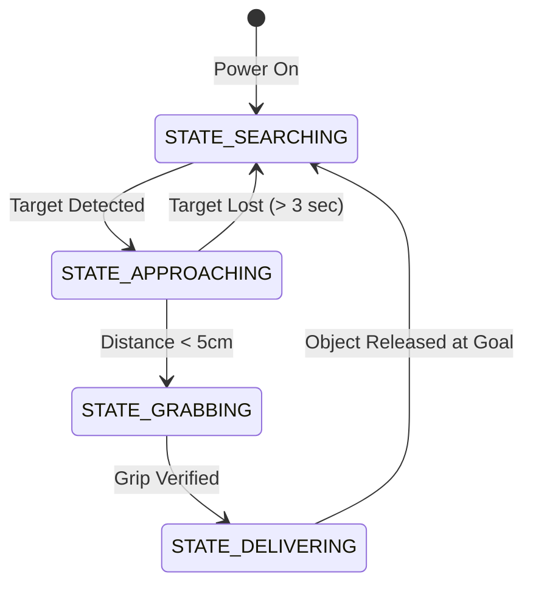
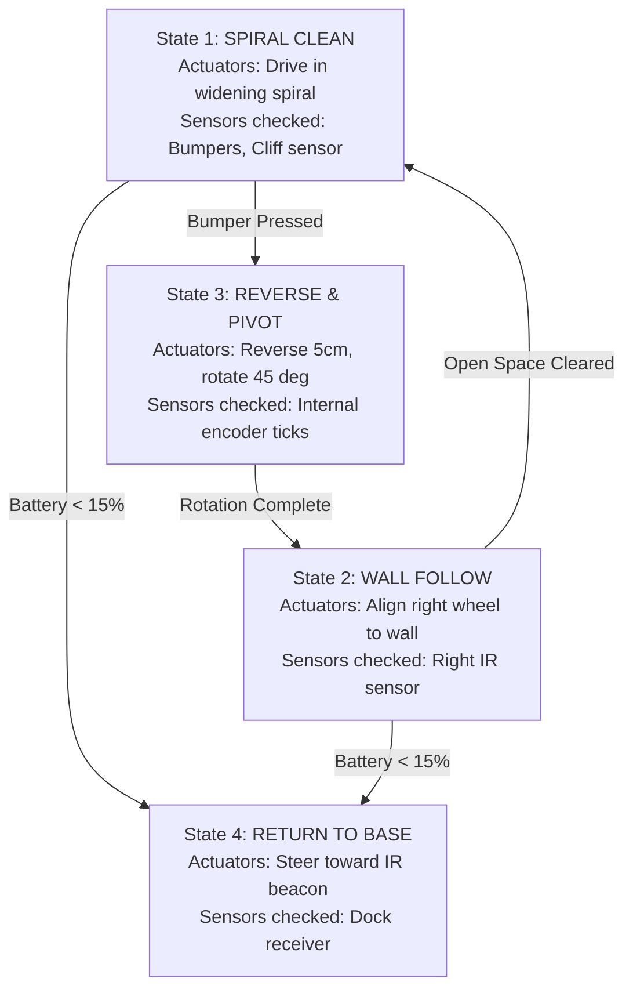
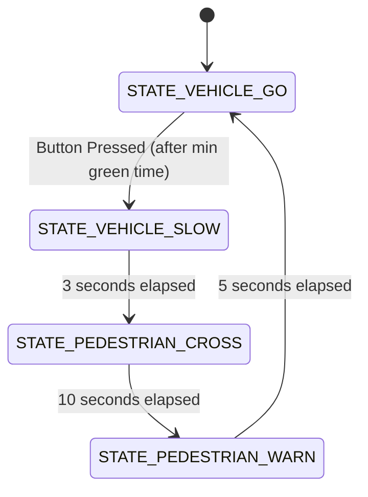

# Unit 2: The Brain: Computational Thinking & Microcontrollers
# Module 2.1: Algorithmic Logic, Flowcharts, & State Machines

> **Prerequisites**: Unit 0 (Foundations), Unit 1 (The Spark: Electricity & Electronics)  
> **Estimated Time**: 45 minutes  
> **Interactive Activity**: Visualizing Robot Behaviors with Finite State Machines (FSMs)  
> **Target Audience**: High School & College Students (Zero Prior Programming Background)  

---

## 1. Learning Objectives

By the end of this module, you will be able to:
- [ ] **Deconstruct** complex physical tasks into unambiguous, step-by-step algorithms suitable for robotic controllers [^1].
- [ ] **Construct** standard engineering flowcharts using ANSI symbols (Process, Decision, Terminal, I/O) [^1].
- [ ] **Design** a **Finite State Machine (FSM)** with well-defined states, transition triggers, and actuator outputs [^2] [^3].
- [ ] **Identify and prevent** algorithmic deadlocks, infinite loops, and unhandled physical edge conditions [^2].

---

## 2. Intuitive Big Picture: The Literal Mind of a Robot

Imagine asking a friend to make a peanut butter sandwich. Your friend grabs the bread bag, opens the twist tie, pulls out two slices, spreads peanut butter with a knife, and puts the slices together.

Now imagine commanding a robot: *"Make a peanut butter sandwich."*
- If the robot has no vision model for twist ties, it crushes the entire loaf of bread with 50 pounds of gripper force.
- If it opens the jar but you forgot to program it to let go of the lid, it tries to stick the knife through the lid.
- If the peanut butter jar is empty, the robot will scrape the glass forever until its motor gears strip.



A computer has **zero common sense**. An **algorithm** is not a vague suggestion; it is an exhaustive, deterministic procedure where every possible fork in the road must be anticipated and handled [^1] [^3].

---

## 3. The Core Concept Explained

### 3.1 Flowcharts: The Blueprint of Computational Logic

Before typing code into an editor, professional roboticists sketch **flowcharts**. A flowchart visually models how decisions branch and how loops repeat [^1]:

```text
    ( START / STOP )   <-- Oval: Program boundary
           |
      [ DO WORK ]      <-- Rectangle: Action or physical command (e.g., Turn on Motor)
           |
         /   \
        < CHECK >      <-- Diamond: Decision / If-Else branch (Yes / No)
         \   /
```

#### Standard ANSI Flowchart Symbols:
1. **Terminal (Oval)**: Marks the start or end of a program or function.
2. **Process (Rectangle)**: An internal calculation or command (e.g., `Set Motor Speed = 50%`, `Count = Count + 1`).
3. **Decision (Diamond)**: A boolean evaluation that splits execution into two paths (e.g., `Is Distance < 20cm?` $\rightarrow$ **YES** or **NO**).
4. **Input / Output (Parallelogram)**: Reading physical hardware or reporting status (e.g., `Read Ultrasonic Sensor`, `Print "Obstacle!"`).

---

### 3.2 The Finite State Machine (FSM): The Engine of Autonomy

In simple programs, execution starts at the top of a file, runs line by line, and exits at the bottom. But a robot does not "exit"—it runs continuously inside an environment for hours [^2].

Robots organize continuous behavior using a mathematical architecture called a **Finite State Machine (FSM)** [^2] [^3].

An FSM consists of three core components:
1. **States**: A finite set of distinct behavioral modes the robot can occupy at any given moment (e.g., `STATE_PATROL`, `STATE_AVOID`, `STATE_DOCKING`). The robot can only be in **one state at a time**.
2. **Inputs / Events**: Sensory triggers from the environment (e.g., bumper contact, distance threshold, timer expiration, battery low).
3. **Transitions**: Strict rules dictating when and how the robot changes from its current state to a new state.



---

### 3.3 Case Study: FSM of an Autonomous Vacuum (Roomba)

Consider the behavioral logic inside a commercial autonomous vacuum [^3]:



#### Why FSMs Prevent Chaos:
Without an FSM, beginner robot code degenerates into an unmaintainable "spaghetti" tangle of nested `if-else` statements. With an FSM, the robot's behavior is **completely predictable**:
- When in `State 3 (REVERSE & PIVOT)`, the robot ignores wall-following code until the backing-up motion has safely completed.
- Each state only cares about the sensors and actuators relevant to its immediate task [^2] [^3].

---

## 4. Hands-On FSM Design Lab

### Lab Objective
In this exercise, you will design the complete Finite State Machine for a **Smart Pedestrian Traffic Intersection**.

### The System Requirements:
1. **Normal Flow**: Green traffic light illuminated for vehicle traffic.
2. **Pedestrian Request**: A pedestrian pushes a crosswalk button.
3. **Transition to Yellow**: The light must switch to Yellow for exactly 3 seconds to allow moving cars to stop safely.
4. **Pedestrian Crossing**: The light turns Red, and the pedestrian "WALK" signal turns white for 10 seconds.
5. **Warning Flashing**: The pedestrian signal flashes orange for 5 seconds before returning to green for vehicle traffic.

#### Step 1: Identify the States
Define the four mutually exclusive states:
- `STATE_VEHICLE_GO`: Green light ON, Pedestrian STOP light ON.
- `STATE_VEHICLE_SLOW`: Yellow light ON, Pedestrian STOP light ON.
- `STATE_PEDESTRIAN_CROSS`: Red light ON, Pedestrian WALK light ON.
- `STATE_PEDESTRIAN_WARN`: Red light ON, Pedestrian FLASHING ORANGE light.

#### Step 2: Build the State Transition Table
Fill out the transition conditions:

| Current State | Input / Trigger Event | Next State | Action / Output |
| :--- | :--- | :--- | :--- |
| `STATE_VEHICLE_GO` | Button Pressed AND Timer $> 15\text{s}$ | `STATE_VEHICLE_SLOW` | Turn Green OFF, Turn Yellow ON; Reset Timer |
| `STATE_VEHICLE_SLOW` | Timer $\ge 3\text{ seconds}$ | `STATE_PEDESTRIAN_CROSS` | Turn Yellow OFF, Turn Red ON, Walk ON; Reset Timer |
| `STATE_PEDESTRIAN_CROSS`| Timer $\ge 10\text{ seconds}$ | `STATE_PEDESTRIAN_WARN` | Start Orange Flasher; Reset Timer |
| `STATE_PEDESTRIAN_WARN` | Timer $\ge 5\text{ seconds}$ | `STATE_VEHICLE_GO` | Turn Red OFF, Turn Green ON; Reset Timer |



---

## 5. Troubleshooting & Algorithmic Pitfalls

> [!WARNING]
> **Pitfall 1: The "Deadlock" State**  
> A deadlock occurs when a state has no exit transition. For example, if your state machine enters `STATE_WAIT_FOR_DOCK`, but the dock's radio beacon is unplugged, the robot will sit frozen forever. **Rule**: Every state must possess a **timeout transition** (e.g., *"If dock not found after 60 seconds, transition to `STATE_SEARCH_NEW_LOCATION` or `STATE_EMERGENCY_STOP`"*).

> [!WARNING]
> **Pitfall 2: Unhandled Edge Cases & Race Conditions**  
> What happens if the pedestrian pushes the button five times in rapid succession while the light is already yellow? If your logic blindly queues button presses, the light will turn green for a split second and immediately snap back to red! In our state table, button inputs are strictly **ignored** unless the system is in `STATE_VEHICLE_GO` [^2].

---

## 6. Real-World Applications & Next Steps

Finite State Machines are the foundation of aerospace and mission-critical autonomy:
- **NASA Curiosity / Perseverance Rovers**: AutoNav runs a state machine cycling through Stereo Image Acquisition $\rightarrow$ Terrain Mesh Generation $\rightarrow$ Arc Evaluation $\rightarrow$ Step Execution [^1].
- **Autonomous Drones**: Flight controllers cycle through `DISARMED` $\rightarrow$ `TAKEOFF` $\rightarrow$ `WAYPOINT_FOLLOW` $\rightarrow$ `RETURN_TO_HOME` $\rightarrow$ `LANDED`.

In our next module, **Module 2.2: Python for Robotics Foundations**, we will translate these visual flowcharts into real executable code using Python and MicroPython!

---

## 7. Sources & Media Provenance

### Cited References
[^1]: **NASA Robotics Alliance Project**, *"Algorithmic Logic and Software Engineering Reference"*, National Aeronautics and Space Administration. Available: [NASA RAP Educational Resources](https://robotics.nasa.gov/educational-resources/).  
[^2]: **Michael Sipser**, *"Introduction to the Theory of Computation (Chapter 1: Regular Languages & Finite Automata)"*, MIT OpenCourseWare. License: CC BY-NC-SA 4.0. Available: [MIT OCW 18.404J](https://ocw.mit.edu/courses/18-404j-theory-of-computation-fall-2020/).  
[^3]: **Leslie Kaelbling, Tomas Lozano-Perez, Dennis Freeman**, *"Introduction to Electrical Engineering and Computer Science I (6.01SC) — State Machines"*, MIT OpenCourseWare. License: CC BY-NC-SA 4.0. Available: [MIT OCW 6.01SC State Machines](https://ocw.mit.edu/courses/6-01sc-introduction-to-electrical-engineering-and-computer-science-i-spring-2011/).

### Media Manifest
| Asset Name | Media Type | Source / Repository | License | Attribution |
| :--- | :--- | :--- | :--- | :--- |
| `fsm-traffic-light.svg` | Vector Graphic / State Diagram | Instructabot Educational Team | CC BY-SA 4.0 | Instructabot Project [^2] |
| `five-subsystems-flow.svg` | Vector Diagram | Instructabot Educational Team | CC BY-SA 4.0 | Instructabot Project |
| `engineering-design-cycle.svg` | Flowchart | Instructabot Educational Team | CC BY-SA 4.0 | Instructabot Project [^1] |

---

## 🧭 Lesson Navigation

| ⬅️ Previous Lesson | 🗺️ Course Hub | ➡️ Next Lesson |
| :--- | :---: | ---: |
| [← Lab 1: The Zero-Code Light-Sensitive Nightlight](../unit-01-electronics/lab-01-zero-code-nightlight.md) | [**Master Syllabus**](../SYLLABUS.md) • [**Getting Started**](../GETTING_STARTED.md) | [**Module 2.2: Python for Robotics Foundations →**](02-python-for-robotics.md) |
