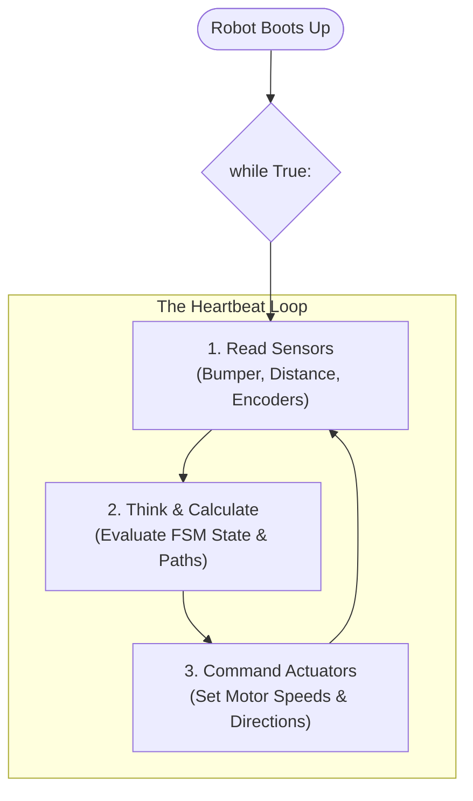

# Unit 2: The Brain: Computational Thinking & Microcontrollers
# Module 2.2: Python for Robotics Foundations

> **Prerequisites**: Module 2.1 (Algorithmic Logic, Flowcharts, & State Machines)  
> **Estimated Time**: 50 minutes  
> **Interactive Activity**: Building a Non-Blocking Robot Control Loop in Python  
> **Target Audience**: High School & College Students (Zero Prior Coding Experience)  

---

## 1. Learning Objectives

By the end of this module, you will be able to:
- [ ] **Write** clean Python/MicroPython scripts using variables, conditional branching (`if/elif/else`), and reusable functions [^1] [^2].
- [ ] **Construct** the universal robotics infinite control loop (`while True:`) [^2] [^3].
- [ ] **Store and process** sensor streams using Python lists and dictionaries [^1].
- [ ] **Explain** why `time.sleep()` is dangerous in mobile robotics and implement **non-blocking timer loops** using millisecond timestamps (`time.ticks_ms()`) [^1] [^2].

---

## 2. Intuitive Big Picture: The Robot’s Heartbeat

Why is Python the undisputed language of modern robotics?
- **Readability**: Python code looks almost identical to plain English instructions.
- **Portability**: The same Python principles you learn here run on tiny **$4 microcontrollers (MicroPython on Raspberry Pi Pico)**, single-board computers (Raspberry Pi), industry-standard **ROS 2 nodes**, and supercomputer **AI neural networks** (PyTorch) [^1] [^2].

In classical desktop programming, a script computes a result, prints it, and finishes. In robotics, **a robot must never stop running while powered on**.

Every robot operates on an infinite heartbeat known as the **Control Loop** [^3]:



---

## 3. The Core Concept Explained

### 3.1 Python Variables: Storing the Robot’s State

In Python, a variable is a named storage container for data. You do not need complex type declarations—Python infers the type automatically [^1]:

```python
# Numbers representing physical quantities
battery_voltage = 11.85         # Float: Decimal number (Volts)
left_motor_speed = 75           # Integer: Percentage speed (0 to 100)
encoder_ticks = 4820            # Integer: Wheel rotation count

# Booleans representing binary sensor states
bumper_pressed = False          # Boolean: True or False
is_emergency_stop_active = False

# Text strings for logging and debugging
robot_name = "Perseverance-Jr"
current_state = "DRIVE_FORWARD"
```

---

### 3.2 Lists: Handling Arrays of Sensor Readings

Robots frequently measure multiple sensors simultaneously (like a multi-sensor distance array). In Python, we store sequences of data in a **List** (bracketed by `[` and `]`) [^1]:

```python
# Ultrasonic sensor distances in centimeters: [Front, Left, Right, Rear]
distance_sensors = [120.5, 45.2, 88.0, 210.0]

# Accessing specific sensors (Python starts counting at index 0!)
front_distance = distance_sensors[0]   # 120.5 cm
left_distance  = distance_sensors[1]   # 45.2 cm

# Finding the closest obstacle
closest_object = min(distance_sensors) # 45.2 cm
```

---

### 3.3 Conditional Decisions: The Robotic If-Elif-Else

Conditionals allow a robot to branch its behavior depending on real-time sensor measurements [^1] [^3]:

```python
def evaluate_navigation(front_distance, left_distance, right_distance):
    """Decides robot movement based on distance thresholds."""
    
    # Critical obstacle threshold: 15 centimeters
    if front_distance < 15.0:
        print("CRITICAL OBSTACLE AHEAD! Stopping immediately.")
        stop_motors()
        
        # Decide which way to turn based on open space
        if left_distance > right_distance:
            print("Turning Left into open space...")
            turn_left(speed=50)
        else:
            print("Turning Right into open space...")
            turn_right(speed=50)
            
    elif front_distance < 50.0:
        # Caution zone: Slow down
        print("Approaching obstacle. Reducing velocity.")
        set_motor_speed(speed=30)
        
    else:
        # All clear!
        set_motor_speed(speed=80)
```

---

### 3.4 The Fatal Flaw: Blocking Delays (`time.sleep`) vs. Non-Blocking Timers

Beginners often make lights blink or pause motor movements using Python's `time.sleep(seconds)` function.

```python
# THE BEGINNER'S TRAP (BLOCKING CODE):
while True:
    drive_forward()
    time.sleep(5)  # Drive forward for 5 seconds...
    turn_left()
```

> [!CAUTION]
> **Why `time.sleep()` is Dangerous in Robotics**:
> When a microcontroller executes `time.sleep(5)`, **the processor completely freezes execution for 5 seconds**. It cannot read bumper switches, cannot check distance sensors, and cannot listen for an Emergency Stop command! If an obstacle appears 1 second into that sleep, the robot will crash blindly into the wall for the remaining 4 seconds [^1] [^2]!

#### The Professional Solution: Non-Blocking Timestamp Comparison
Instead of putting the CPU to sleep, professional robotics code leaves the processor running at full speed, constantly checking a hardware clock (like looking at your wristwatch) [^1] [^2]:

```python
import time

# Record when the event started
previous_timestamp = time.ticks_ms()  # In MicroPython (or time.time() in standard Python)
interval_ms = 1000                    # 1000 milliseconds = 1 second
led_state = False

while True:
    # 1. ALWAYS read sensors continuously on every single loop cycle!
    check_emergency_stop()
    check_obstacle_sensors()
    
    # 2. Check if the required time has elapsed WITHOUT freezing the CPU
    current_timestamp = time.ticks_ms()
    if time.ticks_diff(current_timestamp, previous_timestamp) >= interval_ms:
        # 1 second has passed! Toggle LED state
        led_state = not led_state
        print(f"Blinking Heartbeat LED: {led_state}")
        
        # Reset the clock reference point
        previous_timestamp = current_timestamp
        
    # The loop repeats thousands of times per second without ever getting stuck!
```

---

## 4. Hands-On Coding Lab: The Non-Blocking Robot Scheduler

### Lab Objective
In this exercise, you will write a complete Python script that runs two tasks concurrently without multi-threading:
1. **Task A**: Blink a status "Heartbeat LED" every $500\text{ ms}$.
2. **Task B**: Read a simulated distance sensor every $100\text{ ms}$ and stop if an object is closer than $20\text{ cm}$.

```python
import time
import random  # Simulating live hardware sensor jitter

class RobotBrain:
    def __init__(self):
        self.motor_running = True
        self.led_on = False
        
        # Independent task timers (in milliseconds)
        self.last_heartbeat_time = time.ticks_ms()
        self.heartbeat_interval = 500  # 0.5 sec
        
        self.last_sensor_time = time.ticks_ms()
        self.sensor_interval = 100     # 0.1 sec

    def read_virtual_ultrasonic(self):
        """Simulates an ultrasonic distance reading between 10cm and 100cm."""
        return random.uniform(10.0, 100.0)

    def run_control_loop(self):
        print("🤖 Instructabot Core Loop Started. Press Ctrl+C to abort.")
        
        while self.motor_running:
            current_time = time.ticks_ms()
            
            # --- TASK 1: Heartbeat Flasher (Runs every 500ms) ---
            if time.ticks_diff(current_time, self.last_heartbeat_time) >= self.heartbeat_interval:
                self.led_on = not self.led_on
                status = "ON " if self.led_on else "OFF"
                print(f"[STATUS] Heartbeat LED: {status}")
                self.last_heartbeat_time = current_time
                
            # --- TASK 2: High-Speed Obstacle Watchdog (Runs every 100ms) ---
            if time.ticks_diff(current_time, self.last_sensor_time) >= self.sensor_interval:
                distance = self.read_virtual_ultrasonic()
                print(f"[SENSOR] Distance measured: {distance:.1f} cm")
                
                if distance < 20.0:
                    print(f"🛑 COLLISION RISK! Distance {distance:.1f} cm < 20cm! HALTING MOTORS.")
                    self.motor_running = False
                    
                self.last_sensor_time = current_time
```

Notice how Task 1 and Task 2 execute at completely different frequencies without interfering with each other!

---

## 5. Troubleshooting & Python Pitfalls

> [!WARNING]
> **Pitfall 1: Indentation Errors**  
> In Python, spaces and tabs are not cosmetic—they define code blocks! An unexpected space will throw an `IndentationError`. Always configure your editor to use **4 spaces per indentation level** and never mix tabs and spaces.

> [!WARNING]
> **Pitfall 2: Integer vs. Float Division**  
> In older languages, dividing two integers like $5 / 2$ resulted in $2$ (chopping off the remainder). In modern Python 3, `/` always performs true floating-point division ($5 / 2 = 2.5$). If you specifically require integer division, use the `//` operator ($5 // 2 = 2$).

---

## 6. Real-World Applications & Next Steps

This non-blocking, periodic task loop is how professional aerospace and robotics operating systems work:
- NASA JPL's Flight Software executes real-time periodic task queues at $10\text{ Hz}, 50\text{ Hz}, \text{and } 100\text{ Hz}$.
- The Robot Operating System (ROS 2) uses timer callbacks (`create_timer(interval, callback)`) to publish telemetry and compute trajectories concurrently.

In our next module, **Module 2.3: Microcontrollers vs. Single-Board Computers**, we will explore the physical silicon computers that run this code: bare-metal microcontrollers (Raspberry Pi Pico, ESP32) vs. Linux single-board computers (Raspberry Pi 5)!

---

## 7. Sources & Media Provenance

### Cited References
[^1]: **Damien P. George, MicroPython Community**, *"MicroPython Documentation and Language Reference"*, George Robotics Ltd. Available: [MicroPython Documentation](https://docs.micropython.org/en/latest/).  
[^2]: **Raspberry Pi Ltd. Documentation Team**, *"Raspberry Pi Pico Python SDK: A Guide to MicroPython on RP2040"*, Raspberry Pi Ltd. License: CC BY-SA 4.0. Available: [Raspberry Pi Pico Python SDK](https://datasheets.raspberrypi.com/pico/raspberry-pi-pico-python-sdk.pdf).  
[^3]: **Leslie Kaelbling, Tomas Lozano-Perez, Dennis Freeman**, *"Introduction to Electrical Engineering and Computer Science I (6.01SC) — State Machines & Control Loops"*, MIT OpenCourseWare. License: CC BY-NC-SA 4.0. Available: [MIT OCW 6.01SC](https://ocw.mit.edu/courses/6-01sc-introduction-to-electrical-engineering-and-computer-science-i-spring-2011/).

### Media Manifest
| Asset Name | Media Type | Source / Repository | License | Attribution |
| :--- | :--- | :--- | :--- | :--- |
| `pico-pinout.svg` | Schematic | Raspberry Pi Ltd. / Instructabot | CC BY-SA 4.0 | Raspberry Pi Ltd. [^2] |
| `fsm-traffic-light.svg` | Vector Graphic | Instructabot Educational Team | CC BY-SA 4.0 | Instructabot Project |
| `five-subsystems-flow.svg` | Vector Diagram | Instructabot Educational Team | CC BY-SA 4.0 | Instructabot Project |
