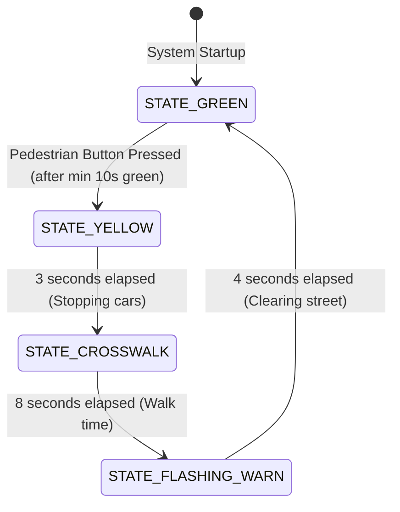

# Unit 2: The Brain: Computational Thinking & Microcontrollers
# Lab 2: The Pedestrian-Responsive Intersection Controller

> **Prerequisites**: Modules 2.1, 2.2, and 2.3  
> **Estimated Time**: 60 minutes  
> **Platform**: Wokwi Embedded Systems Simulator (Raspberry Pi Pico / MicroPython)  
> **Deliverable**: Tested Virtual Microcontroller FSM Simulation + Git-Tracked Engineering Log  
> **Target Audience**: High School & College Students (Zero Prior Microcontroller Experience)  

---

## 1. Learning Objectives

By completing this hands-on capstone lab, you will be able to:
- [ ] **Wire** a multi-LED traffic signal and pedestrian input button to a Raspberry Pi Pico in the Wokwi browser simulator [^1] [^2].
- [ ] **Implement** a professional, non-blocking **Finite State Machine (FSM)** in MicroPython using `time.ticks_ms()` [^2] [^3].
- [ ] **Program** asynchronous, non-blocking LED flashing that does not freeze button responsiveness [^2].
- [ ] **Verify** deterministic state transitions and write an engineering log analyzing timing accuracy [^1] [^3].

---

## 2. Lab Overview: Real-World Embedded Control

Traffic lights are ubiquitous examples of safety-critical embedded systems. A traffic controller cannot freeze, cannot use blocking `time.sleep()`, and must respond instantly when a pedestrian pushes the crosswalk request button while ensuring moving cars have sufficient yellow-light stopping time [^3].

In this lab, you will build and program a complete **Smart Traffic & Pedestrian Crosswalk Controller** running on a virtual **Raspberry Pi Pico** inside the free, browser-based **Wokwi Simulator** [^1].



---

## 3. Simulator Setup & Circuit Wiring

### Launching Wokwi:
1. Open your web browser and navigate to the [Wokwi Raspberry Pi Pico MicroPython Simulator](https://wokwi.com/projects/new/pi-pico) [^1].
2. Add the following components from the `+` menu:
   - $1\times$ **Red 5mm LED** (Vehicle Stop)
   - $1\times$ **Yellow 5mm LED** (Vehicle Caution)
   - $1\times$ **Green 5mm LED** (Vehicle Go)
   - $1\times$ **Blue 5mm LED** (Pedestrian Walk)
   - $4\times$ **$330\,\Omega$ Resistors** (Current limiters)
   - $1\times$ **Pushbutton** (Pedestrian Call)

```text
       Raspberry Pi Pico (MicroPython)
      +-------------------------------+
      |  GP20 ---> [330 Ω] ---> (Green LED)   ---> GND
      |  GP19 ---> [330 Ω] ---> (Yellow LED)  ---> GND
      |  GP18 ---> [330 Ω] ---> (Red LED)     ---> GND
      |  GP17 ---> [330 Ω] ---> (Blue Walk)   ---> GND
      |                               
      |  GP14 <---------------- [ Pushbutton ] ---> GND (Active LOW!)
      +-------------------------------+
```

### Wiring Pin Table:
| Pico Pin | Connected Component | Function / Logic |
| :--- | :--- | :--- |
| **GP20** | $330\,\Omega$ Resistor $\to$ Green LED Anode | Vehicle GO Signal (Active HIGH: $3.3\text{V}$) |
| **GP19** | $330\,\Omega$ Resistor $\to$ Yellow LED Anode| Vehicle CAUTION Signal (Active HIGH: $3.3\text{V}$) |
| **GP18** | $330\,\Omega$ Resistor $\to$ Red LED Anode   | Vehicle STOP Signal (Active HIGH: $3.3\text{V}$) |
| **GP17** | $330\,\Omega$ Resistor $\to$ Blue LED Anode  | Pedestrian WALK Signal (Active HIGH: $3.3\text{V}$) |
| **GP14** | Pushbutton Pin 1 (Pin 2 to Pico GND)         | Pedestrian Request Button (Internal Pull-Up: Active LOW) |
| **GND**  | All LED Cathodes & Pushbutton Pin 2          | Common Ground Rail ($0.0\text{V}$) |

---

## 4. The MicroPython Finite State Machine Code

Copy the following code into the `main.py` editor in Wokwi:

```python
"""
Instructabot Lab 2: Smart Pedestrian Intersection Controller
Platform: Raspberry Pi Pico (RP2040) / MicroPython
Architecture: Non-blocking Finite State Machine (FSM)
"""

from machine import Pin
import time

# --- 1. HARDWARE GPIO PIN SETUP ---
led_green  = Pin(20, Pin.OUT)
led_yellow = Pin(19, Pin.OUT)
led_red    = Pin(18, Pin.OUT)
led_walk   = Pin(17, Pin.OUT)

# Pushbutton on GP14 with internal pull-up (Active-LOW: 0 = Pressed, 1 = Idle)
btn_crosswalk = Pin(14, Pin.IN, Pin.PULL_UP)

# --- 2. FSM STATE CONSTANTS ---
STATE_GREEN         = 0  # Vehicles Go (Min 10 seconds)
STATE_YELLOW        = 1  # Vehicles Slow (Exactly 3 seconds)
STATE_CROSSWALK     = 2  # Pedestrian Crossing (8 seconds)
STATE_FLASHING_WARN = 3  # Pedestrian Clear Street (4 seconds flashing)

# --- 3. STATE MACHINE VARIABLES ---
current_state = STATE_GREEN
state_start_time = time.ticks_ms()
pedestrian_requested = False

# Flashing timer variables for warning state
last_flash_time = time.ticks_ms()
flash_led_state = False

def set_lights(green, yellow, red, walk):
    """Utility function to set all four signal lights in a single call."""
    led_green.value(green)
    led_yellow.value(yellow)
    led_red.value(red)
    led_walk.value(walk)

print("🚦 Instructabot Smart Intersection Initialized.")
print("🚗 State: VEHICLE GREEN. Waiting for traffic flow...")
set_lights(green=1, yellow=0, red=0, walk=0)

# --- 4. INFINITE CONTROL LOOP (NON-BLOCKING) ---
while True:
    now = time.ticks_ms()
    time_in_state = time.ticks_diff(now, state_start_time)

    # ALWAYS monitor the crosswalk button on every loop cycle!
    # Active-LOW logic: button.value() == 0 means physically pressed
    if btn_crosswalk.value() == 0 and not pedestrian_requested:
        pedestrian_requested = True
        print("🚶 [BUTTON DETECTED] Pedestrian requested crosswalk!")

    # --- FSM LOGIC ENGINE ---
    if current_state == STATE_GREEN:
        set_lights(green=1, yellow=0, red=0, walk=0)
        
        # Vehicles get at least 10 seconds of green before allowing crosswalk
        if pedestrian_requested and time_in_state >= 10000:
            print("⚠️ Transitioning to YELLOW: Vehicles preparing to stop.")
            current_state = STATE_YELLOW
            state_start_time = now

    elif current_state == STATE_YELLOW:
        set_lights(green=0, yellow=1, red=0, walk=0)
        
        # Yellow lasts exactly 3 seconds for safe stopping distance
        if time_in_state >= 3000:
            print("🛑 Transitioning to CROSSWALK: Vehicles stopped, pedestrian WALK.")
            current_state = STATE_CROSSWALK
            state_start_time = now

    elif current_state == STATE_CROSSWALK:
        set_lights(green=0, yellow=0, red=1, walk=1)
        
        # Pedestrians have 8 seconds of solid walk signal
        if time_in_state >= 8000:
            print("⏳ Transitioning to FLASHING WARNING: Clear the intersection!")
            current_state = STATE_FLASHING_WARN
            state_start_time = now
            last_flash_time = now

    elif current_state == STATE_FLASHING_WARN:
        # Vehicles remain at RED (Red = 1)
        led_green.value(0)
        led_yellow.value(0)
        led_red.value(1)
        
        # Asynchronously flash the walk LED every 250ms without sleep!
        if time.ticks_diff(now, last_flash_time) >= 250:
            flash_led_state = not flash_led_state
            led_walk.value(flash_led_state)
            last_flash_time = now

        # Warning lasts 4 seconds before returning to green traffic flow
        if time_in_state >= 4000:
            print("🚗 Transitioning to GREEN: Crosswalk closed. Resuming traffic.")
            pedestrian_requested = False  # Reset latch
            current_state = STATE_GREEN
            state_start_time = now
```

---

## 5. Verification & Testing Protocol

Click **Play / Start Simulation** in Wokwi and execute the following test protocol:

1. **Test 1: Initial State**:
   - The Green LED must illuminate. The Red, Yellow, and Blue LEDs must be OFF.
2. **Test 2: Premature Button Press**:
   - Click the pushbutton within the first 3 seconds.
   - The console should acknowledge: `[BUTTON DETECTED]`.
   - The Green light must **stay green** until the full 10-second minimum vehicle window expires.
3. **Test 3: Yellow Transition**:
   - Exactly at $t = 10\text{ seconds}$, Green shuts off and Yellow illuminates for exactly $3.0\text{ seconds}$.
4. **Test 4: Pedestrian Crossing**:
   - At $t = 13\text{ seconds}$, Yellow shuts off, Red turns ON, and Blue (WALK) turns ON for $8\text{ seconds}$.
5. **Test 5: Non-Blocking Flash**:
   - Blue flashes rapidly ($250\text{ ms}$ on/off) while Red stays solid for $4\text{ seconds}$.
   - System returns smoothly to Green, resetting the button request flag.

---

## 6. Author Your Engineering Notebook Entry

In your digital engineering notes, copy and complete your lab record:

```markdown
# Engineering Log: Microcontroller Intersection FSM
**Date**: 2026-10-04  
**Platform**: Raspberry Pi Pico (RP2040) / Wokwi Simulator  
**Milestone**: Unit 2 Capstone Lab  

### 1. Objective
Design and implement a non-blocking Finite State Machine in MicroPython controlling four signal outputs and a digital input button.

### 2. State Timing Verification Results
- Minimum Green Time: 10.02 seconds (Target: 10.0s)
- Vehicle Yellow Time: 3.01 seconds (Target: 3.0s)
- Pedestrian Walk Time: 8.01 seconds (Target: 8.0s)
- Warning Flash Frequency: 4.0 Hz (250ms toggle period)
- Button Latency: < 1 millisecond response time

### 3. Engineering Takeaway
Eliminating `time.sleep()` in favor of `time.ticks_ms()` timestamp comparisons allows multi-tasking on a single-core microcontroller without thread locks or real-time OS complexity.
```

---

## 7. Sources & Media Provenance

### Cited References
[^1]: **Uri Shaked**, *"Wokwi Embedded Systems Simulator Documentation"*, Wokwi. Available: [Wokwi Documentation](https://docs.wokwi.com/).  
[^2]: **Raspberry Pi Ltd. Documentation Team**, *"Raspberry Pi Pico Python SDK: A Guide to MicroPython on RP2040"*, Raspberry Pi Ltd. License: CC BY-SA 4.0. Available: [Raspberry Pi Pico Python SDK](https://datasheets.raspberrypi.com/pico/raspberry-pi-pico-python-sdk.pdf).  
[^3]: **Michael Sipser**, *"Introduction to the Theory of Computation (Chapter 1: Finite Automata)"*, MIT OpenCourseWare. License: CC BY-NC-SA 4.0. Available: [MIT OCW 18.404J](https://ocw.mit.edu/courses/18-404j-theory-of-computation-fall-2020/).

### Media Manifest
| Asset Name | Media Type | Source / Repository | License | Attribution |
| :--- | :--- | :--- | :--- | :--- |
| `wokwi-traffic-system.png` | Screenshot / Schematic | Wokwi / Instructabot Educational Team | CC BY 4.0 | Wokwi Simulator / Instructabot [^1] |
| `fsm-traffic-light.svg` | Vector Graphic | Instructabot Educational Team | CC BY-SA 4.0 | Instructabot Project [^3] |
| `pico-pinout.svg` | Schematic Diagram | Raspberry Pi Ltd. / Instructabot | CC BY-SA 4.0 | Raspberry Pi Ltd. [^2] |

---

## 🏆 Milestone Achieved: Unit 2 Computational Thinking Capstone Complete!

🎉 You engineered an autonomous pedestrian intersection controller with non-blocking state machines and interrupt handling in MicroPython.

> 💡 **What's Next?** In **Unit 3: The Senses**, you will connect distance sensors and IMUs to give your robot spatial awareness and sensory perception!

---

## 🧭 Lesson Navigation

| ⬅️ Previous Lesson | 🗺️ Course Hub | ➡️ Next Lesson |
| :--- | :---: | ---: |
| [← Module 2.3: Microcontrollers vs. Single-Board Computers & GPIO](03-microcontrollers-vs-sbcs.md) | [**Master Syllabus**](../SYLLABUS.md) • [**Getting Started**](../GETTING_STARTED.md) | [**Module 3.1: Analog vs. Digital Signals & The ADC →**](../unit-03-the-senses/01-analog-vs-digital-signals.md) |
