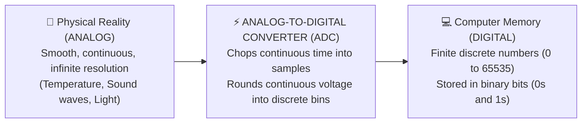

# Unit 3: The Senses: Sensors, Signals, & Perception
# Module 3.1: Analog vs. Digital Signals & The ADC

> **Prerequisites**: Unit 1 (Circuits & Voltage Dividers), Unit 2 (MicroPython & GPIO)  
> **Estimated Time**: 45 minutes  
> **Interactive Activity**: Reading Analog Potentiometers & Calculating Voltages in MicroPython  
> **Target Audience**: High School & College Students (Zero Prior Signal Processing Experience)  

---

## 1. Learning Objectives

By the end of this module, you will be able to:
- [ ] **Contrast** continuous physical analog phenomena with discrete digital numbers [^1].
- [ ] **Explain** the two-step digitization process: **Sampling** (time discretization) and **Quantization** (amplitude discretization) [^1].
- [ ] **Calculate** the voltage resolution of an Analog-to-Digital Converter (ADC) given its bit depth ($N$) and reference voltage ($V_{\text{ref}}$) [^1] [^2].
- [ ] **Read and convert** raw analog sensor values into calibrated physical units using MicroPython's `machine.ADC` module [^2] [^3].

---

## 2. Intuitive Big Picture: The Smooth Slide vs. The Staircase

Look at a light dimmer switch on your wall:
- A **continuous rotary dial** lets you choose an infinite number of brightness levels: $10\%$, $10.5\%$, $10.572\%$, and so forth. That is **Analog**.
- A **light switch** only has two states: `ON` ($1$) or `OFF` ($0$). That is **Digital**.



The physical universe is analog. Temperature does not jump discontinuously from $20^\circ\text{C}$ to $21^\circ\text{C}$; it glides smoothly through every decimal number in between.

However, microprocessors cannot store infinity. To perceive the world, a robot must convert continuous voltages into discrete numbers using an **Analog-to-Digital Converter (ADC)** [^1] [^2].

---

## 3. The Core Concept Explained

### 3.1 The Two Steps of Digitization

Converting a continuous wave into numbers requires two distinct transformations [^1]:

```text
 Continuous Analog Wave (Volts)                 Discrete Digital Staircase
       ^                                              ^
       |   .--.                                       |     __
       |  /    \                                      |    |  |
       | /      \                                     |  __|  |__
  0V --+-----------> Time                       0V ---+------------> Time
                                                       Sampling Intervals
```

1. **Sampling (Discretizing Time)**:
   - The ADC takes snapshots of the input voltage at fixed time intervals (e.g., $1,000\text{ times per second} = 1\text{ kHz}$).
   - *Rule of Thumb (Nyquist-Shannon Theorem)*: To accurately capture a changing physical signal, you must sample at least **twice as fast** as the highest frequency in the signal [^1].
2. **Quantization (Discretizing Voltage)**:
   - The continuous voltage at each sample point is rounded to the nearest discrete number (bin). The precision of these bins is determined by the ADC's **Bit Depth** ($N$) [^1] [^2].

---

### 3.2 ADC Bit Depth and Voltage Resolution

The number of binary bits ($N$) determines how many distinct steps the ADC can measure:

$$\text{Total Discrete Steps} = 2^N$$

| ADC Bit Depth ($N$) | Total Steps ($2^N$) | Resolution on a 3.3V Microcontroller ($\Delta V = \frac{3.3\text{V}}{2^N - 1}$) | Real-World Application |
| :--- | :--- | :--- | :--- |
| **8-bit** | $2^8 = 256$ | $\approx 12.9\text{ mV per step}$ | Low-cost toy sensors |
| **10-bit** | $2^{10} = 1,024$ | $\approx 3.22\text{ mV per step}$ | Classic Arduino Uno |
| **12-bit** | $2^{12} = 4,096$ | $\approx 0.81\text{ mV per step}$ | **Raspberry Pi Pico (RP2040) Hardware** [^2] |
| **16-bit** | $2^{16} = 65,536$ | $\approx 0.05\text{ mV per step}$ | Professional audio & medical instrumentation |

#### Quantization Error:
Because the ADC rounds the voltage to the nearest integer step, the digital representation is never 100% exact. The difference between the true physical voltage and the digital reading is called **Quantization Noise** [^1]. A 12-bit ADC has an error window of less than $0.8\text{ millivolts}$, which is more than accurate enough for robotics!

---

### 3.3 Reading Analog Sensors in MicroPython

The Raspberry Pi Pico contains **three analog input pins**: `GP26` (ADC0), `GP27` (ADC1), and `GP28` (ADC2) [^2].

Although the Pico's hardware ADC has 12 bits of resolution ($0$ to $4095$), MicroPython **normalizes all ADC readings across all microcontrollers to a standard 16-bit unsigned integer ($0$ to $65535$)** using the `read_u16()` method [^2] [^3]:

```python
from machine import ADC, Pin
import time

# Initialize ADC on GP26 (Analog Channel 0)
potentiometer = ADC(Pin(26))

while True:
    # Read raw 16-bit digital integer (Range: 0 to 65535)
    raw_value = potentiometer.read_u16()
    
    # Convert raw integer back into true physical Voltage (0.0V to 3.3V)
    voltage = (raw_value / 65535.0) * 3.3
    
    print(f"Raw Integer: {raw_value:5d}  |  Calculated Voltage: {voltage:.3f} V")
    time.sleep(0.2)
```

#### How the Conversion Formula Works:
- If `raw_value == 0`: Voltage $= \frac{0}{65535} \times 3.3\text{V} = \mathbf{0.00\text{V}}$.
- If `raw_value == 32768`: Voltage $= \frac{32768}{65535} \times 3.3\text{V} \approx \mathbf{1.65\text{V}}$ (Exact midpoint).
- If `raw_value == 65535`: Voltage $= \frac{65535}{65535} \times 3.3\text{V} = \mathbf{3.30\text{V}}$.

---

### 3.4 What About Analog Output? (PWM Explained)

Most microcontrollers **do not have a Digital-to-Analog Converter (DAC)** to output true continuous voltages. Instead, to create the illusion of an analog output (like dimming an LED or setting motor speed), microcontrollers use **Pulse Width Modulation (PWM)** [^2] [^3].

PWM rapidly turns a digital pin `HIGH` and `LOW` thousands of times per second. By varying the percentage of time the signal is `HIGH` (the **Duty Cycle**), the average voltage delivered to the load changes smoothly from $0\%$ to $100\%$:

```text
 25% Duty Cycle (Dim LED / Slow Motor)       75% Duty Cycle (Bright LED / Fast Motor)
    +---+                                       +---------+
    |   |                                       |         |
 ---+   +-------+---+                           +         +---+   +-------+
```

---

## 4. Hands-On Analog Sensor Reading Lab

### Lab Objective
In this exercise, you will connect a potentiometer (rotary knob) to an ADC pin, read the voltage, and use software calibration to map the voltage to a physical temperature readout ($0^\circ\text{C}$ to $100^\circ\text{C}$).

```python
from machine import ADC, Pin
import time

# Setup ADC on GP26
sensor_pin = ADC(Pin(26))

def read_calibrated_temperature():
    """Reads sensor voltage and maps 0.0V-3.3V to 0°C-100°C."""
    raw = sensor_pin.read_u16()
    voltage = (raw / 65535.0) * 3.3
    
    # Linear calibration mapping: 0V = 0°C, 3.3V = 100°C
    temperature_celsius = (voltage / 3.3) * 100.0
    return voltage, temperature_celsius

print("🌡️ Analog Sensor Calibration Initialized.")

for _ in range(10):
    volts, temp = read_calibrated_temperature()
    print(f"Measured: {volts:.2f}V --> Calibrated Temp: {temp:.1f} °C")
    time.sleep(0.5)
```

---

## 5. Troubleshooting & Analog Pitfalls

> [!WARNING]
> **Pitfall 1: Over-Voltage on ADC Pins**  
> The maximum voltage an ADC pin on the Raspberry Pi Pico can measure is **$3.3\text{V}$**. If you connect a $5.0\text{V}$ sensor directly to `GP26`, you will exceed the internal diode protection limits and permanently fry the ADC module inside the chip. Always use a voltage divider (Module 1.2) to step $5.0\text{V}$ signals down to $\le 3.3\text{V}$ before feeding them to an ADC pin! [^2]

> [!WARNING]
> **Pitfall 2: Analog Electrical Noise (Ground Bounce)**  
> If you run a high-power motor from the same breadboard rails as an analog sensor, the motor's electrical noise will cause the ADC readings to fluctuate wildly by hundreds of counts. To solve this, connect the sensor ground directly to the Pico's dedicated analog ground pin (`AGND` / Pin 33) rather than a noisy digital motor ground rail [^2].

---

## 6. Real-World Applications & Next Steps

ADC processing is how robots interpret all environmental variables:
- Battery fuel gauges monitor remaining battery percentage by measuring voltage through an ADC.
- Analog joysticks use two perpendicular potentiometers read by ADCs to measure $(X, Y)$ steering commands.

In our next module, **Module 3.2: Distance & Proximity Sensing**, we will explore how robots measure spatial distance using acoustic sound waves (Ultrasonic HC-SR04) and laser light (Time-of-Flight sensors)!

---

## 7. Sources & Media Provenance

### Cited References
[^1]: **Alan V. Oppenheim, Alan S. Willsky**, *"Signals and Systems (6.007) — Continuous and Discrete-Time Signals & Sampling"*, MIT OpenCourseWare. License: CC BY-NC-SA 4.0. Available: [MIT OCW Signals and Systems](https://ocw.mit.edu/courses/res-6-007-signals-and-systems-spring-2011/).  
[^2]: **Raspberry Pi Ltd. Documentation Team**, *"Raspberry Pi Pico Python SDK: Hardware ADC Specifications"*, Raspberry Pi Ltd. License: CC BY-SA 4.0. Available: [Raspberry Pi Pico SDK](https://datasheets.raspberrypi.com/pico/raspberry-pi-pico-python-sdk.pdf).  
[^3]: **Damien P. George, MicroPython Community**, *"MicroPython Documentation: machine.ADC Class"*, George Robotics Ltd. Available: [MicroPython ADC Documentation](https://docs.micropython.org/en/latest/library/machine.ADC.html).

### Media Manifest
| Asset Name | Media Type | Source / Repository | License | Attribution |
| :--- | :--- | :--- | :--- | :--- |
| `adc-sampling.svg` | Vector Graphic / Signal Plot | Instructabot Educational Team | CC BY-SA 4.0 | Instructabot Project [^1] |
| `pico-pinout.svg` | Schematic Diagram | Raspberry Pi Ltd. / Instructabot | CC BY-SA 4.0 | Raspberry Pi Ltd. [^2] |
| `five-subsystems-flow.svg` | Vector Diagram | Instructabot Educational Team | CC BY-SA 4.0 | Instructabot Project |
