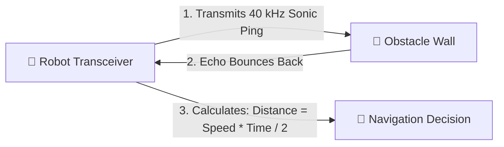
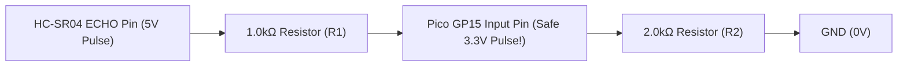

# Unit 3: The Senses: Sensors, Signals, & Perception
# Module 3.2: Distance & Proximity Sensing (Ultrasonic & Time-of-Flight)

> **Prerequisites**: Module 3.1 (Analog vs. Digital Signals), Unit 1 (Voltage Dividers)  
> **Estimated Time**: 45 minutes  
> **Interactive Activity**: Calculating Time-of-Flight Distances & Ultrasonic Echometry  
> **Target Audience**: High School & College Students (Zero Prior Physics Background)  

---

## 1. Learning Objectives

By the end of this module, you will be able to:
- [ ] **Explain** the physical principle of **Time-of-Flight (ToF)** distance measurement using sound and light waves [^1].
- [ ] **Derive and apply** the acoustic distance formula ($d = \frac{v_{\text{sound}} \times t}{2}$) to convert microsecond echo pulses into centimeters [^1] [^2].
- [ ] **Identify and mitigate** the physical failure modes of ultrasound: specular reflections, acoustic absorption, and sensor blind zones [^1].
- [ ] **Interface** a $5\text{V}$ HC-SR04 ultrasonic sensor safely to a $3.3\text{V}$ microcontroller using a resistive voltage divider [^2] [^3].

---

## 2. Intuitive Big Picture: Seeing in the Dark with Echoes

Imagine standing in front of a giant canyon in total darkness. You shout: *"HELLO!"*
Exactly four seconds later, you hear your echo bounce back: *"HELLO!"*

Because sound travels through air at a known speed (roughly 343 meters per second), you can immediately calculate how far away the canyon wall is:
1. The sound traveled to the wall and back in 4 seconds.
2. The one-way trip to the wall took **2 seconds**.
3. Distance $= 343\text{ m/s} \times 2\text{ seconds} = \mathbf{686\text{ meters}}$ away!



This biological trick—used by bats and dolphins for millions of years—is called **echolocation**. In robotics, we replicate this using an **HC-SR04 Ultrasonic Distance Sensor** [^1].

---

## 3. The Core Concept Explained

### 3.1 The HC-SR04 Ultrasonic Sensor Architecture

The HC-SR04 sensor consists of two aluminum cylinders that look like a pair of metallic eyes [^1]:
1. **Transmitter (T)**: An acoustic speaker that emits high-frequency ultrasonic sound waves at **$40,000\text{ Hz}$** ($40\text{ kHz}$—far above the human hearing limit of $20\text{ kHz}$).
2. **Receiver (R)**: A sensitive microphone tuned exclusively to listen for returning $40\text{ kHz}$ echoes.

```text
               +---------------------------------------+
               |        HC-SR04 ULTRASONIC SENSOR      |
               |                                       |
               |    [ (T) Sonic Speaker ]   [ (R) Sonic Mic ]  |
               |                                       |
               +---------------------------------------+
                   |          |          |          |
                  VCC       TRIG       ECHO        GND
                 (+5V)     (Input)   (Output)     (0V)
```

#### The 4-Step Measurement Protocol:
1. **Trigger (`TRIG`)**: The microcontroller sends a tiny **$10\text{ microsecond}$ digital `HIGH` pulse** to the `TRIG` pin.
2. **Sonic Burst**: The sensor's onboard circuit automatically transmits an 8-cycle burst of $40\text{ kHz}$ sound waves.
3. **Echo Timing (`ECHO`)**: The moment the sound leaves, the sensor pulls its `ECHO` pin `HIGH`.
4. **Echo Reception**: The sound hits an obstacle and bounces back. The instant the receiver hears the returning echo, it pulls the `ECHO` pin `LOW`.
5. **Result**: The length of time the `ECHO` pin remained `HIGH` is **the exact round-trip flight time of the sound wave** [^1] [^2]!

---

### 3.2 The Physics Math: Converting Echo Time to Distance

The speed of sound in dry air at room temperature ($20^\circ\text{C}$) is approximately:

$$v_{\text{sound}} \approx 343\text{ meters per second} = 0.0343\text{ centimeters per microsecond} = \frac{1}{29.1}\text{ cm}/\mu\text{s}$$

Because the sound wave must travel **to the obstacle and all the way back**, the one-way distance ($d$) is:

$$d = \frac{v_{\text{sound}} \times t_{\text{echo}}}{2} = \frac{0.0343 \times t_{\mu\text{s}}}{2} = \frac{t_{\mu\text{s}}}{58.2}\text{ centimeters}$$

```text
       Example Calculation:
       If the Echo pulse lasts 1,164 microseconds:
       Distance = 1164 / 58.2 = 20.0 centimeters!
```

> [!NOTE]
> **Temperature Compensation**:
> The speed of sound varies slightly with ambient temperature ($v = 331.3 + 0.606 \cdot T_{^\circ\text{C}}$). In extreme environments (like winter outdoors or hot factories), roboticists measure ambient temperature with a thermistor and dynamically update the speed of sound constant to prevent range errors [^1].

---

### 3.3 Physical Failure Modes: When Sound Lies to Robots

While ultrasonic sensors are inexpensive ($\approx \$2$) and reliable for flat walls, every roboticist must know their physical failure modes [^1]:

```mermaid
flowchart TD
    subgraph "1. Specular Reflection (The Angled Mirror Trap)"
        A1["Sonic Ping"] -->|Hits Wall at >45° Angle| B1["Echo Bounces Away into Space!"]
        B1 --> C1["Robot Thinks Space is Clear and Crashes!"]
    end

    subgraph "2. Acoustic Absorption (The Soft Cushion Trap)"
        A2["Sonic Ping"] -->|Hits Foam / Curtains / Pet Fur| B2["Energy Absorbed & Dissipated"]
        B2 --> C2["No Echo Returns!"]
    end

    subgraph "3. The Blind Zone Trap (< 2 cm)"
        A3["Obstacle < 2cm from Sensor"] -->|Echo Returns While Mic is Ringing| B3["Sensor Blind!"]
    end
```



1. **Specular Reflection**: Sound behaves like light hitting a mirror. If your robot approaches a flat wall at an angle greater than $45^\circ$, the sound bounces away from the robot rather than returning. The sensor times out and reports "infinity" right before the robot crashes!
2. **Acoustic Absorption**: Soft materials like carpets, velvet curtains, or thick clothing absorb ultrasonic vibrations rather than reflecting them.
3. **Sensor Blind Zone**: The sensor requires about $2\text{ cm}$ of distance for the transmitting transducer to stop ringing before the receiver can hear faint echoes. Any object closer than $2\text{ cm}$ is completely invisible [^1].

---

### 3.4 Safe Electrical Interfacing: Protecting 3.3V Microcontrollers

The HC-SR04 is a $5.0\text{V}$ device. Its `ECHO` output pin outputs a **$5.0\text{V}$ digital signal**.

As learned in Module 2.3, the Raspberry Pi Pico operates on **$3.3\text{V}$ logic**! Connecting the $5\text{V}$ `ECHO` pin directly to a Pico GPIO pin will damage the chip.

We solve this using our **Voltage Divider** from Module 1.2:



$$\text{Voltage into Pico} = 5.0\text{V} \times \left( \frac{2\text{k}\Omega}{1\text{k}\Omega + 2\text{k}\Omega} \right) = 5.0\text{V} \times 0.666 = \mathbf{3.33\text{V (Perfect!)}}$$

---

## 4. Hands-On MicroPython Code Lab

### Lab Objective
In this exercise, you will implement a complete, robust HC-SR04 driver in MicroPython using hardware microsecond timers (`time.ticks_us()`).

```python
from machine import Pin
import time

class UltrasonicSensor:
    def __init__(self, trig_pin=14, echo_pin=15):
        # Configure GPIO pins
        self.trig = Pin(trig_pin, Pin.OUT)
        self.echo = Pin(echo_pin, Pin.IN)
        self.trig.value(0)
        time.sleep(0.05)  # Let sensor stabilize

    def get_distance_cm(self):
        """Measures obstacle distance in centimeters using time-of-flight."""
        # 1. Send clean 10-microsecond trigger pulse
        self.trig.value(1)
        time.sleep_us(10)
        self.trig.value(0)

        # 2. Wait for echo pin to go HIGH (with 30ms timeout = ~5 meters)
        timeout_us = 30000
        start_wait = time.ticks_us()
        while self.echo.value() == 0:
            if time.ticks_diff(time.ticks_us(), start_wait) > timeout_us:
                return -1.0  # Timeout error: no echo detected

        pulse_start = time.ticks_us()

        # 3. Wait for echo pin to go LOW (recording pulse duration)
        while self.echo.value() == 1:
            if time.ticks_diff(time.ticks_us(), pulse_start) > timeout_us:
                return -1.0  # Timeout error: obstacle too far

        pulse_end = time.ticks_us()

        # 4. Calculate round-trip duration in microseconds
        duration = time.ticks_diff(pulse_end, pulse_start)

        # 5. Convert to centimeters: Distance = duration / 58.2
        distance_cm = duration / 58.2
        return round(distance_cm, 1)

# --- Test Loop ---
sonar = UltrasonicSensor(trig_pin=14, echo_pin=15)
print("🦇 Ultrasonic Sonar Active. Reading distances...")

for _ in range(10):
    dist = sonar.get_distance_cm()
    if dist > 0:
        print(f"Obstacle Range: {dist:5.1f} cm")
    else:
        print("Out of range / Echo timeout")
    time.sleep(0.3)
```

---

## 5. Troubleshooting & Sensor Pitfalls

> [!WARNING]
> **Pitfall 1: Polling in an Infinite Loop without a Timeout**  
> If an acoustic pulse shoots into empty space and never reflects back, the `ECHO` pin will stay low or high indefinitely. If your code uses a raw `while self.echo.value() == 0:` loop without a microsecond timeout check, your entire robot will freeze forever! Always include a timeout guard (typically $30\text{ ms}$) [^1] [^2].

> [!WARNING]
> **Pitfall 2: Acoustic Interference from Multiple Sonars**  
> If a robot has two ultrasonic sensors on its front bumper and triggers them simultaneously, Sensor A will hear the echo from Sensor B, leading to phantom readings. Always trigger multiple sonars sequentially, waiting at least $30\text{ ms}$ between pings for sound to dissipate.

---

## 6. Real-World Applications & Next Steps

Distance sensing is critical for collision avoidance across robotics:
- Automotive parking sensors use ultrasonic transceivers embedded in car bumpers to alert drivers to curbs and pedestrians.
- Modern high-end robots combine ultrasound with **Laser Time-of-Flight (LiDAR)**, which pulses infrared light at $300,000\text{ km/s}$ to generate high-resolution 3D point cloud maps.

In our next module, **Module 3.3: Motion & Orientation Sensing (IMUs)**, we will discover how robots know which way is up and how they detect turns using Accelerometers and Gyroscopes!

---

## 7. Sources & Media Provenance

### Cited References
[^1]: **SparkFun Electronics Technical Team**, *"HC-SR04 Ultrasonic Distance Sensor Hookup and Operating Guide"*, SparkFun Electronics. License: CC BY-SA 4.0. Available: [SparkFun Distance Sensing Guide](https://learn.sparkfun.com/tutorials/distance-sensing-basics).  
[^2]: **Raspberry Pi Ltd. Documentation Team**, *"Raspberry Pi Pico Python SDK: Hardware Timing & GPIO"*, Raspberry Pi Ltd. License: CC BY-SA 4.0. Available: [Raspberry Pi Pico SDK](https://datasheets.raspberrypi.com/pico/raspberry-pi-pico-python-sdk.pdf).  
[^3]: **Leslie Kaelbling, Tomas Lozano-Perez, Dennis Freeman**, *"Introduction to Electrical Engineering and Computer Science I (6.01SC) — Robot Sensors and Range Finders"*, MIT OpenCourseWare. License: CC BY-NC-SA 4.0. Available: [MIT OCW 6.01SC](https://ocw.mit.edu/courses/6-01sc-introduction-to-electrical-engineering-and-computer-science-i-spring-2011/).

### Media Manifest
| Asset Name | Media Type | Source / Repository | License | Attribution |
| :--- | :--- | :--- | :--- | :--- |
| `ultrasonic-tof.svg` | Vector Graphic / Diagram | Instructabot Educational Team | CC BY-SA 4.0 | Instructabot Project [^1] |
| `voltage-divider.svg` | Schematic Diagram | Instructabot Educational Team | CC BY-SA 4.0 | Instructabot Project |
| `pico-pinout.svg` | Schematic Diagram | Raspberry Pi Ltd. / Instructabot | CC BY-SA 4.0 | Raspberry Pi Ltd. [^2] |
