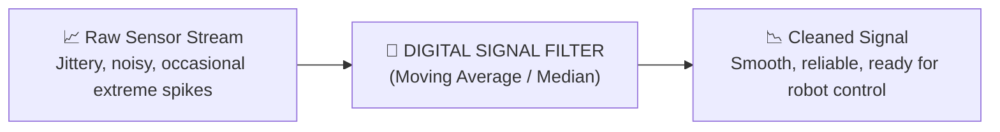
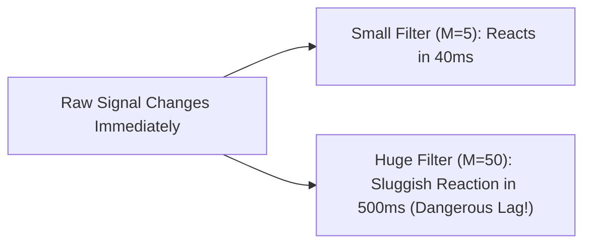

# Unit 3: The Senses: Sensors, Signals, & Perception
# Module 3.4: Real-World Sensor Noise & Digital Signal Filtering

> **Prerequisites**: Modules 3.1, 3.2, and 3.3  
> **Estimated Time**: 45 minutes  
> **Interactive Activity**: Benchmarking Moving Average vs. Median Filters in Python  
> **Target Audience**: High School & College Students (Zero Prior Engineering Experience)  

---

## 1. Learning Objectives

By the end of this module, you will be able to:
- [ ] **Distinguish** between high-frequency Gaussian noise (jitter) and impulsive outlier spikes (dropouts) in physical sensor data [^1].
- [ ] **Implement** a **Moving Average Filter** using a sliding window queue in Python [^1] [^2].
- [ ] **Implement** a **Median Filter** to eliminate extreme outlier spikes without distorting true edges [^1].
- [ ] **Analyze** the fundamental engineering trade-off between **noise smoothing** and **sensor phase lag** [^1] [^3].

---

## 2. Intuitive Big Picture: The Noisy World

In simulation or theoretical textbooks, when an obstacle is 30 centimeters away, an ultrasonic sensor outputs:

$$[30.0, 30.0, 30.0, 30.0, 30.0]$$

In the real physical world, because of air currents, motor electrical noise, and acoustic reflection variations, the sensor actually outputs:

$$[30.1, 29.8, 30.4, \mathbf{0.0}, 29.9, \mathbf{450.0}, 30.2]$$

Notice the two critical anomalies:
1. **High-Frequency Jitter**: The reading wobbles between $29.8\text{ cm}$ and $30.4\text{ cm}$.
2. **Impulsive Spurious Outliers**: A missed acoustic echo causes a single reading of $0.0\text{ cm}$ (triggering a false emergency stop) or $450.0\text{ cm}$ (missing an obstacle) [^1]!



If your robot reacts immediately to every raw sensor reading, its motors will twitch, jerk, and make erratic, unpredictable maneuvers. Raw sensor data must always be **conditioned and filtered** before feeding into control algorithms [^1] [^2].

---

## 3. The Core Concept Explained

### 3.1 The Moving Average Filter: Smoothing White Noise

The **Moving Average Filter** is the most common filter in digital signal processing because it is simple to understand and optimal for reducing random white noise while retaining a sharp step response [^1].

Instead of using the latest raw sample, the filter takes the arithmetic mean of the last $M$ samples:

$$y[n] = \frac{1}{M} \sum_{k=0}^{M-1} x[n-k] = \frac{x[n] + x[n-1] + \dots + x[n-(M-1)]}{M}$$

```text
       Sliding Window of Size M = 4:
       Raw Stream: [ 10, 12, 11, 15 ], 10, 13
                     |------------|  --> Average = (10+12+11+15) / 4 = 12.0
                         |------------|  --> Average = (12+11+15+10) / 4 = 12.0
```

#### Python Implementation with `collections.deque`:
A `deque` (double-ended queue) with a fixed maximum length automatically discards the oldest sample whenever a new sample arrives:

```python
from collections import deque

class MovingAverageFilter:
    def __init__(self, window_size=5):
        self.window = deque(maxlen=window_size)

    def update(self, new_value):
        self.window.append(new_value)
        return sum(self.window) / len(self.window)
```

---

### 3.2 The Median Filter: Eliminating Outlier Spikes

What happens when an ultrasonic sensor drops a ping and reports $0.0\text{ cm}$ or $500.0\text{ cm}$ for one frame?

If you use a 5-sample Moving Average:
$$\text{Window: } [30, 30, \mathbf{500}, 30, 30] \quad \implies \quad \text{Average} = \frac{620}{5} = \mathbf{124.0\text{ cm}!}$$
The single rogue spike pulls the average from $30\text{ cm}$ up to $124\text{ cm}$, completely corrupting your robot's perception!

To destroy outlier spikes, engineers use a **Median Filter** [^1]:
1. Take the $M$ samples in the sliding window.
2. Sort them numerically from smallest to largest.
3. Pick the **middle value (median)**:

```text
       Window: [ 30, 30, 500, 30, 30 ]
       Sorted: [ 30, 30,  30, 30, 500 ]
                           ^
                     Median = 30.0 cm! (The 500 spike is completely ignored!)
```

```python
class MedianFilter:
    def __init__(self, window_size=5):
        self.window = deque(maxlen=window_size)

    def update(self, new_value):
        self.window.append(new_value)
        sorted_window = sorted(self.window)
        mid_index = len(sorted_window) // 2
        return sorted_window[mid_index]
```

---

### 3.3 The Fundamental Trade-Off: Smoothness vs. Phase Lag

Why not simply set the window size to $M = 100$ samples?

Every digital filter introduces **Phase Lag (Delay)** [^1] [^3]. A filter cannot average future events; it can only average past history. The average lag introduced by a sliding window of size $M$ sampled at interval $\Delta t$ is:

$$\text{Time Delay} \approx \frac{M - 1}{2} \times \Delta t$$

| Window Size ($M$) | Noise Reduction | Lag Delay at 50 Hz ($\Delta t = 20\text{ ms}$) | Consequence on a Moving Robot |
| :--- | :--- | :--- | :--- |
| **$M = 1$ (Raw)** | $0\%$ (Raw Noise) | $0.0\text{ ms}$ (Instantaneous) | Twitchy motor control; false triggers |
| **$M = 5$** | $\approx 55\%$ Noise Cut | **$40\text{ ms}$** | **Ideal balance for mobile robotics!** |
| **$M = 15$** | $\approx 75\%$ Noise Cut | **$140\text{ ms}$** | Acceptable for slow stationary sensors |
| **$M = 51$** | $\approx 86\%$ Noise Cut | **$500\text{ ms}$ (Half a second!)** | Robot crashes into obstacle before filter reacts! |



---

## 4. Hands-On Signal Filtering Benchmark Lab

### Lab Objective
In this exercise, you will run a Python benchmark comparing raw noisy sensor readings against a **Moving Average Filter** and a **Median Filter**, observing how each filter responds to high-frequency jitter and sudden outlier spikes.

```python
import random
import time
from collections import deque

class SignalBenchmark:
    def __init__(self, window_size=5):
        self.avg_window = deque(maxlen=window_size)
        self.med_window = deque(maxlen=window_size)

    def process(self, raw_val):
        # 1. Moving average calculation
        self.avg_window.append(raw_val)
        avg_output = sum(self.avg_window) / len(self.avg_window)

        # 2. Median calculation
        self.med_window.append(raw_val)
        sorted_window = sorted(self.med_window)
        med_output = sorted_window[len(sorted_window) // 2]

        return avg_output, med_output

# Run simulation
benchmark = SignalBenchmark(window_size=5)
true_distance = 50.0

print("🔬 Running 10-Step Sensor Noise Filtering Experiment:")
print("Step | Raw Reading (Noisy) | Moving Average | Median Output")
print("-" * 65)

# Generate readings: 8 noisy readings + 2 extreme outlier spikes
test_readings = [
    50.4, 49.6, 50.8, 
    500.0,  # <-- Outlier spike! (Sensor drop)
    49.2, 50.3, 
    0.0,    # <-- Outlier spike! (Acoustic absorption)
    50.1, 49.8, 50.2
]

for step, raw in enumerate(test_readings):
    avg_val, med_val = benchmark.process(raw)
    spike_flag = " ⚠️ SPIKE!" if raw in [0.0, 500.0] else ""
    print(f"{step+1:4d} | {raw:19.1f} | {avg_val:14.1f} | {med_val:13.1f}{spike_flag}")
    time.sleep(0.05)
```

#### Observations from the Output:
- When the raw sensor spikes to `500.0`, the **Moving Average** jumps to `140.0` (heavily corrupted).
- The **Median Filter** holds rock-steady at `50.4`! It completely ignores the invalid outlier.

---

## 5. Troubleshooting & Filtering Pitfalls

> [!WARNING]
> **Pitfall 1: Using Even Window Sizes in Median Filters**  
> Always choose an **odd window size** (e.g., $3, 5, 7$) for median filters. An odd window size guarantees a single unambiguous middle number. An even window size forces an average between the two middle numbers, which can reintroduce partial spike corruption.

> [!WARNING]
> **Pitfall 2: Filtering Already-Clean Digital Signals**  
> Never run a moving average filter on binary digital signals (like a bumper limit switch or encoder tick interrupt). Averaging binary signals rounds sharp $0 \to 1$ edges into slow analog ramps, destroying real-time responsiveness. Use hardware/software debouncing (Module 2.3) for digital inputs instead [^2].

---

## 6. Real-World Applications & Next Steps

Signal conditioning is standard in modern robotics and aerospace:
- NASA Mars rovers use median filters on Hazcam disparity maps to remove single-pixel cosmic ray camera noise before computing obstacle slope.
- Industrial autonomous forklifts combine moving average and median filters to prevent factory lighting glares from corrupting LiDAR range returns.

In our unit capstone, **Lab 3: The Ultrasonic Sonar Radar Scanner**, we will put everything from Unit 3 together: mounting an ultrasonic distance sensor onto a sweeping servo motor in the Wokwi simulator, applying real-time noise filtering, and generating a 180-degree radar map of the environment!

---

## 7. Sources & Media Provenance

### Cited References
[^1]: **Steven W. Smith**, *"The Scientist and Engineer's Guide to Digital Signal Processing (Chapter 15: Moving Average & Median Filters)"*, California Technical Publishing. Available: [DSP Guide Chapter 15](https://www.dspguide.com/ch15.htm).  
[^2]: **Leslie Kaelbling, Tomas Lozano-Perez, Dennis Freeman**, *"Introduction to Electrical Engineering and Computer Science I (6.01SC) — Signals and Conditioning"*, MIT OpenCourseWare. License: CC BY-NC-SA 4.0. Available: [MIT OCW 6.01SC](https://ocw.mit.edu/courses/6-01sc-introduction-to-electrical-engineering-and-computer-science-i-spring-2011/).  
[^3]: **Alan V. Oppenheim, Alan S. Willsky**, *"Signals and Systems (6.007) — Linear Time-Invariant Systems & Group Delay"*, MIT OpenCourseWare. License: CC BY-NC-SA 4.0. Available: [MIT OCW Signals & Systems](https://ocw.mit.edu/courses/res-6-007-signals-and-systems-spring-2011/).

### Media Manifest
| Asset Name | Media Type | Source / Repository | License | Attribution |
| :--- | :--- | :--- | :--- | :--- |
| `sensor-noise-filtering.svg` | Signal Plot | Instructabot Educational Team | CC BY-SA 4.0 | Instructabot Project [^1] |
| `adc-sampling.svg` | Vector Graphic | Instructabot Educational Team | CC BY-SA 4.0 | Instructabot Project [^3] |
| `five-subsystems-flow.svg` | Vector Diagram | Instructabot Educational Team | CC BY-SA 4.0 | Instructabot Project |
