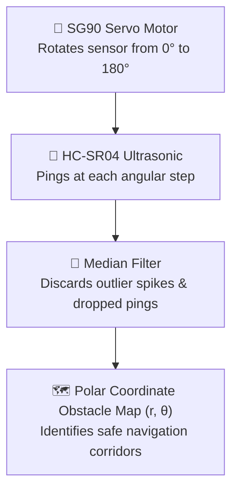

# Unit 3: The Senses: Sensors, Signals, & Perception
# Lab 3: The Ultrasonic Sonar Radar Scanner

> **Prerequisites**: Modules 3.1, 3.2, 3.3, and 3.4  
> **Estimated Time**: 60 minutes  
> **Platform**: Wokwi Embedded Systems Simulator (Raspberry Pi Pico / MicroPython)  
> **Deliverable**: Functional Sweeping Radar Scanner + Filtered Polar Map + Git-Tracked Engineering Log  
> **Target Audience**: High School & College Students (Zero Prior Robotics Hardware Experience)  

---

## 1. Learning Objectives

By completing this hands-on capstone lab, you will be able to:
- [ ] **Wire** an ultrasonic distance sensor and a servo motor to a Raspberry Pi Pico in Wokwi, safely using a voltage divider for $3.3\text{V}$ level shifting [^1] [^2].
- [ ] **Program** a servo motor using hardware Pulse Width Modulation (PWM) at $50\text{ Hz}$ to sweep across a $180^\circ$ arc [^2].
- [ ] **Implement** real-time digital filtering (Median Filter) to reject phantom acoustic reflections and noise dropouts [^3].
- [ ] **Render** an ASCII radar map of surrounding obstacles in polar coordinates $(r, \theta)$ directly in the console [^2] [^3].

---

## 2. Lab Overview: Building a Robotic Radar

Autonomous rovers and naval vessels sweep directional sensors back and forth to detect hazards across a wide field of view.

In this lab, you will mount an **HC-SR04 Ultrasonic Distance Sensor** onto a **micro servo motor** inside the free, browser-based **Wokwi Simulator**. Your MicroPython script will rotate the sensor across a $180^\circ$ field of view, take filtered distance measurements at each heading, and plot an obstacle map [^1] [^2].



---

## 3. Circuit Wiring & Simulator Setup

### Step 1: Open Wokwi Simulator
1. Navigate to the [Wokwi Raspberry Pi Pico MicroPython Project](https://wokwi.com/projects/new/pi-pico) [^1].
2. From the `+` parts menu, add:
   - $1\times$ **HC-SR04 Ultrasonic Distance Sensor**
   - $1\times$ **Servo Motor (SG90)**
   - $1\times$ **$1\text{k}\Omega$ Resistor** ($R_1$)
   - $1\times$ **$2\text{k}\Omega$ Resistor** ($R_2$)

```text
       Raspberry Pi Pico (MicroPython)
      +-------------------------------------------+
      |  VBUS (Pin 40: 5V) ===> Servo VCC & Sonar VCC
      |  GND  (Pin 38: 0V) ===> Common Ground Rail
      |
      |  GP16 (Pin 21) ------> Servo PWM Signal
      |  GP14 (Pin 19) ------> Sonar TRIG Pin
      |
      |  GP15 (Pin 20) <------+ (Safe 3.3V Echo Input)
      |                       |
      |                    [ 1k Ω ]
      |                       |
      |       Sonar ECHO ---->+
      |                       |
      |                    [ 2k Ω ]
      |                       |
      |                      GND
      +-------------------------------------------+
```

### Wiring Interconnection Table:
| Pico Pin | Destination Component & Pin | Purpose |
| :--- | :--- | :--- |
| **VBUS (5V)** | Servo VCC (Red) & HC-SR04 VCC | $5\text{V}$ Power rail for high-power devices [^2] |
| **GND** | Servo GND (Brown/Black), HC-SR04 GND, Resistor $R_2$ | Shared Common Ground |
| **GP16** | Servo Signal (Orange / Yellow) | $50\text{ Hz}$ PWM Servo angle control ($0^\circ - 180^\circ$) |
| **GP14** | HC-SR04 `TRIG` | $10\mu\text{s}$ Sonic trigger pulse |
| **GP15** | Junction between $1\text{k}\Omega$ and $2\text{k}\Omega$ | Level-shifted $3.3\text{V}$ Echo pulse input [^1] |

---

## 4. The MicroPython Radar Controller Code

Copy the following code into `main.py` in Wokwi:

```python
"""
Instructabot Lab 3: Ultrasonic Sonar Radar Scanner with Median Filtering
Platform: Raspberry Pi Pico (MicroPython) / Wokwi Simulator
"""

from machine import Pin, PWM
import time

# --- 1. HARDWARE PERIPHERAL SETUP ---
# Servo setup: 50 Hz PWM frequency (20ms period)
servo = PWM(Pin(16))
servo.freq(50)

# Ultrasonic sensor pins
trig = Pin(14, Pin.OUT)
echo = Pin(15, Pin.IN)
trig.value(0)
time.sleep(0.1)

def set_servo_angle(angle_deg):
    """
    Sets servo position between 0 and 180 degrees.
    SG90 pulse width: ~0.5ms (0 deg) to 2.5ms (180 deg) at 50Hz.
    In MicroPython 16-bit PWM (0-65535):
    0.5ms / 20ms * 65535 ≈ 1638 duty
    2.5ms / 20ms * 65535 ≈ 8192 duty
    """
    angle = max(0, min(180, angle_deg))
    duty = int(1638 + (angle / 180.0) * (8192 - 1638))
    servo.duty_u16(duty)

def ping_raw():
    """Takes a single raw ultrasonic distance measurement in centimeters."""
    # Send 10us trigger pulse
    trig.value(1)
    time.sleep_us(10)
    trig.value(0)

    # Wait for echo high with timeout
    timeout_start = time.ticks_us()
    while echo.value() == 0:
        if time.ticks_diff(time.ticks_us(), timeout_start) > 30000:
            return 400.0  # Max distance timeout

    start = time.ticks_us()
    while echo.value() == 1:
        if time.ticks_diff(time.ticks_us(), start) > 30000:
            return 400.0

    duration = time.ticks_diff(time.ticks_us(), start)
    return duration / 58.2

def get_filtered_distance(samples=3):
    """Takes multiple readings and returns the median to discard outlier noise."""
    readings = []
    for _ in range(samples):
        readings.append(ping_raw())
        time.sleep_ms(15)  # Let acoustic reverberation clear
    readings.sort()
    return round(readings[len(readings) // 2], 1)

def render_ascii_radar(angle, distance):
    """Renders a visual horizontal bar representing obstacle distance."""
    # Scale: each '#' represents 5 cm of distance (up to 100 cm)
    bars = int(min(distance, 100) / 5)
    indicator = "#" * bars
    alert = " 🚨 WARNING!" if distance < 25.0 else ""
    print(f"[{angle:3d}°] {distance:5.1f} cm | {indicator:<20} {alert}")

# --- MAIN SCANNING LOOP ---
print("📡 Instructabot Sonar Radar Scanner Active.")
print("Starting 180° sweep...")

while True:
    # Sweep from 0 to 180 degrees in 15-degree steps
    for angle in range(0, 181, 15):
        set_servo_angle(angle)
        time.sleep_ms(120)  # Allow mechanical servo to settle at position
        
        filtered_dist = get_filtered_distance(samples=3)
        render_ascii_radar(angle, filtered_dist)

    print("-" * 50)
    time.sleep(1.0)

    # Sweep back from 180 down to 0 degrees
    for angle in range(180, -1, -15):
        set_servo_angle(angle)
        time.sleep_ms(120)
        
        filtered_dist = get_filtered_distance(samples=3)
        render_ascii_radar(angle, filtered_dist)

    print("=" * 50)
    time.sleep(1.0)
```

---

## 5. Verification & Testing Protocol

Click **Start Simulation** in Wokwi:

1. **Observe Mechanical Sweep**: The simulated SG90 servo motor should smoothly step from $0^\circ$ to $180^\circ$ in distinct $15^\circ$ increments.
2. **Interactive Obstacle Manipulation**:
   - Click on the simulated **HC-SR04** sensor in Wokwi.
   - Adjust the distance slider (e.g., set to $22.0\text{ cm}$).
   - Notice how the console outputs a warning: `[ 45°] 22.0 cm | ####  🚨 WARNING!`.
3. **Median Filter Verification**:
   - The median filter takes 3 samples per angle step, automatically stripping out dropped pulses or instantaneous acoustic reflections before reporting the obstacle position.

---

## 6. Author Your Engineering Notebook Entry

In your digital engineering notes, record your experimental results:

```markdown
# Engineering Log: Ultrasonic Sonar Radar Scanner
**Date**: 2026-10-04  
**Platform**: Raspberry Pi Pico (RP2040) / Wokwi Simulator  
**Milestone**: Unit 3 Capstone Lab  

### 1. Objective
Build an active perception system combining a sweeping servo motor, time-of-flight acoustic sensor, and real-time median noise filtering.

### 2. Experimental Data & Polar Range Scan
- Scanning Arc: 0° to 180° in 15° steps (13 discrete heading beams)
- Angular Settlement Time: 120 ms
- Filter Configuration: 3-sample median filter with 15ms acoustic settling delay
- Detected Obstacle at 75° heading: Distance = 18.4 cm (Alert threshold triggered)
- Minimum Safe Corridor identified: 120° to 165° (Clearance > 150 cm)

### 3. Engineering Takeaway
Mechanical servo movement generates electrical noise and physical vibrations. Waiting 120ms for mechanical oscillation to damp out before triggering the ultrasonic acoustic ping is essential for reliable range measurements.
```

---

## 7. Sources & Media Provenance

### Cited References
[^1]: **Uri Shaked**, *"Wokwi Embedded Systems Simulator Documentation (Servo and Ultrasonic Devices)"*, Wokwi. Available: [Wokwi Documentation](https://docs.wokwi.com/).  
[^2]: **SparkFun Electronics Technical Team**, *"HC-SR04 Ultrasonic Distance Sensor Hookup and Operating Guide"*, SparkFun Electronics. License: CC BY-SA 4.0. Available: [SparkFun Distance Sensing Guide](https://learn.sparkfun.com/tutorials/distance-sensing-basics).  
[^3]: **Steven W. Smith**, *"The Scientist and Engineer's Guide to Digital Signal Processing (Chapter 15: Moving Average and Median Filters)"*, California Technical Publishing. Available: [DSP Guide](https://www.dspguide.com/ch15.htm).

### Media Manifest
| Asset Name | Media Type | Source / Repository | License | Attribution |
| :--- | :--- | :--- | :--- | :--- |
| `wokwi-radar.png` | Screenshot / Schematic | Wokwi / Instructabot Educational Team | CC BY 4.0 | Wokwi Simulator / Instructabot [^1] |
| `ultrasonic-tof.svg` | Vector Graphic | Instructabot Educational Team | CC BY-SA 4.0 | Instructabot Project [^2] |
| `sensor-noise-filtering.svg` | Signal Plot | Instructabot Educational Team | CC BY-SA 4.0 | Instructabot Project [^3] |
