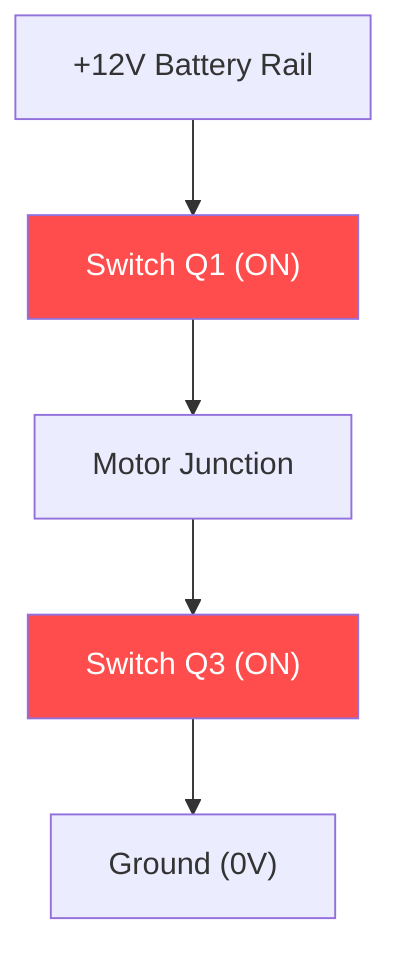

# Unit 4: The Muscles: Motors, Actuation, & Power Electronics
# Module 4.2: Motor Driving & Power Isolation (The H-Bridge)

> **Prerequisites**: Module 4.1 (Electric Motors Compared), Unit 1 (Power Delivery & Transistors)  
> **Estimated Time**: 45 minutes  
> **Interactive Activity**: H-Bridge Logic Truth Table & TB6612FNG Driver Implementation  
> **Target Audience**: High School & College Students (Zero Prior Electronics Experience)  

---

## 1. Learning Objectives

By the end of this module, you will be able to:
- [ ] **Explain** why microcontrollers cannot power DC motors directly and must use intermediate motor driver electronics [^1] [^2].
- [ ] **Deconstruct** the four-transistor **H-Bridge** topology into its four fundamental operational modes: Forward, Reverse, Active Brake, and Coast [^2].
- [ ] **Identify** the fatal "Shoot-Through" fault and explain how modern motor driver ICs prevent cross-conduction short circuits [^2] [^3].
- [ ] **Contrast** legacy bipolar motor drivers (L298N) with modern MOSFET drivers (TB6612FNG) across voltage drop and thermal efficiency [^2] [^3].
- [ ] **Wire and program** an H-Bridge driver in MicroPython using direction logic and PWM speed control [^2].

---

## 2. Intuitive Big Picture: The Reversible Valve

To make a DC motor spin forward, you connect its positive wire to $+12\text{V}$ and its negative wire to Ground.
To make it spin backwards, you must physically unplug both wires, swap them, and plug them back in.

A mobile robot cannot have a human running behind it swapping wires with pliers. The robot needs an **electronic circuit that can reverse polarity thousands of times per second** [^1] [^2].

Furthermore, as learned in Unit 0, a microcontroller's GPIO pin outputs only **$12\text{ milliamperes}$** ($0.012\text{A}$) at $3.3\text{V}$. A motor requires **$1\text{ to } 10\text{ Amperes}$** at $12\text{V}$. Connecting a motor directly to a microcontroller pin will instantly vaporize the microcontroller [^1] [^3]!

The circuit that solves both of these problems is the **H-Bridge** [^2].

---

## 3. The Core Concept Explained

### 3.1 The H-Bridge Circuit Topology

An H-Bridge consists of four high-power semiconductor switches (MOSFETs: $Q1, Q2, Q3, Q4$) arranged in the shape of the capital letter **"H"**, with the DC motor resting in the horizontal crossbar [^2]:

```text
               (+) Battery Power Rail (e.g., +12V)
                     |                   |
                  [ Q1: High Left ]    [ Q2: High Right ]
                     |                   |
                     +----[ MOTOR ]------+
                     |                   |
                  [ Q3: Low Left ]     [ Q4: Low Right ]
                     |                   |
               (-) Ground Rail (0V)
```

By opening and closing pairs of switches electronically, the circuit controls direction, speed, and braking [^2]:

```mermaid
flowchart TD
    subgraph "1. FORWARD (Q1 and Q4 Closed)"
        V1["+12V"] --> Q1_on["Switch Q1 (ON)"]
        Q1_on --> M_left["Motor Terminal (+)"]
        M_left --> M_right["Motor Terminal (-)"]
        M_right --> Q4_on["Switch Q4 (ON)"]
        Q4_on --> GND1["Ground (0V)"]
    end

    subgraph "2. REVERSE (Q2 and Q3 Closed)"
        V2["+12V"] --> Q2_on["Switch Q2 (ON)"]
        Q2_on --> M_right2["Motor Terminal (+)"]
        M_right2 --> M_left2["Motor Terminal (-)"]
        M_left2 --> Q3_on["Switch Q3 (ON)"]
        Q3_on --> GND2["Ground (0V)"]
    end
```



#### The Four Operational States:
| State | Active Switches | Electrical Result | Physical Motor Behavior |
| :--- | :--- | :--- | :--- |
| **1. Forward** | $Q1$ (High-Left) & $Q4$ (Low-Right) | Current flows **Left $\to$ Right** | Motor spins clockwise at full speed. |
| **2. Reverse** | $Q2$ (High-Right) & $Q3$ (Low-Left) | Current flows **Right $\to$ Left** | Motor spins counter-clockwise. |
| **3. Active Brake** | $Q3$ & $Q4$ Closed (Low-side short) | Both motor terminals tied to Ground | **Dynamic Braking**: Motor acts as a generator shorted to itself, stopping instantly! |
| **4. Coast (Freewheel)**| All four switches Open | Motor is disconnected from circuit | Motor coasts smoothly to a halt under friction. |

---

### 3.2 The Deadly "Shoot-Through" Fault

Look closely at the left branch of the "H": switch $Q1$ connects to $+12\text{V}$, and switch $Q3$ connects to Ground.

What happens if a software glitch closes $Q1$ and $Q3$ at the exact same instant?



> [!CAUTION]
> **The Shoot-Through Catastrophe**:
> If $Q1$ and $Q3$ (or $Q2$ and $Q4$) turn on simultaneously, electricity flows directly from $+12\text{V}$ to Ground through the switches, **completely bypassing the motor**! 
> This is a dead short circuit across the battery. In a fraction of a millisecond, hundreds of Amperes rush through the silicon, blowing the transistors apart with a loud pop and scorching the board [^2] [^3].

#### How Modern ICs Prevent Shoot-Through:
Modern integrated motor driver chips (like the **TB6612FNG**) contain built-in hardware logic interlocks and **Dead-Time Insertion**. Even if your microcontroller commands a direction change in a single clock cycle, the driver chip hardware automatically delays turning on the new switches by a few nanoseconds until the old switches have fully turned off [^2] [^3]!

---

### 3.3 Inductive Flyback Spikes & Clamping Diodes

A motor's internal coils are **inductors** (coils of wire storing energy in a magnetic field). 

When you suddenly turn off an energized inductor, the magnetic field collapses instantly. By Faraday's Law of Induction, the collapsing field generates a massive, inverted voltage spike called an **Inductive Kickback** [^1] [^3]:

$$V_{\text{spike}} = -L \frac{di}{dt}$$

A $12\text{V}$ motor can easily generate a **$-150\text{V}$ spike** for a few microseconds. This high-voltage transient will punch straight through the gate insulation of switching transistors.

To eliminate kickback, every H-Bridge must include **Flyback (Freewheeling) Diodes** connected in reverse parallel across each switch. These diodes safely route the inductive energy back into the power rails, clamping the voltage spike to a safe level [^2] [^3].

---

### 3.4 Motor Driver Evolution: L298N vs. TB6612FNG

| Feature | Legacy L298N Driver | Modern TB6612FNG Driver |
| :--- | :--- | :--- |
| **Transistor Type** | Bipolar Junction Transistors (BJT) | **DMOS MOSFETs** (Modern silicon) [^2] |
| **Internal Voltage Drop** | **$2.0\text{V} \text{ to } 2.5\text{V}$ lost inside the chip!** | **$< 0.5\text{V}$ lost** ($R_{\text{ds(on)}} \approx 0.5\,\Omega$) [^2] |
| **Thermal Behavior** | Scalding hot; requires a giant aluminum heatsink | Runs cool; tiny $5\text{ mm}$ surface-mount chip |
| **Output to 12V Motor**| Only delivers $\approx 9.5\text{V}$ to the motor ($20\%$ power lost!) | Delivers $\mathbf{11.6\text{V}}$ to the motor ($96\%$ efficient!) |
| **Shoot-Through Protection**| None (User must manage dead-time) | **Built-in hardware logic interlock** [^2] |

Roboticists today strongly prefer MOSFET-based drivers like the **TB6612FNG** or silent stepper drivers (**TMC2209**) over ancient bipolar chips [^2] [^3].

---

## 4. Hands-On MicroPython H-Bridge Driver Lab

### Lab Objective
In this exercise, you will write a complete, professional `MotorDriver` class in MicroPython to control a DC motor connected to a TB6612FNG driver, implementing Forward, Reverse, Active Brake, and Speed regulation via PWM.

```python
from machine import Pin, PWM
import time

class MotorDriver:
    """
    Driver class for a single DC motor via TB6612FNG H-Bridge.
    Inputs:
      in1_pin: Direction logic input 1
      in2_pin: Direction logic input 2
      pwm_pin: PWM speed control pin (0 to 65535)
      standby_pin: Active-HIGH chip enable pin
    """
    def __init__(self, in1_pin, in2_pin, pwm_pin, standby_pin=None):
        self.in1 = Pin(in1_pin, Pin.OUT)
        self.in2 = Pin(in2_pin, Pin.OUT)
        
        # 20 kHz PWM frequency eliminates audible coil whine!
        self.pwm = PWM(Pin(pwm_pin))
        self.pwm.freq(20000)
        self.pwm.duty_u16(0)
        
        if standby_pin is not None:
            self.standby = Pin(standby_pin, Pin.OUT)
            self.standby.value(1)  # Take chip out of standby mode

    def forward(self, speed_percent):
        """Drives motor forward at speed from 0 to 100%."""
        duty = int(max(0, min(100, speed_percent)) / 100.0 * 65535)
        self.in1.value(1)
        self.in2.value(0)
        self.pwm.duty_u16(duty)

    def reverse(self, speed_percent):
        """Drives motor in reverse at speed from 0 to 100%."""
        duty = int(max(0, min(100, speed_percent)) / 100.0 * 65535)
        self.in1.value(0)
        self.in2.value(1)
        self.pwm.duty_u16(duty)

    def brake(self):
        """Active dynamic brake: shorts motor windings to stop immediately."""
        self.in1.value(1)
        self.in2.value(1)
        self.pwm.duty_u16(65535)

    def coast(self):
        """Freewheeling coast: cuts all power, motor rolls to a stop."""
        self.in1.value(0)
        self.in2.value(0)
        self.pwm.duty_u16(0)

# --- Test Routine ---
# Setup driver on Raspberry Pi Pico pins
motor_left = MotorDriver(in1_pin=18, in2_pin=19, pwm_pin=20)

print("🚗 Testing H-Bridge Motor Control:")
print("1. Driving Forward at 60% speed...")
motor_left.forward(60)
time.sleep(2.0)

print("2. Dynamic Braking!")
motor_left.brake()
time.sleep(1.0)

print("3. Driving Reverse at 40% speed...")
motor_left.reverse(40)
time.sleep(2.0)

print("4. Coasting to a halt.")
motor_left.coast()
```

---

## 5. Troubleshooting & Driver Pitfalls

> [!WARNING]
> **Pitfall 1: The Human-Audible Motor Whine (PWM Frequency)**  
> If you configure your microcontroller's PWM frequency to $500\text{ Hz}$ or $1,000\text{ Hz}$, the motor coils will physically vibrate at that exact frequency, emitting an irritating, high-pitched squeal. Set your PWM frequency to **$20,000\text{ Hz}$ ($20\text{ kHz}$)**. This moves the vibration above the range of human hearing, making your robot whisper-quiet [^2] [^3]!

> [!WARNING]
> **Pitfall 2: Forgetting the Standby (`STBY`) Pin**  
> On TB6612FNG breakout boards, the `STBY` pin must be pulled `HIGH` ($3.3\text{V}$) for the driver to operate. If `STBY` is left disconnected or `LOW`, the entire chip enters low-power sleep mode and will ignore all motor commands.

---

## 6. Real-World Applications & Next Steps

H-Bridges are the fundamental power stage behind all robotics movement:
- Electric cars (like Tesla) use massive 3-phase silicon carbide (SiC) MOSFET inverters—essentially a 6-transistor triple H-Bridge—to deliver 500 Amperes to traction motors.
- Medical surgical robots use miniature H-bridges to position sub-millimeter surgical instruments with sub-millisecond dynamic braking.

In our next module, **Module 4.3: Speed & Direction Control (Acceleration Ramping)**, we will eliminate mechanical gear stripping and wheel slip by building mathematical Soft-Start and S-Curve acceleration profiles!

---

## 7. Sources & Media Provenance

### Cited References
[^1]: **Nicholas Oborny**, *"Understanding Motor Driver Current Ratings and Thermal Dissipation (Application Report SLVA714)"*, Texas Instruments. Available: [TI Application Report SLVA714](https://www.ti.com/lit/an/slva714/slva714.pdf).  
[^2]: **Toshiba Semiconductor & Storage Products**, *"TB6612FNG Driver IC for Dual DC Motors Datasheet"*, Toshiba Corporation. Available: [Toshiba TB6612FNG Datasheet](https://toshiba.semicon-storage.com/info/TB6612FNG_datasheet_en_20141001.pdf).  
[^3]: **Stephen J. Chapman**, *"Electric Machinery Fundamentals (Chapter 7: Solid-State Motor Control)"*, McGraw-Hill Education. Available: [Electric Machinery Fundamentals](https://www.mheducation.com/highered/product/electric-machinery-fundamentals-chapman/M9780073529547.html).

### Media Manifest
| Asset Name | Media Type | Source / Repository | License | Attribution |
| :--- | :--- | :--- | :--- | :--- |
| `h-bridge-circuit.svg` | Schematic Diagram | Instructabot Educational Team | CC BY-SA 4.0 | Instructabot Project [^2] |
| `tb6612-wiring.png` | Schematic Diagram | SparkFun Electronics / Instructabot | CC BY-SA 4.0 | SparkFun Electronics [^2] |
| `five-subsystems-flow.svg` | Vector Diagram | Instructabot Educational Team | CC BY-SA 4.0 | Instructabot Project |
