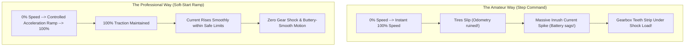
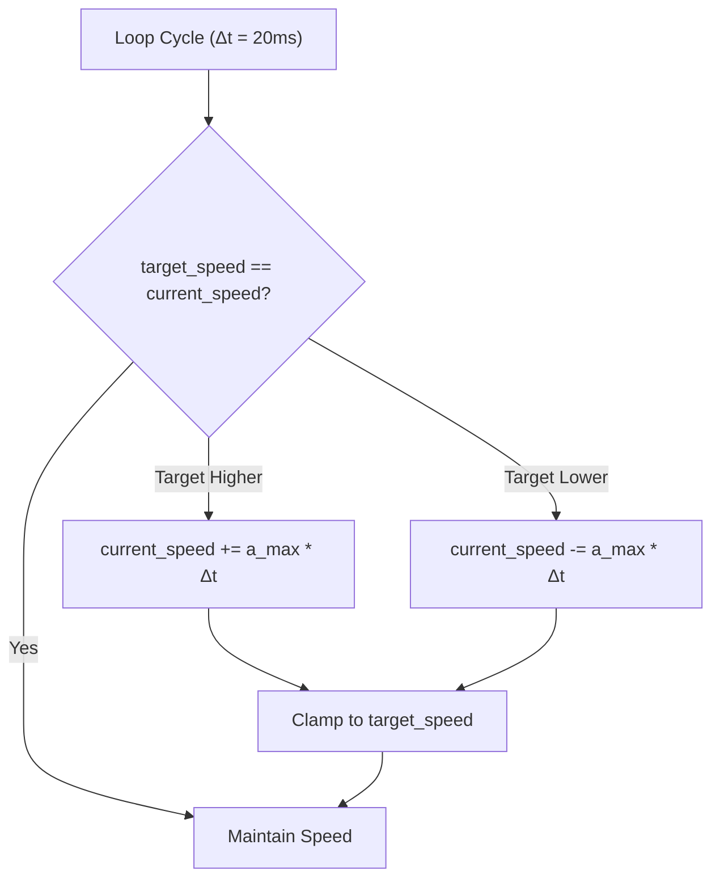
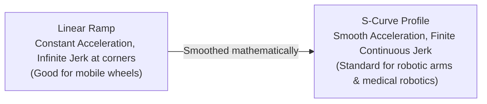

# Unit 4: The Muscles: Motors, Actuation, & Power Electronics
# Module 4.3: Speed & Direction Control: Soft-Start Acceleration Ramping

> **Prerequisites**: Module 4.1 (Motors Compared), Module 4.2 (The H-Bridge)  
> **Estimated Time**: 45 minutes  
> **Interactive Activity**: Simulating Inrush Current & Building an S-Curve Rate Limiter  
> **Target Audience**: High School & College Students (Zero Prior Physics Background)  

---

## 1. Learning Objectives

By the end of this module, you will be able to:
- [ ] **Explain** why instantaneous velocity step commands trigger destructive inrush currents ($I_{\text{inrush}} \approx I_{\text{stall}}$), wheel slippage, and mechanical gear stripping [^1] [^2].
- [ ] **Implement** a **Linear Acceleration Ramp (Rate Limiter)** in Python to transition smoothly between speeds [^2].
- [ ] **Define** **Jerk** (the rate of change of acceleration, $j = \frac{da}{dt}$) and contrast Linear Ramps with **S-Curve Profiles** [^2] [^3].
- [ ] **Protect** robot batteries and gearboxes by capping acceleration in software [^1] [^2].

---

## 2. Intuitive Big Picture: The "Lead Foot" Problem

Imagine riding in a car driven by someone who only knows two gas pedal positions: completely off ($0\%$) or slammed down to the metal ($100\%$). 

Every time the light turns green, the tires screech, rubber burns, passengers get whiplash, and the transmission gears take a brutal mechanical hammer blow. 



In robotics code, beginners frequently write:
```python
# THE LEAD-FOOT MISTAKE:
motor.forward(speed=100)  # Instantly jumps from 0 to 100% in 1 microsecond!
```

This single line of code forces the stationary motor to draw its full **Stall Current** ($I_{\text{stall}}$), causing battery brownout, wheel slip that destroys position tracking, and eventual stripped gear teeth [^1] [^2].

Professional robotics software never steps speed instantly; it applies an **Acceleration Ramp (Soft-Start)** [^2].

---

## 3. The Core Concept Explained

### 3.1 Inrush Current vs. Steady-State Current

As proven in Module 4.1, a stationary motor has **zero Back-EMF**.

When you apply a sudden $100\%$ voltage step:
1. For the first few milliseconds ($t = 0$), the motor rotor has physical inertia and is completely stationary ($\omega = 0\text{ RPM}$).
2. Because $V_{\text{bemf}} = 0\text{V}$, the inrush current spikes to the maximum stall current:
   $$I_{\text{inrush}} = \frac{V_{\text{battery}}}{R_{\text{winding}}} \approx 8.0\text{ to } 15.0\text{ Amperes!}$$
3. As the motor accelerates, Back-EMF climbs, choking the current down to its normal running current ($0.5\text{A}$ to $1.5\text{A}$) [^1] [^2].

```text
 Current (Amperes)
    ^
10A |   |   <--- INSTANT STEP SPIKE (8-10A Inrush!)
    |   |\
    |   | \
 1A |   |  +------------------------ Steady State Running Current (~1A)
 0A +---+-------------------------> Time
```

By ramping the voltage up gradually over $500\text{ milliseconds}$, the rotor has time to accelerate and build Back-EMF in lockstep with the rising voltage, **capping peak current to just a fraction of stall current** [^1] [^2]!

---

### 3.2 The Linear Rate Limiter Algorithm

A **Linear Acceleration Ramp** limits how much the motor's actual speed can change per unit of time [^2]:

$$\Delta v_{\text{max}} = a_{\text{max}} \times \Delta t$$

On every execution cycle of your robot's control loop:
1. Compare `target_speed` with `current_speed`.
2. If `target_speed > current_speed`: Increase `current_speed` by $\Delta v_{\text{max}}$ (Acceleration).
3. If `target_speed < current_speed`: Decrease `current_speed` by $\Delta v_{\text{max}}$ (Deceleration).
4. If the difference is smaller than $\Delta v_{\text{max}}$: Snap directly to `target_speed`.



---

### 3.3 Beyond Linear: Jerk & S-Curve Profiles

While a linear ramp is a massive improvement over an instant step, look closely at its corners:

```text
 Speed
   ^             .------------------- Target Speed
   |           ./  <--- Corner: Sudden jerk in acceleration!
   |         ./
   |       ./
   |     ./ <--- Corner: Sudden jerk!
   0----+-----------------------------> Time
```

At the beginning and end of a linear ramp, the acceleration jumps instantaneously from $0\text{ m/s}^2$ to $2\text{ m/s}^2$. 

The rate of change of acceleration is called **Jerk ($j$)** [^2]:

$$j = \frac{da}{dt} = \frac{d^2 v}{dt^2}$$

High jerk causes structural vibrations, swaying of camera masts, and sloshing of liquid payloads.

To eliminate jerk, advanced industrial robots (and elevators) use an **S-Curve Acceleration Profile** [^2] [^3]. The acceleration itself ramps up smoothly like a bell curve, creating a graceful "S"-shaped velocity trajectory that is completely vibration-free:



---

## 4. Hands-On Python Soft-Start Implementation Lab

### Lab Objective
In this exercise, you will implement an `AccelerationProfile` class in Python that converts abrupt, step-change speed commands into smooth, rate-limited motor outputs.

```python
import time

class MotorRateLimiter:
    """
    Enforces a maximum acceleration limit on motor velocity commands.
    max_accel_per_sec: Maximum percentage speed change allowed per second (%/s).
    """
    def __init__(self, max_accel_per_sec=100.0):
        self.max_accel = max_accel_per_sec
        self.current_speed = 0.0
        self.target_speed = 0.0
        self.last_time = time.ticks_ms()

    def set_target(self, speed_percent):
        """Sets the new desired speed (-100% to +100%)."""
        self.target_speed = max(-100.0, min(100.0, speed_percent))

    def update(self):
        """Calculates and returns the new smoothed speed for this cycle."""
        now = time.ticks_ms()
        dt = time.ticks_diff(now, self.last_time) / 1000.0  # Convert to seconds
        self.last_time = now

        if dt <= 0:
            return self.current_speed

        # Maximum change allowed in this elapsed time slice
        max_delta = self.max_accel * dt

        diff = self.target_speed - self.current_speed

        if abs(diff) <= max_delta:
            # Within one step: arrive exactly at target
            self.current_speed = self.target_speed
        elif diff > 0:
            # Accelerate forward
            self.current_speed += max_delta
        else:
            # Decelerate / reverse
            self.current_speed -= max_delta

        return round(self.current_speed, 1)

# --- Simulation Experiment ---
limiter = MotorRateLimiter(max_accel_per_sec=200.0)  # Takes 0.5s to reach 100%

print("🚀 Simulating Lead-Foot Command: Instant Jump from 0% to 100% Speed!")
limiter.set_target(100.0)

for step in range(12):
    current = limiter.update()
    bars = int(current / 5)
    indicator = "=" * bars
    print(f"t = {step*50:3d} ms | Motor Speed: {current:5.1f}% | {indicator:<20}")
    time.sleep(0.05)  # 50ms loop interval
```

Notice how the motor speed glides from $0.0\%$ to $100.0\%$ smoothly over $500\text{ ms}$, shielding the battery from inrush current!

---

## 5. Troubleshooting & Acceleration Pitfalls

> [!WARNING]
> **Pitfall 1: Asymmetric Emergency Deceleration**  
> While gradual acceleration protects motors during startup, an **emergency stop (E-Stop)** must never be rate-limited! If an obstacle is detected 5 cm ahead, you must bypass the acceleration limiter and command an immediate **Active Brake** (Module 4.2). Rate-limiting an emergency stop will cause your robot to crash gracefully into the obstacle [^1] [^2]!

> [!WARNING]
> **Pitfall 2: Tuning Acceleration for Payload Mass**  
> A mobile robot carrying an empty chassis can accelerate at $200\%/\text{s}$. If you load a heavy $10\text{ kg}$ payload onto the robot, the same acceleration rate will slip the drive wheels. Always tune `max_accel` with the robot at its **maximum operational payload weight**.

---

## 6. Real-World Applications & Next Steps

Acceleration profiling is essential across all modern automation:
- Industrial robot arms (KUKA, ABB, Fanuc) use high-order polynomial S-curve trajectories to move automotive body panels without flexing structural joints.
- Elevators use S-curves to accelerate passengers smoothly so they feel zero stomach-drop sensation.

In our unit capstone, **Lab 4: Precision Bi-Directional Motor Drive with Soft Acceleration**, we will combine everything from Unit 4: wiring a dual-motor driver in the Wokwi simulator, controlling direction with an H-Bridge, and executing smooth soft-start acceleration profiles in MicroPython!

---

## 7. Sources & Media Provenance

### Cited References
[^1]: **Nicholas Oborny**, *"Understanding Motor Driver Current Ratings and Thermal Dissipation (Application Report SLVA714)"*, Texas Instruments. Available: [TI Application Report SLVA714](https://www.ti.com/lit/an/slva714/slva714.pdf).  
[^2]: **Kevin M. Lynch, Frank C. Park**, *"Modern Robotics: Mechanics, Planning, and Control (Chapter 9: Trajectory Generation)"*, Cambridge University Press. License: CC BY-NC-ND 4.0. Available: [Modern Robotics](https://modernrobotics.northwestern.edu/).  
[^3]: **Stephen J. Chapman**, *"Electric Machinery Fundamentals (Chapter 7: Solid-State Motor Control & Dynamics)"*, McGraw-Hill Education. Available: [Electric Machinery Fundamentals](https://www.mheducation.com/highered/product/electric-machinery-fundamentals-chapman/M9780073529547.html).

### Media Manifest
| Asset Name | Media Type | Source / Repository | License | Attribution |
| :--- | :--- | :--- | :--- | :--- |
| `motor-soft-start.svg` | Vector Graphic / Plot | Instructabot Educational Team | CC BY-SA 4.0 | Instructabot Project [^2] |
| `h-bridge-circuit.svg` | Schematic Diagram | Instructabot Educational Team | CC BY-SA 4.0 | Instructabot Project [^1] |
| `five-subsystems-flow.svg` | Vector Diagram | Instructabot Educational Team | CC BY-SA 4.0 | Instructabot Project |
