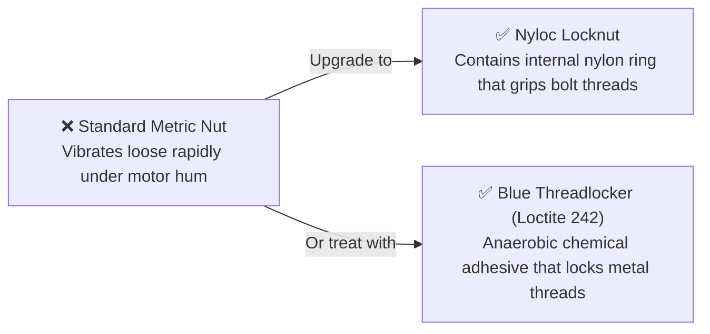

# Unit 5: The Bones: Mechanics, Kinematics, & CAD Modeling
# Module 5.1: Structural Fundamentals, Materials, & Stability

> **Prerequisites**: Unit 0 (Subsystems & Safety), Unit 1 (Circuits)  
> **Estimated Time**: 45 minutes  
> **Interactive Activity**: Calculating Center of Gravity (CG) & Mobile Robot Tip-Over Angles  
> **Target Audience**: High School & College Students (Zero Prior Mechanical Engineering Background)  

---

## 1. Learning Objectives

By the end of this module, you will be able to:
- [ ] **Calculate** a robot's 3D **Center of Gravity (CG)** and determine its tip-over threshold using the **Support Polygon** theorem [^1] [^2].
- [ ] **Evaluate and select** materials for structural frames: 3D printed PLA/PETG, 6061 aluminum extrusion (2020 T-slot), and polycarbonate [^1].
- [ ] **Explain** the critical difference between structural rigidity and elasticity under dynamic robotic loads [^2].
- [ ] **Implement** anti-vibration fastening discipline using metric hardware (M3/M4) and nyloc locking nuts [^1] [^2].

---

## 2. Intuitive Big Picture: The Skyscraper on Wheels

Imagine building a 10-story skyscraper out of rubber bands and wet noodles. No matter how advanced your elevator algorithms or heating thermostats are, the building will sag, twist, and collapse under its own weight.

In robotics, **the software can only be as accurate as the physical skeleton holding the sensors and actuators** [^1].
- If your camera mount flexes by just $2^\circ$ when the robot drives over a bump, an obstacle detected 5 meters away will appear to jump by **35 centimeters** in software!
- If your heavy battery is mounted high on top of the chassis, braking quickly will pitch the robot forward, smashing expensive LiDAR sensors into the floor [^1] [^2].


A rigid structure and a low center of gravity are the physical foundation of all robotics [^1] [^2].

---

## 3. The Core Concept Explained

### 3.1 Center of Gravity (CG) and the Support Polygon

The **Center of Gravity (CG)** is the unique point in space where the entire gravitational weight of the robot can be considered to act [^1] [^2]:

$$x_{\text{cg}} = \frac{\sum (m_i \cdot x_i)}{\sum m_i} = \frac{m_1 x_1 + m_2 x_2 + \dots + m_n x_n}{m_{\text{total}}}$$

```text
                  [ Heavy Camera & LiDAR ] (Top)
                            |
                     ( Center of Gravity ) <--- High CG: Dangerous!
                            |
           [ Battery ]      |      [ Motors ] (Base)
        =======O========================O=======
             Wheel 1                 Wheel 2
        <-------------------------------------->
                 Support Polygon Width (B)
```

#### The Support Polygon Rule:
Draw a shape on the floor enclosing all points where the robot's wheels or legs touch the ground (the convex hull). This is the **Support Polygon** [^1]:
1. **Stable**: As long as the vertical gravity vector pointing downward from the CG falls **inside** the support polygon, the robot will remain upright.
2. **Tip-Over Point**: The moment the robot tilts on a ramp or accelerates so violently that the gravity vector passes **outside** the support polygon border, the robot rolls over!

$$\text{Maximum Static Tip Angle: } \theta_{\text{max}} = \arctan\left(\frac{B / 2}{H_{\text{cg}}}\right)$$

*(where $B$ is the wheelbase width and $H_{\text{cg}}$ is the height of the Center of Gravity)*.

> [!IMPORTANT]
> **The Golden Rule of Robot Chassis Design**:
> Keep $H_{\text{cg}}$ as low as humanly possible! Mount the heaviest components (lead/lithium batteries and steel gearmotors) **underneath or between the wheel axles**, never on the top deck [^1] [^2]!

---

### 3.2 Materials Selection Matrix for Robotics

Choosing the right structural material requires balancing strength, weight, cost, and machinability [^1]:

| Material | Density & Strength | Primary Advantages | Primary Drawbacks | Best Robotics Use |
| :--- | :--- | :--- | :--- | :--- |
| **PLA (3D Printed)** | Stiff, rigid ($1.25\text{ g/cm}^3$) | Fast prototyping; zero warping on print bed. | **Brittle**; softens in heat at only $55^\circ\text{C}$ (melts in hot car!). | Sensor brackets, indoor electronics mounts |
| **PETG (3D Printed)**| Tough, flexible ($1.27\text{ g/cm}^3$) | High impact resistance; heat resistant to $75^\circ\text{C}$. | Slightly more flexible than PLA under heavy loads. | Wheel hubs, arm linkages, motor brackets |
| **Polycarbonate (Lexan)**| Extreme toughness ($1.20\text{ g/cm}^3$) | **Virtually unbreakable**; high optical clarity. | Expensive; difficult to laser-cut (must CNC mill). | Robot skid plates, protective battle armor |
| **Aluminum (6061-T6)** | High strength-to-weight ($2.7\text{ g/cm}^3$) | Extreme rigidity; lightweight; excellent heat sinking. | Requires metal cutting, drilling, and tapping tools. | Main structural chassis plates, robot arm links |
| **2020 Aluminum Extrusion**| Modular T-slot beam | Infinite adjustability using T-nuts; rigid box frames. | Assembly brackets can loosen under intense vibration. | Lab gantries, 3D printers, large rover chassis |

> [!CAUTION]
> **Avoid Cast Acrylic for Structural Parts**:
> Beginners often laser-cut robot chassis plates from cheap clear **Acrylic (Plexiglas)**. While inexpensive, acrylic is notoriously brittle. Tightening an M3 screw can cause hairline cracks that shatter the chassis on the first minor wall impact. Always choose **Polycarbonate (Lexan)** or aluminum for structural plates [^1]!

---

### 3.3 Fasteners & Anti-Vibration Discipline

DC motors and rough terrain generate constant, high-frequency kinetic vibrations. 

In robotics, **standard hardware nuts will vibrate loose within 15 minutes of operation** [^1] [^2]. Every professional robot employs vibration-proof fasteners:



1. **Standardize on Metric Hardware**: Use **M3** ($3\text{mm}$ diameter) for electronics/sensors and **M4** ($4\text{mm}$ diameter) for structural chassis bolts.
2. **Nyloc Locknuts**: Feature a nylon collar that deforms around the bolt threads, preventing back-out even under severe vibration.
3. **Threadlocker Fluid (Blue Loctite 242)**: Apply a single drop to any machine screw threading into metal motor faceplates.

---

## 4. Hands-On Center of Gravity Calculation Lab

### Lab Objective
In this exercise, you will calculate the Center of Gravity and maximum ramp climbing angle for a four-wheeled delivery robot.

### Robot Subsystem Mass Breakdown:
- **Chassis Plate & Wheels**: $1.0\text{ kg}$ at height $h = 3\text{ cm}$
- **Two Drive Motors**: $0.8\text{ kg}$ each ($1.6\text{ kg}$ total) at height $h = 4\text{ cm}$
- **Main Battery Pack**: $1.2\text{ kg}$ at height $h = 5\text{ cm}$
- **LiDAR & Camera Mast**: $0.4\text{ kg}$ at height $h = 25\text{ cm}$
- **Wheelbase Track Width ($B$)**: $24\text{ cm}$ (Half-width $= 12\text{ cm}$)

#### Step 1: Calculate Total Mass
$$m_{\text{total}} = 1.0 + 1.6 + 1.2 + 0.4 = \mathbf{4.2\text{ kg}}$$

#### Step 2: Calculate Height of Center of Gravity ($H_{\text{cg}}$)
$$H_{\text{cg}} = \frac{(1.0 \times 3) + (1.6 \times 4) + (1.2 \times 5) + (0.4 \times 25)}{4.2}$$
$$H_{\text{cg}} = \frac{3.0 + 6.4 + 6.0 + 10.0}{4.2} = \frac{25.4}{4.2} \approx \mathbf{6.05\text{ cm}}$$

#### Step 3: Calculate Maximum Side-Slope Tip Angle
$$\theta_{\text{tip}} = \arctan\left(\frac{12\text{ cm}}{6.05\text{ cm}}\right) = \arctan(1.983) \approx \mathbf{63.2^\circ}$$

*Engineering Conclusion*: Because the heavy battery and motors are mounted low ($3-5\text{ cm}$), the CG is only $6.05\text{ cm}$ above the ground. The robot can safely drive across a $30^\circ$ incline without any danger of rolling over!

---

## 5. Troubleshooting & Structural Pitfalls

> [!WARNING]
> **Pitfall 1: Cantilevered Wheel Axles without Bearings**  
> Beginners often press a wheel directly onto the thin $3\text{mm}$ output shaft of a DC motor without an external support bearing. The entire weight of the robot pushes sideways on the motor gearbox shaft, bending the shaft and stripping the tiny internal gears within days. Always support wheel axles with **ball bearings** mounted to the chassis!

> [!WARNING]
> **Pitfall 2: Overtightening Screws into 3D-Printed Plastic**  
> Driving a metal machine screw directly into 3D-printed plastic strips the plastic threads effortlessly. Use **Brass Heat-Set Threaded Inserts** (pressed in with a soldering iron tip) to provide durable, reusable brass machine threads inside 3D-printed parts.

---

## 6. Real-World Applications & Next Steps

Structural engineering is what separates durable industrial robots from fragile toys:
- NASA’s Curiosity and Perseverance rovers use custom-machined aerospace-grade titanium and aluminum tubing to survive Martian sandstorms and $-100^\circ\text{C}$ temperature swings without snapping.
- Warehouse AMRs place multi-ton steel ballast plates right at the wheel line so they can lift $1,000\text{ kg}$ pallets without tipping backwards.

In our next module, **Module 5.2: Mechanical Power Transmission & Gears**, we will explore how mechanical gears trade speed for torque to give robots superhuman lifting strength!

---

## 7. Sources & Media Provenance

### Cited References
[^1]: **NASA Engineering and Safety Center (NESC)**, *"NASA Technical Handbook: Structural and Mechanical Design Guidelines (NASA-HDBK-7005)"*, National Aeronautics and Space Administration. Public Domain (U.S. Government Work). Available: [NASA Technical Standards](https://standards.nasa.gov/standard/nasa/nasa-hdbk-7005).  
[^2]: **Richard G. Budynas, J. Keith Nisbett**, *"Shigley's Mechanical Engineering Design (Chapter 8: Fasteners & Chapter 13: Gears)"*, McGraw-Hill Education. Available: [Shigley's Mechanical Engineering Design](https://www.mheducation.com/highered/product/shigley-s-mechanical-engineering-design-budynas-nisbett/M9780073398204.html).  
[^3]: **NASA Robotics Alliance Project**, *"Mechanical Design and Material Selection Guidelines"*, National Aeronautics and Space Administration. Available: [NASA RAP Resources](https://robotics.nasa.gov/educational-resources/).

### Media Manifest
| Asset Name | Media Type | Source / Repository | License | Attribution |
| :--- | :--- | :--- | :--- | :--- |
| `stability-polygon.svg` | Vector Graphic / Diagram | Instructabot Educational Team | CC BY-SA 4.0 | Instructabot Project [^1] |
| `five-subsystems-flow.svg` | Vector Diagram | Instructabot Educational Team | CC BY-SA 4.0 | Instructabot Project |
| `engineering-design-cycle.svg` | Flowchart | Instructabot Educational Team | CC BY-SA 4.0 | Instructabot Project [^3] |

---

## 🧭 Lesson Navigation

| ⬅️ Previous Lesson | 🗺️ Course Hub | ➡️ Next Lesson |
| :--- | :---: | ---: |
| [← Lab 4: Precision Bi-Directional Motor Drive with Soft Acceleration](../unit-04-the-muscles/lab-04-motor-drive-acceleration.md) | [**Master Syllabus**](../SYLLABUS.md) • [**Getting Started**](../GETTING_STARTED.md) | [**Module 5.2: Mechanical Power Transmission, Gears, & Belts →**](02-mechanical-power-transmission.md) |
