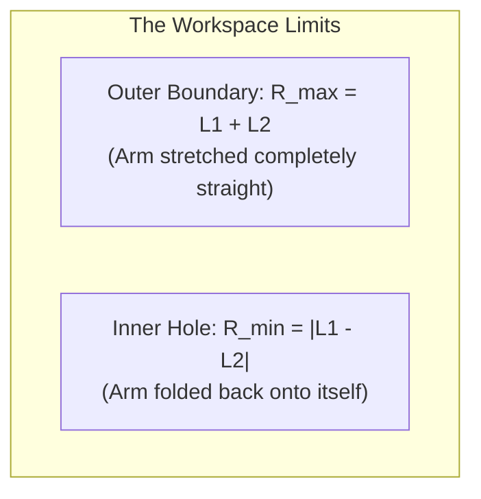

# Unit 5: The Bones: Mechanics, Kinematics, & CAD Modeling
# Module 5.3: Spatial Geometry & Forward Kinematics

> **Prerequisites**: Module 5.1 (Structural Fundamentals), Module 5.2 (Gears & Transmission)  
> **Estimated Time**: 50 minutes  
> **Interactive Activity**: Writing a 2-Link Robotic Arm Forward Kinematics Solver in Python  
> **Target Audience**: High School & College Students (Zero Prior Robotics Math Experience)  

---

## 1. Learning Objectives

By the end of this module, you will be able to:
- [ ] **Define** **Degrees of Freedom (DOF)** for robotic arms and mobile platforms [^1].
- [ ] **Contrast** **Forward Kinematics (FK)** with **Inverse Kinematics (IK)** [^1] [^2].
- [ ] **Derive and calculate** the $(X, Y)$ end-effector position of a 2-link planar robotic arm using trigonometry [^1].
- [ ] **Map** a robotic arm's **Reachable Workspace** and identify mechanical **Singularities** where the arm locks up [^1] [^2].

---

## 2. Intuitive Big Picture: Angles vs. Coordinates

Hold your right arm out. Bend your elbow $90^\circ$. Rotate your shoulder upward $45^\circ$. 

Now, ask yourself:
1. What are your motor joint angles? (Shoulder $= 45^\circ$, Elbow $= 90^\circ$).
2. Where is your index fingertip located in 3D space relative to your spine? ($X = 40\text{ cm forward}, Y = 20\text{ cm right}, Z = 30\text{ cm up}$).

```mermaid
flowchart LR
    JointSpace["🦾 Joint Space (Actuator Angles)<br/>θ1 (Shoulder Angle), θ2 (Elbow Angle)<br/>What the motors control directly!"]
    Cartesian["📍 Task Space (Cartesian Coordinates)<br/>(X, Y, Z) Position in the Room<br/>Where the object / cup is located!"]

    JointSpace -->|FORWARD KINEMATICS (Trigonometry)| Cartesian
    Cartesian -->|INVERSE KINEMATICS (Complex Geometry)| JointSpace
```

This translation between **Joint Angles** (what servo motors understand) and **Cartesian Coordinates** (where objects exist in the real world) is called **Kinematics** [^1] [^2].

---

## 3. The Core Concept Explained

### 3.1 Degrees of Freedom (DOF)

In three-dimensional space, an unconstrained rigid object has **6 Degrees of Freedom (DOF)** [^1]:
- **3 Linear Translations**: Moving along $X$ (forward/back), $Y$ (left/right), and $Z$ (up/down).
- **3 Rotations**: Tilting along Roll ($\phi$), Pitch ($\theta$), and Yaw ($\psi$).

A robot's Degrees of Freedom equal the number of **independent actuated joints** that determine its configuration [^1] [^2]:
- A human arm has **7 DOF** (3 in shoulder, 1 in elbow, 3 in wrist).
- Standard industrial welding arms (KUKA / Fanuc) have **6 DOF**.
- Our introductory planar educational arm has **2 DOF** (Shoulder rotation + Elbow rotation).

---

### 3.2 The 2-Link Planar Robotic Arm

Consider a 2-link robotic arm anchored to a stationary tabletop base at $(0, 0)$ [^1]:

```text
                                (X, Y) <--- End-Effector (Gripper)
                                  /
                                 /  Link 2 (Length L2)
                                /
                       (x1, y1) O <--- Elbow Joint (Angle θ2 relative to Link 1)
                              /
                             /  Link 1 (Length L1)
                            /
                    (0, 0) O <--- Shoulder Joint (Angle θ1 relative to X-axis)
              =============+============= (Base Anchor)
```

- **Link 1**: Length $L_1$, rotated at angle $\theta_1$ relative to the horizontal $X$-axis.
- **Link 2**: Length $L_2$, rotated at angle $\theta_2$ relative to the line of Link 1.

#### Deriving Forward Kinematics (Trigonometry Step-by-Step):
1. **Find the position of the Elbow Joint $(x_1, y_1)$**:
   Using basic right-triangle trigonometry:
   $$x_1 = L_1 \cos(\theta_1) \qquad\qquad y_1 = L_1 \sin(\theta_1)$$

2. **Find the global orientation of Link 2**:
   Link 2 is angled by $\theta_1 + \theta_2$ relative to the horizontal world frame [^1].

3. **Find the position of the End-Effector / Gripper $(X, Y)$**:
   Add the vector projection of Link 2 to the elbow position:

$$X = L_1 \cos(\theta_1) + L_2 \cos(\theta_1 + \theta_2)$$

$$Y = L_1 \sin(\theta_1) + L_2 \sin(\theta_1 + \theta_2)$$

> [!NOTE]
> **Forward Kinematics is Always Easy**:
> Given any set of joint angles $(\theta_1, \theta_2)$, there is **always exactly one unique $(X, Y)$ coordinate** where the gripper will end up!
> The reverse problem—**Inverse Kinematics (IK)**—is much trickier, because to reach a point $(X, Y)$, there are usually two different configurations: **Elbow-Up** or **Elbow-Down** [^1] [^2]!

---

### 3.3 The Reachable Workspace & Singularities

A robotic arm cannot reach every point in the universe. The set of all spatial coordinates $(X, Y)$ that the gripper can physically touch is called the **Reachable Workspace** [^1]:



The workspace forms a circular ring (donut) centered at the base:
- **Maximum Reach**: $R_{\text{max}} = L_1 + L_2$
- **Minimum Reach**: $R_{\text{min}} = |L_1 - L_2|$

#### The Danger of Singularities:
A **Singularity** is a specific mechanical configuration where the arm **loses one or more degrees of freedom** [^1] [^2].
- When the arm is stretched out completely straight ($\theta_2 = 0^\circ$), both links lie on the exact same line.
- In this position, moving the shoulder or elbow can only swing the arm in an arc; **the arm cannot move outward along the radius by even a millimeter**!
- Mathematically, the robot's Jacobian matrix loses rank, and inverse kinematics equations divide by zero, demanding infinite joint velocity [^1] [^2]. Professional motion planners always steer paths clear of singularities.

---

## 4. Hands-On Python Forward Kinematics Lab

### Lab Objective
In this exercise, you will write a complete Forward Kinematics solver in Python and calculate where a 2-link robotic arm gripper ends up across different servo angles.

```python
import math

class PlanarArm2DOF:
    def __init__(self, link1_length_cm, link2_length_cm):
        self.L1 = link1_length_cm
        self.L2 = link2_length_cm

    def forward_kinematics(self, theta1_deg, theta2_deg):
        """
        Calculates (X, Y) coordinates of the elbow and gripper.
        Input angles are in degrees.
        """
        # Convert degrees to radians for Python math library
        t1 = math.radians(theta1_deg)
        t2 = math.radians(theta2_deg)

        # 1. Elbow coordinates
        x_elbow = self.L1 * math.cos(t1)
        y_elbow = self.L1 * math.sin(t1)

        # 2. Gripper (end-effector) coordinates
        x_gripper = x_elbow + (self.L2 * math.cos(t1 + t2))
        y_gripper = y_elbow + (self.L2 * math.sin(t1 + t2))

        return (round(x_elbow, 2), round(y_elbow, 2)), (round(x_gripper, 2), round(y_gripper, 2))

# --- Test Arm Geometry ---
# Link 1 = 15.0 cm, Link 2 = 10.0 cm
arm = PlanarArm2DOF(link1_length_cm=15.0, link2_length_cm=10.0)

test_angles = [
    (0.0, 0.0),    # Stretched straight along +X axis (Singularity)
    (90.0, 0.0),   # Pointing straight up along +Y axis
    (45.0, 45.0),  # Right-angle elbow bend
    (0.0, 90.0)    # Link 1 flat, Link 2 perpendicular
]

print("🦾 Running Forward Kinematics Calculations:")
print("Shoulder (θ1) | Elbow (θ2) | Elbow (x1, y1)  | Gripper (X, Y) End-Effector")
print("-" * 72)

for t1, t2 in test_angles:
    elbow, gripper = arm.forward_kinematics(t1, t2)
    print(f"   {t1:5.1f}°     |   {t2:5.1f}°   | {str(elbow):<16} | {str(gripper):<16}")
```

#### Expected Output Analysis:
- At $(\theta_1 = 0^\circ, \theta_2 = 0^\circ)$: Gripper is at $(25.0, 0.0)\text{ cm}$ ($L_1 + L_2 = 25\text{ cm}$ maximum reach).
- At $(\theta_1 = 90^\circ, \theta_2 = 0^\circ)$: Gripper is at $(0.0, 25.0)\text{ cm}$ (Pointing straight up).
- At $(\theta_1 = 0^\circ, \theta_2 = 90^\circ)$: Gripper is at $(15.0, 10.0)\text{ cm}$.

---

## 5. Troubleshooting & Kinematics Pitfalls

> [!WARNING]
> **Pitfall 1: Mixing Radians and Degrees**  
> Computer math libraries (`math.cos()`, `math.sin()`) strictly expect angles in **Radians**, not Degrees! 
> If you pass $45$ directly into `math.cos(45)`, Python treats it as $45\text{ radians} \approx 2,578^\circ$, yielding completely wrong coordinates. Always convert degrees to radians using `math.radians(degrees)` [^1]!

> [!WARNING]
> **Pitfall 2: Local vs. Global Relative Angles**  
> Notice that $\theta_2$ is measured **relative to Link 1**, not the horizontal ground. If $\theta_1 = 30^\circ$ and $\theta_2 = 0^\circ$, Link 2 is continuing in the exact same direction as Link 1 ($30^\circ$ to ground).

---

## 6. Real-World Applications & Next Steps

Forward Kinematics is the foundation for all robotic motion planning:
- Modern surgical robotic arms calculate forward kinematics thousands of times per second so the surgeon's hand motion translates directly into surgical needle motion.
- Industrial pick-and-place robots use kinematics to align suction cups with silicon wafers in semiconductor cleanrooms.

In our next module, **Module 5.4: Computer-Aided Design (CAD) for Robotics**, we will learn how to model these links and brackets in professional cloud-native 3D CAD (Onshape) and prepare them for 3D printing!

---

## 7. Sources & Media Provenance

### Cited References
[^1]: **John J. Craig**, *"Introduction to Robotics: Mechanics and Control (Chapter 3: Manipulator Kinematics)"*, Pearson Education / Stanford University. Available: [Introduction to Robotics](https://www.pearson.com/en-us/subject-catalog/p/introduction-to-robotics-mechanics-and-control/P200000003290).  
[^2]: **Kevin M. Lynch, Frank C. Park**, *"Modern Robotics: Mechanics, Planning, and Control (Chapter 4: Forward Kinematics)"*, Cambridge University Press. License: CC BY-NC-ND 4.0. Available: [Modern Robotics](https://modernrobotics.northwestern.edu/).  
[^3]: **Richard G. Budynas, J. Keith Nisbett**, *"Shigley's Mechanical Engineering Design"*, McGraw-Hill Education. Available: [Shigley's Mechanical Engineering Design](https://www.mheducation.com/highered/product/shigley-s-mechanical-engineering-design-budynas-nisbett/M9780073398204.html).

### Media Manifest
| Asset Name | Media Type | Source / Repository | License | Attribution |
| :--- | :--- | :--- | :--- | :--- |
| `arm-forward-kinematics.svg` | Vector Graphic / Geometry | Instructabot Educational Team | CC BY-SA 4.0 | Instructabot Project [^1] |
| `gear-ratios.svg` | Vector Graphic | Instructabot Educational Team | CC BY-SA 4.0 | Instructabot Project |
| `five-subsystems-flow.svg` | Vector Diagram | Instructabot Educational Team | CC BY-SA 4.0 | Instructabot Project |
