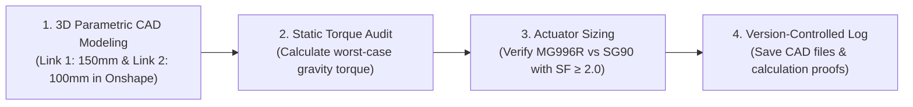

# Unit 5: The Bones: Mechanics, Kinematics, & CAD Modeling
# Lab 5: Designing & Sizing a 2-DOF Robotic Arm Link

> **Prerequisites**: Modules 5.1, 5.2, 5.3, and 5.4  
> **Estimated Time**: 60 minutes  
> **Platform**: Onshape Parametric 3D CAD (Free Educational) + Mechanical Engineering Calculation Worksheet  
> **Deliverable**: 3D Parametric CAD Model in Onshape + Joint Stall Torque Safety Audit + Git-Tracked Engineering Log  
> **Target Audience**: High School & College Students (Zero Prior Engineering Experience)  

---

## 1. Learning Objectives

By completing this hands-on capstone lab, you will be able to:
- [ ] **Model** a lightweight, rigid 2-link robotic arm member in cloud-native 3D CAD (**Onshape**) with servo mounting pockets [^1].
- [ ] **Calculate** static equilibrium joint torque at maximum horizontal cantilever extension [^2] [^3].
- [ ] **Apply a Safety Factor ($SF \ge 2.0$)** to select an appropriate servo motor without risking thermal stall burnout [^2].
- [ ] **Verify** forward kinematic reach limits against modeled 3D arm geometry [^2].

---

## 2. Lab Overview: From Math to Solid Matter

In robotics, an arm must not only reach its target—it must possess the structural rigidity and actuator torque to hold heavy payloads stationary without trembling or stripping gears [^2] [^3].

In this lab, you will design the physical structural skeleton of a **2-DOF Planar Robotic Arm** in **Onshape CAD** and perform an engineering **Static Torque Sizing Audit** to select the correct servo motors [^1] [^2].



---

## 3. Part 1: Parametric 3D CAD Modeling in Onshape

### Arm Design Specifications:
- **Link 1 (Bicep)**: Length $L_1 = 150\text{ mm}$ between joint pivot centers; designed to hold an elbow servo motor at its tip.
- **Link 2 (Forearm)**: Length $L_2 = 100\text{ mm}$ between joint pivot centers; ends in an end-effector tool flange.
- **Material**: 3D-printed PETG ($3.0\text{ mm}$ wall thickness).

```text
 (Shoulder Servo Pivot)                  (Elbow Servo Pivot)
       [ O ] =================================== [ O ] --------------> (Gripper Flange)
         | <--------- Link 1: 150 mm ----------> | <--- Link 2: 100 mm ---> |
```

### Modeling Instructions in Onshape:
1. Open your browser and log into [Onshape](https://www.onshape.com/) [^1].
2. Create a new Document: `Instructabot_2DOF_Arm`.
3. **Sketch Link 1 on the Front Plane**:
   - Draw two circles: Circle 1 at origin ($(0,0)$, diameter $12\text{ mm}$) and Circle 2 at $(150\text{ mm}, 0)$ (diameter $12\text{ mm}$).
   - Connect the circles with tangent top and bottom lines to create a smooth bone-shaped link.
   - Inside Circle 1, create a **$4.0\text{ mm}$ center hole** (for the servo output horn shaft).
   - At the far end, sketch a rectangular pocket **$40.5\text{ mm} \times 20.0\text{ mm}$** with two $3.2\text{ mm}$ mounting holes to accept a standard servo motor.
4. **Lightweighting (Truss Pocketing)**:
   - Along the middle of Link 1, cut out triangular pocket recesses with a $3.0\text{ mm}$ border web. This reduces part mass by $40\%$ while maintaining $90\%$ of torsional rigidity [^1] [^3]!
5. **Extrude**: Extrude the sketch symmetrically by **$6.0\text{ mm}$**. Add $1.5\text{ mm}$ fillets to all internal corners to eliminate stress risers [^3].

---

## 4. Part 2: Static Torque Equilibrium Sizing Calculation

Now calculate the worst-case torque required at the **Shoulder Joint** [^2] [^3].

### The Worst-Case Horizon Configuration:
The maximum torque load on the shoulder servo occurs when the arm is stretched out **completely horizontal ($\theta_1 = 0^\circ, \theta_2 = 0^\circ$)**. In this cantilevered orientation, gravity exerts maximum perpendicular leverage [^2] [^3]:

$$\tau = \sum (\text{Force}_i \times \text{Lever Arm Distance}_i) = g \times \sum (m_i \times d_i)$$


### Component Mass & Position Table:
| Component | Mass ($m$) | Center of Mass Distance from Shoulder ($d$) | Torque Contribution ($\tau_i = m \cdot g \cdot d$) |
| :--- | :--- | :--- | :--- |
| **Link 1 (PETG Bone)** | $60\text{ g} = 0.060\text{ kg}$ | Halfway along Link 1: $75\text{ mm} = 0.075\text{ m}$ | $0.060 \times 9.8 \times 0.075 = \mathbf{0.0441\text{ N}\cdot\text{m}}$ |
| **Elbow Servo (MG996R)**| $55\text{ g} = 0.055\text{ kg}$ | At end of Link 1: $150\text{ mm} = 0.150\text{ m}$ | $0.055 \times 9.8 \times 0.150 = \mathbf{0.0809\text{ N}\cdot\text{m}}$ |
| **Link 2 (PETG Forearm)**| $40\text{ g} = 0.040\text{ kg}$| Midpoint of Link 2: $150 + 50 = 0.200\text{ m}$ | $0.040 \times 9.8 \times 0.200 = \mathbf{0.0784\text{ N}\cdot\text{m}}$ |
| **Payload in Gripper** | $100\text{ g} = 0.100\text{ kg}$| Full reach tip: $150 + 100 = 0.250\text{ m}$ | $0.100 \times 9.8 \times 0.250 = \mathbf{0.2450\text{ N}\cdot\text{m}}$ |

#### Step 1: Calculate Total Static Torque:
$$\tau_{\text{static}} = 0.0441 + 0.0809 + 0.0784 + 0.2450 = \mathbf{0.4484\text{ N}\cdot\text{m}}$$

Converting Newton-meters to standard hobby servo units ($\text{kg}\cdot\text{cm}$):
$$1\text{ N}\cdot\text{m} \approx 10.197\text{ kg}\cdot\text{cm} \implies \tau_{\text{static}} = 0.4484 \times 10.197 = \mathbf{4.57\text{ kg}\cdot\text{cm}}$$

#### Step 2: Apply the Safety Factor ($SF \ge 2.0$):
In robotics, dynamic acceleration, wind resistance, and bearing friction demand a minimum **Safety Factor of $2.0$** [^3]:
$$\tau_{\text{required}} = \tau_{\text{static}} \times 2.0 = 4.57 \times 2.0 = \mathbf{9.14\text{ kg}\cdot\text{cm}}$$

#### Step 3: Actuator Selection Verdict:
- **Option A: Micro Servo (SG90)**: Stall torque $= 1.8\text{ kg}\cdot\text{cm}$.
  - *Verdict*: **FAILED**. The SG90 cannot even lift the unweighted arm! It will strip its nylon gears immediately.
- **Option B: Metal-Gear Standard Servo (MG996R)**: Stall torque $= \mathbf{11.0\text{ kg}\cdot\text{cm}}$ at $6.0\text{V}$.
  - *Verdict*: **PASSED!** ($11.0\text{ kg}\cdot\text{cm} > 9.14\text{ kg}\cdot\text{cm}$). The MG996R provides a safe, durable $2.4\times$ margin of safety [^2] [^3]!

---

## 5. Verification & Testing Rubric

Review your CAD model and sizing audit against these criteria:
- [ ] **Fully Constrained Sketches**: Every sketch line in Onshape turns solid black (no floating blue geometry).
- [ ] **Clearance Fit Tolerances**: M3 bolt holes modeled at $\ge 3.2\text{ mm}$ to accommodate 3D-printing shrinkage.
- [ ] **Fillets Applied**: All interior corners have fillets ($\ge 1.5\text{ mm}$) to distribute mechanical load.
- [ ] **Mathematical Verification**: Static torque calculation clearly accounts for link self-mass, motor mass, and target payload with a $SF \ge 2.0$.

---

## 6. Author Your Engineering Notebook Entry

In your digital engineering notes, document your completed mechanical build:

```markdown
# Engineering Log: 2-DOF Robotic Arm CAD & Torque Audit
**Date**: 2026-10-04  
**Author**: [Your Name]  
**Platform**: PTC Onshape / Analytical Statics  
**Milestone**: Unit 5 Capstone Lab  

### 1. Objective
Model a 2-DOF planar robotic arm in parametric 3D CAD and calculate joint stall torque under maximum horizontal cantilever extension.

### 2. Physical & Kinematic Parameters
- Link 1 Length (L1): 150.0 mm
- Link 2 Length (L2): 100.0 mm
- Total Maximum Reach: 250.0 mm (0.25 m)
- Target Maximum Payload: 100 grams
- Total Static Torque at Shoulder Joint: 0.448 N*m (4.57 kg*cm)
- Selected Shoulder & Elbow Actuator: TowerPro MG996R (Stall Torque = 11.0 kg*cm at 6V)
- Calculated Factor of Safety: 2.41 (Exceeds required SF = 2.0)

### 3. Engineering Takeaway
Over 50% of the required shoulder torque (0.245 N*m out of 0.448 N*m) is caused purely by the payload at the 25cm reach tip. Placing the heavy elbow actuator as close as possible to the shoulder base significantly reduces the required drive torque.
```

---

## 7. Sources & Media Provenance

### Cited References
[^1]: **PTC Education Team**, *"Onshape Fundamentals: Parametric 3D CAD Modeling"*, PTC Inc. Available: [Onshape Learning Center](https://learn.onshape.com/).  
[^2]: **John J. Craig**, *"Introduction to Robotics: Mechanics and Control (Chapter 6: Manipulator Dynamics & Statics)"*, Pearson Education / Stanford University. Available: [Introduction to Robotics](https://www.pearson.com/en-us/subject-catalog/p/introduction-to-robotics-mechanics-and-control/P200000003290).  
[^3]: **Richard G. Budynas, J. Keith Nisbett**, *"Shigley's Mechanical Engineering Design (Chapter 3: Load and Stress Analysis)"*, McGraw-Hill Education. Available: [Shigley's Mechanical Engineering Design](https://www.mheducation.com/highered/product/shigley-s-mechanical-engineering-design-budynas-nisbett/M9780073398204.html).

### Media Manifest
| Asset Name | Media Type | Source / Repository | License | Attribution |
| :--- | :--- | :--- | :--- | :--- |
| `onshape-arm-model.png` | CAD Schematic | PTC Onshape / Instructabot Educational Team | CC BY 4.0 | PTC Onshape / Instructabot [^1] |
| `arm-forward-kinematics.svg` | Vector Graphic | Instructabot Educational Team | CC BY-SA 4.0 | Instructabot Project [^2] |
| `gear-ratios.svg` | Vector Graphic | Instructabot Educational Team | CC BY-SA 4.0 | Instructabot Project [^3] |
