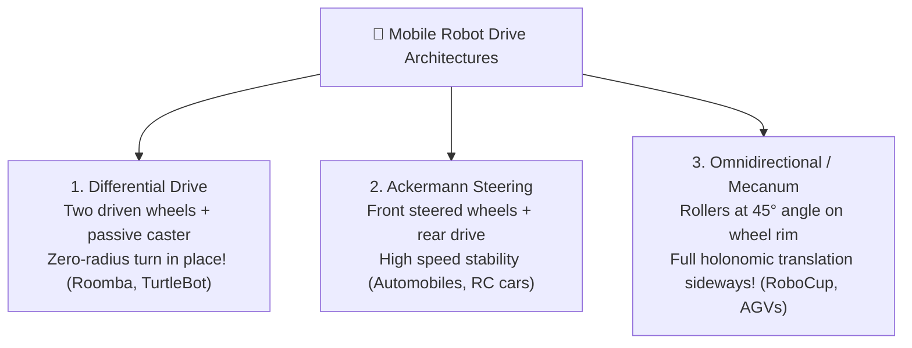
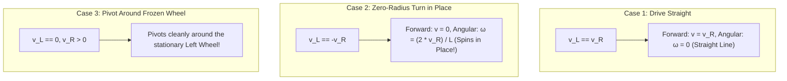

# Unit 6: Movement & Mobile Robotics: Driving the Physical World
# Module 6.1: Mobile Robot Drive Architectures & Kinematics

> **Prerequisites**: Unit 4 (Motors & H-Bridges), Unit 5 (Mechanics & Kinematics)  
> **Estimated Time**: 45 minutes  
> **Interactive Activity**: Differential Drive Forward & Inverse Velocity Kinematics in Python  
> **Target Audience**: High School & College Students (Zero Prior Mobile Robotics Experience)  

---

## 1. Learning Objectives

By the end of this module, you will be able to:
- [ ] **Contrast** the three primary wheeled mobile drive architectures: Differential Drive, Ackermann Steering, and Omnidirectional (Mecanum) [^1] [^2].
- [ ] **Derive and calculate** a differential drive robot's linear velocity ($v$) and angular rotational speed ($\omega$) from left and right wheel velocities ($v_L, v_R$) [^1].
- [ ] **Locate** the **Instantaneous Center of Curvature (ICC)** and calculate turning radius ($R$) [^1].
- [ ] **Explain** the concept of **Non-Holonomic Constraints** and why standard mobile robots cannot slide sideways [^1] [^2].

---

## 2. Intuitive Big Picture: How Robots Move Through Space

Think about how different vehicles turn:
1. **A standard passenger car**: Has a steering wheel that turns the two front tires. To turn around in a narrow driveway, you must perform a multi-point K-turn because a car cannot spin in place.
2. **A battle tank or wheelchair**: Has two independent tracks or wheels. To turn on a dime, you push the right wheel forward and pull the left wheel backward. The machine spins around its own center point without moving forward!
3. **A supermarket cart with stuck wheels**: You can push it diagonally, sideways, or spin it simultaneously.



In robotics, **Differential Drive** is the undisputed educational and industrial standard for indoor service robots because of its mechanical simplicity and ability to rotate in place inside tight doorways and hallways [^1] [^2].

---

## 3. The Core Concept Explained

### 3.1 Differential Drive Kinematics: The Math of Steering

A differential drive robot consists of two coaxial drive wheels separated by a wheelbase track width ($L$), where each wheel has radius $r$ [^1]:

```text
               [ Left Wheel ] (Speed v_L)
                     |
                     |<----------- Track Width L ----------->|
                     |                                       |
                     +=================[ CG ]================+
                                       (v, ω)                |
                                                      [ Right Wheel ] (Speed v_R)
```

#### 1. Forward Linear Velocity ($v$):
The overall forward speed of the robot's center point is simply the average of the two wheel speeds [^1]:

$$v = \frac{v_R + v_L}{2}$$

#### 2. Angular Rotational Velocity ($\omega$):
The robot turns because one wheel travels faster than the other. The rate of rotation around the center point (in radians per second) is the speed difference divided by track width [^1]:

$$\omega = \frac{v_R - v_L}{L}$$



---

### 3.2 The Instantaneous Center of Curvature (ICC)

When a differential drive robot steers along a curve, both wheels trace concentric circular arcs around a single imaginary pivot point on the ground called the **Instantaneous Center of Curvature (ICC)** [^1]:

```text
       ICC (Pivot Center)
        * 
        | <------------- Radius R -------------> |
        +----------------------------------------[ CG ]
        | <---- R - L/2 ----> [ Left Wheel ]      (v)
        | <--------- R + L/2 ---------> [ Right Wheel ]
```

The distance from the robot's center to the ICC is the **Turning Radius ($R$)** [^1]:

$$R = \frac{v}{\omega} = \frac{L}{2} \cdot \left( \frac{v_R + v_L}{v_R - v_L} \right)$$

- When $v_R = v_L$: $R \to \infty$ (A straight line is a circle with infinite radius!).
- When $v_R = -v_L$: $R = 0$ (The robot rotates directly on top of its own center of gravity).

---

### 3.3 What is a "Non-Holonomic Constraint"?

In robotics, **Holonomic** means a robot can instantly move in any direction regardless of its current heading [^1] [^2].

A differential drive robot or a standard car is **Non-Holonomic**:
- It has **3 degrees of freedom in the plane**: position $(x, y)$ and heading $(\theta)$.
- However, it has only **2 controllable velocity inputs**: linear speed ($v$) and steering rate ($\omega$).
- It **cannot slide sideways instantaneously** ($\dot{y}_{\text{local}} = 0$) because the wheels roll forward, not sideways.
- To move 1 meter to its right, a differential robot must first rotate $90^\circ$, drive forward 1 meter, and rotate $90^\circ$ back!

Conversely, robots equipped with **Mecanum Wheels** (rollers angled at $45^\circ$) are **Holonomic**: by spinning opposing wheels in reverse directions, the vector forces cancel forward motion and push the robot purely sideways (crabbing) [^2]!

---

## 4. Hands-On Python Differential Kinematics Lab

### Lab Objective
In this exercise, you will write a complete Python class that solves both **Forward Kinematics** (converting wheel speeds to robot velocity) and **Inverse Kinematics** (converting commanded linear and angular velocity into individual left/right motor speeds).

```python
import math

class DiffDriveKinematics:
    def __init__(self, wheel_radius_m=0.035, track_width_m=0.15):
        self.r = wheel_radius_m      # 3.5 cm wheel radius
        self.L = track_width_m       # 15.0 cm wheelbase width

    def forward_kinematics(self, left_rpm, right_rpm):
        """
        Converts wheel rotational speeds (RPM) into robot linear 
        speed v (m/s) and angular rotational speed omega (rad/s).
        """
        # Convert RPM to linear wheel velocity: v = RPM * (2*pi*r / 60)
        v_L = left_rpm * (2.0 * math.pi * self.r / 60.0)
        v_R = right_rpm * (2.0 * math.pi * self.r / 60.0)

        # Forward kinematics formulas
        v = (v_R + v_L) / 2.0
        omega = (v_R - v_L) / self.L

        return round(v, 3), round(omega, 3)

    def inverse_kinematics(self, target_v_mps, target_omega_radps):
        """
        Converts commanded linear velocity v and angular velocity omega
        into required Left and Right wheel rotational speeds (RPM).
        """
        # Calculate required linear wheel speeds
        v_L = target_v_mps - (target_omega_radps * self.L / 2.0)
        v_R = target_v_mps + (target_omega_radps * self.L / 2.0)

        # Convert linear wheel speeds back into motor RPM
        rpm_L = v_L / (2.0 * math.pi * self.r / 60.0)
        rpm_R = v_R / (2.0 * math.pi * self.r / 60.0)

        return round(rpm_L, 1), round(rpm_R, 1)

# --- Verification Test ---
kinematics = DiffDriveKinematics(wheel_radius_m=0.035, track_width_m=0.15)

print("🚜 Testing Differential Drive Kinematics:")
print("1. Driving Straight at 0.5 m/s:")
rpm_l, rpm_r = kinematics.inverse_kinematics(target_v_mps=0.5, target_omega_radps=0.0)
print(f"   Required Motor RPM -> Left: {rpm_l} RPM | Right: {rpm_r} RPM")

print("\n2. Spin in Place at 1.5 rad/s (~86 deg/s):")
rpm_l, rpm_r = kinematics.inverse_kinematics(target_v_mps=0.0, target_omega_radps=1.5)
print(f"   Required Motor RPM -> Left: {rpm_l} RPM | Right: {rpm_r} RPM")

print("\n3. Verifying Forward Kinematics (Wheel RPM -> Robot Motion):")
v_calc, omega_calc = kinematics.forward_kinematics(left_rpm=rpm_l, right_rpm=rpm_r)
print(f"   Resulting Motion   -> v: {v_calc} m/s | omega: {omega_calc} rad/s")
```

---

## 5. Troubleshooting & Kinematics Pitfalls

> [!WARNING]
> **Pitfall 1: Wheel Slip Ruining Kinematic Assumptions**  
> All differential drive kinematics equations assume **pure rolling without slipping**. If your robot accelerates too aggressively on smooth tile or polished concrete, the wheels spin in place. The math believes the robot traveled forward 1 meter, but in reality, the robot remained stationary. Always use soft-start acceleration profiles (Module 4.3) and high-traction silicone tires!

> [!WARNING]
> **Pitfall 2: Track Width ($L$) Calibration Errors**  
> In theoretical blueprints, $L$ is the distance between wheel centers. In the real world, because tires have width and deform slightly against the floor, the effective **kinematic track width** is often $2\%$ to $5\%$ wider than the physical tape-measure distance. If your robot commanded to turn $360^\circ$ only turns $345^\circ$, tune your $L$ parameter!

---

## 6. Real-World Applications & Next Steps

Differential drive kinematics is the universal standard for indoor robotics:
- The iRobot Roomba, TurtleBot3, and Amazon warehouse Kiva pods all use differential drive kinematics.
- In ROS 2, the standard `diff_drive_controller` plugin directly executes the exact equations derived above to translate `/cmd_vel` geometry messages into wheel motor commands.

In our next module, **Module 6.2: Odometry & Encoders**, we will learn how robots track their position in space by counting wheel ticks with optical and magnetic quadrature encoders!

---

## 7. Sources & Media Provenance

### Cited References
[^1]: **Roland Siegwart, Illah R. Nourbakhsh, Davide Scaramuzza**, *"Introduction to Autonomous Mobile Robots (Chapter 3: Mobile Robot Kinematics)"*, MIT Press. Available: [MIT Press Autonomous Mobile Robots](https://mitpress.mit.edu/9780262015356/introduction-to-autonomous-mobile-robots/).  
[^2]: **Kevin M. Lynch, Frank C. Park**, *"Modern Robotics: Mechanics, Planning, and Control (Chapter 13: Wheeled Mobile Robots)"*, Cambridge University Press. License: CC BY-NC-ND 4.0. Available: [Modern Robotics](https://modernrobotics.northwestern.edu/).  
[^3]: **John J. Craig**, *"Introduction to Robotics: Mechanics and Control"*, Pearson Education. Available: [Introduction to Robotics](https://www.pearson.com/en-us/subject-catalog/p/introduction-to-robotics-mechanics-and-control/P200000003290).

### Media Manifest
| Asset Name | Media Type | Source / Repository | License | Attribution |
| :--- | :--- | :--- | :--- | :--- |
| `diff-drive-kinematics.svg` | Vector Graphic / Diagram | Instructabot Educational Team | CC BY-SA 4.0 | Instructabot Project [^1] |
| `gear-ratios.svg` | Vector Graphic | Instructabot Educational Team | CC BY-SA 4.0 | Instructabot Project |
| `five-subsystems-flow.svg` | Vector Diagram | Instructabot Educational Team | CC BY-SA 4.0 | Instructabot Project |
