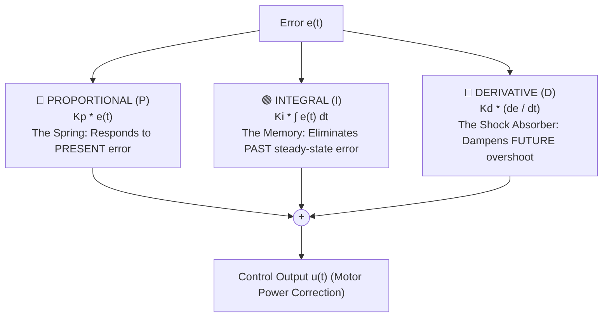

# Unit 6: Movement & Mobile Robotics: Driving the Physical World
# Module 6.3: Closed-Loop Control: The PID Controller

> **Prerequisites**: Module 6.1 (Kinematics), Module 6.2 (Odometry & Encoders)  
> **Estimated Time**: 50 minutes  
> **Interactive Activity**: Implementing and Tuning a PID Controller with Anti-Windup in Python  
> **Target Audience**: High School & College Students (Zero Prior Calculus Background)  

---

## 1. Learning Objectives

By the end of this module, you will be able to:
- [ ] **Explain** why open-loop robot control fails in the physical world and why closed-loop feedback is mandatory [^1].
- [ ] **Deconstruct** the three terms of a **PID Controller** (Proportional, Integral, Derivative) using intuitive physical mechanical analogs [^1] [^2].
- [ ] **Implement** an industrial-grade PID loop with **Integral Anti-Windup** and derivative filtering in Python [^1].
- [ ] **Apply** systematic manual tuning heuristics to eliminate steady-state error, overshoot, and oscillation [^1] [^2].

---

## 2. Intuitive Big Picture: Driving with Your Eyes Open

In Module 6.1, we wrote code that commanded both left and right wheels to spin at 50% power:
```python
motor_left.forward(50)
motor_right.forward(50)
```

In pure computer theory, the robot should drive in a mathematically perfect straight line.

In the real physical world, **this robot will immediately curve off into a wide circle!** Why?
- The copper wire windings in Motor A have $1.52\,\Omega$ of resistance; Motor B has $1.48\,\Omega$.
- The grease inside Gearbox A has slightly more friction than Gearbox B.
- Wheel A is $70.1\text{mm}$ in diameter; Wheel B is $69.8\text{mm}$ due to rubber mold tolerances.

```mermaid
flowchart TD
    subgraph Open-Loop Control (Blind Driving)
        Command["Command: 50% Power to Both Motors"] --> Motor1["Motor A: 120 RPM"]
        Command --> Motor2["Motor B: 114 RPM (Friction!)"]
        Motor1 & Motor2 --> Veer["❌ Robot Veers Off Course! Zero Self-Correction."]
    end

    subgraph Closed-Loop Feedback Control (Eyes Open!)
        Goal["Target: Heading = 0.0°"] --> Subtractor(( - ))
        Subtractor --> Error["Error = Target - Measured"]
        Error --> PID["🧠 PID Controller (Computes Steering Correction)"]
        PID --> Motors["Motors Adjust Left/Right Power Dynamically"]
        Motors --> Sensor["Sensors (IMU / Encoders) Measure Real Heading"]
        Sensor --> Subtractor
    end
```

To drive straight, a robot must drive with its "eyes open"—constantly measuring its actual physical heading, calculating the **Error**, and applying dynamic corrections. The gold standard algorithm that performs this closed-loop feedback across all modern engineering is the **PID Controller** [^1] [^2].

---

## 3. The Core Concept Explained

### 3.1 The Three Letters: P - I - D Demystified

The PID controller calculates a continuous **Control Effort ($u(t)$)** based on the difference between what you want (**Setpoint / Target, $r(t)$**) and what you currently have (**Measured Value, $y(t)$**) [^1]:

$$\text{Error: } e(t) = r(t) - y(t)$$

$$u(t) = P(t) + I(t) + D(t) = K_p \, e(t) + K_i \int e(t)\,dt + K_d \, \frac{de(t)}{dt}$$



---

### 3.2 The Physical Role of Each Term

#### 1. Proportional ($P = K_p \times e(t)$) — "The Spring"
- **Physical Meaning**: Proportional action acts like a mechanical spring connected between where the robot is and where it wants to be.
- If the error is large (robot is $30^\circ$ off target), $P$ pulls with massive force.
- If the error is small ($1^\circ$ off), $P$ pulls gently.
- **The Proportional Weakness (Steady-State Error)**: As the robot gets very close to the target ($0.2^\circ$ error), the proportional output becomes too weak to overcome motor friction and gearbox stiction. The robot stalls just short of its goal! Proportional alone can almost never reach zero error [^1] [^2].

#### 2. Integral ($I = K_i \times \int e(t)\,dt$) — "The Memory"
- **Physical Meaning**: The integral accumulator adds up the error over time.
- If the robot sits stalled $0.5^\circ$ off target, the error accumulates cycle after cycle ($0.5 + 0.5 + 0.5\dots$).
- Eventually, the accumulated integral value grows large enough to push past friction and force the error to **absolute zero**!
- **Danger (Integral Windup)**: If a robot is physically jammed against a wall, the integral term will add up to infinity. When the obstacle is removed, the motor will violently spin out of control. We must clamp the integral with **Anti-Windup limits** [^1]!

#### 3. Derivative ($D = K_d \times \frac{de(t)}{dt}$) — "The Shock Absorber"
- **Physical Meaning**: The derivative measures the speed at which the error is closing.
- When the robot is rushing toward its target heading at high speed, the derivative term becomes strongly negative, **acting like a shock absorber or brake**.
- It prevents the robot from overshooting and oscillating wildly back and forth around the setpoint [^1] [^2].

---

### 3.3 Systematic PID Tuning: The Step-by-Step Recipe

Beginners often randomly tweak all three numbers simultaneously, resulting in a shaking, out-of-control robot. Always follow this disciplined tuning sequence [^1] [^2]:

```text
 1. Set Ki = 0 and Kd = 0.
 2. Slowly increase Kp until the robot responds briskly to disturbances and exhibits
    a slight, steady oscillation around the target.
 3. Increase Kd to add damping. Watch the oscillations vanish as the robot settles smoothly!
 4. Slowly increase Ki to eliminate any remaining steady-state offset error until it hits zero.
```

| Symptom | Cause | Solution |
| :--- | :--- | :--- |
| Robot is sluggish and never reaches setpoint | $K_p$ is too low | Increase $K_p$ |
| Robot oscillates wildly back and forth | $K_p$ too high or $K_d$ too low | Lower $K_p$ or increase $K_d$ |
| Robot stops just short of target ($0.5\text{cm}$ off) | Lack of Integral action | Increase $K_i$ |
| Robot overshoots massively after being blocked | Integral Windup | Add clamping bounds to Integral accumulator [^1] |

---

## 4. Hands-On Python PID Controller Lab

### Lab Objective
In this exercise, you will implement an industrial-grade PID Controller class in Python with anti-windup clamping and test it by steering a simulated mobile robot back to a $0.0^\circ$ heading after a disturbance.

```python
import time

class PIDController:
    """
    Industrial-grade Discrete PID Controller with Integral Anti-Windup.
    """
    def __init__(self, kp, ki, kd, output_limits=(-100.0, 100.0), integral_limits=(-30.0, 30.0)):
        self.kp = kp
        self.ki = ki
        self.kd = kd
        
        self.min_out, self.max_out = output_limits
        self.min_int, self.max_int = integral_limits
        
        self.integral = 0.0
        self.last_error = 0.0
        self.last_time = time.ticks_ms()

    def compute(self, setpoint, measured_value):
        now = time.ticks_ms()
        dt = time.ticks_diff(now, self.last_time) / 1000.0
        self.last_time = now

        if dt <= 0.0:
            return 0.0

        # 1. Error calculation
        error = setpoint - measured_value

        # 2. Proportional term
        p_term = self.kp * error

        # 3. Integral term with Anti-Windup clamping
        self.integral += error * dt
        self.integral = max(self.min_int, min(self.max_int, self.integral))
        i_term = self.ki * self.integral

        # 4. Derivative term (Rate of change of error)
        derivative = (error - self.last_error) / dt
        d_term = self.kd * derivative
        self.last_error = error

        # 5. Sum and clamp final control effort
        total_output = p_term + i_term + d_term
        clamped_output = max(self.min_out, min(self.max_out, total_output))

        return round(clamped_output, 2)

    def reset(self):
        """Clears integral memory and last error state."""
        self.integral = 0.0
        self.last_error = 0.0


# --- Simulation Experiment: Heading Stabilization ---
# Target: Heading = 0.0 degrees (Straight North)
# Robot bumped by physical obstacle to +20.0 degrees off course!
pid = PIDController(kp=2.5, ki=0.5, kd=0.15, output_limits=(-50.0, 50.0))

current_heading = 20.0  # Robot starts 20 degrees off course
dt = 0.05               # 20 Hz loop (50ms)

print("🎯 Running Closed-Loop PID Heading Stabilization Simulation:")
print("Time (ms) | Heading (deg) | Error (deg) | PID Steering Effort | Visual Offset")
print("-" * 75)

for step in range(12):
    steering_effort = pid.compute(setpoint=0.0, measured_value=current_heading)
    
    # Simulate robot physical response to steering effort
    # (Steering effort rotates the robot back toward 0)
    current_heading += steering_effort * dt
    error = 0.0 - current_heading

    # Render ASCII indicator
    offset_chars = int(abs(current_heading))
    bar = (" " * 15 + "|" + "#" * offset_chars) if current_heading >= 0 else (" " * (15 - offset_chars) + "#" * offset_chars + "|")
    
    print(f"{step*50:8d} | {current_heading:11.2f}° | {error:9.2f}° | {steering_effort:17.2f} | {bar}")
    time.sleep(0.05)
```

Notice how the heading rapidly converges from $20.0^\circ$ straight down to $0.0^\circ$ and settles stably without overshoot!

---

## 5. Troubleshooting & Feedback Pitfalls

> [!WARNING]
> **Pitfall 1: Positive Feedback (Inverted Sign Disaster)**  
> If the steering correction is wired with the wrong sign (e.g., when the robot veers right, the code steers *more* to the right), the error increases. A larger error triggers an even harder right steer! The robot will spin into an uncontrollable death spiral within seconds. Always verify that positive error produces a negative corrective force (Negative Feedback) [^1]!

> [!WARNING]
> **Pitfall 2: High-Frequency Noise on the Derivative Term**  
> Because the derivative term calculates $\frac{\Delta e}{\Delta t}$, high-frequency sensor noise (Module 3.4) gets amplified massively. If your raw encoder or gyro reading has jitter, $D$ will chatter violently. Always pass sensor streams through a low-pass or median filter before calculating the derivative [^1] [^2]!

---

## 6. Real-World Applications & Next Steps

PID control is the most successful algorithm in the history of automation:
- Aircraft autopilots use PID controllers to maintain altitude, heading, and airspeed.
- Industrial robotic arms use cascaded PID loops at $1,000\text{ Hz}$ to track millimeter-precise trajectories.
- Automotive cruise control continuously adjusts engine throttle via PID to hold highway speed on hilly terrain.

In our next module, **Module 6.4: Open-Source Physics Simulators (Webots)**, we will enter the world of 3D multi-body dynamics: loading our differential robot into Cyberbotics Webots to simulate gravity, surface friction, and sensor rays!

---

## 7. Sources & Media Provenance

### Cited References
[^1]: **Karl Johan Åström, Richard M. Murray**, *"Feedback Systems: An Introduction for Scientists and Engineers (Chapter 10: PID Control)"*, Princeton University Press / Caltech. License: CC BY-SA 3.0. Available: [Feedback Systems OER Wiki](https://fbswiki.org/wiki/index.php/Feedback_Systems:_An_Introduction_for_Scientists_and_Engineers).  
[^2]: **Roland Siegwart, Illah R. Nourbakhsh, Davide Scaramuzza**, *"Introduction to Autonomous Mobile Robots (Chapter 4: Mobile Robot Feedback Control)"*, MIT Press. Available: [MIT Press Autonomous Mobile Robots](https://mitpress.mit.edu/9780262015356/introduction-to-autonomous-mobile-robots/).  
[^3]: **Kevin M. Lynch, Frank C. Park**, *"Modern Robotics: Mechanics, Planning, and Control (Chapter 11: Robot Control)"*, Cambridge University Press. License: CC BY-NC-ND 4.0. Available: [Modern Robotics](https://modernrobotics.northwestern.edu/).

### Media Manifest
| Asset Name | Media Type | Source / Repository | License | Attribution |
| :--- | :--- | :--- | :--- | :--- |
| `pid-block-diagram.svg` | Vector Graphic / Flowchart | Instructabot Educational Team | CC BY-SA 4.0 | Instructabot Project [^1] |
| `diff-drive-kinematics.svg` | Vector Graphic | Instructabot Educational Team | CC BY-SA 4.0 | Instructabot Project |
| `five-subsystems-flow.svg` | Vector Diagram | Instructabot Educational Team | CC BY-SA 4.0 | Instructabot Project |
