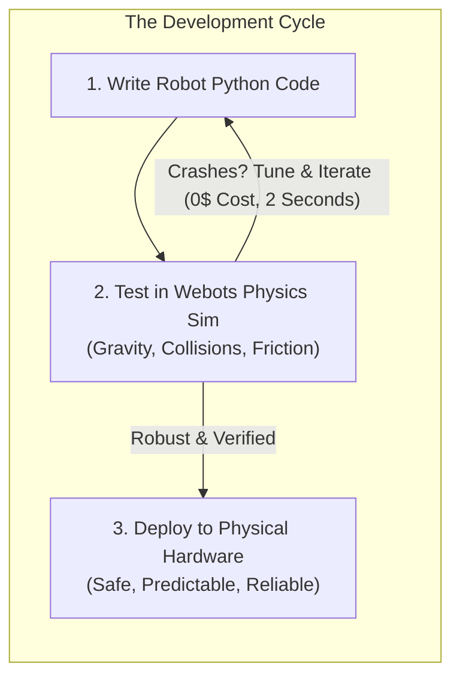
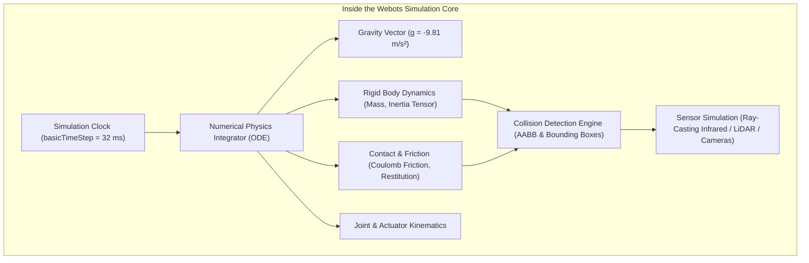
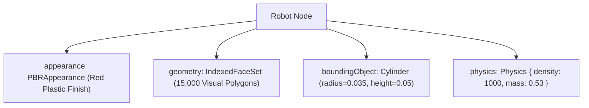
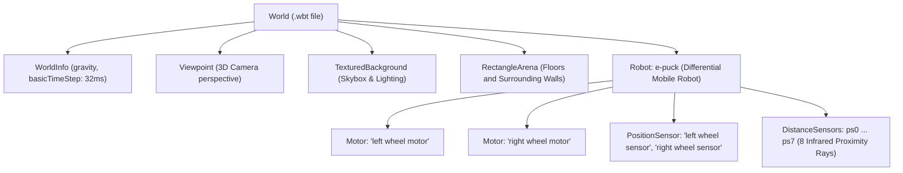

# Unit 6: Movement & Mobile Robotics: Driving the Physical World
# Module 6.4: Open-Source Physics Simulators (Webots)

> **Prerequisites**: Module 6.1 (Kinematics), Module 6.2 (Odometry), Module 6.3 (PID Control)  
> **Estimated Time**: 55 minutes  
> **Interactive Activity**: Launching Webots, Inspecting Rigid Body Physics, and Writing a Python Robot Controller  
> **Target Audience**: High School & College Students (Zero Prior Simulation Experience)  

---

## 1. Learning Objectives

By the end of this module, you will be able to:
- [ ] **Explain** why modern robotics development relies on rigid-body physics engines before deploying code onto physical hardware [^1].
- [ ] **Deconstruct** the architecture of a 3D robotic simulator: Open Dynamics Engine (ODE), time stepping ($\Delta t$), collision meshes, and ray-casting sensors [^1] [^2].
- [ ] **Navigate** the Webots scene tree hierarchy (`WorldInfo`, `Solid`, `Robot`, `Motor`, `DistanceSensor`) [^1].
- [ ] **Write** a clean, event-driven Python controller script using the Webots standard controller API to command motor velocities and read proximity sensors [^1] [^3].
- [ ] **Diagnose** simulation artifacts including contact tunneling, time step lag, and motor control mode configuration [^1] [^2].

---

## 2. Intuitive Big Picture: The Flight Simulator for Robots

Imagine an aerospace company building a new \$100 million jet. Do they let an apprentice programmer write the autopilot code, load it directly onto the real jet, and push it off a runway?

Never! Every pilot and control engineer trains in an ultra-realistic flight simulator. If the code crashes in simulation, you reset the software in two seconds. If the code crashes on a real jet, you destroy the aircraft and endanger lives.



In robotics, physical prototypes are fragile and expensive:
- Motor drivers blow up if you command an instantaneous full-speed reverse.
- Lithium batteries can catch fire if overloaded.
- Ultrasonic and infrared sensors get crushed when a robot slams into a concrete wall at full speed.

By testing inside **Webots**—a gold-standard, open-source 3D robot simulator maintained by Cyberbotics and used worldwide in university research and industrial automation—we can safely test our navigation algorithms thousands of times before touching a single screw [^1] [^3]!

---

## 3. The Core Concept Explained

### 3.1 What Is Inside a Physics Simulator?

A visual 3D video game engine (like Unreal or Unity) prioritizes **visual beauty and high frame rates**, often taking shortcuts with real-world physics. In contrast, a **Robotics Physics Engine** (such as the Open Dynamics Engine / ODE inside Webots) prioritizes **mathematical rigor and physical law conservation** [^1] [^2].



The simulator computes four foundational physical domains every time step:
1. **Rigid Body Dynamics**: Computes linear velocity $\vec{v}$ and angular velocity $\vec{\omega}$ from applied forces and motor torques using Newton-Euler equations:
   $$\sum \vec{F} = m \cdot \vec{a}, \quad \sum \vec{\tau} = \mathbf{I} \cdot \vec{\alpha}$$
2. **Contact & Friction**: When two rigid bodies touch, the simulator computes normal forces to prevent interpenetration, plus tangential friction forces using Coulomb friction models ($F_f \le \mu F_N$) [^1] [^2].
3. **Collision Bounding Volumes**: Checking complex graphical 3D meshes (thousands of polygons) for contact is computationally slow. Instead, Webots surrounds objects with simple geometric primitives (cylinders, spheres, boxes) for lightning-fast collision detection.
4. **Sensor Simulation**: Distance sensors shoot mathematical rays (ray casting) into the virtual 3D environment, calculating the intersection distance to the nearest polygon and adding realistic Gaussian noise [^1] [^3].

---

### 3.2 Graphical Mesh vs. Physics Bounding Object

One of the most important concepts in simulation is separating **how something looks** from **how something collides** [^1]:

| Component | What It Does | Computational Cost | Example |
| :--- | :--- | :--- | :--- |
| **Graphical Mesh (`Shape`)** | Rendered by the GPU with textures, lighting, and reflections for the human user. | High polygon count (10,000+ triangles) | Smooth curved robot chassis |
| **Bounding Object (`boundingObject`)** | Used by the ODE physics engine to calculate contacts, bouncing, and friction. | Extremely lightweight (1 box, cylinder, or sphere) | A single bounding cylinder |



> [!NOTE]
> If a 3D model looks solid on your screen but other objects pass right through it like a ghost, it is missing a `boundingObject`! The GPU is rendering the image, but the ODE physics engine does not know the object exists in the physical world [^1].

---

### 3.3 The Simulation Loop vs. Real-World Wall Clock Time

In physical microcontrollers (Module 2.3), your code runs locked to real-world time: 1 second on your stopwatch is 1 second on the microcontroller.

In a simulator, **Simulation Time is completely decoupled from Real Time** [^1] [^3]:
- **Simulation Time Step (`basicTimeStep`)**: The discrete increment of time (e.g., $32\text{ ms} = 0.032\text{ s}$) that the physics engine advances per calculation cycle.
- **Fast-Forward Mode**: If your computer has a fast processor and the scene is simple, Webots can simulate 10 minutes of driving in just 30 seconds (running at $20\times$ real-time speed)!
- **Slow-Motion Mode**: If your scene has 50 robots with high-resolution LIDARs, the CPU might take 2 seconds of real time to compute just 1 second of simulation time.

Your robot controller code communicates with Webots via a synchronized loop:
```python
while robot.step(TIME_STEP) != -1:
    # 1. Read virtual sensors
    # 2. Compute PID / navigation logic
    # 3. Write new actuator speeds
    pass
```
Whenever `robot.step(TIME_STEP)` is called, your controller pauses, Webots advances the entire 3D physical universe forward by `TIME_STEP` milliseconds, updates all sensor readings, and returns control to your Python script [^1] [^3]!

---

## 4. Practical Guided Walkthrough: The Webots Scene Tree & Python API

Webots represents every simulated world as a hierarchical **Scene Tree** composed of nodes [^1] (`webots-scene-tree.svg`):



### 4.1 The e-puck Educational Robot Architecture

The standard robot used in academic robotics education is the **GCtronic e-puck** [^3]:
- **Diameter**: $70\text{ mm}$ ($0.07\text{ m}$)
- **Wheel Distance ($L$)**: $52\text{ mm}$ ($0.052\text{ m}$)
- **Wheel Radius ($r$)**: $20.5\text{ mm}$ ($0.0205\text{ m}$)
- **Sensors**: 8 infrared proximity distance sensors arranged in a ring (`ps0` to `ps7`)
- **Actuators**: Two high-precision stepper/DC differential drive wheel motors (`left wheel motor`, `right wheel motor`)

```
               Front
           [ps7]   [ps0]
       [ps6]           [ps1]
      Left               Right
       [ps5]           [ps2]
           [ps4]   [ps3]
               Rear
```
- `ps0` and `ps7`: Forward-facing sensors (detect obstacles directly ahead).
- `ps5` and `ps6`: Left-facing sensors (detect walls on the left).
- `ps1` and `ps2`: Right-facing sensors (detect walls on the right).

---

### 4.2 Writing Your First Webots Python Controller

Here is the complete, idiomatic Python controller that initializes the robot, activates proximity sensors, sets motor velocity mode, and implements reactive obstacle avoidance [^1] [^3]:

```python
"""
Instructabot Webots e-puck Obstacle Avoidance Controller
Compatible with Cyberbotics Webots R2023b / R2024a and Python 3.10+
"""

from controller import Robot, DistanceSensor, Motor

# 1. Initialize the Robot instance
robot = Robot()

# 2. Get the simulation time step (in milliseconds)
TIME_STEP = int(robot.getBasicTimeStep())
MAX_SPEED = 6.28  # Radians per second (~1 revolution/sec for e-puck)

# 3. Configure the differential drive motors
left_motor = robot.getDevice('left wheel motor')
right_motor = robot.getDevice('right wheel motor')

# Crucial Step: Setting target position to infinity enables VELOCITY control mode!
left_motor.setPosition(float('inf'))
right_motor.setPosition(float('inf'))
left_motor.setVelocity(0.0)
right_motor.setVelocity(0.0)

# 4. Initialize and enable the 8 proximity distance sensors
ps_names = [f'ps{i}' for i in range(8)]
proximity_sensors = []
for name in ps_names:
    sensor = robot.getDevice(name)
    sensor.enable(TIME_STEP)  # Enable sensor updates every simulation step
    proximity_sensors.append(sensor)

print("🤖 Instructabot e-puck controller initialized successfully!")

# 5. Main Execution Loop
while robot.step(TIME_STEP) != -1:
    # Read sensor values (raw values range from ~60 (far/open) to ~4000 (touching))
    ps_values = [sensor.getValue() for sensor in proximity_sensors]
    
    # Check front obstacles: ps0 (front right) and ps7 (front left)
    front_obstacle_threshold = 80.0
    left_obstacle = ps_values[5] > front_obstacle_threshold or ps_values[6] > front_obstacle_threshold or ps_values[7] > front_obstacle_threshold
    right_obstacle = ps_values[0] > front_obstacle_threshold or ps_values[1] > front_obstacle_threshold or ps_values[2] > front_obstacle_threshold

    # Default: Drive forward at 70% speed
    left_speed = 0.7 * MAX_SPEED
    right_speed = 0.7 * MAX_SPEED

    if left_obstacle and right_obstacle:
        # Dead end ahead: Spin in place to turn around
        left_speed = -0.5 * MAX_SPEED
        right_speed = 0.5 * MAX_SPEED
    elif left_obstacle:
        # Obstacle on the left: Turn right
        left_speed = 0.5 * MAX_SPEED
        right_speed = -0.5 * MAX_SPEED
    elif right_obstacle:
        # Obstacle on the right: Turn left
        left_speed = -0.5 * MAX_SPEED
        right_speed = 0.5 * MAX_SPEED

    # Send commanded velocities to motors
    left_motor.setVelocity(left_speed)
    right_motor.setVelocity(right_speed)
```

---

## 5. Troubleshooting & Simulation Pitfalls

> [!WARNING]
> **Pitfall 1: Forgetting `setPosition(float('inf'))` (The Frozen Motor Bug)**  
> In Webots, rotational motors default to **Position Control Mode** (acting like a servo seeking position $0.0\text{ radians}$). If you call `motor.setVelocity(5.0)` without setting position to infinity first, the motor will twitch and lock in place! You **must** call `motor.setPosition(float('inf'))` to switch the motor into continuous velocity drive mode [^1].

> [!WARNING]
> **Pitfall 2: High Time Step Tunneling (Passing Through Walls)**  
> If `basicTimeStep` is set too high (e.g., $128\text{ ms}$) and the robot drives quickly toward a thin wall ($10\text{ mm}$ thick), the position calculation in one step might be *in front* of the wall, and in the next step *behind* the wall! The collision detector never registers contact. Keep `basicTimeStep` between $8\text{ ms}$ and $32\text{ ms}$, and give virtual walls adequate thickness [^1] [^2].

> [!CAUTION]
> **Pitfall 3: Reading Sensors Before Calling `robot.step()`**  
> When you call `sensor.enable(TIME_STEP)`, the sensor does not have valid data immediately. It takes at least one execution of `robot.step(TIME_STEP)` for Webots to render the physics world and populate the sensor buffers. Reading `getValue()` before the first step yields `0.0` or `NaN` [^1] [^3]!

---

## 6. Real-World Applications & Next Steps

Physics simulation is the backbone of modern robotics development:
- **NASA Jet Propulsion Laboratory**: Simulates Mars rover traverse over granular martian regolith to test steering torque and slope stability before transmitting commands to Perseverance.
- **Autonomous Driving (Waymo / Tesla)**: Simulates billions of virtual miles with edge-case scenarios (pedestrians jumping out from behind parked vehicles) that are too dangerous to test repeatedly on public streets.
- **Warehouse Logistics (Amazon Robotics)**: Runs multi-agent fleet simulations with thousands of automated drive units navigating distribution centers simultaneously.

Now that you understand the Webots physics engine and its Python controller pipeline, you are ready for **Lab 6: Autonomous Maze-Navigating Mobile Robot in Webots**, where you will combine kinematics, PID steering, and proximity wall-following to conquer a maze!

---

## 7. Sources & Media Provenance

### Cited References
[^1]: **Cyberbotics Technical Team**, *"Webots Open-Source Robot Simulator User Guide & Reference Manual"*, Cyberbotics Ltd. License: Apache License 2.0. Available: [Webots Reference Manual](https://cyberbotics.com/doc/reference/index).  
[^2]: **Roland Siegwart, Illah R. Nourbakhsh, Davide Scaramuzza**, *"Introduction to Autonomous Mobile Robots (Chapter 2: Locomotion & Physics Simulation)"*, MIT Press. Available: [MIT Press Autonomous Mobile Robots](https://mitpress.mit.edu/9780262015356/introduction-to-autonomous-mobile-robots/).  
[^3]: **Cyberbotics Ltd. / EPFL DISAL Laboratory**, *"e-puck Mobile Robot Simulation Model Reference"*, Cyberbotics Ltd. License: Apache License 2.0. Available: [Webots e-puck Guide](https://cyberbotics.com/doc/guide/epuck).

### Media Manifest
| Asset Name | Media Type | Source / Repository | License | Attribution |
| :--- | :--- | :--- | :--- | :--- |
| `webots-scene-tree.svg` | Vector Graphic / Architecture | Instructabot Educational Team | Apache License 2.0 | Instructabot Project [^1] |
| `webots-maze-sim.png` | Simulation Screenshot / Diagram | Cyberbotics Ltd. / Instructabot | Apache License 2.0 | Cyberbotics Webots [^1] [^3] |
| `diff-drive-kinematics.svg` | Vector Graphic | Instructabot Educational Team | CC BY-SA 4.0 | Instructabot Project [^2] |
