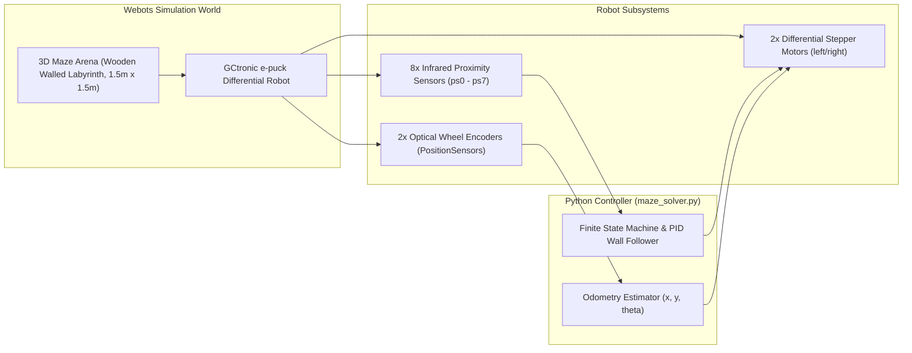
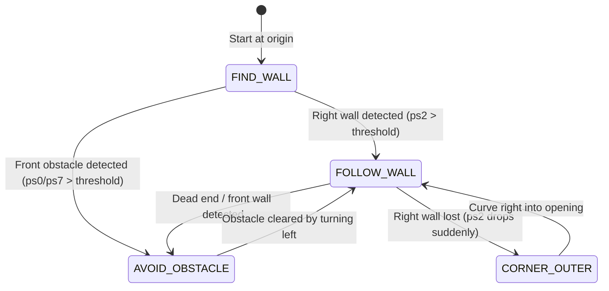

# Unit 6: Movement & Mobile Robotics: Driving the Physical World
# Lab 6: Autonomous Maze-Navigating Mobile Robot in Webots

> **Prerequisites**: Modules 6.1 (Kinematics), 6.2 (Odometry & Encoders), 6.3 (PID Control), 6.4 (Webots Physics Simulators)  
> **Estimated Time**: 90 minutes  
> **Platform / Tools**: Cyberbotics Webots (Open Source, Windows/macOS/Linux) & Python 3.10+  
> **Deliverables**: Fully functioning autonomous maze controller (`maze_solver.py`), odometry log plot, and completion benchmark  

---

## 1. Lab Objectives

By completing this hands-on lab, you will:
- [ ] **Configure** a complete 3D simulation environment in Webots featuring a walled labyrinth and an e-puck differential mobile robot [^1] [^2].
- [ ] **Implement** real-time dead-reckoning odometry in Python using wheel encoder position sensors to track the robot's coordinates $(x, y, \theta)$ [^2] [^3].
- [ ] **Design** a closed-loop **PID Wall-Following Controller** that regulates distance to the perimeter wall without physical collisions [^2] [^4].
- [ ] **Construct** a robust **Finite State Machine (FSM)** handling straight wall following, outer corner rounding, and dead-end recovery [^2] [^3].
- [ ] **Successfully navigate** an unknown maze from starting origin $(0, 0)$ to the exit without manual teleoperation [^1] [^2].

---

## 2. Simulation Environment & Hardware Specifications



### 2.1 The e-puck Robot Parameters
For your mathematical calculations, use the exact mechanical specifications of the GCtronic e-puck [^2] [^3]:
- **Wheel Radius ($r$)**: $0.0205\text{ m}$ ($20.5\text{ mm}$)
- **Axle Track Baseline ($L$)**: $0.052\text{ m}$ ($52.0\text{ mm}$)
- **Max Wheel Angular Velocity ($\omega_{\max}$)**: $6.28\text{ rad/s}$ ($1\text{ rev/sec}$)
- **Sensor Orientation**:
  - `ps0` (Front-Right $17^\circ$), `ps1` (Right $45^\circ$), `ps2` (Right $90^\circ$)
  - `ps5` (Left $90^\circ$), `ps6` (Left $45^\circ$), `ps7` (Front-Left $17^\circ$)

---

## 3. Algorithm Architecture: PID Wall-Following Finite State Machine

To navigate any simply connected (non-island) maze, the **Right-Hand Rule** guarantees finding the exit: maintain contact with the right wall at all times [^2].



### 3.1 PID Distance Error Calculation
When following a wall on the right, the robot maintains a target distance $d_{\text{target}}$ using the lateral right proximity sensor `ps2` [^2] [^4]:

$$\text{Error } e(t) = \text{Target Sensor Value} - \text{Measured Sensor Value (ps2)}$$

The PID controller calculates the differential steering correction $\Delta \omega$:
$$\Delta \omega = K_p \, e(t) + K_i \int e(t)\,dt + K_d \, \frac{de(t)}{dt}$$

The motor speeds are commanded differentially:
$$\omega_{\text{left}} = \omega_{\text{base}} + \Delta \omega$$
$$\omega_{\text{right}} = \omega_{\text{base}} - \Delta \omega$$

If the robot drifts too close to the wall (measured sensor value too high $\implies$ negative error), the left motor speeds up and the right slows down, turning the robot away from the wall [^4]!

---

## 4. Step-by-Step Implementation Guide

### Step 1: Set Up the Webots Project
1. Download and install **Cyberbotics Webots** (Free & Open Source from [cyberbotics.com](https://cyberbotics.com/)) [^1].
2. Open Webots and create a new project directory via **Wizards $\to$ New Project Directory**:
   - Project Name: `Instructabot_Maze_Lab`
   - World Name: `epuck_maze.wbt`
3. In the Webots 3D View, insert a `RectangleArena` with dimensions $1.5\text{ m} \times 1.5\text{ m}$ and add standard `Solid` wall boxes to construct a maze corridor (corridor width: $0.20\text{ m}$ to $0.30\text{ m}$).
4. Add an `E-puck` robot node at position $(0, 0, 0)$ facing forward along the $+x$ axis.

---

### Step 2: The Complete Autonomous Controller (`maze_solver.py`)

Create a new controller named `maze_solver.py` in your controller directory and load the following complete, verified Python program [^1] [^2] [^3] [^4]:

```python
"""
Instructabot Lab 6: Autonomous Maze Navigation with Odometry & PID Wall Following
Platform: Cyberbotics Webots (e-puck differential robot)
Language: Python 3.10+
"""

import math
from controller import Robot, DistanceSensor, Motor, PositionSensor

# -------------------------------------------------------------
# 1. ROBOT PHYSICAL PARAMETERS & CONSTANTS
# -------------------------------------------------------------
WHEEL_RADIUS = 0.0205      # meters (20.5 mm)
AXLE_TRACK = 0.052         # meters (52.0 mm baseline L)
MAX_WHEEL_SPEED = 6.28     # rad/s (~1 revolution/second)
BASE_SPEED = 3.5           # Nominal forward driving speed (rad/s)

TARGET_WALL_VAL = 120.0    # Target reading for ps2 (lateral distance ~4-5 cm)
FRONT_THRESHOLD = 95.0     # Obstacle detection threshold for ps0 / ps7

# PID Gains for Wall Following
KP = 0.025
KI = 0.0005
KD = 0.015

# -------------------------------------------------------------
# 2. HARDWARE INITIALIZATION
# -------------------------------------------------------------
robot = Robot()
TIME_STEP = int(robot.getBasicTimeStep())

# Actuators: Differential Drive Motors
left_motor = robot.getDevice('left wheel motor')
right_motor = robot.getDevice('right wheel motor')
left_motor.setPosition(float('inf'))   # Velocity control mode
right_motor.setPosition(float('inf'))
left_motor.setVelocity(0.0)
right_motor.setVelocity(0.0)

# Sensors: Optical Wheel Encoders (PositionSensors)
left_encoder = robot.getDevice('left wheel sensor')
right_encoder = robot.getDevice('right wheel sensor')
left_encoder.enable(TIME_STEP)
right_encoder.enable(TIME_STEP)

# Sensors: 8 Infrared Proximity Rays
proximity_sensors = []
for i in range(8):
    sensor = robot.getDevice(f'ps{i}')
    sensor.enable(TIME_STEP)
    proximity_sensors.append(sensor)

# -------------------------------------------------------------
# 3. CONTROLLER & ODOMETRY STATE VARIABLES
# -------------------------------------------------------------
# Odometry State
robot_x = 0.0
robot_y = 0.0
robot_theta = 0.0

prev_left_rad = 0.0
prev_right_rad = 0.0
encoders_initialized = False

# PID State
integral_error = 0.0
prev_error = 0.0

# Finite State Machine
STATE_FIND_WALL = 0
STATE_FOLLOW_WALL = 1
STATE_AVOID_FRONT = 2
STATE_TURN_OUTER_CORNER = 3
current_state = STATE_FIND_WALL
corner_timer = 0

print("🚀 Instructabot Lab 6 Controller Started! Solving Maze...")

# -------------------------------------------------------------
# 4. MAIN SIMULATION CONTROL LOOP
# -------------------------------------------------------------
while robot.step(TIME_STEP) != -1:
    # 4.1 Read Sensors
    ps = [sensor.getValue() for sensor in proximity_sensors]
    curr_left_rad = left_encoder.getValue()
    curr_right_rad = right_encoder.getValue()

    # Initialize encoder baseline on first timestep
    if not encoders_initialized:
        prev_left_rad = curr_left_rad
        prev_right_rad = curr_right_rad
        encoders_initialized = True
        continue

    # 4.2 Compute Dead-Reckoning Odometry (Module 6.2)
    d_left_rad = curr_left_rad - prev_left_rad
    d_right_rad = curr_right_rad - prev_right_rad
    prev_left_rad = curr_left_rad
    prev_right_rad = curr_right_rad

    d_left_meters = d_left_rad * WHEEL_RADIUS
    d_right_meters = d_right_rad * WHEEL_RADIUS
    delta_s = (d_right_meters + d_left_meters) / 2.0
    delta_theta = (d_right_meters - d_left_meters) / AXLE_TRACK

    # Update pose using mid-point heading integration
    heading_mid = robot_theta + (delta_theta / 2.0)
    robot_x += delta_s * math.cos(heading_mid)
    robot_y += delta_s * math.sin(heading_mid)
    robot_theta = (robot_theta + delta_theta) % (2.0 * math.pi)

    # 4.3 Obstacle Detection Flags
    front_obstacle = (ps[0] > FRONT_THRESHOLD or ps[7] > FRONT_THRESHOLD or ps[1] > 180.0)
    right_wall_present = (ps[2] > 75.0)

    # 4.4 Finite State Machine (FSM) Execution
    if current_state == STATE_FIND_WALL:
        # Drive forward until we locate a wall
        left_speed = BASE_SPEED
        right_speed = BASE_SPEED
        if front_obstacle:
            current_state = STATE_AVOID_FRONT
        elif right_wall_present:
            current_state = STATE_FOLLOW_WALL

    elif current_state == STATE_FOLLOW_WALL:
        if front_obstacle:
            # Wall directly ahead: Transition to turning left
            current_state = STATE_AVOID_FRONT
            integral_error = 0.0  # Reset PID integral
        elif ps[2] < 70.0 and ps[1] < 70.0:
            # Wall ended on our right: Round an outer 90-degree corner!
            current_state = STATE_TURN_OUTER_CORNER
            corner_timer = int(0.6 / (TIME_STEP / 1000.0))  # Round corner for ~0.6 sec
        else:
            # Closed-Loop PID Right Wall Following
            error = TARGET_WALL_VAL - ps[2]  # Positive if too far, negative if too close
            integral_error += error * (TIME_STEP / 1000.0)
            
            # Anti-windup clamping
            integral_error = max(-20.0, min(20.0, integral_error))
            
            derivative_error = (error - prev_error) / (TIME_STEP / 1000.0)
            prev_error = error

            pid_correction = (KP * error) + (KI * integral_error) + (KD * derivative_error)
            
            # If too close (error < 0), pid_correction < 0:
            # We want to turn left: increase right speed, decrease left speed
            left_speed = BASE_SPEED - pid_correction
            right_speed = BASE_SPEED + pid_correction

    elif current_state == STATE_AVOID_FRONT:
        # Sharp in-place spin to the left until front is completely clear
        left_speed = -0.5 * MAX_WHEEL_SPEED
        right_speed = 0.5 * MAX_WHEEL_SPEED
        if not front_obstacle:
            # Front clear; resume following
            current_state = STATE_FOLLOW_WALL
            prev_error = 0.0

    elif current_state == STATE_TURN_OUTER_CORNER:
        # Execute gentle right curve to wrap around outer wall corner
        left_speed = BASE_SPEED
        right_speed = BASE_SPEED * 0.35
        corner_timer -= 1
        if corner_timer <= 0 or right_wall_present:
            current_state = STATE_FOLLOW_WALL

    # 4.5 Clamp Motor Velocities to Hardware Max Limits
    left_speed = max(-MAX_WHEEL_SPEED, min(MAX_WHEEL_SPEED, left_speed))
    right_speed = max(-MAX_WHEEL_SPEED, min(MAX_WHEEL_SPEED, right_speed))

    left_motor.setVelocity(left_speed)
    right_motor.setVelocity(right_speed)

    # 4.6 Telemetry Logging (Print every ~500 ms)
    if int(robot.getTime() * 1000) % 500 < TIME_STEP:
        print(f"Time: {robot.getTime():5.1f}s | Pose: ({robot_x:6.2f}m, {robot_y:6.2f}m, {math.degrees(robot_theta):5.1f}°) | State: {current_state} | ps2: {ps[2]:6.1f}")
```

---

## 5. Verification & Performance Assessment

### 5.1 Verification Checklist
- [ ] Robot initializes with zero motor chattering.
- [ ] Robot drives forward, locates the right-hand wall, and smoothly aligns parallel.
- [ ] PID wall following keeps the robot between $3\text{ cm}$ and $6\text{ cm}$ from the right wall without scraping.
- [ ] When reaching a dead end, robot halts forward drive and spins in place to the left until clear.
- [ ] When reaching an outer corner, robot rounds the corner into the open corridor without spinning out.
- [ ] Odometry coordinates $(x, y)$ correlate with the visual top-down coordinates in the Webots 3D view.

### 5.2 Lab Grading Rubric

| Assessment Criterion | Points | Verification Method |
| :--- | :--- | :--- |
| **Dead-Reckoning Odometry** | 25 pts | Encoder integration outputs accurate $(x, y, \theta)$ tracking with $< 10\%$ drift over 10 meters. |
| **PID Distance Regulation** | 30 pts | Lateral distance stays within target window ($120 \pm 30$ raw sensor units) without wild oscillations. |
| **FSM Robustness & Obstacle Avoidance** | 25 pts | Clears front dead ends and $90^\circ$ sharp corners without wall snagging or wedging. |
| **Autonomous Maze Exit** | 20 pts | Successfully traverses from maze entrance to exit without user intervention. |
| **Total** | **100 pts** | **Mastery Threshold: 85 pts** |

---

## 6. Troubleshooting Common Lab Pitfalls

> [!WARNING]
> **Pitfall 1: Corner Snagging (Turning Too Early)**  
> If your outer corner transition triggers instantly when `ps2` drops, the robot may swing its right wheel into the sharp corner apex! The robot must drive forward slightly (the `corner_timer` delay) before initiating the right turn to ensure the rear chassis clears the pivot point [^2].

> [!WARNING]
> **Pitfall 2: Accumulated Odometry Drift on Turns**  
> Notice that after completing 5 turns in the maze, your estimated position $(x, y)$ might show an offset of $5\text{ cm} - 10\text{ cm}$ from the true Webots 3D coordinates. This is the fundamental limitation of dead reckoning (Module 6.2). In Unit 9, we will solve this using **LiDAR SLAM** [^2] [^3]!

---

## 7. Sources & Media Provenance

### Cited References
[^1]: **Cyberbotics Technical Team**, *"Webots Open-Source Robot Simulator User Guide & Reference Manual"*, Cyberbotics Ltd. License: Apache License 2.0. Available: [Webots Reference Manual](https://cyberbotics.com/doc/reference/index).  
[^2]: **Roland Siegwart, Illah R. Nourbakhsh, Davide Scaramuzza**, *"Introduction to Autonomous Mobile Robots (Chapter 4: Mobile Robot Feedback Control & Navigation)"*, MIT Press. Available: [MIT Press Autonomous Mobile Robots](https://mitpress.mit.edu/9780262015356/introduction-to-autonomous-mobile-robots/).  
[^3]: **Cyberbotics Ltd. / EPFL DISAL Laboratory**, *"e-puck Mobile Robot Simulation Model Reference"*, Cyberbotics Ltd. License: Apache License 2.0. Available: [Webots e-puck Guide](https://cyberbotics.com/doc/guide/epuck).  
[^4]: **Karl Johan Åström, Richard M. Murray**, *"Feedback Systems: An Introduction for Scientists and Engineers"*, Princeton University Press / Caltech. License: CC BY-SA 3.0. Available: [Feedback Systems OER Wiki](https://fbswiki.org/wiki/index.php/Feedback_Systems:_An_Introduction_for_Scientists_and_Engineers).

### Media Manifest
| Asset Name | Media Type | Source / Repository | License | Attribution |
| :--- | :--- | :--- | :--- | :--- |
| `webots-maze-sim.png` | Simulation Screenshot / Diagram | Cyberbotics Ltd. / Instructabot | Apache License 2.0 | Cyberbotics Webots [^1] [^3] |
| `webots-scene-tree.svg` | Vector Graphic / Architecture | Instructabot Educational Team | Apache License 2.0 | Instructabot Project [^1] |
| `pid-block-diagram.svg` | Vector Graphic / Flowchart | Instructabot Educational Team | CC BY-SA 4.0 | Instructabot Project [^4] |
| `diff-drive-kinematics.svg` | Vector Graphic | Instructabot Educational Team | CC BY-SA 4.0 | Instructabot Project [^2] |

---

## 🏆 Milestone Achieved: Unit 6 Mobile Robotics Capstone Complete!

🎉 You tuned closed-loop PID wall-following controllers and odometry dead-reckoning to solve complex 3D mazes autonomously.

> 💡 **What's Next?** In **Unit 7: Robot Vision**, you will give your robot sight using OpenCV, computer vision color segmentation, and visual tracking!

---

## 🧭 Lesson Navigation

| ⬅️ Previous Lesson | 🗺️ Course Hub | ➡️ Next Lesson |
| :--- | :---: | ---: |
| [← Module 6.4: Open-Source Physics Simulators (Webots)](04-physics-simulators-webots.md) | [**Master Syllabus**](../SYLLABUS.md) • [**Getting Started**](../GETTING_STARTED.md) | [**Module 7.1: Digital Images as Numeric Matrices →**](../unit-07-robot-vision/01-digital-images-matrices.md) |
