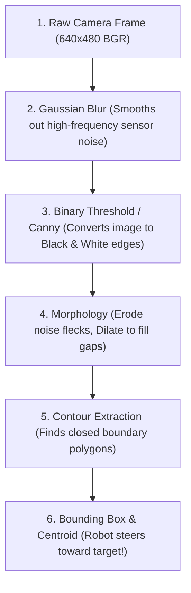
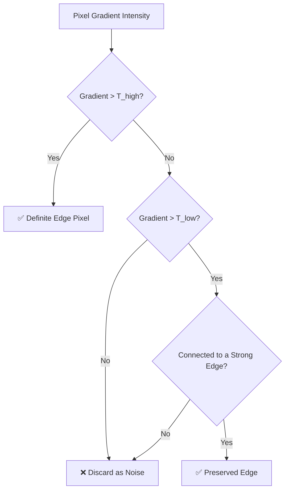

# Unit 7: Vision: Giving Robots Sight with OpenCV
# Module 7.2: OpenCV Foundations in Python

> **Prerequisites**: Module 7.1 (Digital Images as Numeric Matrices)  
> **Estimated Time**: 50 minutes  
> **Interactive Activity**: Building a Real-Time Edge & Contour Detection Pipeline in Python  
> **Target Audience**: High School & College Students (Zero Prior Computer Vision Background)  

---

## 1. Learning Objectives

By the end of this module, you will be able to:
- [ ] **Stream and capture** live camera frames using `cv2.VideoCapture` while respecting real-time compute latency budgets ($< 33\text{ ms}$ per frame for $30\text{ FPS}$) [^1].
- [ ] **Apply 2D spatial convolution** kernels using **Gaussian Blurring** to suppress electronic sensor noise [^1] [^2].
- [ ] **Implement Canny Edge Detection** and explain its multi-stage pipeline: gradient magnitude, non-maximum suppression, and hysteresis thresholding [^1] [^2].
- [ ] **Perform morphological transformations** (Erosion and Dilation) to eliminate salt-and-pepper artifacts and seal object holes [^1].
- [ ] **Extract and filter contours** from binary masks to calculate target bounding boxes, areas, and perimeters [^1] [^2].

---

## 2. Intuitive Big Picture: The Image Processing Assembly Line

A raw image coming directly off a cheap CMOS camera sensor is noisy, grainy, and cluttered. If you ask a robot to "find the ball" directly on raw pixels, it will get confused by background wallpaper, rug patterns, shadows, and camera sensor grain.

To extract meaning from pixels, computer vision engineers use a sequential **Image Processing Pipeline** (`opencv-pipeline.svg`) [^1] [^2]:



Each stage strips away irrelevant noise and distills the image down to pure geometric information that our robot's microcontroller or single-board computer can understand [^1].

---

## 3. The Core Concept Explained

### 3.1 2D Convolution & Gaussian Blurring

How does software "blur" an image? By sliding a tiny mathematical matrix called a **Kernel** across every pixel in the image—a mathematical operation known as **2D Spatial Convolution** [^1] [^2]:

$$\text{Blurred Pixel }(x, y) = \sum_{i=-k}^{k} \sum_{j=-k}^{k} K(i, j) \cdot I(x+i, y+j)$$

```
Raw Image Region (3x3):         Gaussian Kernel (3x3):
[ 100, 105,  98 ]               [ 1/16, 2/16, 1/16 ]
[ 102, 240, 101 ]       *       [ 2/16, 4/16, 2/16 ]   =  Weighted Average
[  99, 103, 100 ]  (Glitch!)    [ 1/16, 2/16, 1/16 ]      Smooth Output: 111!
```
Notice how the single corrupted white noise spike (`240`) gets gracefully blended into the surrounding dark pixels (`~100`). Blurring is the mandatory first step before running edge detection [^1]!

---

### 3.2 The Canny Edge Detector: How Robots Find Boundaries

Invented by John F. Canny in 1986, the **Canny Edge Detector** is the gold standard for finding physical object outlines [^1] [^2]. It operates in four rigorous mathematical stages:

1. **Noise Reduction**: Convolves the image with a Gaussian filter.
2. **Gradient Calculation**: Uses Sobel kernels to calculate directional derivatives ($\frac{\partial I}{\partial x}$ and $\frac{\partial I}{\partial y}$) and determines gradient magnitude and orientation angle ($\theta = \arctan(\frac{G_y}{G_x})$).
3. **Non-Maximum Suppression**: Scans along the gradient direction and thins edges down to exactly 1-pixel-wide lines by preserving only local peak pixels.
4. **Hysteresis Dual-Thresholding**: Uses two thresholds ($T_{\text{low}}$ and $T_{\text{high}}$):
   - Pixels with gradient $> T_{\text{high}}$ are guaranteed strong edges.
   - Pixels with gradient $< T_{\text{low}}$ are immediately discarded.
   - Pixels in between ($T_{\text{low}} \le G \le T_{\text{high}}$) are kept *only* if they connect to a strong edge!



---

### 3.3 Morphological Operations: Cleaning Binary Masks

When you convert an image into a binary black-and-white mask, the mask often has two flaws:
1. **Isolated noise flecks** scattered in the background.
2. **Holes and cracks** inside the target object.

We fix these with **Mathematical Morphology** [^1]:
- **Erosion (`cv2.erode`)**: Slides a structuring element across the mask. A white pixel remains white *only* if all neighboring pixels are white. It shrinks objects, completely erasing tiny 1-2 pixel noise flecks!
- **Dilation (`cv2.dilate`)**: A pixel turns white if *any* neighbor is white. It expands objects, bridging cracks and filling interior holes!
- **Morphological Opening**: `Erosion` followed by `Dilation` (cleans background noise without shrinking the object).
- **Morphological Closing**: `Dilation` followed by `Erosion` (seals internal holes without expanding the object).

---

### 3.4 Contours: Turning Pixels into Geometric Polygons

A **Contour** is a list of consecutive $(x, y)$ boundary coordinates bounding an uninterrupted shape of white pixels [^1]:
- `cv2.findContours()` traces every white blob in the binary image.
- `cv2.contourArea(c)` calculates the enclosed area in square pixels.
- `cv2.boundingRect(c)` computes the minimal bounding box: $(x, y, w, h)$.
- `cv2.minEnclosingCircle(c)` finds the smallest circle enclosing the shape.

By sorting contours by area and ignoring anything smaller than 500 pixels, our robot can ignore background clutter and lock onto the primary target [^1] [^2]!

---

## 4. Practical Hands-On: A Complete OpenCV Processing Pipeline

Here is a complete, self-contained Python program demonstrating the entire pipeline [^1]:

```python
"""
Instructabot Module 7.2: OpenCV Real-Time Filtering & Contour Extraction
Compatible with OpenCV 4.x and Python 3.10+
"""

import cv2
import numpy as np

# 1. Create a synthetic test frame with shapes and artificial noise
# (If you have a webcam, replace this with: cap = cv2.VideoCapture(0); ret, frame = cap.read())
frame = np.zeros((480, 640, 3), dtype=np.uint8)

# Draw simulated target: Green rectangle and white circle
cv2.rectangle(frame, (100, 100), (250, 300), (0, 220, 0), -1)  # Green box
cv2.circle(frame, (450, 240), 60, (240, 240, 240), -1)          # White circle

# Add artificial random sensor noise (salt-and-pepper)
noise = np.random.randint(0, 100, (480, 640, 3), dtype=np.uint8)
noisy_frame = cv2.add(frame, noise)

# ---------------------------------------------------------
# STEP 1: Convert to Grayscale & Gaussian Blur
# ---------------------------------------------------------
gray = cv2.cvtColor(noisy_frame, cv2.COLOR_BGR2GRAY)
blurred = cv2.GaussianBlur(gray, (5, 5), 0)

# ---------------------------------------------------------
# STEP 2: Canny Edge Detection (T_low=50, T_high=150)
# ---------------------------------------------------------
edges = cv2.Canny(blurred, 50, 150)

# ---------------------------------------------------------
# STEP 3: Morphological Closing (Seal gaps in edges)
# ---------------------------------------------------------
kernel = cv2.getStructuringElement(cv2.MORPH_RECT, (3, 3))
closed_edges = cv2.morphologyEx(edges, cv2.MORPH_CLOSE, kernel)

# ---------------------------------------------------------
# STEP 4: Extract Contours
# ---------------------------------------------------------
contours, _ = cv2.findContours(closed_edges, cv2.RETR_EXTERNAL, cv2.CHAIN_APPROX_SIMPLE)

output_canvas = noisy_frame.copy()
print(f"Total Raw Contours Detected: {len(contours)}")

# ---------------------------------------------------------
# STEP 5: Filter by Area & Compute Bounding Boxes
# ---------------------------------------------------------
for i, c in enumerate(contours):
    area = cv2.contourArea(c)
    
    # Filter out tiny noise contours
    if area < 500:
        continue
        
    # Get bounding box: (x, y, width, height)
    x, y, w, h = cv2.boundingRect(c)
    
    # Draw green bounding box on canvas
    cv2.rectangle(output_canvas, (x, y), (x + w, y + h), (0, 255, 255), 2)
    
    # Compute centroid of contour using image moments
    M = cv2.moments(c)
    if M["m00"] != 0:
        cx = int(M["m10"] / M["m00"])
        cy = int(M["m01"] / M["m00"])
        cv2.circle(output_canvas, (cx, cy), 5, (0, 0, 255), -1)
        cv2.putText(output_canvas, f"Target #{i+1} Area: {int(area)}", (x, y - 10),
                    cv2.FONT_HERSHEY_SIMPLEX, 0.5, (0, 255, 255), 1)

print("🎯 Pipeline executed successfully. Target objects isolated!")
```

---

## 5. Troubleshooting & Vision Pitfalls

> [!WARNING]
> **Pitfall 1: Frame Rate Latency & Video Buffer Lag**  
> `cv2.VideoCapture` maintains an internal hardware frame buffer (usually 4 to 5 frames). If your image processing loop takes $80\text{ ms}$ but the camera produces frames every $33\text{ ms}$, the buffer fills with stale frames. Your robot will be reacting to where an obstacle was half a second ago! In high-speed robotics, always grab the latest frame or run the capture loop in a separate dedicated thread [^1].

> [!WARNING]
> **Pitfall 2: Forgetting `cv2.waitKey()` in Interactive Loops**  
> If you call `cv2.imshow("Window", frame)` inside a `while` loop without calling `cv2.waitKey(1)`, the GUI window will completely freeze and display a gray box! `cv2.waitKey(1)` yields CPU time to the operating system's window manager to draw the screen pixels and process keyboard inputs [^1].

---

## 6. Real-World Applications & Next Steps

These foundational image processing primitives are used across modern industry:
- **Medical Imaging**: Canny edge detection and morphology isolate tumor boundaries in MRI and CT scans.
- **Automated Guided Vehicles (AGVs)**: Line-following warehouse robots use binary thresholding and contour centroids to follow black guidance stripes painted on concrete floors.
- **Autonomous Drones**: Real-time edge detection prevents micro-drones from flying into thin power lines and tree branches.

In **Module 7.3: Object Tracking & Fiducial Markers**, we will learn how to track moving colored objects and detect industrial **ArUco / AprilTag markers** to determine the exact 3D position and orientation of docking stations!

---

## 7. Sources & Media Provenance

### Cited References
[^1]: **Gary Bradski, Adrian Kaehler**, *"Learning OpenCV: Computer Vision with the OpenCV Library (Chapter 5: Image Transforms & Filtering, Chapter 8: Contours)"*, O'Reilly Media. License: Apache License 2.0. Available: [OpenCV Official Documentation](https://docs.opencv.org/4.x/).  
[^2]: **Richard Szeliski**, *"Computer Vision: Algorithms and Applications (2nd Edition, Chapter 3: Image Processing, Chapter 7: Feature Detection & Edges)"*, Springer. License: Open Access Electronic Edition. Available: [Szeliski Computer Vision](https://szeliski.org/Book/).  
[^3]: **Roland Siegwart, Illah R. Nourbakhsh, Davide Scaramuzza**, *"Introduction to Autonomous Mobile Robots (Chapter 4: Feature Extraction & Vision)"*, MIT Press. Available: [MIT Press Autonomous Mobile Robots](https://mitpress.mit.edu/9780262015356/introduction-to-autonomous-mobile-robots/).

### Media Manifest
| Asset Name | Media Type | Source / Repository | License | Attribution |
| :--- | :--- | :--- | :--- | :--- |
| `opencv-pipeline.svg` | Vector Graphic / Flowchart | Instructabot Educational Team | CC BY-SA 4.0 | Instructabot Project [^1] |
| `image-matrix-coords.svg` | Vector Graphic | Instructabot Educational Team | CC BY-SA 4.0 | Instructabot Project [^2] |
| `five-subsystems-flow.svg` | Vector Diagram | Instructabot Educational Team | CC BY-SA 4.0 | Instructabot Project |

---

## 🧭 Lesson Navigation

| ⬅️ Previous Lesson | 🗺️ Course Hub | ➡️ Next Lesson |
| :--- | :---: | ---: |
| [← Module 7.1: Digital Images as Numeric Matrices](01-digital-images-matrices.md) | [**Master Syllabus**](../SYLLABUS.md) • [**Getting Started**](../GETTING_STARTED.md) | [**Module 7.3: Object Tracking & Fiducial Markers (ArUco) →**](03-object-tracking-aruco.md) |
