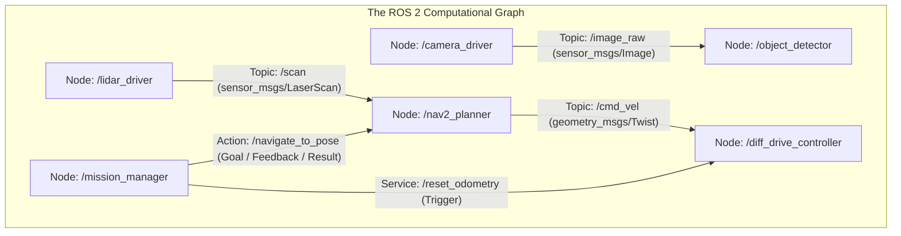

# Unit 8: ROS 2: The Industry Standard Robot Operating System
# Module 8.2: The Core ROS 2 Computational Graph

> **Prerequisites**: Module 8.1 (Why Middleware), Unit 2 (Python Classes & Inheritance)  
> **Estimated Time**: 55 minutes  
> **Interactive Activity**: Writing and Running a Publisher and Subscriber Node in Python with `rclpy`  
> **Target Audience**: High School & College Students (Zero Prior ROS Background)  

---

## 1. Learning Objectives

By the end of this module, you will be able to:
- [ ] **Deconstruct** the ROS 2 Computational Graph into its four fundamental communication paradigms: **Topics**, **Services**, **Actions**, and **Parameters** [^1].
- [ ] **Choose** the correct communication primitive for any robotic scenario (streaming sensors vs. discrete triggers vs. long-running goals) [^1] [^2].
- [ ] **Author** a clean, object-oriented ROS 2 Python node using the `rclpy.node.Node` base class [^1].
- [ ] **Implement** an asynchronous Publisher sending standard `geometry_msgs/msg/Twist` velocity commands and a Subscriber receiving them [^1].
- [ ] **Diagnose and eliminate** common callback blocking bugs caused by improper `spin()` and sleep calls [^1] [^2].

---

## 2. Intuitive Big Picture: The Robotic Orchestra

Imagine a symphony orchestra performing Beethoven's Fifth Symphony.
- The violinists don't stop playing to walk over and tap the cellist on the shoulder to ask what measure they are on.
- Instead, every musician plays their independent instrument, listening to the shared acoustic soundscape and looking at the sheet music.



In ROS 2, the **Computational Graph** is the network of independent programs (**Nodes**) passing standardized messages across shared communication channels (`ros2-computation-graph.svg`) [^1].

---

## 3. The Four Core Communication Primitives

How do nodes talk to each other? ROS 2 provides four distinct tools, each tailored for a specific engineering requirement [^1] [^2]:

| Communication Primitive | Pattern | Communication Style | Best Used For | Concrete Example |
| :--- | :--- | :--- | :--- | :--- |
| **Topics** | Publish / Subscribe (Pub/Sub) | Asynchronous, Unidirectional, Many-to-Many | Continuous, high-frequency data streams. | Streaming camera video at $30\text{ FPS}$, publishing wheel velocities on `/cmd_vel` at $50\text{ Hz}$. |
| **Services** | Client / Server | Synchronous Request / Response (Call and wait) | Instantaneous queries or discrete state changes. | Asking: *"Is the emergency brake engaged?"* or commanding: *"Reset odometry counter to 0.0"*. |
| **Actions** | Action Client / Action Server | Asynchronous Goal, Feedback stream, & Final Result (Preemptible) | Long-duration, goal-oriented tasks that take seconds or minutes. | *"Drive to Kitchen waypoint"*, providing continuous distance-remaining feedback, and allowing mission cancellation if an obstacle appears. |
| **Parameters** | Key / Value Store | Dynamic configuration per node | Tuning thresholds without recompiling or restarting software. | Setting PID controller gains ($K_p = 1.5$), maximum linear speed limit ($0.8\text{ m/s}$). |

---

### 3.1 Deep Dive: Standard Message Types

To allow a navigation algorithm written in Germany to control a robot chassis built in Japan, ROS 2 enforces **standardized message definitions** [^1]:

1. **`std_msgs`**: Basic primitives (`String`, `Int32`, `Float64`, `Bool`).
2. **`geometry_msgs`**: Geometric and kinematic spatial data:
   - **`geometry_msgs/msg/Point`**: 3D position coordinates `(x, y, z)`.
   - **`geometry_msgs/msg/Quaternion`**: 3D orientation `(x, y, z, w)`.
   - **`geometry_msgs/msg/Pose`**: Combines `Point` (position) and `Quaternion` (orientation).
   - **`geometry_msgs/msg/Twist`**: Spatial velocity command containing linear velocity vector and angular velocity vector:
     ```
     Vector3 linear   ->  x (forward/back), y (strafe left/right), z (vertical)
     Vector3 angular  ->  x (roll rate),    y (pitch rate),        z (yaw yaw/turn rate)
     ```
   For differential drive robots (Unit 6), we only command `linear.x` (meters/second) and `angular.z` (radians/second) [^1]!
3. **`sensor_msgs`**: Sensor hardware streams (`LaserScan`, `Image`, `Imu`, `JointState`).

---

## 4. Practical Hands-On: Authoring ROS 2 Nodes in Python (`rclpy`)

Let's write a complete ROS 2 Python publisher and subscriber using clean object-oriented inheritance [^1]:

### 4.1 The Velocity Publisher Node (`velocity_commander.py`)
```python
"""
Instructabot Module 8.2: ROS 2 Velocity Publisher Node
Publishes geometry_msgs/Twist commands at 10 Hz
"""

import rclpy
from rclpy.node import Node
from geometry_msgs.msg import Twist

class VelocityCommander(Node):
    def __init__(self):
        super().__init__('velocity_commander')
        
        # Create a Publisher on topic '/cmd_vel' with queue size of 10
        self.publisher_ = self.create_publisher(Twist, '/cmd_vel', 10)
        
        # Create a wall timer firing every 0.1 seconds (10 Hz)
        self.timer_period = 0.1  # seconds
        self.timer = self.create_timer(self.timer_period, self.timer_callback)
        self.counter = 0
        self.get_logger().info('🚀 Velocity Commander Node has started! Publishing to /cmd_vel...')

    def timer_callback(self):
        msg = Twist()
        # Command forward speed of 0.3 m/s and a gentle left turn of 0.1 rad/s
        msg.linear.x = 0.3
        msg.angular.z = 0.1
        
        self.publisher_.publish(msg)
        self.counter += 1
        if self.counter % 20 == 0:  # Log status every 2 seconds
            self.get_logger().info(f'Published Twist: linear.x={msg.linear.x} m/s, angular.z={msg.angular.z} rad/s')

def main(args=None):
    rclpy.init(args=args)
    node = VelocityCommander()
    try:
        rclpy.spin(node)  # Keeps node alive and processes callbacks
    except KeyboardInterrupt:
        pass
    finally:
        node.destroy_node()
        rclpy.shutdown()

if __name__ == '__main__':
    main()
```

---

### 4.2 The Motor Driver Subscriber Node (`motor_driver.py`)
```python
"""
Instructabot Module 8.2: ROS 2 Motor Driver Subscriber Node
Subscribes to '/cmd_vel' and computes left/right wheel speeds
"""

import rclpy
from rclpy.node import Node
from geometry_msgs.msg import Twist

class MotorDriverSubscriber(Node):
    def __init__(self):
        super().__init__('motor_driver')
        
        # Robot mechanical constants (e-puck baseline L = 0.052m, radius r = 0.0205m)
        self.track_width = 0.052
        self.wheel_radius = 0.0205
        
        # Create a Subscriber to topic '/cmd_vel'
        self.subscription = self.create_subscription(
            Twist,
            '/cmd_vel',
            self.cmd_vel_callback,
            10  # QoS queue depth
        )
        self.get_logger().info('⚡ Motor Driver Node initialized. Listening for Twist commands...')

    def cmd_vel_callback(self, msg: Twist):
        v = msg.linear.x      # forward velocity in m/s
        omega = msg.angular.z  # yaw rate in rad/s

        # Differential Drive Inverse Kinematics (Module 6.1)
        v_left = v - (omega * self.track_width / 2.0)
        v_right = v + (omega * self.track_width / 2.0)

        omega_left_rad_s = v_left / self.wheel_radius
        omega_right_rad_s = v_right / self.wheel_radius

        self.get_logger().info(
            f'Received /cmd_vel: v={v:.2f} m/s, ω={omega:.2f} rad/s -> '
            f'Wheel Speeds: Left={omega_left_rad_s:5.1f} rad/s, Right={omega_right_rad_s:5.1f} rad/s'
        )

def main(args=None):
    rclpy.init(args=args)
    node = MotorDriverSubscriber()
    try:
        rclpy.spin(node)
    except KeyboardInterrupt:
        pass
    finally:
        node.destroy_node()
        rclpy.shutdown()

if __name__ == '__main__':
    main()
```

---

## 5. Troubleshooting & Computational Graph Pitfalls

> [!WARNING]
> **Pitfall 1: Calling `time.sleep()` Inside a ROS Callback (The Thread Freeze)**  
> In ROS 2, by default, all timers and topic callbacks in a node execute sequentially on a **Single-Threaded Executor**. If you call `time.sleep(2.0)` inside `cmd_vel_callback`, you freeze the entire node! The subscriber cannot process new messages, timers stall, and the node becomes unresponsive. Never use blocking sleeps inside callbacks; use asynchronous non-blocking timers or multi-threaded executors [^1]!

> [!WARNING]
> **Pitfall 2: Topic Name Mismatch & Leading Slashes**  
> If one node publishes to `cmd_vel` (relative name) and another subscribes to `/cmd_vel` (global root name), putting them in different namespaces (e.g., `/robot1/cmd_vel`) will disconnect them! Standardize on clean topic names and use ROS 2 launch remapping rather than hardcoding hard-wired topic strings [^1] [^2].

---

## 6. Real-World Applications & Next Steps

The ROS 2 Computational Graph is ubiquitous across modern robotics:
- **Warehouse Fleets (KION / Dematic)**: AGV forklifts publish localized odometry topics and subscribe to central fleet management action goals over industrial Wi-Fi.
- **Agricultural Robotics (John Deere)**: Autonomous tractors run separate nodes for GPS RTK navigation, weed spray nozzle control, and safety LIDAR obstacle stop actions.
- **Surgical Robotics (Intuitive Surgical)**: Master console controllers communicate with patient-side robotic arms via ultra-reliable, deterministic DDS topics.

In **Module 8.3: Introspection & Visualization Tools**, we will learn how to inspect this live graph using command-line diagnostic tools (`ros2 topic`, `ros2 node`) and visualize 3D sensor streams using **RViz2**!

---

## 7. Sources & Media Provenance

### Cited References
[^1]: **Open Robotics**, *"ROS 2 Documentation: Concepts (Nodes, Topics, Services, Actions, Parameters)"*, Open Source Robotics Foundation. License: Creative Commons Attribution 3.0 / Apache License 2.0. Available: [ROS 2 Official Documentation](https://docs.ros.org/en/humble/index.html).  
[^2]: **Steven Macenski, Tully Foote, Brian Gerkey, Michael Carroll, Dirk Thomas**, *"Robot Operating System 2: Design, architecture, and uses in the wild"*, Science Robotics, Vol. 7, No. 66. Available: [Science Robotics ROS 2 Article](https://www.science.org/doi/10.1126/scirobotics.abm6074).  
[^3]: **Roland Siegwart, Illah R. Nourbakhsh, Davide Scaramuzza**, *"Introduction to Autonomous Mobile Robots (Chapter 4: Middleware Communications)"*, MIT Press. Available: [MIT Press Autonomous Mobile Robots](https://mitpress.mit.edu/9780262015356/introduction-to-autonomous-mobile-robots/).

### Media Manifest
| Asset Name | Media Type | Source / Repository | License | Attribution |
| :--- | :--- | :--- | :--- | :--- |
| `ros2-computation-graph.svg` | Vector Graphic / Architecture | Instructabot Educational Team | CC BY 3.0 | Instructabot Project [^1] [^2] |
| `ros2-package-structure.svg` | Vector Graphic / Architecture | Instructabot Educational Team | CC BY 3.0 | Instructabot Project [^1] |
| `five-subsystems-flow.svg` | Vector Diagram | Instructabot Educational Team | CC BY-SA 4.0 | Instructabot Project |

---

## 🧭 Lesson Navigation

| ⬅️ Previous Lesson | 🗺️ Course Hub | ➡️ Next Lesson |
| :--- | :---: | ---: |
| [← Module 8.1: Why Middleware? The Monolith Problem & ROS 2 Architecture](01-why-middleware-ros2.md) | [**Master Syllabus**](../SYLLABUS.md) • [**Getting Started**](../GETTING_STARTED.md) | [**Module 8.3: Introspection & Visualization Tools (CLI, rqt, RViz2) →**](03-introspection-rviz2.md) |
