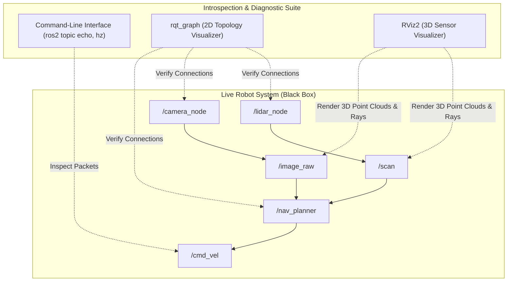
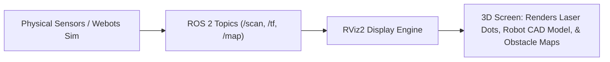

# Unit 8: ROS 2: The Industry Standard Robot Operating System
# Module 8.3: Introspection & Visualization Tools (CLI, rqt, RViz2)

> **Prerequisites**: Module 8.1 (Why Middleware), Module 8.2 (Computational Graph)  
> **Estimated Time**: 50 minutes  
> **Interactive Activity**: Auditing Live ROS 2 Nodes from the Terminal and Visualizing 3D Sensor Data in RViz2  
> **Target Audience**: High School & College Students (Zero Prior ROS Background)  

---

## 1. Learning Objectives

By the end of this module, you will be able to:
- [ ] **Audit** running ROS 2 systems using the command-line introspection suite (`ros2 node`, `ros2 topic`, `ros2 param`) [^1].
- [ ] **Measure** topic publication frequencies and transmission latencies using `ros2 topic hz` and `ros2 topic bw` [^1].
- [ ] **Inspect and verify** computational topologies visually using `rqt_graph` [^1].
- [ ] **Differentiate** between a 3D Physics Simulator (Webots / Gazebo) and a 3D Sensor Visualizer (**RViz2**) [^1] [^2].
- [ ] **Configure** RViz2 display plugins (`RobotModel`, `LaserScan`, `TF`, `PointCloud2`) relative to a designated **Fixed Frame** [^1] [^2].

---

## 2. Intuitive Big Picture: The Robotic X-Ray Machine

When a physical robot behaves strangely—for example, stopping unexpectedly in an empty hallway—you cannot see the invisible wireless packets flying through the air.
- Did the LiDAR node crash?
- Is the navigation node outputting zero velocity?
- Is the motor driver receiving commands but unable to move?

Trying to debug a robot without introspection tools is like performing surgery in the dark. ROS 2 provides an industrial-grade **Introspection Suite**: command-line diagnostic probes and 3D visualization tools that act as an X-ray machine for your robot's digital nervous system [^1] [^2]!



---

## 3. The Core Concept Explained

### 3.1 The ROS 2 CLI Introspection Toolkit

Every robotics engineer uses the terminal to probe and diagnose live nodes [^1]:

```bash
# 1. List all active nodes currently running on the network
$ ros2 node list
/camera_driver
/diff_drive_controller
/lidar_driver
/nav2_planner

# 2. Inspect a specific node's inputs and outputs
$ ros2 node info /nav2_planner
  Subscribers:
    /scan: sensor_msgs/msg/LaserScan
    /odom: nav_msgs/msg/Odometry
  Publishers:
    /cmd_vel: geometry_msgs/msg/Twist
  Service Servers:
    /nav2_planner/get_plan: nav_msgs/srv/GetPlan
```

#### Diagnostic Commands for Topics:
- **`ros2 topic list`**: Lists all active broadcast channels. Add `-t` to display message types (`ros2 topic list -t`).
- **`ros2 topic echo /topic_name`**: Prints live message payloads directly onto the terminal screen in real time.
- **`ros2 topic hz /topic_name`**: Measures publication frequency in Hertz (Hz) and rate jitter:
  ```text
  average rate: 29.982 Hz
  min: 0.031s max: 0.035s std dev: 0.00112s window: 30
  ```
- **`ros2 topic pub /cmd_vel geometry_msgs/msg/Twist "{linear: {x: 0.2}}"`**: Injects a test message directly from the command line into the robot without writing a script!

---

### 3.2 Visualizing Architecture: `rqt_graph`

Instead of memorizing terminal outputs, running `rqt_graph` opens an interactive GUI that plots the entire running computational graph [^1]:
- Ovals represent **Nodes**.
- Rectangles and arrows represent **Topics** and the direction of data flow.
- Instantly exposes **orphaned topics** (a node publishing data that nobody is listening to) and **unconnected subscribers** [^1]!

---

### 3.3 Visualizing 3D Reality: RViz2 vs. Physics Simulators

A common misconception among beginner roboticists is confusing **Webots** with **RViz2** [^1] [^2]:

| Feature | Physics Simulator (Webots / Gazebo) | 3D Visualizer (**RViz2**) |
| :--- | :--- | :--- |
| **Primary Purpose** | Creates a simulated virtual universe with gravity, collisions, and contacts. | Visualizes what the robot's onboard computers **actually perceive and believe**. |
| **Physics Calculations** | ODE engine calculates forces, torques, accelerations, and friction. | **Zero physics calculations**. Only draws data sent over ROS 2 topics. |
| **Data Source** | Computes virtual world state from mathematical models. | Subscribes to live ROS 2 topics (`/scan`, `/tf`, `/odom`, `/image_raw`). |
| **Role on Real Robots** | Not used when operating on physical hardware. | **Crucial GUI used on real-world robots** to monitor sensor feeds and navigation paths. |



---

### 3.4 Key RViz2 Displays and the "Fixed Frame"

When you open RViz2 (`rviz2-interface.svg`), you configure display plugins from the left panel [^1] [^2]:

1. **`RobotModel`**: Parses the robot's URDF (Unified Robot Description Format) XML file to display a textured 3D CAD rendering of the robot chassis, wheels, and joints.
2. **`LaserScan`**: Draws thousands of colored dots representing LiDAR beam hit points in 3D space.
3. **`TF` (Transforms)**: Renders 3D coordinate axis triads (Red=$X$, Green=$Y$, Blue=$Z$) for every physical frame (`base_link`, `laser_link`, `camera_link`).
4. **`Map`**: Displays 2D occupancy grid maps generated by SLAM algorithms (Unit 9).

> [!IMPORTANT]
> **The RViz2 Fixed Frame:**  
> In 3D space, every distance measurement must be relative to a reference coordinate frame.  
> In RViz2, the **Fixed Frame** (configured in the *Global Options* panel) is the anchor of the virtual universe.  
> - Set to `odom` or `map` for world-centric navigation (the robot drives across your screen).  
> - Set to `base_link` for robot-centric view (the robot stays fixed at the center while walls move past).  
> If RViz displays a bright red error banner saying *"No transform from [laser_link] to [map]"*, it means the spatial transform tree (Module 8.4) is broken [^1] [^2]!

---

## 4. Practical Hands-On: Diagnosing a ROS 2 Pipeline in Python

Let's write a simple diagnostic monitor node in Python that subscribes to a topic, calculates publication jitter, and alerts if sensor streams freeze [^1]:

```python
"""
Instructabot Module 8.3: Topic Health & Heartbeat Monitor Node
Audits stream frequency and detects frozen sensors.
"""

import time
import rclpy
from rclpy.node import Node
from geometry_msgs.msg import Twist

class TopicHealthMonitor(Node):
    def __init__(self):
        super().__init__('topic_health_monitor')
        
        self.last_msg_time = time.time()
        self.msg_count = 0
        
        # Subscribe to target topic
        self.sub = self.create_subscription(
            Twist,
            '/cmd_vel',
            self.topic_callback,
            10
        )
        
        # Periodic watchdog timer running at 2 Hz
        self.watchdog_timer = self.create_timer(0.5, self.watchdog_callback)
        self.get_logger().info("🔍 Topic Health Monitor online. Monitoring /cmd_vel...")

    def topic_callback(self, msg: Twist):
        self.last_msg_time = time.time()
        self.msg_count += 1

    def watchdog_callback(self):
        elapsed = time.time() - self.last_msg_time
        if elapsed > 1.5:
            self.get_logger().warn(f"⚠️ HEARTBEAT TIMEOUT! No message on /cmd_vel for {elapsed:.2f}s!")
        else:
            self.get_logger().info(f"✅ Stream Healthy. Total Messages: {self.msg_count}, Last Heard: {elapsed*1000:.0f}ms ago")

def main(args=None):
    rclpy.init(args=args)
    node = TopicHealthMonitor()
    try:
        rclpy.spin(node)
    except KeyboardInterrupt:
        pass
    finally:
        node.destroy_node()
        rclpy.shutdown()

if __name__ == '__main__':
    main()
```

---

## 5. Troubleshooting & Visualization Pitfalls

> [!WARNING]
> **Pitfall 1: Leaving `ros2 topic echo` Running Over Wi-Fi**  
> Running `ros2 topic echo /camera/image_raw` streams uncompressed megabyte-sized raw image frames into your terminal. Over a wireless robot network, this floods the Wi-Fi bandwidth, dropping motor control packets and causing severe latency! Only echo high-bandwidth sensor topics locally or echo single message snapshots: `ros2 topic echo /topic --once` [^1].

> [!WARNING]
> **Pitfall 2: Forgetting to Source the ROS 2 Environment**  
> If you open a new terminal tab and type `ros2`, Linux may return `command not found: ros2`. Remember that ROS 2 requires sourcing the setup script in every new bash terminal: `source /opt/ros/humble/setup.bash` (or adding it to `~/.bashrc`) [^1].

---

## 6. Real-World Applications & Next Steps

Introspection and visualization tools are essential across industrial robotics:
- **Autonomous Trucking (Torc / Aurora)**: Field test engineers monitor real-time RViz dashboards showing 200-meter LiDAR point clouds and vehicle intent trajectories on highway runs.
- **Factory Fleets**: Remote operations centers use Web-based RViz visualizers to inspect automated forklifts that flag an obstacle alert on the factory floor.
- **Subsea Robotics**: Autonomous Underwater Vehicles (AUVs) transmit compact diagnostic health topics over acoustic modems to surface ships.

In **Module 8.4: Spatial Relationships with TF2 (Transform Library)**, we will discover how ROS 2 solves coordinate frame mathematics, transforming 2D camera pixels into 3D robot gripper coordinates!

---

## 7. Sources & Media Provenance

### Cited References
[^1]: **Open Robotics**, *"ROS 2 Documentation: Command Line Tools & RViz2 (Humble / Iron)"*, Open Source Robotics Foundation. License: Creative Commons Attribution 3.0 / Apache License 2.0. Available: [ROS 2 Official Documentation](https://docs.ros.org/en/humble/index.html).  
[^2]: **Steven Macenski, Tully Foote, Brian Gerkey, Michael Carroll, Dirk Thomas**, *"Robot Operating System 2: Design, architecture, and uses in the wild"*, Science Robotics, Vol. 7, No. 66. Available: [Science Robotics ROS 2 Article](https://www.science.org/doi/10.1126/scirobotics.abm6074).  
[^3]: **Roland Siegwart, Illah R. Nourbakhsh, Davide Scaramuzza**, *"Introduction to Autonomous Mobile Robots (Chapter 4: Spatial Visualization)"*, MIT Press. Available: [MIT Press Autonomous Mobile Robots](https://mitpress.mit.edu/9780262015356/introduction-to-autonomous-mobile-robots/).

### Media Manifest
| Asset Name | Media Type | Source / Repository | License | Attribution |
| :--- | :--- | :--- | :--- | :--- |
| `rviz2-interface.svg` | Vector Graphic / UI Mockup | Instructabot Educational Team | CC BY 3.0 | Instructabot Project [^1] [^2] |
| `ros2-computation-graph.svg` | Vector Graphic / Architecture | Instructabot Educational Team | CC BY 3.0 | Instructabot Project [^1] |
| `five-subsystems-flow.svg` | Vector Diagram | Instructabot Educational Team | CC BY-SA 4.0 | Instructabot Project |

---

## 🧭 Lesson Navigation

| ⬅️ Previous Lesson | 🗺️ Course Hub | ➡️ Next Lesson |
| :--- | :---: | ---: |
| [← Module 8.2: The Core ROS 2 Computational Graph](02-computational-graph-nodes-topics.md) | [**Master Syllabus**](../SYLLABUS.md) • [**Getting Started**](../GETTING_STARTED.md) | [**Module 8.4: Spatial Relationships with TF2 (Transform Library) →**](04-tf2-coordinate-transforms.md) |
