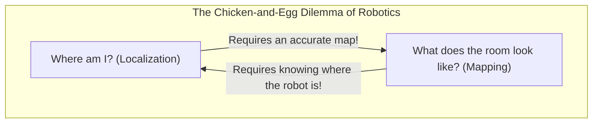
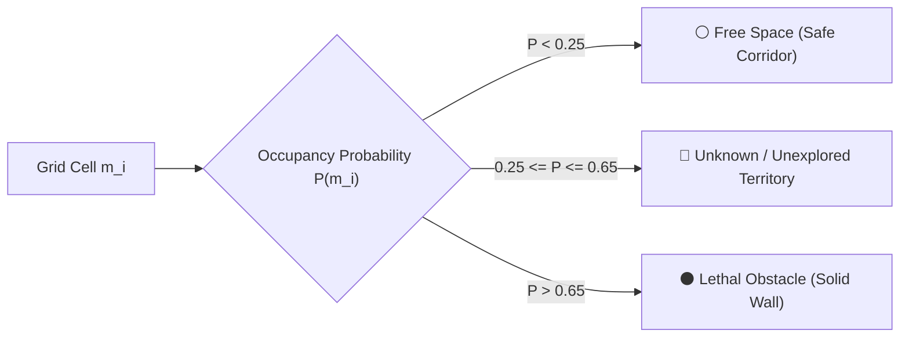

# Unit 9: Autonomous Navigation: SLAM & Path Planning
# Module 9.1: The Fundamental Problem of SLAM & Occupancy Grids

> **Prerequisites**: Unit 3 (Sensors & Distance), Unit 6 (Odometry & Drift), Unit 8 (ROS 2 & TF2)  
> **Estimated Time**: 50 minutes  
> **Interactive Activity**: Implementing a Log-Odds 2D Occupancy Grid Map Update in Python  
> **Target Audience**: High School & College Students (Zero Prior Probabilistic Robotics Background)  

---

## 1. Learning Objectives

By the end of this module, you will be able to:
- [ ] **Explain** the "chicken-and-egg" dilemma of **Simultaneous Localization and Mapping (SLAM)** [^1] [^2].
- [ ] **Deconstruct** a 2D **Occupancy Grid Map** into discrete cells representing free space, lethal obstacles, and unexplored territory [^1].
- [ ] **Formulate** recursive Bayesian map updating using the computationally efficient **Log-Odds** representation [^1].
- [ ] **Implement** ray-casting map updates in Python to clear free space and mark obstacle endpoints from simulated range beams [^1] [^2].
- [ ] **Diagnose** mapping artifacts caused by accumulated dead-reckoning odometry drift [^1] [^2].

---

## 2. Intuitive Big Picture: The Blindfolded Explorer

Imagine waking up in the center of an unfamiliar, pitch-black warehouse with nothing but a flashlight.
- To draw an accurate blueprint of the warehouse, **you need to know your exact location $(x, y)$** whenever you see a wall.
- But to calculate your exact location $(x, y)$ when your footsteps slip, **you need an accurate blueprint of the warehouse**!



In robotics, this paradox is known as the **SLAM Problem (Simultaneous Localization and Mapping)** [^1] [^2]. A robot dropped into an unknown environment must simultaneously build the map of its world while using that incomplete, evolving map to track its own position!

---

## 3. The Core Concept Explained

### 3.1 What Is an Occupancy Grid Map?

Invented by Alberto Elfes and Hans Moravec at Carnegie Mellon University, the **Occupancy Grid Map** is the industry standard format for robotic navigation (`occupancy-grid.svg`) [^1]:
- The 2D world is divided into a uniform Cartesian grid of small square cells (typically $5\text{ cm} \times 5\text{ cm}$ per cell).
- Each cell $m_i$ stores a probability value $P(m_i = 1)$ representing the likelihood that the cell contains a physical solid obstacle:

```
[ Free Space: P ≈ 0.0 ]     [ Unknown: P = 0.5 ]     [ Obstacle: P ≈ 1.0 ]
       (White)                     (Gray)                   (Black)
Robot can drive safely     Unexplored territory      Solid wall: Do not hit!
```



---

### 3.2 The Log-Odds Bayesian Update Formulation

When a sensor beam passes through cell $A$ and hits a wall at cell $B$, how should the robot update its beliefs?
- Cell $A$ was empty along the beam line of sight $\implies$ decrease occupancy probability.
- Cell $B$ reflected the beam $\implies$ increase occupancy probability.

If we multiplied raw probabilities ($0.05 \times 0.02 \times \dots$), numbers would quickly become so small that computer floating-point processors would suffer **numerical underflow**!

Sebastian Thrun and roboticists solved this using the **Log-Odds ($l$)** transform [^1]:

$$l(m_i) = \ln \left( \frac{P(m_i)}{1 - P(m_i)} \right)$$

| State | Probability $P(m_i)$ | Log-Odds $l(m_i)$ |
| :--- | :--- | :--- |
| **Completely Unknown** | $0.50$ ($50\%$) | $\ln(\frac{0.5}{0.5}) = \mathbf{0.0}$ |
| **Definitely Free** | $0.01$ ($1\%$) | $\ln(\frac{0.01}{0.99}) \approx \mathbf{-4.6}$ |
| **Definitely Occupied** | $0.99$ ($99\%$) | $\ln(\frac{0.99}{0.01}) \approx \mathbf{+4.6}$ |

#### The Recursive Additive Update Rule:
Instead of slow probability multiplications, updating a cell's occupancy becomes **a single addition of a float** [^1]:

$$l_t(m_i) = l_{t-1}(m_i) + \text{InverseSensorModel}(z_t) - l_0$$

When the robot needs to display the map, it converts log-odds back into probability:

$$P(m_i) = 1 - \frac{1}{1 + e^{l(m_i)}}$$

---

## 4. Practical Hands-On: A 2D Occupancy Grid Updater in Python

Here is a complete Python program that creates a 2D occupancy grid, simulates range sensor beams, uses Bresenham's ray-casting to clear line-of-sight cells, and updates log-odds values [^1]:

```python
"""
Instructabot Module 9.1: 2D Occupancy Grid Map Updater
Demonstrating Log-Odds recursive Bayes updates and ray casting.
"""

import math
import numpy as np

# 1. Grid Map Dimensions & Constants
GRID_SIZE = 50          # 50 x 50 cells
RESOLUTION = 0.1        # 0.1 meters (10 cm) per cell -> 5.0m x 5.0m map
L_0 = 0.0               # Initial log-odds: Unknown (P = 0.5)
L_OCC = 0.85            # Log-odds increase for obstacle hits
L_FREE = -0.40          # Log-odds decrease for free cells passed through

# Initialize grid map with zeros (all unknown)
log_odds_map = np.zeros((GRID_SIZE, GRID_SIZE), dtype=np.float32)

def bresenham_line(x0, y0, x1, y1):
    """Bresenham's Line Algorithm: returns all integer grid cells along a ray."""
    cells = []
    dx = abs(x1 - x0)
    dy = abs(y1 - y0)
    sx = 1 if x0 < x1 else -1
    sy = 1 if y0 < y1 else -1
    err = dx - dy

    x, y = x0, y0
    while True:
        cells.append((x, y))
        if x == x1 and y == y1:
            break
        e2 = 2 * err
        if e2 > -dy:
            err -= dy
            x += sx
        if e2 < dx:
            err += dx
            y += sy
    return cells

def update_laser_scan(robot_x_m, robot_y_m, hit_x_m, hit_y_m):
    """Updates the map based on a laser beam originating at robot and hitting an obstacle."""
    # Convert meters to grid cell coordinates
    r_col = int(robot_x_m / RESOLUTION)
    r_row = int(robot_y_m / RESOLUTION)
    h_col = int(hit_x_m / RESOLUTION)
    h_row = int(hit_y_m / RESOLUTION)

    # Get all cells along the beam's line of sight
    ray_cells = bresenham_line(r_col, r_row, h_col, h_row)

    # 1. All cells prior to the hit are FREE space
    for c, r in ray_cells[:-1]:
        if 0 <= c < GRID_SIZE and 0 <= r < GRID_SIZE:
            log_odds_map[r, c] += L_FREE
            # Clamp limits to avoid unbounded growth
            log_odds_map[r, c] = max(-4.0, log_odds_map[r, c])

    # 2. The endpoint cell is an OCCUPIED obstacle
    end_c, end_r = ray_cells[-1]
    if 0 <= end_c < GRID_SIZE and 0 <= end_r < GRID_SIZE:
        log_odds_map[end_r, end_c] += L_OCC
        log_odds_map[end_r, end_c] = min(4.0, log_odds_map[end_r, end_c])

# Simulate robot at (2.5m, 2.5m) scanning a solid wall located at x = 4.0m
robot_pos = (2.5, 2.5)
for angle_deg in range(-30, 31, 5):
    angle_rad = math.radians(angle_deg)
    # Distance to wall at x = 4.0: (4.0 - 2.5) / cos(angle)
    dist = (4.0 - 2.5) / math.cos(angle_rad)
    hit_x = robot_pos[0] + dist * math.cos(angle_rad)
    hit_y = robot_pos[1] + dist * math.sin(angle_rad)
    
    update_laser_scan(robot_pos[0], robot_pos[1], hit_x, hit_y)

# Convert log-odds back to probability map: P = 1 - 1 / (1 + exp(l))
prob_map = 1.0 - (1.0 / (1.0 + np.exp(log_odds_map)))

# Print ASCII slice of the generated map
print("🗺️ 2D Occupancy Grid Map Slice (Row 25):")
row_str = ""
for col in range(GRID_SIZE):
    p = prob_map[25, col]
    if p > 0.65:
        row_str += "#"  # Wall
    elif p < 0.35:
        row_str += "."  # Free space
    else:
        row_str += "?"  # Unknown
print(row_str)
print("Legend: [.] Free Space   [?] Unknown   [#] Obstacle Wall")
```

---

## 5. Troubleshooting & Mapping Pitfalls

> [!WARNING]
> **Pitfall 1: Ghost Walls from Odometry Drift**  
> If you build an occupancy grid using pure dead-reckoning odometry without SLAM scan-matching, a $5^\circ$ heading error after 10 meters of driving will rotate your entire laser scan! The next wall you observe will be drawn in the wrong location, creating "ghost duplicate walls" and ruining map alignment [^1] [^2].

> [!WARNING]
> **Pitfall 2: Over-Confidence Clamping Failure**  
> If a cell accumulates thousands of measurements without limits ($l = 10,000$), and then someone opens a door, it would take thousands of observations to undo that massive log-odds value! Production SLAM software strictly clamps log-odds between $[-4.0, +4.0]$ so the map can adapt to dynamic changes [^1].

---

## 6. Real-World Applications & Next Steps

Occupancy grid SLAM is active across our daily lives:
- **Consumer Vacuum Robots (iRobot, Roborock)**: Uses 2D LiDAR to build persistent apartment floorplans and identify carpet zones.
- **Underground Mining Vehicles (Caterpillar)**: Navigates GPS-denied underground rock tunnels using 2D and 3D occupancy mapping.
- **Hospital Delivery Robots (Tug / Aethon)**: Transports medications and linens between nursing wards using occupancy maps.

In **Module 9.2: 2D LiDAR SLAM Algorithms**, we will discover how algorithms eliminate odometry drift using **Scan Matching, Particle Filters (AMCL), and Graph-Based Loop Closures**!

---

## 7. Sources & Media Provenance

### Cited References
[^1]: **Sebastian Thrun, Wolfram Burgard, Dieter Fox**, *"Probabilistic Robotics (Chapter 9: Occupancy Grid Mapping)"*, MIT Press. Available: [MIT Press Probabilistic Robotics](https://mitpress.mit.edu/9780262201629/probabilistic-robotics/).  
[^2]: **Roland Siegwart, Illah R. Nourbakhsh, Davide Scaramuzza**, *"Introduction to Autonomous Mobile Robots (Chapter 5: Localization & Mapping)"*, MIT Press. Available: [MIT Press Autonomous Mobile Robots](https://mitpress.mit.edu/9780262015356/introduction-to-autonomous-mobile-robots/).  
[^3]: **Steven Macenski, Tully Foote, Brian Gerkey, Michael Carroll, Dirk Thomas**, *"Robot Operating System 2: Design, architecture, and uses in the wild"*, Science Robotics, Vol. 7, No. 66. Available: [Science Robotics ROS 2 Article](https://www.science.org/doi/10.1126/scirobotics.abm6074).

### Media Manifest
| Asset Name | Media Type | Source / Repository | License | Attribution |
| :--- | :--- | :--- | :--- | :--- |
| `occupancy-grid.svg` | Vector Graphic / Map Schematic | Instructabot Educational Team | CC BY-SA 4.0 | Instructabot Project [^1] |
| `diff-drive-kinematics.svg` | Vector Graphic | Instructabot Educational Team | CC BY-SA 4.0 | Instructabot Project [^2] |
| `five-subsystems-flow.svg` | Vector Diagram | Instructabot Educational Team | CC BY-SA 4.0 | Instructabot Project |
