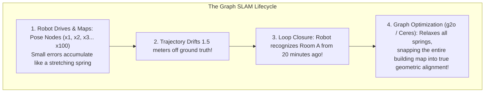
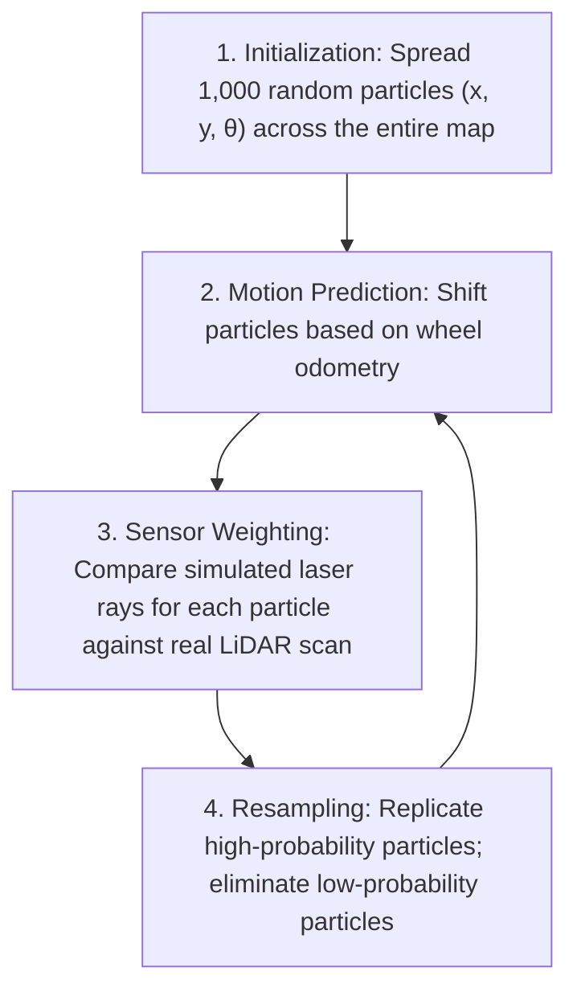

# Unit 9: Autonomous Navigation: SLAM & Path Planning
# Module 9.2: 2D LiDAR SLAM Algorithms (Scan Matching, AMCL, Loop Closure)

> **Prerequisites**: Module 9.1 (The SLAM Problem & Occupancy Grids), Unit 6 (Odometry Drift)  
> **Estimated Time**: 55 minutes  
> **Interactive Activity**: Simulating Monte Carlo Particle Filter Convergence in Python  
> **Target Audience**: High School & College Students (Zero Prior Probabilistic Robotics Background)  

---

## 1. Learning Objectives

By the end of this module, you will be able to:
- [ ] **Deconstruct** how **Scan Matching** (Iterative Closest Point / Correlative Matching) extracts rigid transformations directly from laser range scans, bypassing wheel slip [^1] [^2].
- [ ] **Explain** how **Monte Carlo Localization (AMCL)** uses particle filters to solve the classic "Kidnapped Robot Problem" [^1].
- [ ] **Illustrate** the structure of **Graph-Based SLAM** (Pose Graphs), defining nodes, edges, and non-linear least squares optimization [^1] [^3].
- [ ] **Demonstrate** how **Loop Closure** eliminates accumulated drift when re-visiting previously mapped territory (`loop-closure-graph.svg`) [^1].
- [ ] **Diagnose** geometric degeneracy failures when navigating long, featureless symmetric corridors [^1] [^2].

---

## 2. Intuitive Big Picture: The Subsea Diver & Landmark Recognition

Imagine a diver swimming through an underwater cave system.
- In the open water with zero landmarks, the diver tries to track position by counting fin kicks (Dead Reckoning). After 20 minutes, ocean currents have swept the diver dozens of meters off course!
- But suddenly, the diver shines a light on a distinct rock archway they swam through 30 minutes ago.
- Instantly, the diver's brain makes a connection: *"I am back at the archway!"* All the drifted uncertainty vanishes, and the diver snaps their mental map back into alignment!



In robotics, this recognition is called **Loop Closure**, and it is the magical ingredient that enables robots to map entire skyscrapers without cumulative error [^1] [^3]!

---

## 3. The Core Concept Explained

### 3.1 Scan Matching: Laser-Based Odometry

Instead of trusting rubber wheels that slip on dusty concrete, **Scan Matching** aligns two consecutive raw LiDAR scans mathematically [^1] [^2]:
1. At timestamp $t$, the robot records Scan $A$ (360 distance points).
2. The robot drives forward. At $t + \Delta t$, it records Scan $B$.
3. The scan matching algorithm rotates and translates Scan $B$ until its laser points align perfectly on top of Scan $A$:

$$\min_{\Delta x, \Delta y, \Delta \theta} \sum_{i} \left\| \mathbf{R}(\Delta \theta) \cdot p_{B,i} + \mathbf{t} - p_{A, \text{match}} \right\|^2$$

Because scan matching measures the solid, immovable physical walls of the building, it is completely immune to wheel slip [^1]!

---

### 3.2 Monte Carlo Localization (AMCL) & Particle Filters

Once a robot has a completed map of a building (Module 9.1), how does it find itself if an engineer picks it up and carries it to an unknown room (The **Kidnapped Robot Problem**) [^1]?

The industry-standard solution in ROS 2 is **Adaptive Monte Carlo Localization (AMCL)** [^1]:



- Each particle represents a hypothetical guess of where the robot might be.
- If a particle sits in a small office, but the robot's real LiDAR sees a 20-meter open hallway, that particle's probability drops to zero and it dies!
- Within 2 to 3 seconds of driving, the particles cluster tightly around the robot's single true physical location [^1]!

---

### 3.3 Graph-Based SLAM (Pose Graphs)

Modern SLAM systems (such as `slam_toolbox` and Cartographer in ROS 2) formulate mapping as a mathematical **Pose Graph** (`loop-closure-graph.svg`) [^1] [^3]:
- **Nodes ($\mathbf{x}_i$)**: The robot's estimated 2D pose $(x, y, \theta)$ at discrete intervals.
- **Edges ($\mathbf{z}_{ij}$)**: Geometric spatial constraints connecting nodes:
  - **Sequential Edges**: Odometry and scan-matching between step $i$ and step $i+1$.
  - **Loop Closure Edges**: Constraints connecting a current node $\mathbf{x}_{150}$ back to an old node $\mathbf{x}_5$ when familiar geometry is recognized!

When a loop closure edge is detected, an optimization engine (such as Google Ceres or g2o) computes a non-linear least squares relaxation that distributes error evenly across the trajectory, straightening bent walls and eliminating drift [^1] [^3]!

---

## 4. Practical Hands-On: A 1D Particle Filter in Python

To intuitively experience how particle filters localize a robot without guessing, run this self-contained Python simulation [^1]:

```python
"""
Instructabot Module 9.2: 1D Monte Carlo Particle Filter
Demonstrating how a robot localizes itself in an unknown room.
"""

import random
import numpy as np

# A 1D hallway of length 20 meters with distinct landmark doors at x = 4.0m and x = 14.0m
HALLWAY_LENGTH = 20.0
DOORS = [4.0, 14.0]
NUM_PARTICLES = 500

# 1. Initialize particles randomly across the entire hallway
particles = np.random.uniform(0.0, HALLWAY_LENGTH, NUM_PARTICLES)
weights = np.ones(NUM_PARTICLES) / NUM_PARTICLES

# True hidden robot position
true_robot_x = 1.0

print("🔍 Kidnapped Robot: Starting 1D Particle Filter localization...")

for step in range(1, 6):
    # Robot moves forward 1.0 meter
    move_dist = 1.0
    true_robot_x += move_dist
    
    # 1. Motion Update: Move all particles forward with slight Gaussian noise
    particles += move_dist + np.random.normal(0, 0.1, NUM_PARTICLES)
    # Wrap boundaries
    particles = np.mod(particles, HALLWAY_LENGTH)

    # 2. Sensor Measurement: Does the robot detect a door within 0.8 meters?
    robot_sees_door = any(abs(true_robot_x - d) < 0.8 for d in DOORS)

    # 3. Measurement Update: Weight particles based on whether their position matches sensor
    for i in range(NUM_PARTICLES):
        particle_sees_door = any(abs(particles[i] - d) < 0.8 for d in DOORS)
        if particle_sees_door == robot_sees_door:
            weights[i] *= 0.85
        else:
            weights[i] *= 0.15

    # Normalize weights
    weights /= np.sum(weights)

    # 4. Resample particles based on normalized weights (Survival of the fittest)
    indices = np.random.choice(NUM_PARTICLES, size=NUM_PARTICLES, p=weights)
    particles = particles[indices]
    weights.fill(1.0 / NUM_PARTICLES)

    # Compute estimated robot position as weighted mean of particles
    estimated_x = np.mean(particles)
    std_dev = np.std(particles)
    print(f"Step {step}: True X = {true_robot_x:5.2f}m | Est X = {estimated_x:5.2f}m | Uncertainty (StdDev) = {std_dev:4.2f}m | Sensor Sees Door: {robot_sees_door}")

print("🎯 Particle filter converged tightly around the true robot position!")
```

---

## 5. Troubleshooting & SLAM Pitfalls

> [!WARNING]
> **Pitfall 1: Geometric Degeneracy in Long Featureless Corridors**  
> If a robot drives down a $100\text{ meter}$ long hotel hallway with smooth, flat drywall and zero alcoves, its LiDAR scans look identical whether it is at meter 10 or meter 50! Scan matching has infinite mathematical solutions along the hallway axis. In degenerate corridors, SLAM must temporarily trust wheel encoders and IMUs [^1] [^2].

> [!WARNING]
> **Pitfall 2: False Positive Loop Closures (The Catastrophic Map Tear)**  
> If two completely different hotel rooms have identical rectangular dimensions, a naive scan-matcher might falsely conclude: *"I am back in Room 101!"* when it is actually in Room 405. Forcing a false loop closure will physically rip the map in half, rotating floors by $90^\circ$! SLAM algorithms require high-confidence geometric thresholds before accepting loop closures [^1] [^3].

---

## 6. Real-World Applications & Next Steps

LiDAR SLAM algorithms power modern industrial autonomy:
- **Autonomous Guided Forklifts**: Navigate multi-million square-foot Amazon fulfillment centers using 2D LiDAR SLAM with sub-centimeter repeatability.
- **Planetary Rovers (Mars Perseverance)**: Computes visual-inertial odometry and terrain feature matching to traverse hazardous martian terrain.
- **Port Automation**: 40-ton automated straddle carriers stack shipping containers in Rotterdam harbor guided by dual 2D/3D LiDAR SLAM.

In **Module 9.3: Path Planning & Obstacle Avoidance**, we will learn how robots use completed maps to find collision-free routes using **Costmaps, $A^*$ Grid Search, and Dynamic Window Approach (DWA)**!

---

## 7. Sources & Media Provenance

### Cited References
[^1]: **Sebastian Thrun, Wolfram Burgard, Dieter Fox**, *"Probabilistic Robotics (Chapter 8: Monte Carlo Localization, Chapter 10: Graph SLAM)"*, MIT Press. Available: [MIT Press Probabilistic Robotics](https://mitpress.mit.edu/9780262201629/probabilistic-robotics/).  
[^2]: **Roland Siegwart, Illah R. Nourbakhsh, Davide Scaramuzza**, *"Introduction to Autonomous Mobile Robots (Chapter 5: Range-Based Localization)"*, MIT Press. Available: [MIT Press Autonomous Mobile Robots](https://mitpress.mit.edu/9780262015356/introduction-to-autonomous-mobile-robots/).  
[^3]: **Steven Macenski, Tully Foote, Brian Gerkey, Michael Carroll, Dirk Thomas**, *"Robot Operating System 2: Design, architecture, and uses in the wild"*, Science Robotics, Vol. 7, No. 66. Available: [Science Robotics ROS 2 Article](https://www.science.org/doi/10.1126/scirobotics.abm6074).

### Media Manifest
| Asset Name | Media Type | Source / Repository | License | Attribution |
| :--- | :--- | :--- | :--- | :--- |
| `loop-closure-graph.svg` | Vector Graphic / Pose Graph | Instructabot Educational Team | CC BY-SA 4.0 | Instructabot Project [^1] [^3] |
| `occupancy-grid.svg` | Vector Graphic | Instructabot Educational Team | CC BY-SA 4.0 | Instructabot Project [^1] |
| `diff-drive-kinematics.svg` | Vector Graphic | Instructabot Educational Team | CC BY-SA 4.0 | Instructabot Project [^2] |
