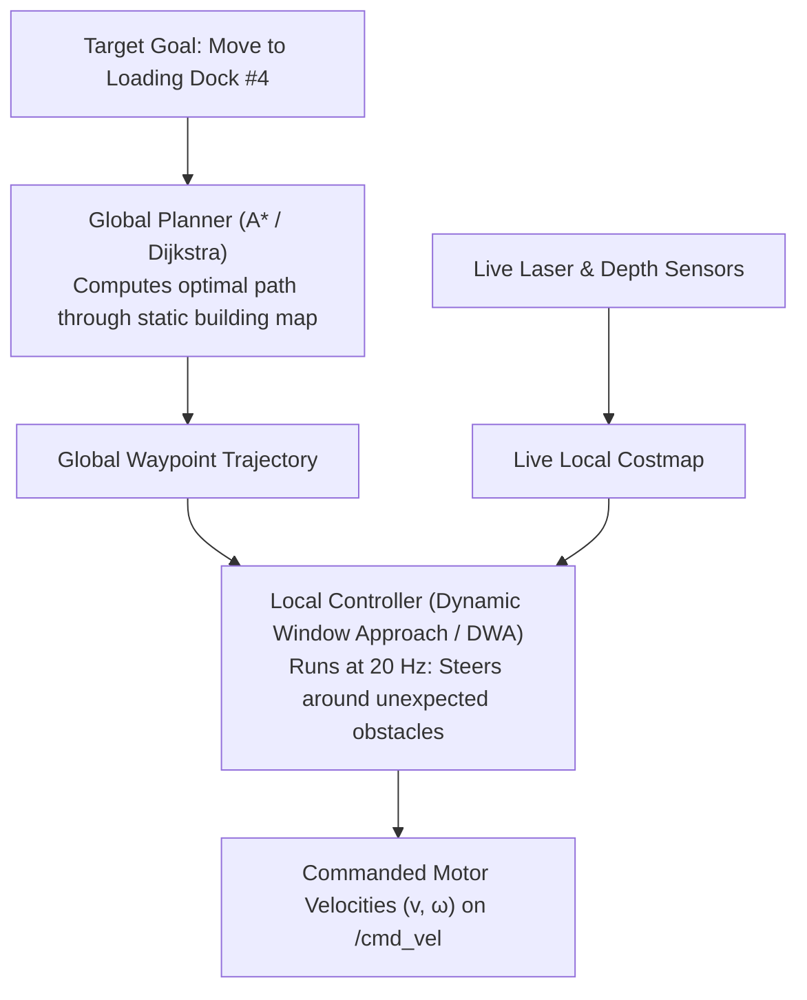
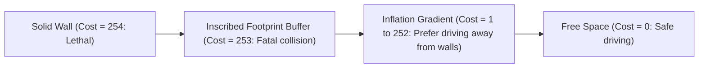

# Unit 9: Autonomous Navigation: SLAM & Path Planning
# Module 9.3: Path Planning & Costmaps ($A^*$, C-Space, DWA)

> **Prerequisites**: Module 9.1 (Occupancy Grids), Module 9.2 (SLAM), Unit 6 (Kinematics & PID)  
> **Estimated Time**: 55 minutes  
> **Interactive Activity**: Writing and Running a Complete $A^*$ Grid Path Planner in Python  
> **Target Audience**: High School & College Students (Zero Prior Graph Theory Background)  

---

## 1. Learning Objectives

By the end of this module, you will be able to:
- [ ] **Differentiate** between **Global Path Planning** (high-level route finding) and **Local Trajectory Execution** (real-time dynamic obstacle avoidance) [^1] [^2].
- [ ] **Construct a 2D Costmap** using **Configuration Space (C-Space)** inflation to treat the physical robot as a single collision-free mathematical point (`a-star-costmap.svg`) [^1] [^3].
- [ ] **Formulate and implement** the **$A^*$ (A-Star) Graph Search Algorithm** using cost evaluation function $f(n) = g(n) + h(n)$ [^1] [^2].
- [ ] **Explain** how local velocity planners (Dynamic Window Approach / DWA) sample achievable velocity pairs $(v, \omega)$ within motor acceleration limits [^1] [^3].
- [ ] **Diagnose** local minima traps where robots get stuck inside U-shaped obstacles [^1] [^2].

---

## 2. Intuitive Big Picture: The Cross-Country Road Trip

Imagine driving a car from New York City to Los Angeles:
- You do not plan every second of steering wheel angles 3,000 miles in advance.
- First, you open a highway map and pick the major interstate highways (Interstate 80 $\to$ Interstate 15). This is the **Global Plan**.
- Second, while driving down the highway, you check your rearview mirror, brake for deer, and steer around potholes. This is the **Local Controller**.



Modern autonomous robotics decouples navigation into this two-tier hierarchy [^1] [^3]!

---

## 3. The Core Concept Explained

### 3.1 The Costmap & Configuration Space (C-Space)

A mobile robot is not an infinitely small point in space; it is a heavy physical chassis with length, width, and protruding wheels.

If a path planner searches a map treating the robot as a single point, it will plan paths that squeeze through a $20\text{ cm}$ gap—and a $40\text{ cm}$ wide robot will smash into both walls!

To solve this, roboticists use **Configuration Space (C-Space) Obstacle Inflation** (`a-star-costmap.svg`) [^1] [^2]:
- We "inflate" every solid wall outward by the physical radius of the robot ($r_{\text{inscribed}}$).
- Now, if the center point of the robot stays out of the inflated zone, **the physical robot is mathematically guaranteed never to hit the wall!**



In ROS 2 Costmap2D, cell values range from $0$ to $255$:
- **Lethal (254)**: Center of the cell is inside a known physical obstacle.
- **Inscribed (253)**: Center of the cell is closer to an obstacle than the robot's circular footprint radius.
- **Inflation Layer (1 - 252)**: Costs decay exponentially with distance away from obstacles. The planner prefers lower costs, naturally guiding the robot down the middle of corridors [^1] [^3]!

---

### 3.2 Global Planning: The $A^*$ Algorithm

The gold standard algorithm for finding the shortest path across a grid map is the **$A^*$ (A-Star) Algorithm**, invented in 1968 by Peter Hart, Nils Nilsson, and Bertram Raphael [^1] [^2].

$A^*$ evaluates candidate grid cells using the total estimated cost function [^2]:

$$f(n) = g(n) + h(n)$$

1. **$g(n)$ (The Known Cost)**: The exact accumulated cost to travel from the starting cell to the current cell $n$.
2. **$h(n)$ (The Heuristic Estimate)**: The estimated cost to travel from cell $n$ to the final goal. For 2D grid navigation, we use the Euclidean distance formula:
   $$h(n) = \sqrt{(x_{\text{goal}} - x_n)^2 + (y_{\text{goal}} - y_n)^2}$$
3. **$f(n)$ (Total Priority)**: Cells with smaller $f(n)$ values are explored first via a Priority Queue.

Because the heuristic $h(n)$ pulls the search beam directly toward the goal, $A^*$ explores up to **$90\%$ fewer cells than Dijkstra's algorithm**, executing in milliseconds [^1] [^2]!

---

### 3.3 Local Planning: The Dynamic Window Approach (DWA)

While the global path tells the robot *where* to go, it does not know that a forklift just pulled out of an aisle.

The **Dynamic Window Approach (DWA)** runs at $20\text{ Hz}$ to avoid dynamic obstacles [^1] [^3]:
1. **Dynamic Window**: Considers only forward velocities $v$ and turn rates $\omega$ that the robot's physical motors can actually accelerate to within the next time step $\Delta t$:
   $$v \in [v_{\text{curr}} - a_{\max}\Delta t, \; v_{\text{curr}} + a_{\max}\Delta t]$$
2. **Trajectory Projection**: Simulates where each candidate pair $(v, \omega)$ will steer the robot over the next 2 seconds.
3. **Scoring Function**: Scores every candidate arc based on:
   - Distance to nearest obstacle (clearance).
   - Alignment with the global $A^*$ path.
   - High forward speed.
The highest-scoring $(v, \omega)$ is dispatched directly to `/cmd_vel` [^1] [^3]!

---

## 4. Practical Hands-On: A Complete $A^*$ Path Planner in Python

Here is a complete, self-contained Python implementation of $A^*$ path planning on a 2D grid with obstacles [^1] [^2]:

```python
"""
Instructabot Module 9.3: A* (A-Star) Grid Path Planner in Python
Computes the optimal collision-free trajectory from Start to Goal.
"""

import math
import heapq

class AStarPlanner:
    def __init__(self, grid):
        self.grid = grid
        self.rows = len(grid)
        self.cols = len(grid[0])

    def heuristic(self, a, b):
        """Euclidean distance heuristic."""
        return math.hypot(b[0] - a[0], b[1] - a[1])

    def plan(self, start, goal):
        # Priority queue stores tuples: (f_score, current_cell)
        open_set = []
        heapq.heappush(open_set, (0, start))

        came_from = {}
        g_score = {start: 0.0}
        f_score = {start: self.heuristic(start, goal)}

        # 8-directional motion offsets: (dr, dc, move_cost)
        motions = [
            (0, 1, 1.0), (0, -1, 1.0), (1, 0, 1.0), (-1, 0, 1.0),       # Orthogonal
            (1, 1, 1.414), (1, -1, 1.414), (-1, 1, 1.414), (-1, -1, 1.414) # Diagonal
        ]

        while open_set:
            _, current = heapq.heappop(open_set)

            if current == goal:
                # Reconstruct path by retracing backwards
                path = []
                while current in came_from:
                    path.append(current)
                    current = came_from[current]
                path.append(start)
                return path[::-1]  # Return path from start to goal

            for dr, dc, cost in motions:
                neighbor = (current[0] + dr, current[1] + dc)
                r, c = neighbor

                # Check boundaries and obstacles (1 = Wall)
                if not (0 <= r < self.rows and 0 <= c < self.cols):
                    continue
                if self.grid[r][c] == 1:
                    continue

                tentative_g = g_score[current] + cost
                if neighbor not in g_score or tentative_g < g_score[neighbor]:
                    came_from[neighbor] = current
                    g_score[neighbor] = tentative_g
                    f = tentative_g + self.heuristic(neighbor, goal)
                    f_score[neighbor] = f
                    heapq.heappush(open_set, (f, neighbor))

        return None  # No valid path found!

# 0 = Free Space, 1 = Solid Obstacle Wall
sample_map = [
    [0, 0, 0, 0, 0, 0, 0, 0, 0, 0],
    [0, 1, 1, 1, 1, 0, 0, 0, 0, 0],
    [0, 0, 0, 0, 1, 0, 0, 1, 1, 0],
    [0, 0, 0, 0, 1, 0, 0, 1, 0, 0],
    [0, 0, 1, 0, 1, 0, 0, 1, 0, 0],
    [0, 0, 1, 0, 0, 0, 0, 1, 0, 0],
    [0, 0, 1, 1, 1, 1, 0, 0, 0, 0],
    [0, 0, 0, 0, 0, 0, 0, 0, 0, 0],
]

planner = AStarPlanner(sample_map)
start_pt = (0, 0)
goal_pt = (7, 9)

path = planner.plan(start_pt, goal_pt)

if path:
    print(f"🎉 Path found! Length: {len(path)} steps.")
    # Visualize path on map
    display = [["." if cell == 0 else "#" for cell in row] for row in sample_map]
    for r, c in path:
        display[r][c] = "*"
    display[start_pt[0]][start_pt[1]] = "S"
    display[goal_pt[0]][goal_pt[1]] = "G"

    print("\nVisualized A* Path (* = Waypoint, # = Wall, . = Free):")
    for row in display:
        print(" ".join(row))
else:
    print("❌ No collision-free path exists!")
```

---

## 5. Troubleshooting & Planning Pitfalls

> [!WARNING]
> **Pitfall 1: The U-Shaped Obstacle Local Minimum Trap**  
> If a local planner uses purely reactive potential field forces (push away from walls, pull toward goal), a robot entering a deep U-shaped dead end will get trapped: the wall pushes it back, while the goal pulls it forward! The robot oscillates indefinitely. Combining local controllers with a global $A^*$ planner eliminates this because $A^*$ plans around the outside of the U-shape [^1] [^2].

> [!WARNING]
> **Pitfall 2: Over-Conservative Inflation Trapping Narrow Doorways**  
> If your costmap inflation radius is set too large (e.g., $1.0\text{ meter}$ for a $0.4\text{ meter}$ robot), standard $80\text{ cm}$ interior doorways will be marked as completely impassable lethal space! Always size `inflation_radius` and `cost_scaling_factor` so that standard doors maintain an open, non-lethal passage through the middle [^1] [^3].

---

## 6. Real-World Applications & Next Steps

Modern path planning powers automated transport across the globe:
- **Autonomous Valet Parking**: Vehicles navigate dense underground parking garages using hybrid curvature $A^*$ algorithms.
- **Surgical Endoscopy**: Flexible snake-like robotic endoscopes plan non-colliding curved trajectories through intestinal cavities.
- **Drone Swarms**: Fleets of hundreds of synchronized drones compute collision-free spatial 3D paths to create light show animations in night skies.

In **Module 9.4: The ROS 2 Navigation Stack (Nav2)**, we will discover how all these components are packaged into the production-grade **Nav2 framework** using Behavior Trees!

---

## 7. Sources & Media Provenance

### Cited References
[^1]: **Steven Macenski, Nav2 Working Group**, *"Nav2 (ROS 2 Navigation Framework) Official Documentation: Costmap 2D & Planners"*, Open Navigation LLC / Open Robotics. License: Apache License 2.0. Available: [Nav2 Documentation](https://navigation.ros.org/).  
[^2]: **Steven M. LaValle**, *"Planning Algorithms (Chapter 2: Discrete Planning & A*, Chapter 6: Combinatorial Methods)"*, Cambridge University Press. License: Open Access Electronic Edition. Available: [Planning Algorithms](https://planning.cs.uiuc.edu/).  
[^3]: **Sebastian Thrun, Wolfram Burgard, Dieter Fox**, *"Probabilistic Robotics (Chapter 9 & 10: Mapping & Planning)"*, MIT Press. Available: [MIT Press Probabilistic Robotics](https://mitpress.mit.edu/9780262201629/probabilistic-robotics/).

### Media Manifest
| Asset Name | Media Type | Source / Repository | License | Attribution |
| :--- | :--- | :--- | :--- | :--- |
| `a-star-costmap.svg` | Vector Graphic / Architecture | Instructabot Educational Team | CC BY-SA 4.0 | Instructabot Project [^1] [^2] |
| `occupancy-grid.svg` | Vector Graphic | Instructabot Educational Team | CC BY-SA 4.0 | Instructabot Project [^3] |
| `diff-drive-kinematics.svg` | Vector Graphic | Instructabot Educational Team | CC BY-SA 4.0 | Instructabot Project |
