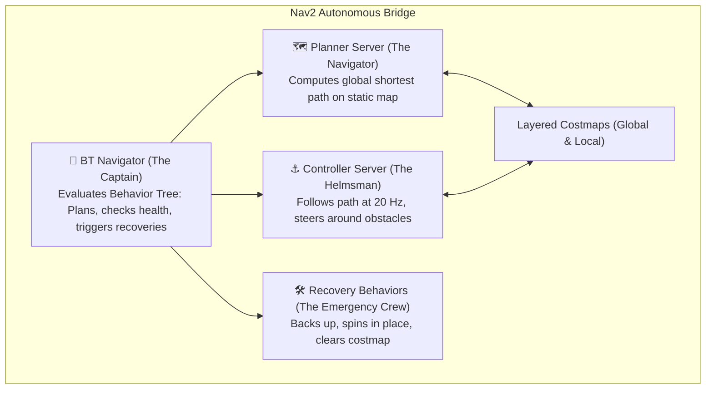
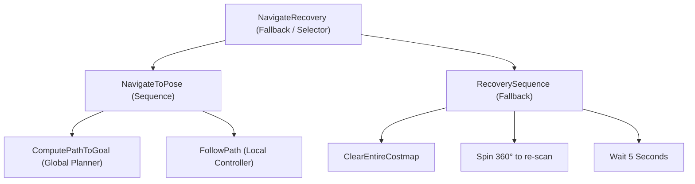

# Unit 9: Autonomous Navigation: SLAM & Path Planning
# Module 9.4: The ROS 2 Navigation Stack (Nav2 Architecture)

> **Prerequisites**: Module 9.1 (Occupancy Grids), Module 9.2 (SLAM), Module 9.3 (Path Planning), Unit 8 (ROS 2)  
> **Estimated Time**: 55 minutes  
> **Interactive Activity**: Commanding Nav2 Autonomous Waypoint Missions via Python BasicNavigator API  
> **Target Audience**: High School & College Students (Zero Prior Production Navigation Background)  

---

## 1. Learning Objectives

By the end of this module, you will be able to:
- [ ] **Deconstruct** the architecture of the **ROS 2 Navigation Framework (Nav2)** into its core server subsystems [^1] [^2].
- [ ] **Explain** how **Behavior Trees (BT)** orchestrate navigation workflows, replanning loops, and autonomous recovery behaviors [^1].
- [ ] **Configure** the multi-layered Costmap2D architecture (Static, Obstacle, and Inflation layers) [^1].
- [ ] **Command** point-to-point autonomous missions in Python using the `BasicNavigator` API [^1].
- [ ] **Diagnose** lifecycle state machine errors and uninitialized AMCL initial pose failures [^1] [^2].

---

## 2. Intuitive Big Picture: The Ship's Autonomous Bridge

Building an autonomous mobile robot without a framework is like asking a single captain to steer the ship, shovel coal into the boilers, check the nautical charts, scan the horizon for icebergs, and fix engine breakdowns all at the exact same second.

In commercial robotics, engineers don't write navigation from scratch. They use **Nav2**—the battle-tested, open-source navigation stack powering hundreds of thousands of robots worldwide [^1] [^2]:



By decoupling path calculation, motor control, obstacle inflation, and recovery logic into dedicated servers, Nav2 achieves bulletproof industrial reliability [^1]!

---

## 3. The Core Nav2 Architecture

### 3.1 Behavior Trees: Beyond Fragile `if/else` Statements

Why does Nav2 use **Behavior Trees (BT)** instead of standard Python `if/else` loops or Finite State Machines (`nav2-architecture.svg`) [^1]?
- In a classic state machine with 10 states (Driving, Avoiding, Stuck, Turning...), adding one new recovery behavior requires drawing dozens of complicated transition arrows. It quickly becomes an unmaintainable "spaghetti" mess.
- A **Behavior Tree** structures decision-making hierarchically [^1]:



1. **Fallback (Selector, `?`)**: Tries the first child. If it succeeds, the Fallback succeeds. If it fails, it gracefully falls back to the next child (e.g., if driving fails, trigger recovery!).
2. **Sequence (`->`)**: Executes children sequentially. If any step fails, the sequence terminates immediately.

If someone pushes a cart in front of the robot, the local controller reports failure. The Behavior Tree instantly triggers:
1. Recompute global path around cart.
2. If blocked, clear temporary costmap noise.
3. If still blocked, back up $0.5\text{ m}$ and spin $360^\circ$!
4. If still blocked, halt and send an alert to human supervisors [^1]!

---

### 3.2 The Core Server Modules

Nav2 breaks navigation into specialized ROS 2 Action servers [^1]:

1. **BT Navigator (`bt_navigator`)**: Coordinates the high-level mission by executing the behavior tree XML script.
2. **Planner Server (`planner_server`)**: Generates the global geometric path from start to goal. Standard plugins include:
   - `NavfnPlanner`: Traditional Dijkstra / $A^*$ grid search.
   - `SmacPlanner`: Hybrid-$A^*$ planning respecting car-like minimum turning radii.
3. **Controller Server (`controller_server`)**: Takes the global path and outputs real-time `/cmd_vel` velocity commands. Standard plugins include:
   - `DWBController`: Modern Dynamic Window Approach implementation.
   - `MPPIController`: Model Predictive Path Integral controller (GPU-accelerated optimization).
4. **Behavior Server (`behavior_server`)**: Executes physical recovery maneuvers (`Spin`, `BackUp`, `Wait`).
5. **Costmap 2D (`global_costmap` and `local_costmap`)**: Maintains multi-layered 2D obstacle grids:
   - **Static Layer**: Permanent walls from SLAM map.
   - **Obstacle Layer**: Live dynamic obstacles detected by 2D LiDAR.
   - **Inflation Layer**: Exponential safety buffer around obstacles [^1].

---

### 3.3 Managed Lifecycle Nodes

Every major node in Nav2 is a **ROS 2 Managed Lifecycle Node** [^1] [^2]:
- In standard ROS 1, nodes started publishing messages before sensors were fully initialized, causing crashes.
- Lifecycle nodes have explicit deterministic states:
  $$\text{Unconfigured} \xrightarrow{\text{configure()}} \text{Inactive} \xrightarrow{\text{activate()}} \text{Active}$$
- A node cannot publish motor commands until all sensors and costmaps are verified active [^1]!

---

## 4. Practical Hands-On: Commanding Missions with the Python `BasicNavigator` API

Nav2 provides a clean, elegant Python interface (`BasicNavigator`) allowing developers to command complex waypoint missions in just a few lines of code [^1]:

```python
"""
Instructabot Module 9.4: Nav2 Mission Commander
Dispatches autonomous navigation goals and monitors execution.
Requires: ros-humble-nav2-simple-commander
"""

import time
import rclpy
from geometry_msgs.msg import PoseStamped
from nav2_simple_commander.robot_navigator import BasicNavigator, TaskResult

def main():
    # 1. Initialize ROS 2 and Nav2 Simple Commander
    rclpy.init()
    nav = BasicNavigator()

    # 2. Wait for Nav2 Lifecycle to become fully active
    print("⏳ Waiting for Nav2 stack to become active...")
    nav.waitUntilNav2Active()
    print("✅ Nav2 is active and ready for autonomous missions!")

    # 3. Define Target Navigation Goal (e.g., Loading Dock A at x=3.5m, y=2.0m)
    goal_pose = PoseStamped()
    goal_pose.header.frame_id = 'map'
    goal_pose.header.stamp = nav.get_clock().now().to_msg()
    goal_pose.pose.position.x = 3.5
    goal_pose.pose.position.y = 2.0
    goal_pose.pose.orientation.w = 1.0  # Facing forward along +X

    # 4. Dispatch Navigation Goal to Nav2 Action Server
    print(f"🚀 Dispatching Robot to Goal: ({goal_pose.pose.position.x}, {goal_pose.pose.position.y})...")
    nav.goToPose(goal_pose)

    # 5. Monitor Mission Progress & Feedback Loop
    while not nav.isTaskComplete():
        feedback = nav.getFeedback()
        if feedback:
            print(
                f"   [Nav2 Progress] Distance Remaining: {feedback.distance_remaining:4.2f}m | "
                f"Time Elapsed: {feedback.navigation_time.sec}s"
            )
        time.sleep(1.0)

    # 6. Evaluate Final Mission Result
    result = nav.getResult()
    if result == TaskResult.SUCCEEDED:
        print("🎯 MISSION ACCOMPLISHED! Robot reached goal pose successfully.")
    elif result == TaskResult.CANCELED:
        print("⚠️ Mission was canceled by user/supervisor.")
    elif result == TaskResult.FAILED:
        print("❌ Mission failed! Path was blocked and recovery behaviors exhausted.")

    rclpy.shutdown()

if __name__ == '__main__':
    main()
```

---

## 5. Troubleshooting & Nav2 Pitfalls

> [!WARNING]
> **Pitfall 1: Sending Goals Before Initializing AMCL Pose**  
> If you start Nav2 with a pre-saved map and immediately command `goToPose()`, Nav2 will reject the goal! AMCL does not know where the robot started. You must first set the initial estimate via RViz's **2D Pose Estimate** button or publish to the `/initialpose` topic (`geometry_msgs/msg/PoseWithCovarianceStamped`) [^1].

> [!WARNING]
> **Pitfall 2: Local Costmap Obstacle Clearing Failures**  
> If a human walks in front of the robot, the obstacle layer marks that cell as lethal (Cost = 254). When the human walks away, that cell should be cleared by laser rays. If the sensor's `clearing: true` parameter is missing in `nav2_params.yaml`, the ghost obstacle remains permanently in the costmap, preventing the robot from ever driving through [^1]!

---

## 6. Real-World Applications & Next Steps

Nav2 is deployed across diverse industrial sectors:
- **Autonomous Mobile Robots (AMRs)**: Moving pallets across giant automotive assembly plants (BMW, Tesla).
- **Hospital Disinfection**: Ultraviolet-C sanitizing robots patrolling hospital corridors autonomously overnight.
- **Airport Baggage Handling**: Fleet of autonomous tugs moving passenger luggage between aircraft ramps and terminals.

In **Lab 9: Autonomous Warehouse Delivery Challenge**, you will bring together 2D LiDAR SLAM, occupancy grid mapping, costmaps, and Nav2 waypoint navigation inside a simulated industrial warehouse!

---

## 7. Sources & Media Provenance

### Cited References
[^1]: **Steven Macenski, Nav2 Working Group**, *"Nav2 (ROS 2 Navigation Framework) Official Documentation: Architecture, Simple Commander, & Behavior Trees"*, Open Navigation LLC / Open Robotics. License: Apache License 2.0. Available: [Nav2 Documentation](https://navigation.ros.org/).  
[^2]: **Steven Macenski, Tully Foote, Brian Gerkey, Michael Carroll, Dirk Thomas**, *"Robot Operating System 2: Design, architecture, and uses in the wild"*, Science Robotics, Vol. 7, No. 66. Available: [Science Robotics ROS 2 Article](https://www.science.org/doi/10.1126/scirobotics.abm6074).  
[^3]: **Sebastian Thrun, Wolfram Burgard, Dieter Fox**, *"Probabilistic Robotics (Chapter 10: Robot Navigation)"*, MIT Press. Available: [MIT Press Probabilistic Robotics](https://mitpress.mit.edu/9780262015356/probabilistic-robotics/).

### Media Manifest
| Asset Name | Media Type | Source / Repository | License | Attribution |
| :--- | :--- | :--- | :--- | :--- |
| `nav2-architecture.svg` | Vector Graphic / Architecture | Instructabot Educational Team | CC BY-SA 4.0 | Instructabot Project [^1] [^2] |
| `a-star-costmap.svg` | Vector Graphic / Architecture | Instructabot Educational Team | CC BY-SA 4.0 | Instructabot Project [^1] |
| `ros2-computation-graph.svg` | Vector Graphic | Instructabot Educational Team | CC BY 3.0 | Instructabot Project [^2] |

---

## 🧭 Lesson Navigation

| ⬅️ Previous Lesson | 🗺️ Course Hub | ➡️ Next Lesson |
| :--- | :---: | ---: |
| [← Module 9.3: Path Planning & Costmaps ($A^*$, C-Space, DWA)](03-path-planning-and-costmaps.md) | [**Master Syllabus**](../SYLLABUS.md) • [**Getting Started**](../GETTING_STARTED.md) | [**Lab 9: Autonomous Warehouse Delivery Challenge →**](lab-09-autonomous-warehouse-nav2.md) |
