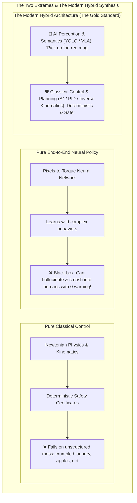

# Unit 10: State of the Art: Modern AI, Foundation Models, & Sim2Real
# Module 10.1: Classical Control vs. Machine Learning in Robotics

> **Prerequisites**: Units 4, 5, 6 (Classical Control & Kinematics), Unit 7 (Computer Vision), Unit 9 (Navigation)  
> **Estimated Time**: 50 minutes  
> **Interactive Activity**: Benchmarking Deterministic Kinematics vs. Neural Approximators in Python  
> **Target Audience**: High School & College Students (Zero Prior Deep Learning Background)  

---

## 1. Learning Objectives

By the end of this module, you will be able to:
- [ ] **Critique** the architectural debate between pure Classical Control and pure End-to-End Deep Learning in robotics [^1] [^2].
- [ ] **Identify** the distinct operational domains where classical physics models excel versus where neural perception is mandatory [^1] [^3].
- [ ] **Explain** why safety-critical robotic deployments rely on **Hybrid Architectures**: AI-driven semantic perception paired with mathematically certified deterministic control [^1] [^2].
- [ ] **Analyze** the failure modes of black-box neural policies, including distribution shift and adversarial vulnerability [^2] [^4].

---

## 2. Intuitive Big Picture: The Two Extreme Camps

In modern robotics engineering, two philosophical factions often clash:

1. **The Classical Purist Camp**:  
   *"Everything in robotics can be modeled with Newton-Euler equations, linear algebra, and Kalman filters. If you understand the mass, friction, and kinematics, you don't need a single neural network!"*
2. **The Deep Learning Maximalist Camp**:  
   *"Physics equations are a crude approximation of reality. Just point a camera at the scene, feed pixels into a billion-parameter Transformer, and output motor voltages directly!"*



The greatest robotic systems built today—from surgical da Vinci robots to autonomous Waymo cars—are neither purely classical nor purely end-to-end. They are **Hybrid Architectures** (`classical-vs-ai.svg`) [^1] [^2]!

---

## 3. The Core Concept Explained

### 3.1 Where Classical Control Reigns Supreme

Classical engineering (Units 4, 5, 6, 8, 9) is built on hundreds of years of rigorous mathematical physics [^1]:
- **Deterministic Guarantees**: A PID controller (Module 6.3) or Control Barrier Function (CBF) can be proven mathematically to *never* exceed a safe boundary.
- **Microsecond Compute Speed**: Calculating inverse kinematics (Module 5.3) requires a few trigonometric operations, executing in under $0.001\text{ ms}$ on a \$5 microcontroller.
- **Zero Training Data Required**: You do not need to collect 100,000 video demonstrations to make a wheel spin at $50\text{ RPM}$; you simply apply Ohm's Law and closed-loop feedback!

```
Classical Strengths:
✅ High-frequency motor loops (1,000 Hz)
✅ Hard real-time safety & emergency stops
✅ Known, rigid physical kinematics
```

---

### 3.2 Where Deep Learning Is Irreplaceable

Where does classical control fall flat on its face? In the **unstructured, unpredictable real world** [^1] [^3]:
- **The Folded Towel Problem**: Try writing a physics equation describing the exact geometry of a crumpled, soft bath towel thrown on the floor. It is mathematically intractable!
- **Semantic Understanding**: A LiDAR scan sees a cloud of distance dots. It cannot tell you if that cluster of dots is a solid concrete barrier or an empty cardboard box that can be safely nudged aside.
- **Open-World Generalization**: A deep neural network trained on millions of web images can recognize cups, shoes, oranges, and books it has never encountered in its training environment [^3] [^4].

```
Deep Learning Strengths:
✅ Open-world semantic object detection
✅ Deformable object manipulation (textiles, food, plants)
✅ Natural language reasoning & high-level mission tasking
```

---

### 3.3 The Comparative Architectural Matrix

| Metric | Classical Modular Stack | End-to-End Neural Policy | Modern Hybrid Stack |
| :--- | :--- | :--- | :--- |
| **Primary Approach** | Explicit physical equations ($F=ma$, $A^*$, PID). | Deep Neural Net ($\text{Pixels} \to \text{Motor Torques}$). | Neural Perception $\to$ Classical Motion Planning. |
| **Explainability** | $100\%$ White-box (audit every equation). | $0\%$ Black-box (billions of uninterpretable weights). | High: Clear boundaries between semantic intent and actuation. |
| **Safety Certification** | Provable stability margins (ISO 13849 / ISO 26262). | Cannot be formally safety certified. | **Fully certifiable**: Classical safety barrier overrides neural intent. |
| **Generalization** | Brittle in novel unstructured environments. | Handles diverse visual textures and clutter. | Combines visual robustness with geometric precision. |

---

## 4. Practical Hands-On: Deterministic Math vs. Neural Approximator

Let's compare the precision and reliability of analytical trigonometry against a small neural network predicting 2-link robotic arm kinematics (Module 5.3) [^1]:

```python
"""
Instructabot Module 10.1: Deterministic Trigonometry vs. Neural Prediction
Demonstrating why safety-critical robotics preserves classical mathematical cores.
"""

import math
import numpy as np

# 1. Deterministic Analytical Forward Kinematics (Module 5.3)
def analytical_fk(theta1_deg, theta2_deg, L1=1.0, L2=1.0):
    """Computes exact end-effector (X, Y) via pure trigonometry."""
    t1 = math.radians(theta1_deg)
    t2 = math.radians(theta2_deg)
    x = L1 * math.cos(t1) + L2 * math.cos(t1 + t2)
    y = L1 * math.sin(t1) + L2 * math.sin(t1 + t2)
    return x, y

# 2. Simulated Neural Network Predictor (Trained on noisy samples)
class MockNeuralKinematics:
    def __init__(self):
        # Neural networks approximate non-linear functions with slight residual error
        self.noise_std = 0.015  # 1.5 cm average error

    def predict(self, theta1_deg, theta2_deg):
        true_x, true_y = analytical_fk(theta1_deg, theta2_deg)
        # Add slight neural approximation error
        pred_x = true_x + np.random.normal(0, self.noise_std)
        pred_y = true_y + np.random.normal(0, self.noise_std)
        return pred_x, pred_y

# 3. Benchmark Execution
nn_model = MockNeuralKinematics()
test_joint_angles = [(0, 0), (45, 45), (90, -45), (30, 60)]

print("🔬 Kinematic Execution Benchmark:")
print("=" * 65)
print(f"{'Joints (θ1, θ2)':16s} | {'Analytical (Exact)':20s} | {'Neural (Approx)':20s}")
print("=" * 65)

for t1, t2 in test_joint_angles:
    exact_x, exact_y = analytical_fk(t1, t2)
    pred_x, pred_y = nn_model.predict(t1, t2)
    error_mm = math.hypot(exact_x - pred_x, exact_y - pred_y) * 1000.0

    print(f"({t1:2d}°, {t2:2d}°)         | ({exact_x:+5.3f}, {exact_y:+5.3f}) m      | ({pred_x:+5.3f}, {pred_y:+5.3f}) m (Δ={error_mm:4.1f}mm)")

print("=" * 65)
print("💡 Conclusion: Use Analytical equations for joint math (0.0mm error)!")
print("   Reserve Neural Networks for semantic perception where formulas don't exist.")
```

---

## 5. Troubleshooting & AI Robotics Pitfalls

> [!WARNING]
> **Pitfall 1: Distribution Shift (The Catastrophic Out-of-Distribution Error)**  
> If an end-to-end robotic policy is trained exclusively in a laboratory with white fluorescent lighting, running it in an office with afternoon yellow sunlight can cause the neural network to output erratic, dangerous motor commands! Neural networks do not "know what they do not know" [^2] [^4].

> [!WARNING]
> **Pitfall 2: Bypassing Low-Level Safety Governors**  
> Never wire deep learning outputs directly to high-power motor drivers. Always route AI-commanded velocities through a classical **Safety Filter / Velocity Governor** that strictly enforces physical limits on maximum acceleration, obstacle proximity, and emergency stops [^1] [^2]!

---

## 6. Real-World Applications & Next Steps

This hybrid synergy powers the cutting edge of industrial and consumer robotics:
- **Autonomous Driving (Waymo / Zoox)**: Deep neural networks process camera and LiDAR feeds to detect pedestrians, cyclists, and traffic signals; classical convex optimization and model predictive control (MPC) plan the vehicle's steering and braking trajectory.
- **Surgical Robotics**: AI highlights anatomical structures (arteries, nerves) on endoscopic video; deterministic software locks the robotic scalpel within virtual safety zones to prevent accidental incisions.
- **Warehouse Logistics**: Neural vision models classify package labels and item geometries; classical motion planning guides 6-DOF industrial robot arms to pack pallets without collisions.

In **Module 10.2: Deep Learning Object Detection (YOLO) for Robots**, we will deploy **YOLO** (You Only Look Once) to enable our robot to recognize 80 classes of physical objects in real time!

---

## 7. Sources & Media Provenance

### Cited References
[^1]: **Steven Macenski, Tully Foote, Brian Gerkey, Michael Carroll, Dirk Thomas**, *"Robot Operating System 2: Design, architecture, and uses in the wild"*, Science Robotics, Vol. 7, No. 66. Available: [Science Robotics ROS 2 Article](https://www.science.org/doi/10.1126/scirobotics.abm6074).  
[^2]: **Anthony Brohan, Noah Brown, Justice Carbajal, Yevgen Chebotar, Google DeepMind Team**, *"RT-2: Vision-Language-Action Models Transfer Web Knowledge to Robotic Control"*, Conference on Robot Learning (CoRL 2023). Available: [Robotics Transformer 2 Website](https://robotics-transformer2.github.io/).  
[^3]: **Cheng Chi, Siyuan Feng, Yilun Du, Zhenjia Xu, Eric Cousineau, Benjamin Burchfiel, Shuran Song**, *"Diffusion Policy: Visuomotor Policy Learning via Action Diffusion"*, Robotics: Science and Systems (RSS 2023). Available: [Diffusion Policy Website](https://diffusion-policy.cs.columbia.edu/).  
[^4]: **Josh Tobin, Rachel Fong, Alex Ray, Jonas Schneider, Wojciech Zaremba, Pieter Abbeel**, *"Domain Randomization for Transferring Deep Neural Networks from Simulation to the Real World"*, IEEE IROS 2017. Available: [ArXiv Publication](https://arxiv.org/abs/1703.06907).

### Media Manifest
| Asset Name | Media Type | Source / Repository | License | Attribution |
| :--- | :--- | :--- | :--- | :--- |
| `classical-vs-ai-robotics` | Vector Graphic / Architecture | Instructabot Educational Team | CC BY-SA 4.0 | Instructabot Project [^1] [^2] |
| `five-subsystems-flow.svg` | Vector Diagram | Instructabot Educational Team | CC BY-SA 4.0 | Instructabot Project |
| `opencv-pipeline.svg` | Vector Flowchart | Instructabot Educational Team | CC BY-SA 4.0 | Instructabot Project |

---

## 🧭 Lesson Navigation

| ⬅️ Previous Lesson | 🗺️ Course Hub | ➡️ Next Lesson |
| :--- | :---: | ---: |
| [← Lab 9: Autonomous Warehouse Delivery Challenge](../unit-09-autonomous-navigation/lab-09-autonomous-warehouse-nav2.md) | [**Master Syllabus**](../SYLLABUS.md) • [**Getting Started**](../GETTING_STARTED.md) | [**Module 10.2: Deep Learning Object Detection (YOLO) for Robots →**](02-deep-learning-object-detection-yolo.md) |
