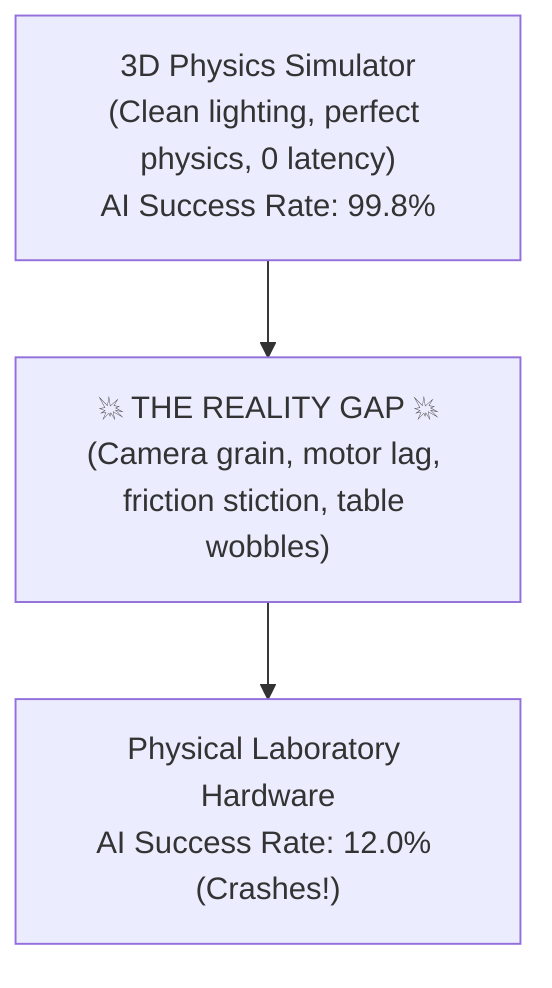
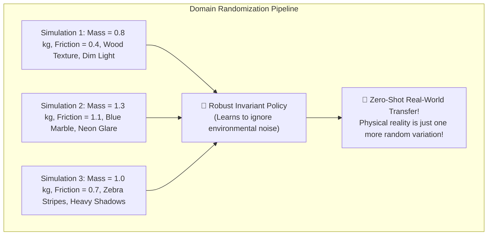

# Unit 10: State of the Art: Modern AI, Foundation Models, & Sim2Real
# Module 10.3: Simulation-to-Real (Sim2Real) Transfer & Domain Randomization

> **Prerequisites**: Module 6.4 (Webots Physics Simulators), Module 10.1 (Classical vs. AI), Module 10.2 (YOLO)  
> **Estimated Time**: 50 minutes  
> **Interactive Activity**: Building a Physics & Visual Domain Randomizer in Python  
> **Target Audience**: High School & College Students (Zero Prior Sim2Real Experience)  

---

## 1. Learning Objectives

By the end of this module, you will be able to:
- [ ] **Define** the **Reality Gap** and explain why neural policies trained in 3D physics simulators fail when deployed on real physical robots [^1] [^2].
- [ ] **Analyze** the two primary categories of reality gap discrepancies: **Visual Discrepancy** (rendering vs. photons) and **Dynamics Discrepancy** (ODE physics vs. physical contact mechanics) [^1] [^2].
- [ ] **Formulate** the technique of **Domain Randomization** as an invariance learning strategy (`domain-randomization.svg`) [^1].
- [ ] **Implement** a programmatic domain randomizer in Python that perturbs mass, surface friction, communication latency, and visual textures [^1] [^3].
- [ ] **Differentiate** between Domain Randomization, System Identification (SysID), and Domain Adaptation [^1] [^2].

---

## 2. Intuitive Big Picture: The Flawless Virtual World

Imagine training an AI agent inside a simulated robotics environment:
- You train the robot across 50,000,000 simulated attempts in Webots or Isaac Sim.
- Inside the simulator, the robot learns to pick up soda cans with **$99.8\%$ accuracy**. It never drops a single can!
- Proud of your AI, you download the neural weights onto a real physical robotic arm in your laboratory.
- You place a real soda can on the table and hit run.
- **The robot swings past the can, knocks it across the room, smashes into the table, and strips its gearbox!**



This heartbreaking failure is known as the **Sim2Real Problem (Simulation-to-Real)** [^1] [^2]. No simulator can ever model all the messy, microscopic quirks of the physical universe!

---

## 3. The Core Concept Explained

### 3.1 The Two Halves of the Reality Gap

Why do simulators lie to neural networks [^1] [^2]?

1. **Visual Discrepancy (The Rendering Gap)**:
   - In simulation, lighting follows clean mathematical approximations (Phong shading or ray-tracing).
   - In the real world, afternoon sunlight streams through window blinds, dust settles on camera lenses, and fluorescent bulbs flicker at $60\text{ Hz}$.
   - A neural network trained on clean virtual pixels sees real-world camera noise as completely foreign out-of-distribution input!

2. **Dynamics Discrepancy (The Physics Gap)**:
   - Simulators (Module 6.4) model contacts as rigid polygons with constant Coulomb friction.
   - Real rubber tires compress, deform, and heat up.
   - USB communication cables have stochastic latency jitter ($5\text{ ms} - 45\text{ ms}$).
   - Lithium batteries experience voltage drops under high motor load, altering available stall torque!

---

### 3.2 The OpenAI Solution: Domain Randomization

In 2017, Josh Tobin, Pieter Abbeel, and researchers at OpenAI proposed a counterintuitive, brilliant breakthrough [^1]:
> *"Do not try to make the simulator look like the real world. Instead, make the simulator look completely crazy, bizarre, and wildly randomized!"*

If you train a robot in a simulator where the table texture changes every 10 seconds—from neon zebra stripes, to pink polka dots, to dark wood—and the lighting angle shifts randomly from green to purple, the neural network learns:
> *"The texture of the table and the color of the light are completely irrelevant. The only invariant feature that matters is the 3D geometry of the object!"*



Because physical reality falls somewhere within the wide envelope of randomized simulations, the policy transfers to physical hardware **with zero real-world training ("Zero-Shot Transfer")** (`domain-randomization.svg`) [^1]!

---

## 4. Practical Hands-On: A Programmatic Domain Randomizer in Python

Here is how robotics researchers inject randomized physics and visual parameters into simulation training loops [^1] [^3]:

```python
"""
Instructabot Module 10.3: Sim2Real Physics & Visual Domain Randomizer
Generates randomized environment configurations for robust policy training.
"""

import random
import numpy as np

class DomainRandomizer:
    def __init__(self):
        # Baseline Nominal Physical Parameters (e.g., e-puck or robotic arm link)
        self.nominal_mass_kg = 0.500         # 500 grams
        self.nominal_friction_coeff = 0.70   # Rubber on wood
        self.nominal_latency_s = 0.015       # 15 ms motor control lag
        self.nominal_camera_fov_deg = 60.0

    def randomize_environment(self, episode_id):
        """Generates a randomized physical and visual world configuration."""
        # 1. Randomize Dynamics & Physics Parameters
        # Mass variation: +/- 25%
        random_mass = self.nominal_mass_kg * random.uniform(0.75, 1.25)
        
        # Surface friction variation: +/- 50%
        random_friction = self.nominal_friction_coeff * random.uniform(0.50, 1.50)
        
        # Communication latency variation: 5 ms to 45 ms
        random_latency = random.uniform(0.005, 0.045)

        # 2. Randomize Visual Sensor Parameters
        # Random lighting color (RGB tint multiplier)
        light_color = [round(random.uniform(0.6, 1.4), 2) for _ in range(3)]
        
        # Random table texture style
        textures = ['checkerboard', 'brushed_aluminum', 'dark_granite', 'white_plastic', 'wood_grain']
        chosen_texture = random.choice(textures)

        # Camera Field of View jitter: +/- 5 degrees
        random_fov = self.nominal_camera_fov_deg + random.uniform(-5.0, 5.0)

        env_config = {
            'episode': episode_id,
            'mass_kg': round(random_mass, 3),
            'friction_mu': round(random_friction, 2),
            'control_latency_ms': round(random_latency * 1000.0, 1),
            'camera_fov': round(random_fov, 1),
            'light_tint_rgb': light_color,
            'surface_texture': chosen_texture
        }
        return env_config

randomizer = DomainRandomizer()

print("🎲 Sim2Real Domain Randomization Matrix (5 Sample Training Episodes):")
print("=" * 78)
for ep in range(1, 6):
    cfg = randomizer.randomize_environment(ep)
    print(f"Episode {cfg['episode']}: Mass: {cfg['mass_kg']}kg | Friction μ: {cfg['friction_mu']} | "
          f"Lag: {cfg['control_latency_ms']:4.1f}ms | FOV: {cfg['camera_fov']}° | Texture: {cfg['surface_texture']}")
print("=" * 78)
print("✅ Training across these diverse permutations makes the neural policy immune to real-world deviations!")
```

---

## 5. Troubleshooting & Sim2Real Pitfalls

> [!WARNING]
> **Pitfall 1: Over-Randomization (The Impossible Task)**  
> If you randomize parameters too aggressively (e.g., varying mass by $\pm 500\%$ or setting friction to $0.01$), the physical task becomes physically impossible to solve! The neural network will fail to converge on any working policy. Always center random distributions around realistic physical hardware bounds [^1].

> [!WARNING]
> **Pitfall 2: Neglecting Actuator Backlash & Gear Stiction**  
> Beginners often randomize only link mass and surface friction, but forget about gearbox mechanics. In real hardware, gear backlash (Module 5.2) causes a $5\text{ ms} - 10\text{ ms}$ dead-zone whenever a motor reverses direction. If your simulator models instantaneous velocity reversals without backlash, real motors will oscillate violently [^1] [^2]!

---

## 6. Real-World Applications & Next Steps

Domain randomization made history at OpenAI and across modern robotics:
- **OpenAI DALL-E & Dactyl**: Successfully solved a physical Rubik's Cube with a 24-DOF humanoid robotic hand trained entirely in simulation with domain randomization.
- **Quadruped Locomotion (ANYbotics / Boston Dynamics)**: Robot dogs learn to walk across slippery ice, muddy hills, and loose gravel by training against millions of randomized terrain physics profiles.
- **Drone Racing**: Autonomous quadcopters navigate high-speed obstacle courses at $60\text{ mph}$ using vision policies trained under randomized lighting and wind gust forces.

In **Module 10.4: Vision-Language-Action (VLA) & Foundation Models in Robotics**, we will explore the frontier of AI: how multi-billion parameter foundation models allow robots to follow complex natural language instructions!

---

## 7. Sources & Media Provenance

### Cited References
[^1]: **Josh Tobin, Rachel Fong, Alex Ray, Jonas Schneider, Wojciech Zaremba, Pieter Abbeel**, *"Domain Randomization for Transferring Deep Neural Networks from Simulation to the Real World"*, IEEE/RSJ International Conference on Intelligent Robots and Systems (IROS 2017). Available: [ArXiv Publication](https://arxiv.org/abs/1703.06907).  
[^2]: **Anthony Brohan, Noah Brown, Justice Carbajal, Yevgen Chebotar, Google DeepMind Team**, *"RT-2: Vision-Language-Action Models Transfer Web Knowledge to Robotic Control"*, Conference on Robot Learning (CoRL 2023). Available: [Robotics Transformer 2 Website](https://robotics-transformer2.github.io/).  
[^3]: **Cheng Chi, Siyuan Feng, Yilun Du, Zhenjia Xu, Eric Cousineau, Benjamin Burchfiel, Shuran Song**, *"Diffusion Policy: Visuomotor Policy Learning via Action Diffusion"*, Robotics: Science and Systems (RSS 2023). Available: [Diffusion Policy Website](https://diffusion-policy.cs.columbia.edu/).

### Media Manifest
| Asset Name | Media Type | Source / Repository | License | Attribution |
| :--- | :--- | :--- | :--- | :--- |
| `domain-randomization-sim2real` | Vector Graphic / Architecture | Instructabot Educational Team | CC BY-SA 4.0 | Instructabot Project [^1] |
| `classical-vs-ai-robotics` | Vector Graphic | Instructabot Educational Team | CC BY-SA 4.0 | Instructabot Project [^2] |
| `webots-scene-tree.svg` | Vector Graphic | Instructabot Educational Team | Apache License 2.0 | Instructabot Project |

---

## 🧭 Lesson Navigation

| ⬅️ Previous Lesson | 🗺️ Course Hub | ➡️ Next Lesson |
| :--- | :---: | ---: |
| [← Module 10.2: Deep Learning Object Detection (YOLO) for Robots](02-deep-learning-object-detection-yolo.md) | [**Master Syllabus**](../SYLLABUS.md) • [**Getting Started**](../GETTING_STARTED.md) | [**Module 10.4: Vision-Language-Action (VLA) & Foundation Models in Robotics →**](04-vla-foundation-models.md) |
