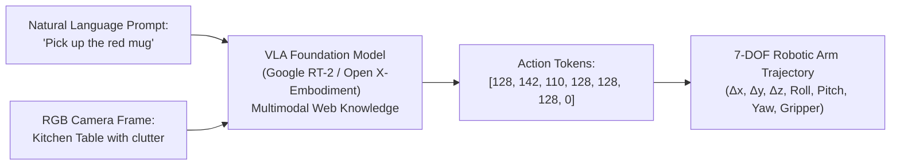

# Unit 10: State of the Art: Modern AI, Foundation Models, & Sim2Real
# Module 10.4: Vision-Language-Action (VLA) & Foundation Models in Robotics

> **Prerequisites**: Module 10.1 (Classical vs. AI), Module 10.2 (YOLO Detection), Module 10.3 (Sim2Real)  
> **Estimated Time**: 55 minutes  
> **Interactive Activity**: Simulating Action Tokenization & Multimodal Semantic Reasoning in Python  
> **Target Audience**: High School & College Students (Zero Prior Large Language Model Robotics Background)  

---

## 1. Learning Objectives

By the end of this module, you will be able to:
- [ ] **Trace** the evolution of AI models from Large Language Models (LLMs) to Vision-Language Models (VLMs) and **Vision-Language-Action (VLA)** robotic foundation models [^1].
- [ ] **Deconstruct** how models like Google DeepMind's **RT-1** and **RT-2** tokenize 6-DOF end-effector actions and gripper states directly into the language model vocabulary (`vla-architecture.svg`) [^1].
- [ ] **Explain** the significance of the **Open X-Embodiment Dataset** in training cross-embodiment foundation policies across diverse physical robot platforms [^1] [^2].
- [ ] **Contrast** traditional deterministic regression with **Diffusion Policies** that capture multimodal human action distributions without averaging traps [^3].
- [ ] **Implement** an action token decoding pipeline in Python that translates multimodal tokens into continuous 3D spatial waypoints [^1].

---

## 2. Intuitive Big Picture: Talking to a Robot

Imagine walking into a room and saying to an assistant:
> *"I just spilled my soda on the table. Could you help clean it up?"*

A human immediately understands:
1. "Spilled soda" implies sticky liquid on a surface.
2. Cleaning requires finding a paper towel or sponge (not a hammer or a shoe).
3. The sponge must be brought to the table and pressed down gently.



Before 2023, commanding a robot required typing hardcoded $(x, y, z)$ Cartesian coordinates into a Python script. Today, **Vision-Language-Action (VLA) Foundation Models** allow robots to inherit the vast reasoning knowledge of the internet, connecting high-level human words to physical motor actions [^1]!

---

## 3. The Core Concept Explained

### 3.1 What Is a Vision-Language-Action (VLA) Model?

To understand a VLA model, observe the three generational leaps of artificial intelligence [^1]:
1. **Large Language Models (LLMs)**: Input = Text $\to$ Output = Text (ChatGPT, Gemini). They understand grammar, philosophy, and code, but are completely blind to the physical world.
2. **Vision-Language Models (VLMs)**: Input = Text + Images $\to$ Output = Text (GPT-4o, PaLM-E). They can look at a photo and say: *"There is a red apple on the wooden table."* But they cannot move a motor.
3. **Vision-Language-Action Models (VLAs)**: Input = Text + Images $\to$ Output = **Physical Robot Motor Actions** (`vla-architecture.svg`) [^1]!

---

### 3.2 The Google DeepMind RT-2 Breakthrough: Action Tokenization

How can a text-generating Transformer move a physical robotic arm?

In 2023, researchers at Google DeepMind unveiled **Robotics Transformer 2 (RT-2)** [^1]. Instead of inventing a completely new architecture, they performed an ingenious trick: **they converted physical robot movements into text words!**

A 7-DOF robotic arm action consists of 7 continuous numbers:
$$\mathbf{a}_t = [\Delta x, \Delta y, \Delta z, \Delta \text{roll}, \Delta \text{pitch}, \Delta \text{yaw}, \text{gripper\_open\_close}]$$

RT-2 discretizes each continuous range into 256 discrete integer bins (from $0$ to $255$). These 256 numbers are added directly to the language model's dictionary alongside standard words [^1]:

```text
User: "Pick up the blue towel" + [Camera Frame]
RT-2 Model Output: "128 145 92 128 130 128 255"
```
The robot parses those numbers, converts them back into metric millimeters and radians, and sends them to its motor controllers! By co-fine-tuning on both internet text and robotic demonstration trajectories, the model can reason semantically: it knows that an energy drink is a "can", and that a rock is heavy [^1]!

---

### 3.3 The Multimodal Action Dilemma & Diffusion Policies

Why does standard supervised learning fail when learning complex manipulation from human demonstrations?

Imagine a robot approaching an obstacle:
- Operator A avoids the obstacle by steering **Left**.
- Operator B avoids the obstacle by steering **Right**.
- Both choices are 100% valid!

If you train a standard neural network with Mean Squared Error (MSE) loss, the network averages Operator A and Operator B:
$$\text{Average Action} = \frac{\text{Steer Left} + \text{Steer Right}}{2} = \text{Drive Straight into the Obstacle!}$$

To solve this, Cheng Chi and researchers at Columbia/MIT developed **Diffusion Policy** [^3]:
- Instead of predicting a single deterministic average, the network uses a **generative diffusion process** (the same math behind Stable Diffusion image generators) to iteratively denoise random Gaussian vectors into smooth, multimodal action trajectories.
- The robot cleanly commits to either the Left trajectory or the Right trajectory, mastering complex tasks like peeling carrots, folding clothes, and inserting USB plugs [^3]!

---

## 4. Practical Hands-On: Action Tokenization & Decoding in Python

Let's write a Python module that demonstrates how VLA models discretize physical actions and decode tokens into continuous metric trajectories [^1]:

```python
"""
Instructabot Module 10.4: VLA Action Tokenizer & Trajectory Decoder
Demonstrating how Vision-Language-Action models represent 7-DOF robotic motion.
"""

import numpy as np

class VLAActionTokenizer:
    def __init__(self, bins=256):
        self.bins = bins
        # Bounds for 7-DOF Delta Actions: [dx, dy, dz (m), droll, dpitch, dyaw (rad), gripper (0=closed, 1=open)]
        self.min_bounds = np.array([-0.05, -0.05, -0.05, -0.20, -0.20, -0.20, 0.0])
        self.max_bounds = np.array([+0.05, +0.05, +0.05, +0.20, +0.20, +0.20, 1.0])

    def continuous_to_tokens(self, action_vector):
        """Converts continuous physical action into discrete integer tokens [0, 255]."""
        # Normalize to [0, 1]
        norm = (action_vector - self.min_bounds) / (self.max_bounds - self.min_bounds)
        norm = np.clip(norm, 0.0, 1.0)
        # Discretize into integer bins
        tokens = np.round(norm * (self.bins - 1)).astype(int)
        return tokens.tolist()

    def tokens_to_continuous(self, tokens):
        """Decodes integer tokens [0, 255] back into metric physical action units."""
        tokens_arr = np.array(tokens, dtype=float)
        norm = tokens_arr / (self.bins - 1)
        action_vector = self.min_bounds + norm * (self.max_bounds - self.min_bounds)
        return action_vector

tokenizer = VLAActionTokenizer()

# 1. Simulate a physical desired action:
# Move forward +2.0 cm (+0.02m), lift up +3.5 cm (+0.035m), yaw right -0.10 rad, close gripper (0.0)
physical_action = np.array([0.020, 0.000, 0.035, 0.000, 0.000, -0.100, 0.0])

# 2. Tokenize into language model vocabulary tokens
action_tokens = tokenizer.continuous_to_tokens(physical_action)
token_string = " ".join(str(t) for t in action_tokens)

print(f"🤖 Continuous Physical Action:")
print(f"   ΔX={physical_action[0]:+5.3f}m, ΔY={physical_action[1]:+5.3f}m, ΔZ={physical_action[2]:+5.3f}m | "
      f"Yaw={physical_action[5]:+5.3f}rad | Gripper={physical_action[6]:.1f}")
print(f"\n📝 Tokenized Output (VLA Language Model Vocabulary Representation):")
print(f"   Tokens: [{token_string}]")

# 3. Decode back onto robot hardware
decoded_action = tokenizer.tokens_to_continuous(action_tokens)
reconstruction_error = np.max(np.abs(physical_action - decoded_action))

print(f"\n⚡ Decoded Hardware Action:")
print(f"   ΔX={decoded_action[0]:+5.3f}m, ΔY={decoded_action[1]:+5.3f}m, ΔZ={decoded_action[2]:+5.3f}m | "
      f"Yaw={decoded_action[5]:+5.3f}rad | Gripper={decoded_action[6]:.1f}")
print(f"   Max Discretization Quantization Error: {reconstruction_error * 1000.0:4.2f} mm (Sub-millimeter precision!)")
```

---

## 5. Troubleshooting & VLA Pitfalls

> [!WARNING]
> **Pitfall 1: Inference Latency vs. Dynamic Stability**  
> Massive multi-billion parameter VLA models run at $3\text{ Hz} - 5\text{ Hz}$ on powerful GPU workstations, whereas motor control loops require $500\text{ Hz} - 1,000\text{ Hz}$. If you attempt to control motors directly at $3\text{ Hz}$, the robot will shudder and jerk! VLA models must predict **action chunks / trajectory splines** that a fast low-level classical interpolator executes smoothly [^1] [^3].

> [!WARNING]
> **Pitfall 2: Semantic Prompt Ambiguity**  
> VLA models are sensitive to prompt phrasing. Telling a robot: *"Clear the desk"* might result in the robot sweeping an expensive laptop onto the floor because it considered the laptop "clutter"! Instructions should be explicit and grounded: *"Pick up the empty soda can and place it in the recycling bin"* [^1].

---

## 6. Real-World Applications & Next Steps

Foundation models are ushering in the era of general-purpose robotics:
- **General Household Assistive Robots**: Robots that can fold diverse laundry, empty dishwashers, and wipe counters guided by natural speech.
- **Flexible Manufacturing**: Rapidly re-tasking factory arms to assemble new products without writing thousands of lines of custom robot code.
- **Healthcare & Eldercare**: Mobile assistive robots fetching medications and opening doors for mobility-impaired patients.

You have now reached the summit of our curriculum! In our **Capstone Lab 10: Semantic Object Fetching & Sorting Pipeline**, you will integrate everything you have learned—from electricity, microcontrollers, and kinematics to OpenCV, ROS 2, and AI—to complete an autonomous semantic retrieval mission!

---

## 7. Sources & Media Provenance

### Cited References
[^1]: **Anthony Brohan, Noah Brown, Justice Carbajal, Yevgen Chebotar, Google DeepMind Team**, *"RT-2: Vision-Language-Action Models Transfer Web Knowledge to Robotic Control"*, Conference on Robot Learning (CoRL 2023). Available: [Robotics Transformer 2 Website](https://robotics-transformer2.github.io/).  
[^2]: **Open X-Embodiment Collaboration**, *"Open X-Embodiment: Robotic Learning Datasets and RT-X Models"*, arXiv:2310.08864 (2023). Available: [Open X-Embodiment Project](https://robotics-transformer-x.github.io/).  
[^3]: **Cheng Chi, Siyuan Feng, Yilun Du, Zhenjia Xu, Eric Cousineau, Benjamin Burchfiel, Shuran Song**, *"Diffusion Policy: Visuomotor Policy Learning via Action Diffusion"*, Robotics: Science and Systems (RSS 2023). Available: [Diffusion Policy Website](https://diffusion-policy.cs.columbia.edu/).

### Media Manifest
| Asset Name | Media Type | Source / Repository | License | Attribution |
| :--- | :--- | :--- | :--- | :--- |
| `vla-foundation-model-architecture` | Vector Graphic / Architecture | Instructabot Educational Team | CC BY-SA 4.0 | Instructabot Project [^1] |
| `classical-vs-ai-robotics` | Vector Graphic | Instructabot Educational Team | CC BY-SA 4.0 | Instructabot Project [^1] [^2] |
| `yolo-detection-grid.svg` | Vector Graphic | Instructabot Educational Team | CC BY-SA 4.0 | Instructabot Project |
