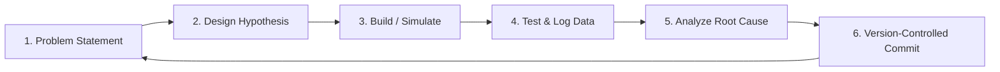

# Unit 0: The Robotic Mindset & Anatomy of Systems
# Module 0.3: Engineering Notebooks, Safety, and Ethics

> **Prerequisites**: Module 0.1 (What Makes a Robot a Robot?), Module 0.2 (The Five Subsystems)  
> **Estimated Time**: 40 minutes  
> **Interactive Activity**: The Pre-Flight Safety Audit & Git Engineering Log  
> **Target Audience**: High School & College Students (Zero Prior Engineering Experience)  

---

## 1. Learning Objectives

By the end of this module, you will be able to:
- [ ] **Maintain** a professional, version-controlled engineering notebook that documents hypotheses, iterations, test results, and design rationale [^1].
- [ ] **Identify** mechanical, electrical, and kinetic hazards in robotic systems according to international safety standards (ANSI/RIA R15.06-2012) [^2].
- [ ] **Safely manage** high-density energy storage, particularly Lithium Polymer (LiPo) batteries, preventing thermal runaway and irreversible degradation [^1].
- [ ] **Design** a hardwired Emergency Stop (E-Stop) architecture and distinguish it from an untrusted software pause [^2].
- [ ] **Apply** ethical frameworks (IEEE Ethically Aligned Design) to autonomous decision-making and societal impacts [^3].

---

## 2. Intuitive Big Picture: Software Has Mass

In web or app development, when your code encounters a runtime exception or crash, an error message prints to the console. You fix the syntax error, refresh the browser, and try again.

In robotics, **software controls physical mass, inertia, and high electrical current**.
- A typo in motor velocity calculation can drive a 50-pound metal robot off a workbench at 10 miles per hour.
- An inverted directional sign can twist a robotic arm joint into its own structural frame, stripping steel gears in milliseconds.
- A punctured lithium battery does not print an error message—it emits toxic hydrofluoric acid gas and bursts into a $1,000^\circ\text{C}$ chemical fire.


Because robots inhabit the physical world alongside human beings, robotics engineering demands strict safety protocols, disciplined documentation, and ethical responsibility [^1] [^2] [^3].

---

## 3. The Core Concept Explained

### 3.1 The Engineering Notebook: If It Isn’t Documented, It Didn’t Happen

At organizations like NASA, JPL, and leading research laboratories, engineers document every step of their work in an **Engineering Notebook** [^1]. In this curriculum, our engineering notebook is fully digital and version-controlled via Git.

An engineering log entry must answer five questions every single day:
1. **Goal**: What specific problem or hypothesis am I tackling today?
2. **Design / Approach**: What components, schematics, or algorithmic flowcharts am I testing?
3. **Observations & Data**: What actually happened? (Include numerical measurements, sensor readings, and error logs—not just *"it didn't work"*).
4. **Root Cause Analysis**: Why did it fail or succeed?
5. **Next Steps**: What change will be tested next based on this evidence?



---

### 3.2 Physical & Mechanical Safety (ANSI/RIA R15.06)

Industrial and educational robots present distinct kinetic risks regulated by standards like **ANSI/RIA R15.06-2012** [^2]:

#### 1. Pinch Points & Entrapment Zones
A pinch point occurs wherever a moving part approaches another stationary or moving part (e.g., meshing spur gears, scissor linkages, belt-and-pulley drives).
- **Rule**: Never touch or adjust gears, belts, or linkages while power is connected. Loose hair, lanyards, and hoodie strings must be secured.

#### 2. Stored Mechanical Energy
Springs, counterweights, and elevated robot arms store potential energy ($E_p = mgh$). Even with the battery disconnected, releasing a brake or loosening a bolt can cause a heavy arm to drop instantly under gravity.
- **Rule**: Mechanically support or lower all articulated limbs to their lowest rest position before performing maintenance.

#### 3. The Hardwired Emergency Stop (E-Stop)
Never rely on software (like a keyboard spacebar or phone app button) as your sole safety stop. If your microcontroller crashes, your software loop freezes, leaving motors running at full throttle [^2].

```mermaid
flowchart LR
    Battery[Battery (+)] --> EStop["🛑 HARDWIRED E-STOP (Push-to-Break Switch)"]
    EStop --> Driver["Motor Driver Power Input"]
    Driver --> Motors["Motors"]
    
    style EStop fill:#ff4d4d,stroke:#990000,stroke-width:2px,color:#fff
```

- A true **E-Stop** is a physical, normally closed (NC) latching push-button that **mechanically breaks the circuit to the motor drivers**. When pressed, it physically cuts power to the actuators regardless of what the software is doing [^2].

---

### 3.3 Battery Safety: Managing High-Density Energy

Most modern mobile robots rely on **Lithium Polymer (LiPo)** or **Lithium-Ion (Li-ion)** batteries because of their outstanding energy-to-weight ratio. However, lithium chemistries require strict handling [^1]:

| Parameter | Safe Operating Range (per Cell) | Danger Threshold | Consequence of Violation |
| :--- | :--- | :--- | :--- |
| **Max Voltage (Full Charge)** | $4.20\text{V}$ | $> 4.25\text{V}$ | Metallic lithium plating, oxygen release, catastrophic fire. |
| **Nominal Storage Voltage** | $3.80\text{V} - 3.85\text{V}$ | — | Ideal state for storing batteries longer than 48 hours. |
| **Minimum Cutoff Voltage** | $3.30\text{V} - 3.50\text{V}$ | $< 3.00\text{V}$ | Permanent chemical damage, copper shunts form, puffed battery. |

```text
       SAFE CHARGE ZONE            STORAGE           DANGER: UNDER-VOLTAGE
 [ 4.20V Full ] <===========> [ 3.85V Storage ] <===========> [ 3.00V Critical Cutoff ]
```

> [!CAUTION]
> **LiPo Safety Golden Rules**:
> 1. **Never charge unattended**: Always charge inside a fireproof LiPo safety bag on a non-flammable surface (concrete or ceramic tile).
> 2. **Never charge a "puffed" battery**: If a battery swells or feels squishy like a marshmallow, its internal layers have delaminated and generated gas. Dispose of it safely at a battery recycling center.
> 3. **Always use a Balance Charger**: LiPo packs contain multiple cells in series (e.g., 3S = 3 cells = 11.1V). A balance charger monitors each individual cell to ensure no single cell exceeds $4.20\text{V}$.

---

### 3.4 Ethics & Algorithmic Accountability in Robotics

As robots transition from factory cages into hospital hallways, roads, and homes, engineers bear profound ethical responsibilities. The **IEEE Global Initiative on Ethics of Autonomous and Intelligent Systems** outlines core principles every roboticist must uphold [^3]:

1. **Human Agency & Well-Being**: Autonomous systems must be designed to augment and empower human capabilities, not deceive humans or infringe on human autonomy.
2. **Transparency & Explainability**: A robot's decision-making process must not be an impenetrable black box. When an autonomous mobile robot stops or takes a detour, its internal state and sensor data must be auditable (logging telemetry).
3. **Predictable Fail-Safe Design**: If sensors are blinded (e.g., direct sunlight glaring into a camera or thick smoke blinding a LiDAR), the robot must default to a safe state (stopping and setting mechanical brakes), rather than guessing blind.
4. **Labor & Societal Awareness**: Engineers must be mindful of how industrial automation affects workers and advocate for reskilling and human-collaborative robotics (cobots).

---

## 4. Hands-On Safety Audit Lab

### Lab Objective
In this exercise, you will conduct a formal **Pre-Flight Safety Audit** for a mobile robot and establish your first version-controlled Engineering Log entry.

### Part 1: The Pre-Flight Safety Audit Checklist
Before powering on any simulated or physical robot, evaluate the four safety pillars:

- [ ] **Pillar 1 (Mechanical)**: Are all wheels, pulleys, and motor mounts securely tightened? Are cables routed away from moving gears or tire treads?
- [ ] **Pillar 2 (Electrical)**: Is there a common ground between the logic controller and the motor power supply? Are all bare wire connections insulated with heat shrink?
- [ ] **Pillar 3 (Actuation & E-Stop)**: Is the robot propped up on a bench stand so the wheels can spin freely in the air during the first test? Is a hardwired power switch or accessible battery plug within immediate reach?
- [ ] **Pillar 4 (Software & Fail-Safe)**: Does the control loop include a watchdog timer or communication timeout that automatically sets motor speeds to zero if connection is lost?

### Part 2: Engineering Log Template
Create your first markdown log entry in your project notes:

```markdown
### Engineering Log Entry: 2026-10-04
- **Subsystem**: Power & Safety
- **Objective**: Conduct initial power-rail isolation test and verify common ground.
- **Hypothesis**: The logic rail will supply stable 5.0V even when the motor driver draws 2.0A surge current.
- **Observations / Measurements**:
  - Unloaded Logic Voltage: 5.02V
  - Motor Stall Current: 1.84A
  - Voltage Dip on Logic Rail: 4.98V (Within acceptable 5% tolerance)
- **Conclusion**: Power isolation verified. No brownout risk detected.
```

---

## 5. Troubleshooting & Safety Pitfalls

> [!WARNING]
> **Pitfall 1: Testing Wheels While on the Ground**  
> Never test new motor control code with the robot resting on the floor. If a directional sign is backwards or a loop fails to stop, the robot will drive off your table or into a wall before you can reach the power switch. Always place the robot on a test stand or block so the drive wheels spin safely in mid-air.

> [!WARNING]
> **Pitfall 2: Software "Stop" vs. Physical Power Disconnect**  
> Writing `motor.setSpeed(0)` in code is not an emergency stop. If the microcontroller locks up inside an infinite loop, or if the serial cable disconnects, the motor driver will continue executing the last received command indefinitely. Always have a physical mechanical switch or quick-disconnect power plug.

---

## 6. Real-World Applications & Next Steps

Strict safety and rigorous documentation are the hallmarks of world-class robotics engineering:
- In surgical robotics, dual-channel redundant sensors and physical safety interlocks ensure patient safety.
- In space exploration, meticulous engineering notebooks allow teams on Earth to diagnose anomalies occurring hundreds of millions of miles away on Mars.

In our next hands-on milestone, **Lab 0: Reverse-Engineering Systems Decomposition**, we will put all of Unit 0 together: you will systematically tear down and map the subsystems, safety measures, and Sense-Think-Act loops of real-world autonomous robots!

---

## 7. Sources & Media Provenance

### Cited References
[^1]: **NASA Robotics Alliance Project**, *"Engineering Notebook and Safety Reference Guidelines"*, National Aeronautics and Space Administration. Available: [NASA RAP Resources](https://robotics.nasa.gov/educational-resources/).  
[^2]: **Robotics Industries Association (RIA) / ANSI**, *"ANSI/RIA R15.06-2012: Industrial Robots and Robot Systems — Safety Requirements"*, Association for Advancing Automation (A3). Available: [A3 Robot Safety Standard](https://www.automate.org/a3-content/ansi-ria-r15-06-2012-robot-safety-standard).  
[^3]: **IEEE Global Initiative on Ethics of Autonomous and Intelligent Systems**, *"Ethically Aligned Design: A Vision for Prioritizing Human Well-being with Autonomous and Intelligent Systems"*, Institute of Electrical and Electronics Engineers, 2019. License: CC BY-NC 3.0. Available: [IEEE Ethically Aligned Design](https://standards.ieee.org/industry-connections/ec/ead-v1/).

### Media Manifest
| Asset Name | Media Type | Source / Repository | License | Attribution |
| :--- | :--- | :--- | :--- | :--- |
| `estop-circuit.svg` | Schematic Diagram | Instructabot Educational Team | CC BY-SA 4.0 | Instructabot Project [^2] |
| `engineering-design-cycle.svg` | Vector Graphic / Flowchart | Instructabot Educational Team | CC BY-SA 4.0 | Instructabot Project [^1] |
| `five-subsystems-flow.svg` | Vector Diagram | Instructabot Educational Team | CC BY-SA 4.0 | Instructabot Project |

---

## 🧭 Lesson Navigation

| ⬅️ Previous Lesson | 🗺️ Course Hub | ➡️ Next Lesson |
| :--- | :---: | ---: |
| [← Module 0.2: The Five Subsystems of Any Robot](02-the-five-subsystems.md) | [**Master Syllabus**](../../syllabus.md) • [**Getting Started**](../../getting_started.md) | [**Lab 0: Reverse-Engineering Systems Decomposition →**](lab-00-systems-decomposition.md) |
