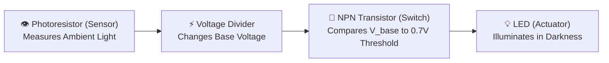
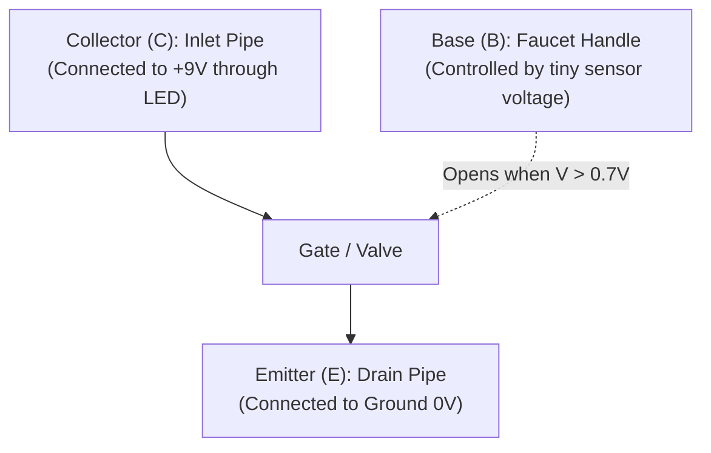
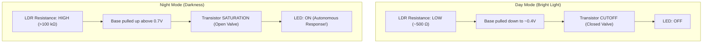

# Unit 1: The Spark: Electricity & Electronics from Scratch
# Lab 1: The Zero-Code Light-Sensitive Nightlight

> **Prerequisites**: Modules 1.1, 1.2, and 1.3  
> **Estimated Time**: 60 minutes  
> **Platform**: Autodesk Tinkercad Circuits (Free / Browser-Based Simulation)  
> **Deliverable**: Functional Virtual Simulation + Git-Tracked Engineering Log Entry  
> **Target Audience**: High School & College Students (Zero Prior Electronics or Coding Experience)  

---

## 1. Learning Objectives

By completing this hands-on lab, you will be able to:
- [ ] **Construct** an autonomous closed-loop sensor circuit on a breadboard without writing a single line of software code [^1] [^2].
- [ ] **Utilize** a Photoresistor (Light-Dependent Resistor / LDR) in a voltage divider to measure ambient darkness [^1].
- [ ] **Operate** a Bipolar Junction Transistor (NPN 2N2222) as an electronic switch [^2].
- [ ] **Measure and debug** circuit voltages at each node using a digital multimeter [^1] [^3].
- [ ] **Document** the schematic, operation, and test results in a version-controlled engineering log [^2].

---

## 2. Lab Overview: Autonomous Sensing Without Code

Before microprocessors existed, robots and automated systems used **analog electronics** to make decisions. In this lab, you will build an autonomous nightlight that automatically turns an LED on when the room goes dark and shuts it off when light returns.

This exercise proves the foundational robotics principle: **autonomy does not require complex code—it requires a closed feedback loop between sensor and actuator!** [^2]



---

## 3. The Core Component: The Transistor as an Electronic Switch

To build this circuit without a microcontroller, we use an **NPN Bipolar Junction Transistor (2N2222)** [^1] [^2].

Think of a transistor as an **electrically controlled water faucet**:



The transistor has three legs:
1. **Collector (C)**: Where current wants to enter.
2. **Emitter (E)**: Where current exits to ground.
3. **Base (B)**: The control valve handle.
   - When the Base voltage is below $0.6\text{V}$, the valve is snapped shut (**Cutoff State**). Zero current flows from Collector to Emitter; the LED stays dark.
   - When the Base voltage reaches **$\approx 0.7\text{V}$**, the valve snaps wide open (**Saturation State**). Current rushes from Collector to Emitter, lighting the LED brightly [^1] [^2]!

---

## 4. Circuit Schematic & Bill of Materials

### Virtual Components Needed in Tinkercad:
- $1\times$ **Small Solderless Breadboard**
- $1\times$ **9V Battery**
- $1\times$ **NPN Transistor (BJT 2N2222)**
- $1\times$ **Photoresistor (LDR)**
- $1\times$ **$10\text{k}\Omega$ Resistor** (Brown - Black - Orange - Gold)
- $1\times$ **$330\,\Omega$ Resistor** (Orange - Orange - Brown - Gold)
- $1\times$ **Standard Red LED**
- $1\times$ **Digital Multimeter**

```text
               (+) 9V Power Rail
                    |
     +--------------+-------------------+
     |                                  |
   [ LDR ]                           [ 330 Ω Resistor ]
  (Photoresistor)                       |
     |                               [ LED (Anode +) ]
     +---------> [ Base (B) ]        [ LED (Cathode -) ]
     |              |                   |
 [ 10k Ω ]        [ 2N2222 ] <----------+ (Collector C)
  Resistor          |
     |           [ Emitter (E) ]
     +--------------+
                    |
               (-) Ground (0V)
```

---

## 5. Step-by-Step Breadboard Assembly Instructions

1. **Launch Simulator**:
   - Go to [Autodesk Tinkercad Circuits](https://www.tinkercad.com/) and create a new circuit.
   - Drag out the **Breadboard**, **9V Battery**, and components.
2. **Power Rails**:
   - Connect the red battery wire to the breadboard positive (`+`) rail.
   - Connect the black battery wire to the breadboard negative (`-`) rail.
3. **Insert the Transistor**:
   - Place the **NPN Transistor** in rows 15, 16, and 17 (facing flat side forward):
     - Pin 1 (Collector): Row 15
     - Pin 2 (Base): Row 16
     - Pin 3 (Emitter): Row 17
   - Connect a black jumper wire from **Row 17 (Emitter)** to the **negative Ground rail (`-`)**.
4. **Wire the LED and Current-Limiting Resistor**:
   - Place the **$330\,\Omega$ Resistor** between the **positive rail (`+`)** and **Row 12**.
   - Place the **LED**:
     - Anode (+ long leg) in **Row 12** (connected to the $330\,\Omega$ resistor).
     - Cathode (- flat edge) in **Row 15** (connected to the Transistor Collector).
5. **Wire the Light-Sensing Voltage Divider**:
   - Place the **$10\text{k}\Omega$ Resistor** between the **positive rail (`+`)** and **Row 16 (Transistor Base)**.
   - Place the **Photoresistor (LDR)** between **Row 16 (Transistor Base)** and the **negative Ground rail (`-`)**.

---

## 6. Testing & Verifying Operation

1. Click **Start Simulation**.
2. Click directly on the **Photoresistor (LDR)**. A slider representing ambient light appears above it.
3. **Daylight Test (Slider to the Right)**:
   - In bright light, the photoresistor's internal resistance drops to $\approx 500\,\Omega$.
   - Because $500\,\Omega$ is tiny compared to the $10\text{k}\Omega$ resistor, it pulls the Transistor Base voltage down to $\approx 0.4\text{V}$.
   - Since $0.4\text{V} < 0.7\text{V}$, the transistor stays shut off. **The LED is OFF.**
4. **Nighttime Test (Drag Slider to the Left into Darkness)**:
   - In dark conditions, the photoresistor's resistance soars to over $200\text{k}\Omega$!
   - Now the voltage divider output climbs above $0.7\text{V}$.
   - The transistor Base turns on, current rushes through the Collector, and **the LED lights up automatically!**



---

## 7. Troubleshooting & Verification Checklist

- [ ] **LED is always ON**: Check the photoresistor wiring. If the LDR is not properly grounded to Row 16, the $10\text{k}\Omega$ resistor will hold the Base permanently at $+9\text{V}$, leaving the LED permanently illuminated.
- [ ] **LED never turns ON**: Verify the LED polarity. The Anode (bent leg) must touch the $330\,\Omega$ resistor; the Cathode must touch the Collector. Also verify the transistor is NPN, not PNP.
- [ ] **LED burns out / explodes in simulation**: You forgot the $330\,\Omega$ protective resistor. Never connect an LED directly between $+9\text{V}$ and the transistor without a current-limiting resistor!

---

## 8. Author Your Engineering Notebook Entry

In your digital engineering notes, document your completed build:

```markdown
# Engineering Log: Autonomous Light-Sensitive Circuit
**Date**: 2026-10-04  
**Author**: [Your Name]  
**Milestone**: Unit 1 Capstone (Zero-Code Autonomous Nightlight)  

### 1. Objective
Design and simulate an analog sensory control circuit that activates an LED in low-light conditions using a photoresistor voltage divider and an NPN transistor switch without a microcontroller.

### 2. Experimental Data & Multimeter Readings
- Supply Voltage: 9.00V
- Transistor Base Voltage (Bright Sunlight): 0.38V (Transistor Cutoff, LED Current = 0.0 mA)
- Transistor Base Voltage (Total Darkness): 0.74V (Transistor Saturation, LED Current = 21.2 mA)
- Voltage Drop across 330Ω Resistor during activation: 7.0V
- Current through LED: I = 7.0V / 330Ω = 21.2 mA (Within safe 20-25 mA rating)

### 3. Engineering Reflection
This lab demonstrates that robotic sensing and decision-making can be implemented purely through solid-state physics. The transistor acts as a physical threshold comparator.
```

---

## 9. Sources & Media Provenance

### Cited References
[^1]: **Tony R. Kuphaldt**, *"Lessons In Electric Circuits, Volume III — Semiconductors (Chapter 4: Bipolar Junction Transistors)"*, Open Textbook Library. Available: [Lessons In Electric Circuits (Semiconductors)](https://open.umn.edu/opentextbooks/textbooks/lessons-in-electric-circuits-volume-i-dc).  
[^2]: **Leslie Kaelbling, Tomas Lozano-Perez, Dennis Freeman**, *"Introduction to Electrical Engineering and Computer Science I (6.01SC) — Circuits and Op-Amps"*, MIT OpenCourseWare. License: CC BY-NC-SA 4.0. Available: [MIT OCW 6.01SC](https://ocw.mit.edu/courses/6-01sc-introduction-to-electrical-engineering-and-computer-science-i-spring-2011/).  
[^3]: **SparkFun Education Team**, *"How to Use a Breadboard"*, SparkFun Electronics. License: CC BY-SA 4.0. Available: [SparkFun Breadboard Guide](https://learn.sparkfun.com/tutorials/how-to-use-a-breadboard).

### Media Manifest
| Asset Name | Media Type | Source / Repository | License | Attribution |
| :--- | :--- | :--- | :--- | :--- |
| `tinkercad-nightlight.png` | Circuit Schematic | Tinkercad Circuits / Instructabot | CC BY 4.0 | Autodesk Tinkercad / Instructabot [^2] |
| `breadboard-internals.svg` | Vector Graphic | Instructabot Educational Team | CC BY-SA 4.0 | Instructabot Project [^3] |
| `voltage-divider.svg` | Schematic Diagram | Instructabot Educational Team | CC BY-SA 4.0 | Instructabot Project [^1] |

---

## 🏆 Milestone Achieved: Unit 1 Electronics Capstone Complete!

🎉 You designed and verified an autonomous Sense-Think-Act nightlight circuit operating entirely on analog semiconductor physics without code.

> 💡 **What's Next?** In **Unit 2: The Brain**, you will connect microcontrollers and write real-time Python state machines to control physical hardware!

---

## 🧭 Lesson Navigation

| ⬅️ Previous Lesson | 🗺️ Course Hub | ➡️ Next Lesson |
| :--- | :---: | ---: |
| [← Module 1.3: Power Delivery, Voltage Regulators, & Brownout Prevention](03-power-delivery-and-regulators.md) | [**Master Syllabus**](../../syllabus.md) • [**Getting Started**](../../getting_started.md) | [**Module 2.1: Algorithmic Logic, Flowcharts, & State Machines →**](../unit-02-the-brain/01-algorithmic-logic-and-flowcharts.md) |
