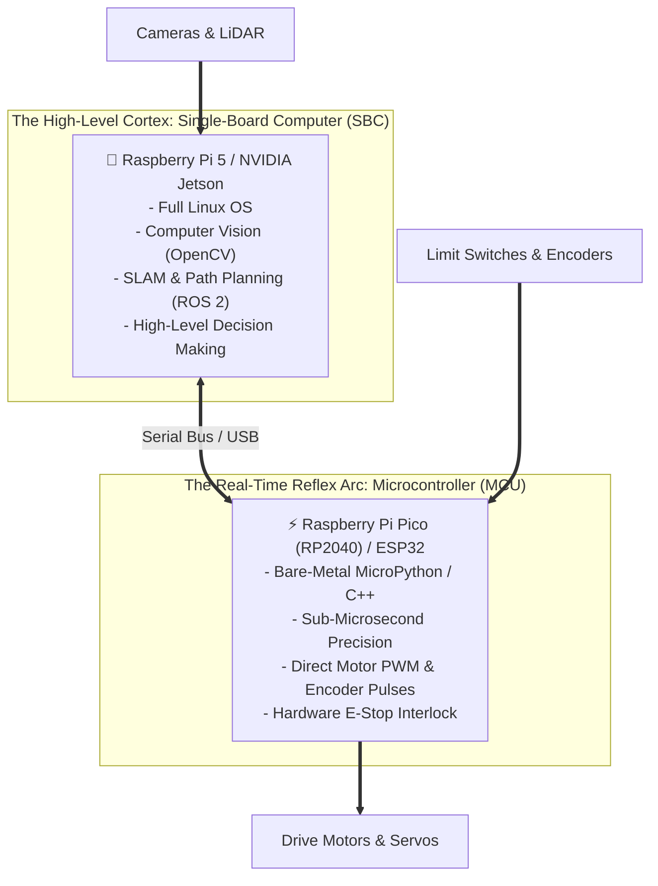

# Unit 2: The Brain: Computational Thinking & Microcontrollers
# Module 2.3: Microcontrollers vs. Single-Board Computers & GPIO

> **Prerequisites**: Module 2.1 (Algorithmic Logic), Module 2.2 (Python Foundations)  
> **Estimated Time**: 45 minutes  
> **Interactive Activity**: GPIO Pin Interfacing & Hardware I/O in MicroPython  
> **Target Audience**: High School & College Students (Zero Prior Hardware Experience)  

---

## 1. Learning Objectives

By the end of this module, you will be able to:
- [ ] **Contrast** a Microcontroller Unit (MCU: RP2040, ESP32) with a Single-Board Computer (SBC: Raspberry Pi 5, Jetson) across timing determinism, power, and operating systems [^1] [^2].
- [ ] **Configure** General Purpose Input/Output (GPIO) pins for digital output (LEDs) and digital input (switches) in MicroPython [^1].
- [ ] **Enable** software-defined internal pull-up resistors (`Pin.PULL_UP`) to prevent floating pin errors without extra breadboard parts [^1] [^2].
- [ ] **Architect** a professional dual-brain robotic system (SBC for AI/Vision + MCU for hard real-time motor control) [^2] [^3].

---

## 2. Intuitive Big Picture: The Reflex Arc vs. The Cortex

When you accidentally touch a scorching hot stove, your hand jerks back in a fraction of a second before you even consciously realize what happened. That rapid reaction is handled by a **reflex arc** in your spinal cord. Seconds later, your conscious brain (cortex) processes the event: *"That stove was hot. I should turn off the burner and get an ice pack."*

Modern advanced robotics mimics this biological division of labor:



1. **Microcontrollers (MCUs)**: Handle the reflex arc. They read wheel encoders every microsecond, generate smooth motor pulses, and immediately stop if a bumper is hit [^1].
2. **Single-Board Computers (SBCs)**: Handle the conscious brain. They run Linux, connect to Wi-Fi, process high-resolution video, and plan paths through a house [^2].

---

## 3. The Core Concept Explained

### 3.1 Head-to-Head Comparison: MCU vs. SBC

| Feature | Microcontroller Unit (MCU) | Single-Board Computer (SBC) |
| :--- | :--- | :--- |
| **Common Examples** | Raspberry Pi Pico (RP2040 / RP2350 Pico 2) [^4], ESP32, Arduino Uno | Raspberry Pi 4/5, NVIDIA Jetson Nano/Orin |
| **Operating System** | **None** (Bare metal firmware: MicroPython or C++) | **Full Linux OS** (Ubuntu, Raspberry Pi OS) |
| **Clock Speed** | $16\text{ MHz} - 240\text{ MHz}$ | $1.5\text{ GHz} - 2.4\text{ GHz}$ (Quad/Octa-core) |
| **RAM Memory** | Kilobytes ($264\text{ KB}$ on Pico, $520\text{ KB}$ on ESP32) | Gigabytes ($2\text{ GB} - 8\text{ GB}$) |
| **Timing Precision** | **Hard Real-Time**: Predictable down to nanoseconds! | **Non-Deterministic**: Linux task scheduler causes jitter [^2]. |
| **Power Consumption** | Fractions of a Watt ($0.1\text{W}$ - runs for weeks on AA batteries) | $5\text{W} - 25\text{W}$ (Requires large battery packs) |
| **Boot Time** | **Instantaneous** (A few milliseconds) | $15 - 45\text{ seconds}$ to boot Linux |
| **Primary Robotics Job**| Motor PWM, reading encoders, sensors, emergency stops | Computer vision, AI object detection, SLAM, ROS 2 |

---

### 3.2 The Raspberry Pi Pico (RP2040): The Educational Benchmark

In this curriculum, our primary microcontroller is the **Raspberry Pi Pico**, powered by the custom **RP2040** silicon chip engineered by Raspberry Pi [^2]:

```text
                           [ USB Port ]
                GP0  [ 1]            [40] VBUS (5V from USB)
                GP1  [ 2]            [39] VSYS (System Power In)
                GND  [ 3]            [38] GND (Ground)
                GP2  [ 4]   +----+   [37] 3V3_EN
                GP3  [ 5]   |RP  |   [36] 3V3_OUT (Clean 3.3V Logic Supply)
                GP4  [ 6]   |2040|   [35] ADC_VREF
                GP5  [ 7]   +----+   [34] GP28 (Analog ADC2)
                GND  [ 8]            [33] GND (Ground)
```

- **Dual-Core ARM Cortex-M0+** running at $133\text{ MHz}$.
- **264 KB of internal SRAM** memory.
- **26 multi-function GPIO pins** (General Purpose Input/Output).
- **Cost**: Only $\approx \$4.00$, making it universally accessible [^2].

> [!CAUTION]
> **Voltage Warning: 3.3V Logic!**
> The Raspberry Pi Pico operates on **$3.3\text{V}$ logic levels**. 
> - A digital `HIGH` is $3.3\text{V}$; `LOW` is $0.0\text{V}$.
> - Feeding $5.0\text{V}$ from an older Arduino sensor directly into a Pico GPIO pin can permanently fry the internal silicon. Always use a voltage divider or logic level shifter when connecting $5\text{V}$ devices! [^1] [^2]

---

### 3.3 Controlling Hardware with MicroPython: The `machine` Module

In MicroPython, hardware peripherals are controlled using the built-in `machine` module [^1]:

```python
from machine import Pin
import time

# 1. Configuring an OUTPUT pin (Sending electrical signals OUT)
# The onboard LED on the Raspberry Pi Pico is connected to GP25
led = Pin(25, Pin.OUT)

# Turn the LED ON (Sets pin to 3.3V)
led.value(1)  # or led.on()

# Turn the LED OFF (Sets pin to 0.0V)
led.value(0)  # or led.off()
```

---

### 3.4 Software Internal Pull-Up Resistors: Active-LOW Logic

In Module 1.2, we learned that switches require a pull-up or pull-down resistor to prevent "floating pin" electromagnetic jitter.

Modern microcontrollers like the RP2040 have **resistors built directly into the silicon of every GPIO pin**! You can activate them with a single parameter in MicroPython [^1] [^2]:

```python
# 2. Configuring an INPUT pin with INTERNAL PULL-UP
# Connect a pushbutton between GP14 and GND (Ground)!
button = Pin(14, Pin.IN, Pin.PULL_UP)
```

#### Understanding Active-LOW Logic:
Because the internal pull-up resistor is holding the pin high to $3.3\text{V}$:
- **Button is NOT pressed**: The circuit is open. The internal resistor pulls the pin to $3.3\text{V}$. `button.value()` returns **`1`**.
- **Button IS pressed**: The button connects GP14 directly to GND ($0\text{V}$). `button.value()` returns **`0`**.

This is called **Active-LOW logic** and is the universal engineering standard in industrial control systems because it protects against short circuits to chassis ground [^1] [^2].

```python
if button.value() == 0:
    print("Pushbutton is PRESSED!")
else:
    print("Pushbutton is idle (released).")
```

---

## 4. Hands-On Hardware I/O Lab

### Lab Objective
In this exercise, you will write a complete MicroPython script for the Raspberry Pi Pico that implements **Button Debouncing**—a critical hardware technique that eliminates mechanical switch contact chatter.

```python
from machine import Pin
import time

# Hardware setup
led = Pin(25, Pin.OUT)
button = Pin(14, Pin.IN, Pin.PULL_UP)

# State variables
led_state = False
last_button_state = 1
last_debounce_time = 0
debounce_delay_ms = 50  # 50 millisecond debounce window

print("🔘 Hardware I/O Ready. Press the button to toggle LED!")

while True:
    current_time = time.ticks_ms()
    reading = button.value()

    # Detect if the button state changed (pressed or released)
    if reading != last_button_state:
        # Check if enough time has elapsed to filter out physical contact bounce
        if time.ticks_diff(current_time, last_debounce_time) > debounce_delay_ms:
            # If reading is 0, the button was just pressed down (Active LOW)
            if reading == 0:
                led_state = not led_state
                led.value(led_state)
                print(f"Button Pressed! LED toggled: {'ON' if led_state else 'OFF'}")
                
            last_debounce_time = current_time
            last_button_state = reading
```

---

## 5. Troubleshooting & Hardware Pitfalls

> [!WARNING]
> **Pitfall 1: Mechanical "Contact Bounce"**  
> When you press a physical metal pushbutton, the microscopic metal contacts do not close cleanly in an instant. They physically bounce against each other for $5\text{ to }20\text{ milliseconds}$, generating dozens of rapid `1-0-1-0` transitions. Without software debouncing (as implemented in our lab above), a single button click will trigger your robot to toggle its state 10 times in a millisecond! [^1] [^2]

> [!WARNING]
> **Pitfall 2: Maximum GPIO Current Limits**  
> Each GPIO pin on an RP2040 can safely output or sink a maximum of **$12\text{mA}$** ($0.012\text{A}$), and the entire chip cannot exceed $50\text{mA}$ across all pins combined. Never try to drive a motor, relay, or solenoid directly from a GPIO pin—always use a transistor or motor driver IC! [^2]

---

## 6. Real-World Applications & Next Steps

This split architecture is standard across the entire robotics industry:
- **Autonomous Drones**: A Pixhawk microcontroller running PX4 firmware executes flight stabilization loops at $400\text{ Hz}$, while a companion Raspberry Pi 4 processes visual camera feeds.
- **Self-Driving Vehicles**: Automotive microcontrollers handle real-time brake-by-wire and steering actuators, while high-performance compute clusters run AI perception and path planning.

In our unit capstone, **Lab 2: The Pedestrian-Responsive Intersection Controller**, we will assemble all of Unit 2: wiring a multi-LED traffic intersection in the Wokwi simulator with an interactive crosswalk button and programming a robust, non-blocking Finite State Machine in MicroPython!

---

## 7. Sources & Media Provenance

### Cited References
[^4]: **Raspberry Pi Ltd**, *"Raspberry Pi RP2350 Microcontroller Datasheet (Dual ARM Cortex-M33 & RISC-V Hazard3)"*, Raspberry Pi Documentation. Available: [RP2350 Official Datasheet](https://datasheets.raspberrypi.com/rp2350/rp2350-datasheet.pdf).
[^1]: **Damien P. George, MicroPython Community**, *"MicroPython Documentation and Language Reference (machine.Pin Module)"*, George Robotics Ltd. Available: [MicroPython Pin Documentation](https://docs.micropython.org/en/latest/library/machine.Pin.html).  
[^2]: **Raspberry Pi Ltd. Documentation Team**, *"Raspberry Pi Pico Python SDK: A Guide to MicroPython on RP2040"*, Raspberry Pi Ltd. License: CC BY-SA 4.0. Available: [Raspberry Pi Pico Python SDK](https://datasheets.raspberrypi.com/pico/raspberry-pi-pico-python-sdk.pdf).  
[^3]: **Leslie Kaelbling, Tomas Lozano-Perez, Dennis Freeman**, *"Introduction to Electrical Engineering and Computer Science I (6.01SC) — Embedded Systems and Microcontrollers"*, MIT OpenCourseWare. License: CC BY-NC-SA 4.0. Available: [MIT OCW 6.01SC](https://ocw.mit.edu/courses/6-01sc-introduction-to-electrical-engineering-and-computer-science-i-spring-2011/).

### Media Manifest
| Asset Name | Media Type | Source / Repository | License | Attribution |
| :--- | :--- | :--- | :--- | :--- |
| `mcu-vs-sbc.svg` | Vector Graphic / Architecture | Instructabot Educational Team | CC BY-SA 4.0 | Instructabot Project [^2] |
| `pico-pinout.svg` | Schematic Diagram | Raspberry Pi Ltd. / Instructabot | CC BY-SA 4.0 | Raspberry Pi Ltd. [^2] |
| `five-subsystems-flow.svg` | Vector Diagram | Instructabot Educational Team | CC BY-SA 4.0 | Instructabot Project |

---

## 🧭 Lesson Navigation

| ⬅️ Previous Lesson | 🗺️ Course Hub | ➡️ Next Lesson |
| :--- | :---: | ---: |
| [← Module 2.2: Python for Robotics Foundations](02-python-for-robotics.md) | [**Master Syllabus**](../../syllabus.md) • [**Getting Started**](../../getting_started.md) | [**Lab 2: The Pedestrian-Responsive Intersection Controller →**](lab-02-intersection-controller.md) |
