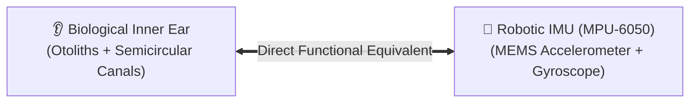
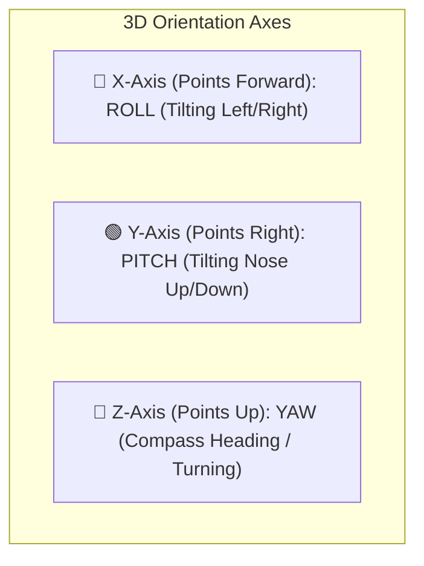
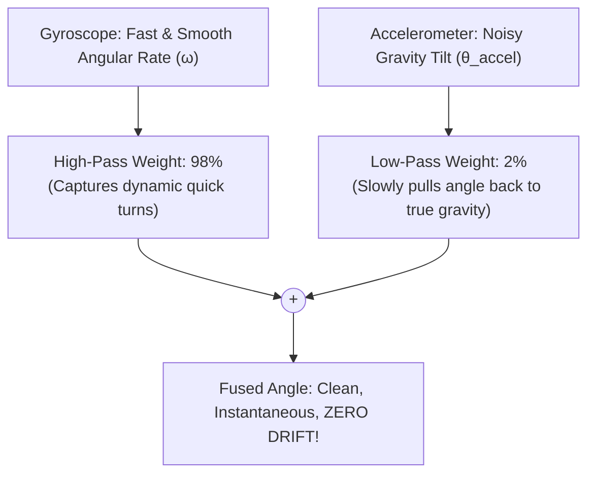

# Unit 3: The Senses: Sensors, Signals, & Perception
# Module 3.3: Motion & Orientation Sensing (IMUs & Gyroscopes)

> **Prerequisites**: Module 3.1 (Signals & Sampling), Unit 0 (Subsystems)  
> **Estimated Time**: 45 minutes  
> **Interactive Activity**: Simulating an IMU & Implementing a Complementary Sensor Fusion Filter  
> **Target Audience**: High School & College Students (Zero Prior Physics Background)  

---

## 1. Learning Objectives

By the end of this module, you will be able to:
- [ ] **Deconstruct** a 6-Axis Inertial Measurement Unit (IMU) into its core sensors: 3-axis Accelerometer and 3-axis Gyroscope [^1].
- [ ] **Explain** how microscopic MEMS cantilevers measure Earth's gravitational vector ($1\text{g} \approx 9.8\text{ m/s}^2$) to calculate tilt angles (Roll and Pitch) [^1] [^2].
- [ ] **Explain** why integrating gyroscope angular velocity causes **Drift Error** over time [^1] [^3].
- [ ] **Construct** a **Complementary Filter** combining accelerometer stability with gyroscope responsiveness in Python [^1] [^3].

---

## 2. Intuitive Big Picture: The Inner Ear of a Robot

Close your eyes. Tilt your head to the left. Turn your head quickly to the right. 

Even with zero vision and complete silence, your brain knows your exact orientation in space. How? 

Inside your inner ear, you have two biological balance mechanisms:
1. **The Otolith Organs**: Fluid-filled chambers containing microscopic calcium stones that press down under gravity. They tell you which way is **down**.
2. **The Semicircular Canals**: Three fluid-filled loops that detect when your head is **turning or rotating**.



An **Inertial Measurement Unit (IMU)** is the robot's inner ear [^1]. It is the sensor that allows drones to balance in wind gusts, self-balancing rovers to stay upright, and Mars rovers to know if they are about to tip over on a steep sand dune [^2].

---

## 3. The Core Concept Explained

### 3.1 Spatial Coordinate Frames: Roll, Pitch, and Yaw

In three-dimensional space, an object can move along three linear axes ($X, Y, Z$) and rotate around three rotational axes [^2]:



```text
                     +Z (Yaw: Heading Turn)
                      |
                      |   +X (Roll: Side Tilt)
                      |  /
                      | /
       ---------------+------------- +Y (Pitch: Nose Tilt)
                     /|
                    / |
```

---

### 3.2 The Accelerometer: Finding Gravity

Inside a Micro-Electro-Mechanical Systems (MEMS) chip (such as the industry-standard **MPU-6050**), tiny silicon structures are etched with microscopic combs acting as microscopic springs [^1].

When the chip accelerates—or when Earth's gravity pulls on it—the microscopic silicon mass deflects, changing electrical capacitance:
- When sitting flat on a table, the accelerometer reads:
  $$X = 0.0\text{g}, \quad Y = 0.0\text{g}, \quad Z = +1.0\text{g} \quad (\approx 9.8\text{ m/s}^2\text{ upward normal force})$$
- If you tilt the robot on its side:
  $$X = 0.0\text{g}, \quad Y = +1.0\text{g}, \quad Z = 0.0\text{g}$$

#### Calculating Tilt Angles from Gravity:
By comparing the gravity vector components using trigonometry, a robot computes its exact tilt [^1] [^2]:

$$\text{Roll} = \arctan\left(\frac{Y}{Z}\right) \times \frac{180^\circ}{\pi} \qquad\qquad \text{Pitch} = \arctan\left(\frac{-X}{\sqrt{Y^2 + Z^2}}\right) \times \frac{180^\circ}{\pi}$$

> [!WARNING]
> **The Accelerometer's Weakness**:
> An accelerometer measures *all* forces, not just gravity! When a mobile robot accelerates forward or hits a bump, the shock forces pollute the gravity measurement. An accelerometer is **noisy in the short term**, but **100% accurate in the long term** because gravity never stops pulling down [^1] [^3].

---

### 3.3 The Gyroscope: Measuring Turn Rates

A MEMS gyroscope does not measure tilt angles; it measures **Angular Velocity** ($\omega$), the speed of rotation in degrees per second ($^\circ/\text{s}$) [^1].

To calculate the robot's current angle ($\theta$), we must **integrate** velocity over time:

$$\theta_{\text{new}} = \theta_{\text{previous}} + (\omega \times \Delta t)$$

#### The Gyroscope's Fatal Flaw: The Drift Problem
Because no mechanical silicon sensor is 100% perfect, a stationary gyroscope resting on a table might report a tiny erroneous reading like $+0.05^\circ/\text{s}$.
- In 1 second: Error $= 0.05^\circ$ (Negligible).
- In 1 minute: Error $= 0.05 \times 60 = 3.0^\circ$.
- In 1 hour: Error $= 0.05 \times 3600 = \mathbf{180.0^\circ}$!

Without correction, the robot will believe it is spinning in circles even while parked stationary in a garage [^1] [^3]!

| Sensor Type | Short-Term Behavior | Long-Term Behavior | Primary Error Source |
| :--- | :--- | :--- | :--- |
| **Accelerometer** | **Noisy & Jittery** (Affected by road bumps) | **Rock-Solid True Gravity** (Zero drift) | Kinetic vibrations |
| **Gyroscope** | **Buttery-Smooth & Instantaneous** | **Severe Accumulating Drift** | Numerical integration bias |

---

### 3.4 Sensor Fusion: The Complementary Filter

How do roboticists solve this? We fuse them together using a **Complementary Filter** [^3]!

We pass the Gyroscope through a **High-Pass Filter** (trusting its rapid, smooth motions) and pass the Accelerometer through a **Low-Pass Filter** (using gravity to slowly anchor the angle and cancel drift) [^1] [^3]:

$$\text{Angle}_{\text{fused}} = 0.98 \times \left( \text{Angle}_{\text{fused}} + \omega_{\text{gyro}} \cdot \Delta t \right) + 0.02 \times \text{Angle}_{\text{accel}}$$



---

## 4. Hands-On Python Sensor Fusion Lab

### Lab Objective
In this exercise, you will implement a Complementary Filter in Python, demonstrating how fusing simulated noisy accelerometer and drifting gyroscope readings produces a clean, drift-free estimate of robot tilt.

```python
import math
import random
import time

class ComplementaryFilter:
    def __init__(self, alpha=0.98):
        self.alpha = alpha  # Weight factor (98% gyro, 2% accel)
        self.fused_angle = 0.0
        self.gyro_only_angle = 0.0

    def update(self, gyro_rate, accel_x, accel_y, accel_z, dt):
        """Fuses new sensor data to update orientation estimate."""
        
        # 1. Calculate tilt angle from accelerometer gravity vector (degrees)
        accel_pitch = math.atan2(-accel_x, math.sqrt(accel_y**2 + accel_z**2)) * (180.0 / math.pi)
        
        # 2. Integrate gyroscope rate (pure gyro dead reckoning)
        self.gyro_only_angle += gyro_rate * dt
        
        # 3. Apply Complementary Filter Formula
        # (High-pass gyro prediction) + (Low-pass accel correction)
        self.fused_angle = (self.alpha * (self.fused_angle + gyro_rate * dt)) + ((1.0 - self.alpha) * accel_pitch)
        
        return self.fused_angle, self.gyro_only_angle, accel_pitch

# --- Simulation Experiment ---
filter_engine = ComplementaryFilter(alpha=0.98)
dt = 0.02  # 50 Hz loop (20 milliseconds per cycle)

# True physical state: Robot is tilted at 15.0 degrees stationary
true_tilt = 15.0
gyro_drift_bias = 1.2  # Gyroscope has an error of +1.2 deg/sec

print("📐 Running 100-cycle Sensor Fusion Simulation...")
print("Step | Raw Accel (Noisy) | Gyro Integrated (Drifting) | Fused Output (Clean)")
print("-" * 75)

for step in range(10):
    # Simulate accelerometer with road bump noise (+/- 3 degrees jitter)
    noisy_accel_x = -math.sin(math.radians(true_tilt + random.uniform(-3.0, 3.0)))
    noisy_accel_z = math.cos(math.radians(true_tilt))
    noisy_accel_y = 0.0
    
    # Simulate gyroscope reading (stationary = 0 deg/s + bias drift)
    noisy_gyro_rate = 0.0 + gyro_drift_bias
    
    fused, gyro_drifting, raw_accel = filter_engine.update(noisy_gyro_rate, noisy_accel_x, noisy_accel_y, noisy_accel_z, dt)
    print(f"{step*10:4d} | {raw_accel:17.2f}° | {gyro_drifting:26.2f}° | {fused:18.2f}°")
    time.sleep(0.05)
```

Observe how `Gyro Integrated` drifts away relentlessly, while `Raw Accel` jumps with random noise. The `Fused Output` settles stably on the true $15^\circ$ angle!

---

## 5. Troubleshooting & Orientation Pitfalls

> [!WARNING]
> **Pitfall 1: Why the Complementary Filter Cannot Fix Yaw (Heading)**  
> Gravity only points **down** (along the $Z$ axis). Because gravity does not act sideways, an accelerometer cannot measure heading rotation around the $Z$-axis (**Yaw**)! To eliminate yaw drift on a mobile robot, you must add a **3-axis digital magnetometer (compass)** or fuse wheel encoders and camera visual odometry [^1] [^2].

> [!WARNING]
> **Pitfall 2: High Vibrations Exceeding Sensor Range**  
> If an IMU is mounted directly to a robot chassis near high-speed gearboxes without rubber dampening pads, the mechanical motor vibrations can saturate the accelerometer's full-scale range ($\pm 2\text{g}$ or $\pm 16\text{g}$). Always isolate IMUs with soft silicone foam mounting tape.

---

## 6. Real-World Applications & Next Steps

Sensor fusion is essential for physical autonomy:
- Quadcopters use complementary and Kalman filters at $1,000\text{ Hz}$ to remain level in turbulent winds.
- Smartphones use IMU fusion to rotate screen orientation smoothly without glitching when bumped.

In our next module, **Module 3.4: Real-World Noise & Signal Conditioning**, we will learn how to clean up noisy sensor streams using Digital Moving Average and Median Filters!

---

## 7. Sources & Media Provenance

### Cited References
[^1]: **TDK InvenSense Engineering**, *"MPU-6050 Six-Axis (Gyro + Accelerometer) MEMS MotionTracking Specification"*, TDK InvenSense. Available: [TDK InvenSense MPU-6050](https://invensense.tdk.com/products/motion-tracking/6-axis/mpu-6050/).  
[^2]: **Kevin M. Lynch, Frank C. Park**, *"Modern Robotics: Mechanics, Planning, and Control (Chapter 3: Rigid-Body Motions)"*, Cambridge University Press. License: CC BY-NC-ND 4.0. Available: [Modern Robotics](https://modernrobotics.northwestern.edu/).  
[^3]: **Steven W. Smith**, *"The Scientist and Engineer's Guide to Digital Signal Processing (Chapter 15: Moving Average Filters)"*, California Technical Publishing. Available: [DSP Guide](https://www.dspguide.com/).

### Media Manifest
| Asset Name | Media Type | Source / Repository | License | Attribution |
| :--- | :--- | :--- | :--- | :--- |
| `imu-coordinates.svg` | Vector Graphic / 3D Axes | Instructabot Educational Team | CC BY-SA 4.0 | Instructabot Project [^2] |
| `sensor-noise-filtering.svg` | Signal Plot | Instructabot Educational Team | CC BY-SA 4.0 | Instructabot Project [^3] |
| `five-subsystems-flow.svg` | Vector Diagram | Instructabot Educational Team | CC BY-SA 4.0 | Instructabot Project |

---

## 🧭 Lesson Navigation

| ⬅️ Previous Lesson | 🗺️ Course Hub | ➡️ Next Lesson |
| :--- | :---: | ---: |
| [← Module 3.2: Distance & Proximity Sensing (Ultrasonic & Time-of-Flight)](02-distance-and-proximity.md) | [**Master Syllabus**](../../syllabus.md) • [**Getting Started**](../../getting_started.md) | [**Module 3.4: Real-World Sensor Noise & Digital Signal Filtering →**](04-noise-and-signal-conditioning.md) |
