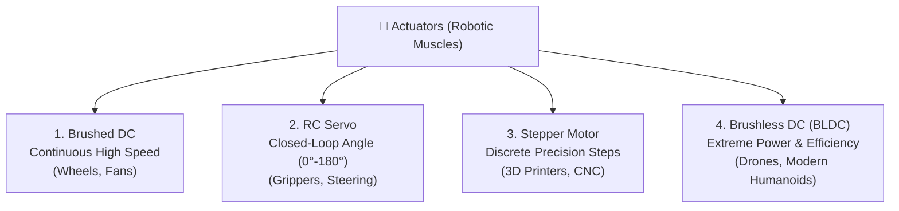
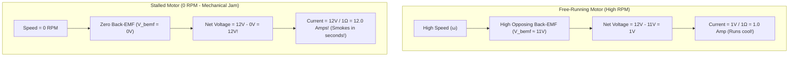

# Unit 4: The Muscles: Motors, Actuation, & Power Electronics
# Module 4.1: Electric Motors Compared (DC, Servos, Steppers, & BLDC)

> **Prerequisites**: Unit 1 (Ohm's Law & Power), Unit 2 (The Brain & PWM)  
> **Estimated Time**: 45 minutes  
> **Interactive Activity**: Motor Sizing & Torque-Speed Curve Analysis  
> **Target Audience**: High School & College Students (Zero Prior Mechanical Experience)  

---

## 1. Learning Objectives

By the end of this module, you will be able to:
- [ ] **Contrast** the four primary electric motor architectures in robotics: Brushed DC, RC Servos, Steppers, and Brushless DC (BLDC) [^1] [^2].
- [ ] **Explain** the physical phenomenon of **Back-Electromotive Force (Back-EMF)** and why a stalled motor draws catastrophic current ($I_{\text{stall}} \gg I_{\text{free}}$) [^1].
- [ ] **Calculate** motor mechanical power ($P = \tau \cdot \omega$) from torque and rotational speed [^2].
- [ ] **Select** the appropriate motor type for mobile robot drive wheels, robotic arm joints, drone propellers, and precision linear slides [^1] [^3].

---

## 2. Intuitive Big Picture: The Robotic Muscle

In human biology, muscles cannot push—they can only contract (pull) by converting chemical energy (ATP) into mechanical force.

In robotics, **actuators** convert stored electrical energy into physical force, rotation, and motion [^1]. 

However, no single motor type is perfect for all tasks:
- A drone propeller must spin at **$15,000\text{ RPM}$** with minimal weight.
- A robotic arm shoulder must lift a heavy payload at only **$10\text{ RPM}$** with massive holding force.
- A 3D printer must move by fractions of a millimeter without slipping.

To design a robot that works, you must understand the strengths, weaknesses, and electrical behaviors of the four motor families [^1] [^2].



---

## 3. The Core Concept Explained

### 3.1 The Four Motor Families

#### 1. Brushed DC Motors (The Workhorse)
- **How it Works**: Direct current flows into carbon brushes rubbing against a rotating commutator ring. As the rotor turns, the brushes mechanically switch which coil is energized, maintaining continuous magnetic attraction [^1].
- **Advantages**: Simplest to use. Apply DC voltage across its two terminals, and it spins! Reverse the wires, and it spins in reverse.
- **Disadvantages**: Mechanical brushes create sparks, electrical noise, friction, and wear down over time.
- **Best Use**: Wheeled mobile robot drive systems (when paired with a gearbox) [^2].

#### 2. RC Servo Motors (The Positioner)
- **How it Works**: An integrated package containing a tiny DC motor, a gear reduction box, a potentiometer sensor on the output shaft, and an internal control circuit [^1].
- **Control Signal**: Positioned via $50\text{ Hz}$ Pulse Width Modulation (PWM):
  - $1.0\text{ ms pulse} \implies 0^\circ$ position.
  - $1.5\text{ ms pulse} \implies 90^\circ$ position (centered).
  - $2.0\text{ ms pulse} \implies 180^\circ$ position.
- **Best Use**: Robotic arm joints, pan-tilt camera turrets, steering linkages, and mechanical claws.

#### 3. Stepper Motors (The Precision Indexer)
- **How it Works**: A multi-toothed iron rotor surrounded by stator coils. Instead of spinning freely, pulsing the coils in sequence snaps the motor forward by an exact angle (typically **$1.8^\circ$ per step = 200 steps per revolution**) [^1].
- **Advantages**: Open-loop precision. If you command 100 steps, it rotates exactly $180^\circ$ without needing an encoder! Phenomenal holding torque at standstill.
- **Disadvantages**: Heavy, power-hungry (draws full current even when stationary), and vibrates at high speeds.
- **Best Use**: 3D printers, CNC gantries, automated laboratory pipettes.

#### 4. Brushless DC Motors (BLDC) (The High-Performance King)
- **How it Works**: Permanent magnets are placed on the rotor, and coils are on the stationary outer shell. An external electronic microchip (Electronic Speed Controller / ESC) energizes 3 phases in an electronic rotating magnetic field—zero mechanical brushes [^1] [^2]!
- **Advantages**: Incredibly high efficiency ($>90\%$), massive power-to-weight ratio, high speeds ($>20,000\text{ RPM}$), and zero brush wear.
- **Disadvantages**: Requires complex 3-phase inverter electronics and rotor angle sensors.
- **Best Use**: Aerial quadcopters, modern humanoid quadruped joints (like Boston Dynamics Spot), and electric vehicles.

---

### 3.2 Back-Electromotive Force (Back-EMF) & The Stall Current Trap

Why do electric motors draw tiny current when spinning freely, but draw massive current when held in place?

Every electric motor is simultaneously an **electric generator** [^1]!
1. When you connect a battery to a motor, current flows through the coils and the motor accelerates.
2. As the coils spin through the magnetic field, they **generate their own opposing voltage** called **Back-Electromotive Force ($V_{\text{bemf}}$)**:
   $$V_{\text{bemf}} = K_e \times \omega$$
   *(where $K_e$ is the motor's electrical velocity constant and $\omega$ is rotational speed)*.
3. The true voltage driving current through the motor windings is only the **difference** between the battery voltage and Back-EMF [^1]:

$$I_{\text{motor}} = \frac{V_{\text{battery}} - V_{\text{bemf}}}{R_{\text{winding}}}$$



> [!CAUTION]
> **The Danger of Motor Stalling**:
> If your robot's arm tries to lift an object that is too heavy, or if its drive wheels get jammed against a rock, rotational speed drops to zero. With zero Back-EMF, current surges to the **Stall Current** ($I_{\text{stall}} = \frac{V}{R_{\text{winding}}}$), which is often **$10\times \text{ to } 20\times$ higher** than normal running current! This burns out motor windings, melts motor driver chips, and crashes batteries [^1] [^3].

---

### 3.3 Mechanical Power & Torque-Speed Curves

A motor's mechanical power output is the product of its **Torque** ($\tau$, rotational twisting force in Newton-meters, $\text{N}\cdot\text{m}$) and its **Rotational Speed** ($\omega$, in radians per second) [^2]:

$$P_{\text{mech}} = \tau \times \omega$$

```text
  Torque (τ)
      ^
Stall | \
Torque|  \
      |   \   Torque-Speed Linear Trade-off
      |    \
      |     \
      0------+-----------------> Speed (ω)
           No-Load Free Speed
```

- At **maximum speed** (free-running), torque is **zero** $\implies \text{Power Output} = 0$.
- At **maximum torque** (stalled), speed is **zero** $\implies \text{Power Output} = 0$.
- **Peak mechanical power occurs at exactly $50\%$ of no-load speed and $50\%$ of stall torque** [^1] [^2]!

---

## 4. Hands-On Motor Sizing Calculation Lab

### Lab Objective
In this exercise, you will calculate the torque and stall current required for a two-wheeled mobile robot climbing a $15^\circ$ ramp.

### Robot Parameters:
- **Total Robot Mass ($m$)**: $4.0\text{ kg}$
- **Wheel Radius ($r$)**: $5\text{ cm} = 0.05\text{ m}$
- **Number of Drive Motors**: $2$ (one per wheel)
- **Battery Voltage**: $12.0\text{V}$
- **Motor Winding Resistance ($R_{\text{winding}}$)**: $1.5\,\Omega$

#### Step 1: Calculate Gravity Force Down the Incline
$$F_{\text{incline}} = m \times g \times \sin(\theta) = 4.0\text{ kg} \times 9.8\text{ m/s}^2 \times \sin(15^\circ) \approx 39.2 \times 0.2588 \approx \mathbf{10.14\text{ Newtons}}$$

#### Step 2: Calculate Required Wheel Axle Torque
$$\text{Total Torque} = F \times r = 10.14\text{ N} \times 0.05\text{ m} \approx 0.507\text{ N}\cdot\text{m}$$
$$\text{Torque per Motor} = \frac{0.507\text{ N}\cdot\text{m}}{2} = \mathbf{0.254\text{ N}\cdot\text{m} \approx 25.4\text{ N}\cdot\text{cm}}$$

#### Step 3: Calculate Motor Stall Current
If the wheels jam on a rock:
$$I_{\text{stall}} = \frac{V_{\text{battery}}}{R_{\text{winding}}} = \frac{12.0\text{V}}{1.5\,\Omega} = \mathbf{8.0\text{ Amperes per motor!}}$$
Total current draw for two stalled motors $= 16.0\text{ Amps}$. Your motor driver must be rated for at least $8\text{A}$ to $10\text{A}$ peak current to survive this stall [^1] [^3]!

---

## 5. Troubleshooting & Actuation Pitfalls

> [!WARNING]
> **Pitfall 1: Expecting High Torque at High Speed**  
> A DC motor cannot deliver maximum torque and maximum speed simultaneously. If your robot accelerates sluggishly or fails to climb carpet, you must add **gear reduction** (Module 5.2). A 30:1 gearbox multiplies torque by $30\times$ while reducing speed by $30\times$.

> [!WARNING]
> **Pitfall 2: Overheating RC Servos at Mechanical Limits**  
> If an RC servo is commanded to rotate to $180^\circ$, but a physical mechanical bracket prevents it from moving past $165^\circ$, the internal control loop will apply $100\%$ stall power fighting the physical hardstop. The servo motor will heat up and burn its internal nylon gears within 60 seconds. Always calibrate software limits to stay well clear of physical mechanical stops.

---

## 6. Real-World Applications & Next Steps

Motor selection determines the capability of every autonomous platform:
- The NASA Perseverance Rover uses 6 brushless DC motors inside its wheel hubs with 200:1 planetary gearboxes, allowing it to crawl over rocks with immense torque.
- Modern humanoid robots (like Unitree G1 or Boston Dynamics Atlas) use high-torque quasi-direct-drive (QDD) brushless outrunners to achieve dynamic running and backflips.

In our next module, **Module 4.2: Motor Driving & Power Isolation (The H-Bridge)**, we will build the electronic circuitry needed to control motor speed and bidirectional rotation safely using MOSFET H-Bridges!

---

## 7. Sources & Media Provenance

### Cited References
[^1]: **Stephen J. Chapman**, *"Electric Machinery Fundamentals (Chapter 7: DC Motors and Generators)"*, McGraw-Hill Education. Available: [Electric Machinery Fundamentals](https://www.mheducation.com/highered/product/electric-machinery-fundamentals-chapman/M9780073529547.html).  
[^2]: **Kevin M. Lynch, Frank C. Park**, *"Modern Robotics: Mechanics, Planning, and Control (Chapter 8: Actuation and Dynamics)"*, Cambridge University Press. License: CC BY-NC-ND 4.0. Available: [Modern Robotics](https://modernrobotics.northwestern.edu/).  
[^3]: **Leslie Kaelbling, Tomas Lozano-Perez, Dennis Freeman**, *"Introduction to Electrical Engineering and Computer Science I (6.01SC) — Motors and Actuation"*, MIT OpenCourseWare. License: CC BY-NC-SA 4.0. Available: [MIT OCW 6.01SC](https://ocw.mit.edu/courses/6-01sc-introduction-to-electrical-engineering-and-computer-science-i-spring-2011/).

### Media Manifest
| Asset Name | Media Type | Source / Repository | License | Attribution |
| :--- | :--- | :--- | :--- | :--- |
| `motor-types.svg` | Vector Graphic / Infographic | Instructabot Educational Team | CC BY-SA 4.0 | Instructabot Project [^1] |
| `five-subsystems-flow.svg` | Vector Diagram | Instructabot Educational Team | CC BY-SA 4.0 | Instructabot Project |
| `linear-vs-buck.svg` | Vector Graphic | Instructabot Educational Team | CC BY-SA 4.0 | Instructabot Project |

---

## 🧭 Lesson Navigation

| ⬅️ Previous Lesson | 🗺️ Course Hub | ➡️ Next Lesson |
| :--- | :---: | ---: |
| [← Lab 3: The Ultrasonic Sonar Radar Scanner](../unit-03-the-senses/lab-03-sonar-radar-scanner.md) | [**Master Syllabus**](../../syllabus.md) • [**Getting Started**](../../getting_started.md) | [**Module 4.2: Motor Driving & Power Isolation (The H-Bridge) →**](02-h-bridge-motor-driving.md) |
