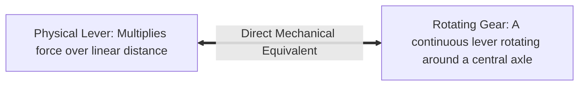
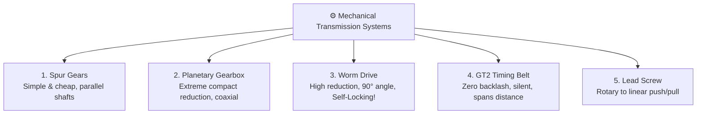
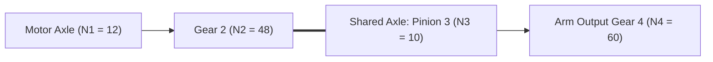

# Unit 5: The Bones: Mechanics, Kinematics, & CAD Modeling
# Module 5.2: Mechanical Power Transmission, Gears, & Belts

> **Prerequisites**: Module 5.1 (Structural Fundamentals), Unit 4 (Electric Motors)  
> **Estimated Time**: 45 minutes  
> **Interactive Activity**: Multi-Stage Gear Train Calculations & Torque Sizing  
> **Target Audience**: High School & College Students (Zero Prior Engineering Background)  

---

## 1. Learning Objectives

By the end of this module, you will be able to:
- [ ] **Calculate** gear ratios ($G$) and apply the conservation of mechanical power to trade rotational speed for torque [^1].
- [ ] **Contrast** the five primary mechanical transmission mechanisms: Spur Gears, Planetary Gearboxes, Worm Gears, GT2 Timing Belts, and Lead Screws [^1] [^2].
- [ ] **Explain** the self-locking (non-backdrivable) property of worm gears and why it prevents robot arms from collapsing when unpowered [^1].
- [ ] **Identify and mitigate** mechanical **Backlash (Play)** to preserve robotic positioning precision [^1] [^2].

---

## 2. Intuitive Big Picture: The Lever on an Axle

Imagine trying to loosen a rusted lug nut on a car tire using a tiny 2-inch wrench. You pull with all your strength, but it won't budge. 

Now, slide a 3-foot steel pipe over the wrench handle. With gentle downward pressure, the rusted nut breaks free with ease! You applied the exact same muscular effort, but the longer lever multiplied your **Torque** [^1].



A gear is simply a continuous lever revolving around an axle [^1]. 

Electric motors have a natural physical personality: they love spinning **extremely fast ($3,000 \text{ to } 10,000\text{ RPM}$)** with **very tiny torque**. 

A robot wheel or robotic arm, however, needs to spin **slowly ($60 \text{ to } 150\text{ RPM}$)** with **massive torque**. 

**Mechanical transmission** is the bridge that converts high-speed, low-torque motor rotation into low-speed, high-torque robotic muscle [^1] [^2]!

---

## 3. The Core Concept Explained

### 3.1 The Gear Ratio Formula: Speed vs. Torque Trade-Off

When two gears mesh, the teeth on their outer perimeters must travel at the exact same physical linear speed [^1]:

```text
    Driving Gear (Input / Motor)               Driven Gear (Output / Wheel)
         Number of Teeth: N1                        Number of Teeth: N2
            Speed: ω_in                                Speed: ω_out
            Torque: τ_in                               Torque: τ_out
                ( O ) ==========================> (       O       )
               10 Teeth                                50 Teeth
```

#### The Fundamental Gear Ratio Equation:

$$G = \frac{N_{\text{driven}}}{N_{\text{driving}}} = \frac{N_2}{N_1}$$

By conservation of energy (assuming $100\%$ efficiency $\eta = 1.0$), mechanical power is conserved:

$$P_{\text{in}} = P_{\text{out}} \implies \tau_{\text{in}} \cdot \omega_{\text{in}} = \tau_{\text{out}} \cdot \omega_{\text{out}}$$

Therefore:

$$\text{Output Speed: } \omega_{\text{out}} = \frac{\omega_{\text{in}}}{G} \qquad\qquad \text{Output Torque: } \tau_{\text{out}} = \tau_{\text{in}} \times G \times \eta$$

*(where $\eta$ is gear train efficiency, typically $85\% \text{ to } 95\%$ due to tooth friction)*.

#### Real-World Example:
A motor spins at $6,000\text{ RPM}$ with $0.02\text{ N}\cdot\text{m}$ of torque. You connect a **$50:1$ gear reduction box** ($\eta = 0.90$):
- **Output Speed**: $\omega_{\text{out}} = \frac{6000\text{ RPM}}{50} = \mathbf{120\text{ RPM}}$ (Perfect for mobile robot wheels!).
- **Output Torque**: $\tau_{\text{out}} = 0.02\text{ N}\cdot\text{m} \times 50 \times 0.90 = \mathbf{0.90\text{ N}\cdot\text{m}}$ ($45\times$ more twisting force!).

---

### 3.2 The Five Mechanical Transmission Families



#### 1. Spur Gears (The Classic)
- **Geometry**: Cylindrical gears with straight teeth parallel to the axle shaft.
- **Characteristics**: High efficiency ($98\%$ per stage), inexpensive to 3D print or machine.
- **Limitation**: Large reduction ratios require massive diameters or multi-stage compound gearboxes.

#### 2. Planetary (Epicyclic) Gearboxes (The Aerospace Standard)
- **Geometry**: A central **Sun Gear** drives three **Planet Gears** that revolve inside an outer stationary **Ring Gear** [^1].
- **Characteristics**: Input and output shafts are on the exact same centerline (coaxial). The load is shared across multiple planet gears simultaneously, delivering immense torque in a tiny cylindrical volume.
- **Application**: The standard gearbox inside Mars rover wheels, battery drills, and robotic arm joints [^2].

#### 3. Worm Drives (The Self-Locking Brake)
- **Geometry**: A threaded screw (the worm) meshes with a spur gear (the worm wheel) at a $90^\circ$ right angle.
- **The Self-Locking Property**: The worm screw can easily turn the gear wheel. However, **the gear wheel cannot turn the worm screw** [^1]! Friction locks it in place.
- **Robotics Superpower**: When a robot arm holding a heavy tool loses power, a worm gear joint **will never drop or collapse**. It acts as a permanent, zero-power mechanical holding brake!

#### 4. GT2 Timing Belts (The Smooth Precision Link)
- **Geometry**: Toothed rubber belts reinforced with embedded fiberglass or Kevlar tension cords running over pulleys.
- **Characteristics**: Zero backlash, near-silent operation, absorbs motor shock, and easily bridges long physical distances (e.g., motor mounted low in chassis driving an axle high above).
- **Application**: 3D printer $X/Y$ axes and camera slider gimbals.

#### 5. Lead Screws & Ball Screws (Rotary-to-Linear)
- **Geometry**: A precision threaded rod that drives a bronze or ball-bearing nut forward and backward.
- **Application**: 3D printer $Z$-axis elevation, robotic gripper scissor mechanisms, and linear hydraulic-replacement actuators.

---

### 3.3 The Nemesis of Robotics: Mechanical Backlash (Play)

To prevent gear teeth from binding and jamming, gearboxes must have a microscopic clearance gap between meshing teeth. This clearance is called **Backlash** [^1] [^2].

```text
       [ Gear Tooth A ]  <-- Gap (Backlash) -->  [ Gear Tooth B ]
                              |               |
                              +---------------+
```

#### Why Backlash Ruins Robot Precision:
Imagine a motor attached to a $100:1$ gearbox with $1^\circ$ of backlash at the output shaft:
1. When the motor turns clockwise, Tooth A pushes Tooth B.
2. The motor suddenly reverses counter-clockwise.
3. The motor must rotate **through the empty gap** before Tooth A contacts the opposite face of Tooth B!
4. For that split second, the motor spins, but the robot arm **does not move at all**. 
5. At the end of a 1-meter robotic arm, a $1^\circ$ backlash gap causes the gripper to wobble unpredictably by **1.75 centimeters** [^2]!

Roboticists eliminate backlash using **preloaded spring gears**, **timing belts**, or **harmonic strain-wave drives** in industrial arms [^2].

---

## 4. Hands-On Compound Gear Train Sizing Lab

### Lab Objective
In this exercise, you will calculate the gear ratio and final lifting capacity of a **Compound Two-Stage Gearbox** driving a robotic arm.

```text
 Stage 1: Motor Pinion (N1 = 12 teeth) meshes with Gear 2 (N2 = 48 teeth)
          Gear 2 and Pinion 3 (N3 = 10 teeth) share the SAME axle shaft!
 Stage 2: Pinion 3 (N3 = 10 teeth) meshes with Arm Gear 4 (N4 = 60 teeth)
```



#### Step 1: Calculate Individual Stage Ratios
$$G_1 = \frac{N_2}{N_1} = \frac{48}{12} = \mathbf{4.0}$$
$$G_2 = \frac{N_4}{N_3} = \frac{60}{10} = \mathbf{6.0}$$

#### Step 2: Calculate Total Compound Gear Ratio
$$\text{Total Ratio } G_{\text{total}} = G_1 \times G_2 = 4.0 \times 6.0 = \mathbf{24.0:1}$$

#### Step 3: Calculate Final Arm Output Torque
- Motor input torque: $\tau_{\text{motor}} = 0.05\text{ N}\cdot\text{m}$
- Stage efficiency: $\eta = 90\%$ per stage $\implies \eta_{\text{total}} = 0.90 \times 0.90 = 0.81$ ($81\%$ efficiency)
$$\tau_{\text{arm}} = \tau_{\text{motor}} \times G_{\text{total}} \times \eta_{\text{total}} = 0.05\text{ N}\cdot\text{m} \times 24.0 \times 0.81 = \mathbf{0.972\text{ N}\cdot\text{m}}$$

#### Step 4: Sizing Payload Lifting Capacity
If the robotic arm is $20\text{ cm}$ long ($L = 0.20\text{ m}$):
$$F_{\text{lift}} = \frac{\tau_{\text{arm}}}{L} = \frac{0.972\text{ N}\cdot\text{m}}{0.20\text{ m}} = 4.86\text{ Newtons}$$
$$\text{Max Payload Mass } m = \frac{F}{g} = \frac{4.86\text{ N}}{9.8\text{ m/s}^2} \approx \mathbf{0.496\text{ kg} \approx 496\text{ grams}}.$$

The $24:1$ compound gearbox allows a tiny motor to lift half a kilogram at full arm extension [^1] [^2]!

---

## 5. Troubleshooting & Mechanical Transmission Pitfalls

> [!WARNING]
> **Pitfall 1: Meshing Different Gear Modules (Tooth Pitches)**  
> Two gears cannot mesh unless they share the exact same **Module ($m$)** or Diametral Pitch (DP). Module is the ratio of pitch diameter to tooth count ($m = D / N$). Attempting to mesh an $m = 1.0$ gear with an $m = 0.8$ gear will grind the teeth and lock the axle instantly.

> [!WARNING]
> **Pitfall 2: Neglecting Gear Lubrication**  
> 3D printed plastic gears running dry against each other will heat up, soften, and weld themselves together under heavy motor load. Always apply a thin layer of white lithium grease or PTFE silicone lubricant to open gear trains to reduce friction and wear [^1].

---

## 6. Real-World Applications & Next Steps

Mechanical transmission is the quiet genius behind all robotic feats:
- Surgical robots use ultra-thin tungsten cable pulleys routed through stainless steel tubing to articulate wrists smaller than a pencil tip.
- Robotic exoskeletons use cycloidal and harmonic drives to multiply human knee and hip torque without adding bulky gearboxes.

In our next module, **Module 5.3: Spatial Geometry & Forward Kinematics**, we will use trigonometry to calculate exactly where our robotic arm gripper is located in 3D Cartesian coordinates!

---

## 7. Sources & Media Provenance

### Cited References
[^1]: **Richard G. Budynas, J. Keith Nisbett**, *"Shigley's Mechanical Engineering Design (Chapter 13: Gears — General & Chapter 14: Spur and Helical Gears)"*, McGraw-Hill Education. Available: [Shigley's Mechanical Engineering Design](https://www.mheducation.com/highered/product/shigley-s-mechanical-engineering-design-budynas-nisbett/M9780073398204.html).  
[^2]: **John J. Craig**, *"Introduction to Robotics: Mechanics and Control (Chapter 8: Manipulator Mechanism Design)"*, Pearson Education / Stanford University. Available: [Introduction to Robotics](https://www.pearson.com/en-us/subject-catalog/p/introduction-to-robotics-mechanics-and-control/P200000003290).  
[^3]: **NASA Engineering and Safety Center (NESC)**, *"NASA Technical Handbook: Structural and Mechanical Design Guidelines (NASA-HDBK-7005)"*, National Aeronautics and Space Administration. Available: [NASA Technical Standards](https://standards.nasa.gov/standard/nasa/nasa-hdbk-7005).

### Media Manifest
| Asset Name | Media Type | Source / Repository | License | Attribution |
| :--- | :--- | :--- | :--- | :--- |
| `gear-ratios.svg` | Vector Graphic / Diagram | Instructabot Educational Team | CC BY-SA 4.0 | Instructabot Project [^1] |
| `motor-types.svg` | Vector Graphic | Instructabot Educational Team | CC BY-SA 4.0 | Instructabot Project |
| `five-subsystems-flow.svg` | Vector Diagram | Instructabot Educational Team | CC BY-SA 4.0 | Instructabot Project |

---

## 🧭 Lesson Navigation

| ⬅️ Previous Lesson | 🗺️ Course Hub | ➡️ Next Lesson |
| :--- | :---: | ---: |
| [← Module 5.1: Structural Fundamentals, Materials, & Stability](01-structural-fundamentals.md) | [**Master Syllabus**](../../syllabus.md) • [**Getting Started**](../../getting_started.md) | [**Module 5.3: Spatial Geometry & Forward Kinematics →**](03-spatial-geometry-kinematics.md) |
