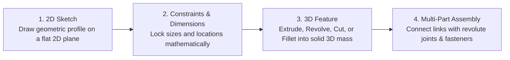
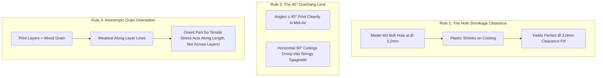

# Unit 5: The Bones: Mechanics, Kinematics, & CAD Modeling
# Module 5.4: Computer-Aided Design (CAD) & Designing for 3D Printing

> **Prerequisites**: Module 5.1 (Materials & Fasteners), Module 5.3 (Kinematics)  
> **Estimated Time**: 50 minutes  
> **Interactive Activity**: Parametric 3D Modeling of a Robotic Servo Bracket in Onshape  
> **Target Audience**: High School & College Students (Zero Prior 3D Modeling Experience)  

---

## 1. Learning Objectives

By the end of this module, you will be able to:
- [ ] **Navigate** cloud-native parametric 3D CAD (**Onshape**) using the 2D-Sketch to 3D-Feature engineering workflow [^1].
- [ ] **Apply** geometric constraints (Concentric, Coincident, Tangent, Symmetric) to create **Fully Constrained Sketches** [^1].
- [ ] **Implement** Design for Additive Manufacturing (DFAM) rules: hole shrinkage clearances, the $45^\circ$ overhang limit, and layer adhesion orientation [^1] [^2].
- [ ] **Export** standard fabrication formats: **STL/STEP** for 3D printing and **DXF** for laser cutting [^1].

---

## 2. Intuitive Big Picture: The Digital Machine Shop

Before computer modeling, mechanical engineers drew blueprints by hand with compasses and rulers. If an axle hole needed to move by 2 millimeters, thousands of hours of hand-drawn blueprints had to be scrapped and redrawn from scratch.

Today, engineers use **Parametric Computer-Aided Design (CAD)** [^1]:
- **Parametric** means that parts are driven by mathematical relationships and dimensions. 
- If you change a servo motor's width from $20\text{mm}$ to $22\text{mm}$, the bracket holes, mounting plates, and fastener clearances **automatically adapt in real time** [^1]!



In this curriculum, we use **Onshape**—a professional, browser-based cloud CAD system that runs smoothly on Chromebooks, Macs, Windows, and Linux without downloading heavy software [^1].

---

## 3. The Core Concept Explained

### 3.1 The 4-Step Parametric Modeling Workflow

Every mechanical part in Onshape is constructed using a four-step lifecycle [^1]:

```text
 1. Select Plane (Top / Front / Right)
 2. Sketch 2D Profile (Lines, Circles, Rectangles)
 3. Add Geometric Constraints (Concentric, Equal, Horizontal) + Dimensions (mm)
    *BLUE lines = Under-constrained (Can be dragged out of shape)
    *BLACK lines = Fully-constrained (Locked mathematically in space!)
 4. Apply 3D Extrude (Pushes the 2D sketch into a 3D solid object)
```

#### Essential Geometric Constraints:
- **Coincident**: Locks two points together or snaps a point onto a line.
- **Concentric**: Forces two circular holes or arcs to share the exact same center point (essential for bolt holes inside circular bosses!).
- **Equal**: Forces multiple lines to have the exact same length, or holes to share the same diameter.
- **Tangent**: Creates a smooth, continuous transition between an arc and a straight line [^1].

---

### 3.2 Design for Additive Manufacturing (DFAM Rules for 3D Printing)

3D printing (Fused Deposition Modeling / FDM) creates parts by squeezing molten plastic through a heated brass nozzle layer by layer. 

Designing a part on a computer screen does not guarantee it can physically exist. You must design specifically for the physics of 3D printing [^1] [^2]:



#### Rule 1: The Hole Shrinkage Offset
When molten plastic cools from $210^\circ\text{C}$ to room temperature, it contracts. Inner circular holes shrink slightly more than outer dimensions.
- If you need a bolt hole for an **M3 screw ($3.0\text{mm}$)**:
  - **Do NOT model it at $3.0\text{mm}$** (the screw will jam!).
  - Model it at **$3.2\text{mm}$ to $3.4\text{mm}$** for a smooth clearance fit [^1].
- For **Brass Heat-Set Threaded Inserts**:
  - Model an M3 insert pocket at **$4.0\text{mm}$ to $4.2\text{mm}$** (the hot brass will melt its way into the plastic wall).

#### Rule 2: The $45^\circ$ Overhang Threshold
Because each molten layer must rest on the layer beneath it, printers cannot deposit plastic into empty air.
- Any overhang with an angle **$\le 45^\circ$ relative to vertical** can be printed cleanly with zero supports.
- Any flat horizontal bridge longer than a few millimeters will sag into stringy spaghetti unless sacrificial support structures are enabled in the slicing software [^1].

#### Rule 3: Anisotropic Layer Delamination
3D printed parts have **anisotropic strength**—they are strong in the $(X, Y)$ plane, but **weak between layer boundaries along the $Z$-axis**:
- Never orient a robotic arm link vertically so that payload lifting force tries to pull the layers apart! 
- Always print links **flat on their side** so the continuous plastic extrusion threads run the entire length of the structural limb [^1] [^2].

---

## 4. Hands-On CAD Walkthrough: Modeling a Servo Bracket

### Lab Objective
In this exercise, you will create a free educational account on [Onshape](https://www.onshape.com/) and model a custom **U-Channel Servo Bracket** for an SG90 micro-servo.

```text
               +---------------------------------------+
               |  (O) M3 Bolt Hole         (O)         |
               |                                       |
               |     +---------------------------+     |
               |     |  SG90 Servo Body Cutout   |     |
               |     |      (23.0mm x 12.5mm)    |     |
               |     +---------------------------+     |
               |                                       |
               |  (O)                      (O)         |
               +---------------------------------------+
```

### Step-by-Step Modeling Steps in Onshape:
1. **Create Document**: Name it `Instructabot_Servo_Bracket`.
2. **Create Sketch on Top Plane**:
   - Select the **Top Plane** and click **New Sketch** ($N$ key to view normal).
   - Use the **Center Point Rectangle** tool: Draw a rectangle centered at the origin.
   - Press $D$ (Dimension tool): Set width to **$40.0\text{ mm}$** and height to **$28.0\text{ mm}$**.
3. **Cut the Servo Rectangular Pocket**:
   - Inside the main rectangle, sketch another Center Point Rectangle.
   - Dimension it to **$23.0\text{ mm}$ width** by **$12.5\text{ mm}$ height** (standard SG90 body size + $0.5\text{mm}$ clearance).
4. **Add Mounting Screw Holes**:
   - Sketch four circles in the corners.
   - Apply an **Equal Constraint** to all four circles.
   - Dimension one circle to **$3.2\text{ mm}$** (M3 clearance).
   - Dimension hole centers **$4.0\text{ mm}$** inward from the outer edges.
   - Notice that every single line has turned **BLACK** (Fully Constrained!).
5. **Extrude into 3D Solid**:
   - Click the green checkmark to finish sketch.
   - Select the **Extrude** tool (Shift + E).
   - Select the face between the outer boundary and the inner cutout.
   - Set Depth to **$3.0\text{ mm}$** (solid plate thickness).
   - Click green checkmark. You now have a solid, professional 3D robotic bracket ready for 3D printing!

---

## 5. Troubleshooting & CAD Pitfalls

> [!WARNING]
> **Pitfall 1: Leaving Blue (Under-Constrained) Sketches**  
> If lines in your sketch are **blue**, they are not locked by dimensions or constraints. If you accidentally click and drag with your mouse, the entire bracket will stretch out of shape without warning! Always add dimensions and constraints until **every line in the sketch turns solid black** [^1].

> [!WARNING]
> **Pitfall 2: Sharp Internal $90^\circ$ Corners (Stress Concentrations)**  
> Sharp internal corners create severe mechanical stress concentrations where cracks begin. In CAD, always add **Fillets (rounds)** with a radius of $1.5\text{mm} - 3.0\text{mm}$ to internal corners. Fillets distribute mechanical stress evenly and significantly strengthen 3D-printed parts [^1] [^2]!

---

## 6. Real-World Applications & Next Steps

Parametric CAD and digital fabrication have revolutionized robotics:
- NASA JPL engineers design rover wheels and chassis in parametric CAD, run finite element stress simulations (FEA), and transmit files directly to multi-axis CNC mills and metal 3D printers.
- Rapid-prototyping teams can design, print, and test a custom robotic gripper in a single afternoon.

In our unit capstone, **Lab 5: Designing and Sizing a 2-DOF Robotic Arm Link**, we will assemble our CAD skills with kinematics and torque calculations: modeling a 2-link robotic arm with servo mount brackets and calculating the joint stall torque needed to lift payloads!

---

## 7. Sources & Media Provenance

### Cited References
[^1]: **PTC Education Team**, *"Onshape Fundamentals: Parametric 3D CAD Curriculum"*, PTC Inc. Available: [Onshape Learning Center](https://learn.onshape.com/).  
[^2]: **Richard G. Budynas, J. Keith Nisbett**, *"Shigley's Mechanical Engineering Design (Chapter 3: Load and Stress Analysis & Fillets)"*, McGraw-Hill Education. Available: [Shigley's Mechanical Engineering Design](https://www.mheducation.com/highered/product/shigley-s-mechanical-engineering-design-budynas-nisbett/M9780073398204.html).  
[^3]: **NASA Engineering and Safety Center (NESC)**, *"NASA Technical Handbook: Structural and Mechanical Design Guidelines (NASA-HDBK-7005)"*, National Aeronautics and Space Administration. Available: [NASA Technical Standards](https://standards.nasa.gov/standard/nasa/nasa-hdbk-7005).

### Media Manifest
| Asset Name | Media Type | Source / Repository | License | Attribution |
| :--- | :--- | :--- | :--- | :--- |
| `onshape-arm-model.png` | Screenshot / CAD | PTC Onshape / Instructabot Educational Team | CC BY 4.0 | PTC Onshape / Instructabot [^1] |
| `stability-polygon.svg` | Vector Graphic | Instructabot Educational Team | CC BY-SA 4.0 | Instructabot Project [^3] |
| `five-subsystems-flow.svg` | Vector Diagram | Instructabot Educational Team | CC BY-SA 4.0 | Instructabot Project |

---

## 🧭 Lesson Navigation

| ⬅️ Previous Lesson | 🗺️ Course Hub | ➡️ Next Lesson |
| :--- | :---: | ---: |
| [← Module 5.3: Spatial Geometry & Forward Kinematics](03-spatial-geometry-kinematics.md) | [**Master Syllabus**](../../syllabus.md) • [**Getting Started**](../../getting_started.md) | [**Lab 5: Designing & Sizing a 2-DOF Robotic Arm Link →**](lab-05-robotic-arm-cad-sizing.md) |
