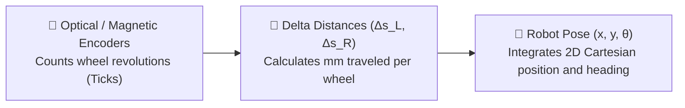
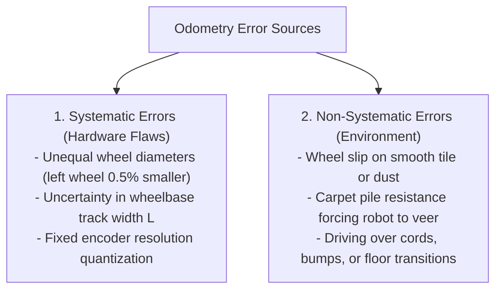

# Unit 6: Movement & Mobile Robotics: Driving the Physical World
# Module 6.2: Odometry & Encoders: Tracking Position in Space

> **Prerequisites**: Module 6.1 (Differential Drive Kinematics)  
> **Estimated Time**: 45 minutes  
> **Interactive Activity**: Building a Real-Time Dead-Reckoning Odometry Engine in Python  
> **Target Audience**: High School & College Students (Zero Prior State Estimation Experience)  

---

## 1. Learning Objectives

By the end of this module, you will be able to:
- [ ] **Explain** how **Quadrature Encoders** use two $90^\circ$ phase-shifted channels (A and B) to detect both position and direction of rotation [^1].
- [ ] **Calculate** linear distance per encoder tick ($C_m = \frac{2\pi r}{\text{Ticks per Rev}}$) [^1] [^2].
- [ ] **Implement** the discrete **Dead-Reckoning Odometry** equations to continuously update robot pose $(x, y, \theta)$ in 2D space [^1].
- [ ] **Classify** systematic vs. non-systematic odometry drift errors and explain why dead reckoning alone is insufficient for long-term navigation [^1] [^2].

---

## 2. Intuitive Big Picture: Walking with Your Eyes Closed

Imagine closing your eyes in your living room and attempting to walk into the kitchen:
1. You count your steps: *"1 step forward, 2 steps forward, 3 steps forward..."*
2. You estimate your turning angle: *"Turn roughly $90^\circ$ left..."*
3. You take 5 more steps forward.

In your mind, you have a mental map of where you are. This process of estimating your current position based solely on counted steps and prior movements is called **Dead Reckoning** [^1].



In robotics, **Odometry** is the mathematical engine that turns raw motor shaft revolutions into real-time Cartesian coordinates $(x, y, \theta)$ [^1] [^2].

---

## 3. The Core Concept Explained

### 3.1 Quadrature Encoders: Decoding Direction & Position

An **incremental encoder** measures rotation by generating digital pulses as a wheel turns. There are two primary physical types [^1]:
1. **Optical Encoders**: An infrared LED shines through a slotted plastic disc onto a photodiode. As the disc spins, the light beam is chopped into pulses.
2. **Magnetic Hall-Effect Encoders**: A multi-pole magnetic disc spins next to two Hall-effect semiconductor sensors that detect magnetic field transitions.

```text
               Direction: FORWARD (Clockwise)
 Channel A:  ___|---|___|---|___|---|___   (Phase leads Channel B by 90°)
 Channel B:  _____|---|___|---|___|---|___

               Direction: REVERSE (Counter-Clockwise)
 Channel A:  _____|---|___|---|___|---|___
 Channel B:  ___|---|___|---|___|---|___   (Phase leads Channel A by 90°)
```

#### How Quadrature Detects Direction:
By placing two sensor channels ($A$ and $B$) physically offset by a quarter-cycle (**$90^\circ$ out of phase**, or "in quadrature") [^1]:
- **Forward Rotation**: Channel A transitions `HIGH` **before** Channel B.
- **Reverse Rotation**: Channel B transitions `HIGH` **before** Channel A.

#### 4X Decoding Resolution:
By triggering a microcontroller interrupt on **both the rising and falling edges** of both Channel A and Channel B, you capture **4 distinct states per cycle**:

$$\text{Total Counts per Revolution} = 4 \times \text{Pulses Per Revolution (PPR)}$$

A budget motor with an 11 PPR magnetic encoder and a 30:1 gearbox produces:
$$11 \times 4 \times 30 = \mathbf{1,320\text{ ticks per wheel revolution!}}$$
This allows the robot to measure wheel rotation down to fractions of a millimeter [^1]!

---

### 3.2 The Dead-Reckoning Integration Math

To track the robot's pose in the room, we define the **Pose Vector** as:

$$\mathbf{p} = \begin{bmatrix} x \\ y \\ \theta \end{bmatrix}$$

*(where $x$ and $y$ are Cartesian coordinates in meters, and $\theta$ is the robot's heading angle in radians)* [^1].

#### Step 1: Distance per Tick Constant ($C_m$)
For a wheel with radius $r$:
$$C_m = \frac{2 \pi r}{\text{Ticks per Revolution}}$$

#### Step 2: Wheel Displacements per Sampling Slice ($\Delta t$)
$$\Delta s_L = \Delta \text{ticks}_L \times C_m \qquad\qquad \Delta s_R = \Delta \text{ticks}_R \times C_m$$

#### Step 3: Robot Center Displacement and Heading Change
The distance traveled by the center of the robot ($\Delta s$) and the change in orientation ($\Delta \theta$) are [^1]:

$$\Delta s = \frac{\Delta s_R + \Delta s_L}{2} \qquad\qquad \Delta \theta = \frac{\Delta s_R - \Delta s_L}{L}$$

#### Step 4: Pose Update Integration (2nd-Order Runge-Kutta)
To account for continuous turning during the time slice, we project the displacement along the **average heading** ($\theta + \frac{\Delta \theta}{2}$) [^1] [^2]:

$$x_{k+1} = x_k + \Delta s \cdot \cos\left(\theta_k + \frac{\Delta \theta}{2}\right)$$

$$y_{k+1} = y_k + \Delta s \cdot \sin\left(\theta_k + \frac{\Delta \theta}{2}\right)$$

$$\theta_{k+1} = \theta_k + \Delta \theta$$

---

### 3.3 The Drift Nemesis: Systematic vs. Non-Systematic Errors

Why does dead-reckoning odometry eventually fail if run for a long time?

Odometry errors are **cumulative**—any tiny error committed on step 1 is added into step 2, step 3, and forever into the future [^1] [^2]:



```text
 True Robot Path:       [ Start ] -------------------------> [ Goal: X=5.0m, Y=0.0m ]
 Odometry Believes:     [ Start ] -------------------------> [ "Goal Reached!" ]
 Physical Reality:      [ Start ] ---------\____             [ Actual: X=4.6m, Y=-0.8m ] (Drifted!)
```

> [!IMPORTANT]
> **The Role of Odometry in Modern Robotics**:
> Odometry is **superb for high-speed local control** over short time horizons ($1\text{ to } 5\text{ seconds}$). However, after driving 100 meters, odometry error can grow to several meters. 
> To correct this drift, autonomous robots fuse odometry with **external environmental perception** (LiDAR SLAM, cameras, AprilTags) to periodically snap the robot's pose back to ground truth [^1] [^2]!

---

## 4. Hands-On Python Odometry Engine Lab

### Lab Objective
In this exercise, you will implement a discrete Odometry pose integration class in Python, simulating a mobile robot driving forward in an $S$-curve and tracking its $(x, y, \theta)$ position in real time.

```python
import math
import time

class OdometryTracker:
    def __init__(self, wheel_radius_m=0.035, track_width_m=0.15, ticks_per_rev=1320):
        self.L = track_width_m
        # Distance per single encoder tick in meters
        self.meters_per_tick = (2.0 * math.pi * wheel_radius_m) / ticks_per_rev

        # Current robot pose: [x (m), y (m), theta (rad)]
        self.x = 0.0
        self.y = 0.0
        self.theta = 0.0

        self.last_ticks_left = 0
        self.last_ticks_right = 0

    def update(self, current_ticks_left, current_ticks_right):
        """
        Updates the 2D Cartesian pose based on new cumulative encoder ticks.
        """
        # 1. Calculate delta ticks since last update
        delta_ticks_l = current_ticks_left - self.last_ticks_left
        delta_ticks_r = current_ticks_right - self.last_ticks_right
        
        self.last_ticks_left = current_ticks_left
        self.last_ticks_right = current_ticks_right

        # 2. Convert tick deltas into linear distances traveled by each wheel
        delta_s_l = delta_ticks_l * self.meters_per_tick
        delta_s_r = delta_ticks_r * self.meters_per_tick

        # 3. Calculate robot center displacement and angular rotation
        delta_s = (delta_s_r + delta_s_l) / 2.0
        delta_theta = (delta_s_r - delta_s_l) / self.L

        # 4. Integrate pose using average heading approximation
        avg_theta = self.theta + (delta_theta / 2.0)
        self.x += delta_s * math.cos(avg_theta)
        self.y += delta_s * math.sin(avg_theta)
        self.theta += delta_theta

        # Normalize theta to stay cleanly within [-pi, +pi]
        self.theta = math.atan2(math.sin(self.theta), math.cos(self.theta))

        return round(self.x, 3), round(self.y, 3), round(math.degrees(self.theta), 1)

# --- Simulation Experiment ---
tracker = OdometryTracker(wheel_radius_m=0.035, track_width_m=0.15, ticks_per_rev=1320)

print("🧭 Simulating Odometry Pose Integration:")
print("Step | Left Ticks | Right Ticks | Pose: X (m) | Pose: Y (m) | Heading (deg)")
print("-" * 70)

# Simulate robot driving straight, then turning left
simulated_ticks = [
    (132, 132),   # Move forward 0.1 rev
    (264, 264),   # Move forward 0.2 rev
    (396, 528),   # Right wheel spins faster -> Turning Left!
    (528, 792),   # Continuing left turn
    (700, 964)    # Driving straight along new heading
]

for step, (t_l, t_r) in enumerate(simulated_ticks):
    pos_x, pos_y, heading_deg = tracker.update(t_l, t_r)
    print(f" {step+1:2d}  | {t_l:10d} | {t_r:11d} | {pos_x:10.3f} | {pos_y:10.3f} | {heading_deg:9.1f}°")
    time.sleep(0.05)
```

Notice how the coordinate tracker accurately plots the robot's curved $(x, y)$ trajectory and heading angle!

---

## 5. Troubleshooting & Odometry Pitfalls

> [!WARNING]
> **Pitfall 1: Encoder Interrupt Overflow (Missing Ticks)**  
> If an encoder produces $5,000\text{ ticks per second}$ at top speed, and your microcontroller spends too long inside a slow function, the processor will miss hardware interrupt pulses. Missing ticks on one wheel causes the odometry math to believe the robot is turning when it is actually driving straight. Always use dedicated hardware timer counters (like the RP2040's programmable I/O / PIO) or keep interrupt routines to a few nanoseconds [^1] [^2]!

> [!WARNING]
> **Pitfall 2: Angle Wrapping (-180° to +180°)**  
> If a robot rotates continuously clockwise past $+180^\circ$ ($+\pi\text{ rad}$), the raw angle variable will continue climbing to $360^\circ, 720^\circ$, and beyond. If a control algorithm tries to subtract angles without normalization, it will calculate an error of $350^\circ$ instead of $10^\circ$! Always normalize heading using `math.atan2(math.sin(theta), math.cos(theta))`.

---

## 6. Real-World Applications & Next Steps

Odometry is the fundamental clock of modern autonomous navigation:
- The ROS 2 Navigation stack (`Nav2`) requires a continuous stream of `nav_msgs/Odometry` messages to fuse with LiDAR scans in Extended Kalman Filters (EKF).
- Computer mouse sensors are essentially high-speed optical surface odometry chips tracking $(x, y)$ movements over desks.

In our next module, **Module 6.3: Closed-Loop Control (The PID Controller)**, we will solve the ultimate mobile robotics challenge: why robots with identical motor commands always veer off course, and how PID feedback loops force robots to drive laser-straight!

---

## 7. Sources & Media Provenance

### Cited References
[^1]: **Roland Siegwart, Illah R. Nourbakhsh, Davide Scaramuzza**, *"Introduction to Autonomous Mobile Robots (Chapter 5: Mobile Robot Localization & Odometry)"*, MIT Press. Available: [MIT Press Autonomous Mobile Robots](https://mitpress.mit.edu/9780262015356/introduction-to-autonomous-mobile-robots/).  
[^2]: **Kevin M. Lynch, Frank C. Park**, *"Modern Robotics: Mechanics, Planning, and Control (Chapter 13: Wheeled Robot Odometry)"*, Cambridge University Press. License: CC BY-NC-ND 4.0. Available: [Modern Robotics](https://modernrobotics.northwestern.edu/).  
[^3]: **Karl Johan Åström, Richard M. Murray**, *"Feedback Systems: An Introduction for Scientists and Engineers"*, Princeton University Press. License: CC BY-SA 3.0. Available: [Feedback Systems OER](https://fbswiki.org/wiki/index.php/Feedback_Systems:_An_Introduction_for_Scientists_and_Engineers).

### Media Manifest
| Asset Name | Media Type | Source / Repository | License | Attribution |
| :--- | :--- | :--- | :--- | :--- |
| `quadrature-encoder.svg` | Vector Graphic / Waveforms | Instructabot Educational Team | CC BY-SA 4.0 | Instructabot Project [^1] |
| `diff-drive-kinematics.svg` | Vector Graphic | Instructabot Educational Team | CC BY-SA 4.0 | Instructabot Project |
| `five-subsystems-flow.svg` | Vector Diagram | Instructabot Educational Team | CC BY-SA 4.0 | Instructabot Project |

---

## 🧭 Lesson Navigation

| ⬅️ Previous Lesson | 🗺️ Course Hub | ➡️ Next Lesson |
| :--- | :---: | ---: |
| [← Module 6.1: Mobile Robot Drive Architectures & Kinematics](01-drive-architectures.md) | [**Master Syllabus**](../../syllabus.md) • [**Getting Started**](../../getting_started.md) | [**Module 6.3: Closed-Loop Control: The PID Controller →**](03-closed-loop-pid-control.md) |
