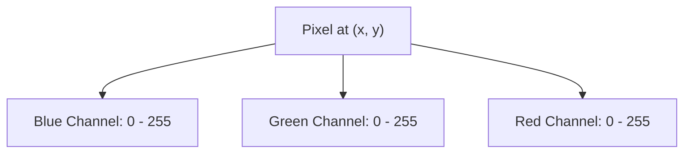
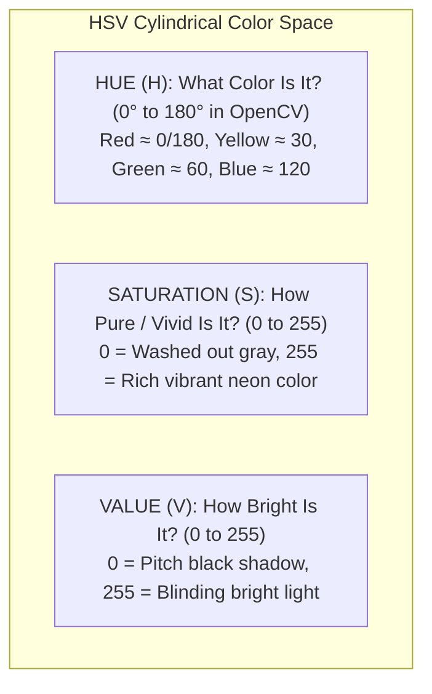

# Unit 7: Vision: Giving Robots Sight with OpenCV
# Module 7.1: Digital Images as Numeric Matrices

> **Prerequisites**: Unit 2 (Python & NumPy Basics), Unit 3 (Sensors & Analog Signals)  
> **Estimated Time**: 45 minutes  
> **Interactive Activity**: Inspecting Image Matrices, Slicing Pixel Regions, and Converting Color Spaces in Python  
> **Target Audience**: High School & College Students (Zero Prior Computer Vision Background)  

---

## 1. Learning Objectives

By the end of this module, you will be able to:
- [ ] **Deconstruct** a digital image into its underlying multidimensional numeric matrix (height, width, color channels) [^1].
- [ ] **Explain** why computer vision systems place the coordinate origin $(0, 0)$ at the top-left corner and how Cartesian $(x, y)$ maps to array indexing `[row, col]` [^1] [^2].
- [ ] **Compare** the RGB/BGR color space to the **HSV (Hue, Saturation, Value)** color space and articulate why HSV provides lighting invariance for robotic perception [^1] [^2].
- [ ] **Manipulate** image matrices in Python using NumPy array slicing without causing `uint8` arithmetic overflow bugs [^1].

---

## 2. Intuitive Big Picture: The Robot's Spreadsheet

When humans look at a photograph of a red apple on a wooden desk, our brains instantly recognize objects, textures, shadows, and depths.

When a robot's camera looks at that same apple, it sees **nothing but a gigantic grid of numbers**—literally a 2D or 3D spreadsheet where every cell stores an integer between `0` (pitch black) and `255` (maximum brightness) [^1]!


To give a robot sight, we do not teach it "philosophy of vision." We perform **arithmetic, linear algebra, and statistical operations on matrices of numbers** [^1] [^2].

---

## 3. The Core Concept Explained

### 3.1 Pixels, Resolution, and Coordinate Systems

A digital image consists of a two-dimensional grid of tiny discrete picture elements called **pixels** [^1]:
- **Resolution**: Expressed as $\text{Width} \times \text{Height}$ (e.g., $640 \times 480$, $1920 \times 1080$).
- **The Top-Left Origin $(0, 0)$**: In standard high-school mathematics, the origin $(0, 0)$ sits at the bottom-left corner, and $y$ increases upwards. In computer vision and displays, **the origin $(0, 0)$ is at the top-left corner**, and $y$ increases **downwards** (`image-matrix-coords.svg`) [^1] [^2]!

```
(0, 0) ------------------------> X (Columns, Width: 0 to 639)
  |      Pixel (x=100, y=50)
  |            [ * ]
  |
  V
  Y (Rows, Height: 0 to 479)
```

> [!IMPORTANT]
> **The $(x, y)$ vs. `[row, col]` Inversion Trapping Every Beginner:**  
> When accessing an image matrix in Python/NumPy, array indexing is `matrix[row, column]`.  
> - Rows correspond to the vertical axis (**$y$**).  
> - Columns correspond to the horizontal axis (**$x$**).  
> Therefore, accessing point $(x, y)$ requires writing `img[y, x]`, NOT `img[x, y]`! Swapping these causes instant `IndexError: index out of bounds` [^1].

---

### 3.2 Channels: Grayscale vs. RGB vs. BGR

Each pixel can store one or more numbers depending on the color format [^1]:

1. **Grayscale (Single Channel)**:
   - A 2D matrix of shape `(Height, Width)`.
   - Each pixel is a single `uint8` byte ($0 = \text{Black}$, $255 = \text{White}$, $128 = \text{Middle Gray}$).
   - Memory footprint for $640 \times 480 = 307,200\text{ bytes} \approx 307\text{ KB}$.

2. **RGB Color (Three Channels)**:
   - A 3D tensor of shape `(Height, Width, 3)`.
   - Three stacked planes representing the additive primary colors of light: **Red, Green, and Blue**.
   - Red pixel: `[255, 0, 0]`; Yellow pixel: `[255, 255, 0]`; White pixel: `[255, 255, 255]`.



> [!WARNING]
> **OpenCV's Historical BGR Convention:**  
> While the rest of computer science uses **RGB**, the OpenCV library internally loads images in **BGR (Blue, Green, Red)** order due to legacy IBM camera hardware standards in the late 1990s! If you display an OpenCV BGR image using Matplotlib, people's faces will look blue and fire will look cyan. Always convert `cv2.cvtColor(img, cv2.COLOR_BGR2RGB)` before passing to Matplotlib [^1]!

---

### 3.3 The Fragility of RGB vs. The Power of HSV

Why can't our robot simply look for bright orange balls by checking `if R > 200 and G > 100 and B < 50`?

In the real physical world, **lighting is constantly changing** [^1] [^2]:
- In direct sunlight, the orange ball reflects intense light: `R=255, G=140, B=20`.
- In a shadowy corner of the room, the same ball reflects dim light: `R=110, G=55, B=8`.
- In RGB, brightness is mixed inextricably into every single channel! Changing the room's lamp causes all three values ($R, G, B$) to collapse, breaking hardcoded thresholds.

To solve this, roboticists convert camera frames into **HSV (Hue, Saturation, Value)** [^1] [^2]:



By decoupling pure color tint (**Hue**) from ambient illumination (**Value**), our robot can isolate a red object simply by checking `Hue within [0, 10]`, regardless of whether a shadow falls over it [^1]!

---

## 4. Practical Hands-On: Matrix Manipulation in Python

Let's inspect, crop, and convert an image matrix using pure Python and NumPy [^1]:

```python
"""
Instructabot Module 7.1: Image Matrix Fundamentals & Color Spaces
Run with: python -m pip install numpy opencv-python
"""

import numpy as np

# 1. Create a synthetic 3-channel BGR image (Height=480, Width=640)
# A black canvas filled with zeros
canvas = np.zeros((480, 640, 3), dtype=np.uint8)

print(f"Canvas Shape: {canvas.shape}")  # (480, 640, 3)
print(f"Data Type: {canvas.dtype}")      # uint8 (0 to 255)
print(f"Total Bytes: {canvas.nbytes:,} bytes (~921 KB)")

# 2. Paint a solid Blue rectangle in the top-left quadrant
# Note: OpenCV uses BGR -> [Blue, Green, Red]
canvas[50:200, 50:200] = [255, 0, 0]  # Pure Blue

# 3. Paint a solid Yellow circle/square in the center
# Yellow in BGR is Blue=0, Green=255, Red=255
canvas[200:350, 250:400] = [0, 255, 255]

# 4. Inspect a single pixel at (x=300, y=250) -> row=250, col=300
pixel_val = canvas[250, 300]
print(f"Pixel at (x=300, y=250) [B, G, R]: {pixel_val}")

# 5. Extract a sub-region (Region of Interest / ROI) via array slicing
roi = canvas[200:350, 250:400]
print(f"ROI Sub-matrix shape: {roi.shape}")

# 6. Demonstrating uint8 arithmetic overflow pitfall
val_a = np.uint8(250)
val_b = np.uint8(10)
bad_sum = val_a + val_b  # 250 + 10 = 260 -> wraps to 4!
print(f"⚠️ Standard uint8 Overflow: 250 + 10 = {bad_sum}")

# Safe OpenCV saturated arithmetic clamps to 255
import cv2
arr_a = np.array([250], dtype=np.uint8)
arr_b = np.array([10], dtype=np.uint8)
safe_sum = cv2.add(arr_a, arr_b)
print(f"✅ cv2.add Saturated Arithmetic: 250 + 10 = {safe_sum[0]}")
```

---

## 5. Troubleshooting & Vision Pitfalls

> [!WARNING]
> **Pitfall 1: Unintentional In-Place Modification via Slices**  
> In NumPy, slicing an image `roi = img[100:200, 100:200]` does **not** create a copy; it creates a *view* pointing to the exact same RAM memory! If you modify `roi`, you permanently alter the original `img`. If you want an independent copy, always call `.copy()`: `roi = img[100:200, 100:200].copy()` [^1].

> [!WARNING]
> **Pitfall 2: The Red Hue Wrap-Around in HSV**  
> In standard color theory, Hue is a $360^\circ$ circle. In OpenCV, Hue is compressed into $0 - 180$ so it fits into a single `uint8` byte. Pure red sits at the very beginning ($0^\circ - 10^\circ$) AND the very end ($170^\circ - 180^\circ$) of the circle! Detecting red requires checking two separate ranges and merging them (`mask = mask1 | mask2`) [^1] [^2].

---

## 6. Real-World Applications & Next Steps

Understanding image matrices is the foundational building block for all robotic vision:
- **Mars Rovers**: Camera images are downsampled and compressed into compact matrices before transmitting across millions of miles of deep-space radio links.
- **Factory Sorting**: Quality inspection cameras analyze pixel intensities along bottle rims to detect micro-cracks before soda bottles are filled.
- **Agricultural Drones**: Multi-spectral cameras measure Near-Infrared (NIR) channel intensity matrices to calculate the Normalized Difference Vegetation Index (NDVI) and evaluate crop health.

In **Module 7.2: OpenCV Foundations in Python**, we will load live camera streams and apply filtering operations: blurring to suppress noise, thresholding to isolate shapes, and extracting edge contours!

---

## 7. Sources & Media Provenance

### Cited References
[^1]: **Gary Bradski, Adrian Kaehler**, *"Learning OpenCV: Computer Vision with the OpenCV Library (Chapter 2 & 3: Image Processing & Matrices)"*, O'Reilly Media / OpenCV Foundation. License: Apache License 2.0. Available: [OpenCV Official Documentation](https://docs.opencv.org/4.x/).  
[^2]: **Richard Szeliski**, *"Computer Vision: Algorithms and Applications (2nd Edition, Chapter 2: Image Formation & Color)"*, Springer. License: Open Access Electronic Edition. Available: [Szeliski Computer Vision](https://szeliski.org/Book/).  
[^3]: **Roland Siegwart, Illah R. Nourbakhsh, Davide Scaramuzza**, *"Introduction to Autonomous Mobile Robots (Chapter 4: Computer Vision)"*, MIT Press. Available: [MIT Press Autonomous Mobile Robots](https://mitpress.mit.edu/9780262015356/introduction-to-autonomous-mobile-robots/).

### Media Manifest
| Asset Name | Media Type | Source / Repository | License | Attribution |
| :--- | :--- | :--- | :--- | :--- |
| `image-matrix-coords.svg` | Vector Graphic / Coordinate Diagram | Instructabot Educational Team | CC BY-SA 4.0 | Instructabot Project [^1] [^2] |
| `opencv-pipeline.svg` | Vector Flowchart | Instructabot Educational Team | CC BY-SA 4.0 | Instructabot Project [^1] |
| `five-subsystems-flow.svg` | Vector Diagram | Instructabot Educational Team | CC BY-SA 4.0 | Instructabot Project |

---

## 🧭 Lesson Navigation

| ⬅️ Previous Lesson | 🗺️ Course Hub | ➡️ Next Lesson |
| :--- | :---: | ---: |
| [← Lab 6: Autonomous Maze-Navigating Mobile Robot in Webots](../unit-06-mobile-robotics/lab-06-maze-navigation-webots.md) | [**Master Syllabus**](../../syllabus.md) • [**Getting Started**](../../getting_started.md) | [**Module 7.2: OpenCV Foundations in Python →**](02-opencv-python-foundations.md) |
