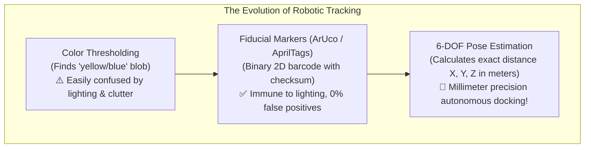
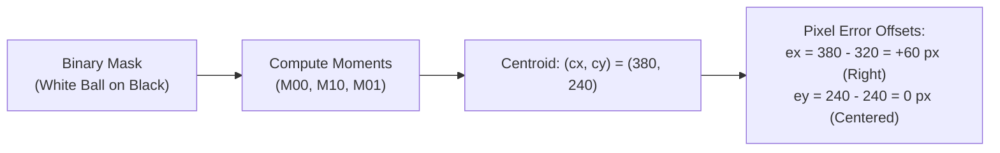

# Unit 7: Vision: Giving Robots Sight with OpenCV
# Module 7.3: Object Tracking & Fiducial Markers (ArUco)

> **Prerequisites**: Module 7.1 (Image Matrices), Module 7.2 (OpenCV Foundations)  
> **Estimated Time**: 55 minutes  
> **Interactive Activity**: Color-Based Centroid Tracking & 6-DOF ArUco Marker Pose Estimation in Python  
> **Target Audience**: High School & College Students (Zero Prior Computer Vision Background)  

---

## 1. Learning Objectives

By the end of this module, you will be able to:
- [ ] **Isolate and track** a target colored object in real time using HSV thresholding and spatial image moments ($M_{00}, M_{10}, M_{01}$) [^1] [^2].
- [ ] **Calculate** horizontal and vertical pixel error offsets from the camera center to feed closed-loop visual servoing controllers [^1].
- [ ] **Explain** why color tracking alone is brittle and why industrial robotics relies on **Fiducial Markers** (ArUco / AprilTags) [^1] [^3].
- [ ] **Perform 6-DOF pose estimation** to calculate the exact 3D Cartesian position $[X, Y, Z]$ and orientation $[Roll, Pitch, Yaw]$ of a marker relative to the camera lens [^1] [^3].

---

## 2. Intuitive Big Picture: The Drone Landing Problem

Imagine an autonomous drone returning to base in a windy rainstorm. It needs to land with millimeter precision on a tiny wireless charging pad on top of a building.

Can the drone simply look for a "blue charging pad" using color tracking?
- What if a nearby worker is wearing a blue rain jacket?
- What if headlights from a passing truck reflect off a puddle?
- What if sunlight shifts from noon daylight to red sunset?

Color tracking alone would send the drone crashing into the worker!



To achieve 100% reliable tracking, robotics uses **Fiducial Markers**—mathematically engineered black-and-white 2D barcodes that encode a unique numerical ID, high-contrast corners, and error-correcting parity bits [^1] [^3]!

---

## 3. The Core Concept Explained

### 3.1 Color Segmentation & Centroid Calculation

When tracking an object by color (like a bright tennis ball), our algorithm executes three mathematical steps [^1] [^2]:

1. **HSV Thresholding (`cv2.inRange`)**: Generates a binary mask where pixels inside the $[H_{\min}, S_{\min}, V_{\min}]$ to $[H_{\max}, S_{\max}, V_{\max}]$ bounds turn white (`255`), and all other pixels turn black (`0`).
2. **Spatial Image Moments**: Moments summarize the distribution of pixel intensities across an image:
   - **Zero-Order Moment ($M_{00}$)**: The total area (number of white pixels):
     $$M_{00} = \sum_x \sum_y I(x, y)$$
   - **First-Order Moments ($M_{10}$ and $M_{01}$)**: The sum of $x$ and $y$ pixel coordinates weighted by intensity:
     $$M_{10} = \sum_x \sum_y x \cdot I(x, y), \quad M_{01} = \sum_x \sum_y y \cdot I(x, y)$$
3. **Centroid Coordinates $(c_x, c_y)$**: The center of mass of the target:
   $$c_x = \frac{M_{10}}{M_{00}}, \quad c_y = \frac{M_{01}}{M_{00}}$$



These pixel errors ($e_x, e_y$) feed directly into motor PID controllers to steer the robot or pan-tilt camera toward the target!

---

### 3.2 What Is an ArUco Marker?

Developed by Dr. Sergio Garrido-Jurado and his research group at the University of Córdoba, **ArUco markers** are synthetic square planar patterns consisting of a wide black outer border and an internal binary matrix of black and white cells [^3]:

```
+-------------------+
|  BLACK OUTER BORDER|
|  +-------------+  |
|  | 0 | 1 | 0 | 1|  |  <-- Internal Binary Code
|  | 1 | 0 | 1 | 0|  |      Encodes unique ID (e.g., ID: 42)
|  | 0 | 0 | 1 | 1|  |      Rotational symmetry check
|  +-------------+  |
|                   |
+-------------------+
```

- **Outer Black Border**: Provides maximum visual contrast for instant corner extraction even under low lighting.
- **Internal Matrix**: Encodes a binary number using Hamming error-correcting codes. Even if part of the marker is scratched or covered by shadow, the detector verifies the checksum and rejects false positives.
- **Predefined Dictionaries**: Common sets include `DICT_4X4_50` (4x4 internal grid, 50 distinct IDs) and `DICT_6X6_250` (6x6 grid, 250 distinct IDs) [^1] [^3].

---

### 3.3 6-DOF Pose Estimation via Perspective-n-Point (PnP)

A 2D camera flattens the 3D world into a flat picture. How can a flat picture tell the robot: *"The marker is exactly $1.25\text{ meters}$ away, tilted $15^\circ$ forward"* (`aruco-marker-pose.svg`)?

By solving the **Perspective-n-Point (PnP) Problem** [^1] [^2] [^3]:
1. We know the **exact real-world geometry** of the marker: four flat corners separated by known physical width $s$ (e.g., $s = 0.05\text{ meters}$).
2. The camera observes where those four corners appear on the 2D pixel sensor: $(u_1, v_1), \dots, (u_4, v_4)$.
3. Using the **Camera Intrinsic Calibration Matrix ($K$)**:
   $$\mathbf{K} = \begin{bmatrix} f_x & 0 & c_x \\ 0 & f_y & c_y \\ 0 & 0 & 1 \end{bmatrix}$$
   (where $f_x, f_y$ are lens focal lengths in pixels and $c_x, c_y$ is the optical center), OpenCV computes the unique 3D transformation:
   - **Translation Vector ($\vec{t} = [X, Y, Z]$)**: Physical distance in meters along the camera's $X$ (right), $Y$ (down), and $Z$ (forward into the room) axes!
   - **Rotation Vector ($\vec{r} = [r_x, r_y, r_z]$)**: Orientation of the marker in 3D space [^1] [^3].

---

## 4. Practical Hands-On: Detecting ArUco Markers & Estimating 3D Pose

Here is the complete Python script to generate, detect, and compute the 3D pose of an ArUco marker [^1] [^3]:

```python
"""
Instructabot Module 7.3: ArUco Fiducial Marker Detection & 6-DOF Pose Estimation
Compatible with OpenCV 4.7+ and Python 3.10+
"""

import cv2
import numpy as np

# 1. Define the ArUco Dictionary
aruco_dict = cv2.aruco.getPredefinedDictionary(cv2.aruco.DICT_4X4_50)
aruco_params = cv2.aruco.DetectorParameters()
detector = cv2.aruco.ArucoDetector(aruco_dict, aruco_params)

# 2. Generate a synthetic ArUco marker image (ID = 23, size = 200x200 pixels)
marker_img = cv2.aruco.generateImageMarker(aruco_dict, id=23, sidePixels=200)

# 3. Embed marker into a simulated camera frame (640x480)
frame = np.ones((480, 640), dtype=np.uint8) * 220  # Light gray background
frame[140:340, 220:420] = marker_img               # Place marker in center
frame_bgr = cv2.cvtColor(frame, cv2.COLOR_GRAY2BGR)

# 4. Define Camera Intrinsic Matrix for standard 640x480 webcam
# (focal length ~500px, principal point at image center)
camera_matrix = np.array([
    [500.0,   0.0, 320.0],
    [  0.0, 500.0, 240.0],
    [  0.0,   0.0,   1.0]
], dtype=np.float32)

dist_coeffs = np.zeros((4, 1), dtype=np.float32)  # Zero lens distortion assumption
MARKER_REAL_SIZE = 0.05  # 5 centimeters (0.05 meters)

# 5. Detect Markers in the frame
corners, ids, rejected = detector.detectMarkers(frame_bgr)

if ids is not None and len(ids) > 0:
    print(f"✅ Detected {len(ids)} marker(s)! IDs: {ids.flatten()}")
    
    # Draw detected green boundary around marker
    cv2.aruco.drawDetectedMarkers(frame_bgr, corners, ids)

    # 6. Estimate 3D Pose for each detected marker
    # Define 3D coordinates of marker corners in object frame
    obj_points = np.array([
        [-MARKER_REAL_SIZE/2,  MARKER_REAL_SIZE/2, 0],
        [ MARKER_REAL_SIZE/2,  MARKER_REAL_SIZE/2, 0],
        [ MARKER_REAL_SIZE/2, -MARKER_REAL_SIZE/2, 0],
        [-MARKER_REAL_SIZE/2, -MARKER_REAL_SIZE/2, 0]
    ], dtype=np.float32)

    flat_ids = ids.flatten()
    for i in range(len(flat_ids)):
        # Solve PnP for corner pixels
        success, rvec, tvec = cv2.solvePnP(obj_points, corners[i][0], camera_matrix, dist_coeffs)
        
        if success:
            x_m, y_m, z_m = tvec.flatten()
            print(f"🎯 Marker ID {flat_ids[i]} Pose:")
            print(f"   Position: X={x_m:+6.3f}m, Y={y_m:+6.3f}m, Z={z_m:6.3f}m")
            print(f"   Straight-Line Euclidean Distance: {np.linalg.norm(tvec):6.3f} meters")
            
            # Draw 3D coordinate axes (Red=X, Green=Y, Blue=Z)
            cv2.drawFrameAxes(frame_bgr, camera_matrix, dist_coeffs, rvec, tvec, 0.03)
else:
    print("❌ No markers detected in frame.")
```

---

## 5. Troubleshooting & Marker Tracking Pitfalls

> [!WARNING]
> **Pitfall 1: Specular Glare on Glossy Marker Paper**  
> If an ArUco marker is printed on glossy photo paper or covered in shiny tape, harsh overhead LED lights cause a blinding white specular reflection. The camera sensor saturates, white washes out the black grid cells, and corner detection fails completely! Always print fiducial markers on **matte cardstock** or non-reflective vinyl [^1] [^3].

> [!WARNING]
> **Pitfall 2: Wrong Physical Marker Dimension in `solvePnP`**  
> `solvePnP` computes metric distance based strictly on the `MARKER_REAL_SIZE` you provide. If you tell the code the marker is $10\text{ cm}$ wide, but you actually printed it at $5\text{ cm}$, the estimated distance ($Z$) will be off by a factor of 2! Always measure the printed black square boundary with a physical ruler or caliper [^1] [^3].

---

## 6. Real-World Applications & Next Steps

Fiducial markers are the industry backbone of robotic positioning:
- **NASA International Space Station**: Autonomous cargo spacecraft (SpaceX Dragon, Cygnus) use optical fiducial markers for terminal docking with the ISS berthing port.
- **Amazon Kiva Warehouses**: Orange drive units read optical 2D grid markers printed on the warehouse floor at $60\text{ FPS}$ to maintain sub-centimeter positioning accuracy.
- **Surgical Robotics**: Laparoscopic surgical arms track miniature sterilizable markers to register tool tip positions with preoperative 3D MRI scans.

In **Module 7.4: 3D Depth Sensing Technologies**, we will explore how robots perceive true 3D depth without markers using Stereo Parallax, Structured Light, and LiDAR Time-of-Flight sensors!

---

## 7. Sources & Media Provenance

### Cited References
[^1]: **Gary Bradski, Adrian Kaehler**, *"Learning OpenCV: Computer Vision with the OpenCV Library (Chapter 11: Camera Models & Calibration, Chapter 12: Projection)"*, O'Reilly Media. License: Apache License 2.0. Available: [OpenCV Official Documentation](https://docs.opencv.org/4.x/).  
[^2]: **Richard Szeliski**, *"Computer Vision: Algorithms and Applications (2nd Edition, Chapter 6: Geometric Camera Models & Pose Estimation)"*, Springer. License: Open Access Electronic Edition. Available: [Szeliski Computer Vision](https://szeliski.org/Book/).  
[^3]: **S. Garrido-Jurado, R. Muñoz-Salinas, F. J. Madrid-Cuevas, M. J. Marín-Jiménez**, *"Automatic Generation and Detection of Highly Reliable Fiducial Markers Under Occlusion"*, Pattern Recognition, Vol. 47, No. 6. Available: [ArUco Project University of Córdoba](https://www.uco.es/investiga/grupos/ava/portfolio/aruco/).

### Media Manifest
| Asset Name | Media Type | Source / Repository | License | Attribution |
| :--- | :--- | :--- | :--- | :--- |
| `aruco-marker-pose.svg` | Vector Graphic / 3D Axes | Instructabot Educational Team | CC BY-SA 4.0 | Instructabot Project [^1] [^3] |
| `opencv-pipeline.svg` | Vector Flowchart | Instructabot Educational Team | CC BY-SA 4.0 | Instructabot Project [^1] |
| `image-matrix-coords.svg` | Vector Graphic | Instructabot Educational Team | CC BY-SA 4.0 | Instructabot Project [^2] |

---

## 🧭 Lesson Navigation

| ⬅️ Previous Lesson | 🗺️ Course Hub | ➡️ Next Lesson |
| :--- | :---: | ---: |
| [← Module 7.2: OpenCV Foundations in Python](02-opencv-python-foundations.md) | [**Master Syllabus**](../../syllabus.md) • [**Getting Started**](../../getting_started.md) | [**Module 7.4: 3D Depth Sensing Technologies →**](04-3d-depth-sensing.md) |
