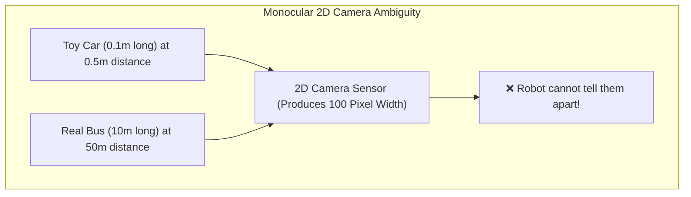
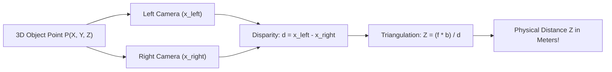

# Unit 7: Vision: Giving Robots Sight with OpenCV
# Module 7.4: 3D Depth Sensing Technologies

> **Prerequisites**: Module 7.1 (Image Matrices), Module 7.2 (OpenCV Foundations), Module 7.3 (Pose Estimation)  
> **Estimated Time**: 50 minutes  
> **Interactive Activity**: Computing Stereo Parallax, Depth Maps, and Generating 3D Point Clouds in Python  
> **Target Audience**: High School & College Students (Zero Prior 3D Vision Experience)  

---

## 1. Learning Objectives

By the end of this module, you will be able to:
- [ ] **Explain** the fundamental scale ambiguity of single 2D cameras (monocular vision) and why 3D depth perception is required for robotic manipulation and navigation [^1] [^2].
- [ ] **Derive** the binocular stereo triangulation equation relating baseline ($b$), focal length ($f$), disparity ($d$), and depth ($Z$) [^1] [^2].
- [ ] **Compare** the trade-offs of the three primary 3D sensing paradigms: **Passive Stereo Vision**, **Active Structured Light**, and **LiDAR / Time-of-Flight (ToF)** [^1] [^3].
- [ ] **Process** a 16-bit depth image in Python to construct a metric 3D Point Cloud ($[X, Y, Z]$ coordinates) [^1].

---

## 2. Intuitive Big Picture: The Optical Illusion Problem

Hold your smartphone up to a life-size billboard photograph of an open hallway. If a robot with a standard 2D camera looks at your phone screen, it will see a hallway and command its motors to drive forward—smashing straight into the glass!

A single 2D camera discards the third dimension ($Z$). A small object close to the lens and a massive object far away produce the **exact same pixel size on the sensor** [^1] [^2]:

$$\text{Pixel Size } p = \frac{f \cdot \text{Real Size } W}{Z}$$



To interact safely with the physical world, robots must possess **true 3D depth perception**—knowing not just *what* an object is, but its exact distance in physical meters [^1] [^2].

---

## 3. The Core Concept Explained

### 3.1 Passive Stereo Vision: Triangulation via Parallax

Human eyes perceive depth through **Stereo Parallax**: hold your finger in front of your face and alternate closing your left and right eyes. Your finger appears to jump back and forth against the background! Closer objects jump dramatically; distant objects barely move.

In robotic **Binocular Stereo Vision**, two parallel cameras are mounted side by side (`stereo-depth-parallax.svg`) [^1] [^2]:
- **Baseline ($b$)**: The horizontal physical distance between the two camera optical centers (e.g., $b = 0.075\text{ m}$).
- **Focal Length ($f$)**: Lens focal length in pixels.
- **Disparity ($d$)**: The pixel coordinate shift of the same physical point between the left and right camera frames ($d = x_{\text{left}} - x_{\text{right}}$).



From similar triangles in geometric optics, the depth $Z$ is derived as [^1] [^2]:

$$Z = \frac{f \cdot b}{d}$$

> [!IMPORTANT]
> **The Inverse Disparity Law:**  
> Depth ($Z$) is **inversely proportional** to disparity ($d$).  
> - When disparity is large ($d = 80\text{ px}$), the object is very close ($Z = 0.5\text{ m}$).  
> - When disparity is tiny ($d = 2\text{ px}$), the object is far away ($Z = 20\text{ m}$).  
> - When disparity approaches zero ($d \to 0$), depth goes to infinity!  
> Notice that depth error $\Delta Z$ grows quadratically with distance ($\Delta Z \propto Z^2$): stereo vision is hyper-accurate up close, but loses precision at long distances [^1] [^2].

---

### 3.2 Comparison of the Three 3D Depth Modalities

Different robotics applications require different depth sensing technologies [^1] [^3]:

| Sensor Technology | How It Works | Key Strengths | Key Weaknesses | Leading Examples |
| :--- | :--- | :--- | :--- | :--- |
| **Passive Stereo Vision** | Matches visual features between two RGB cameras via software block matching. | Works great in bright outdoor sunlight; low cost. | Fails completely on featureless smooth surfaces (plain white walls). | Stereolabs ZED 2, OAK-D |
| **Active Structured Light** | Projects an invisible pattern of infrared speckles; an IR camera calculates pattern deformation. | Works flawlessly on textureless walls and in pitch-black rooms. | Blinded outdoors by the sun's overwhelming infrared rays; short range ($0.2\text{m} - 3\text{m}$). | Intel RealSense D435 / SR300, Apple FaceID |
| **LiDAR / Time-of-Flight (ToF)** | Fires rapid pulsed laser beams and measures the exact round-trip flight time of light: $d = \frac{c \cdot \Delta t}{2}$. | Extreme long range ($10\text{m} - 250\text{m}$); millimeter accuracy; unaffected by ambient light. | Higher unit cost; sparse angular point density compared to megapixel camera grids. | Velodyne, Ouster, RPLiDAR A1/A2 |

---

### 3.3 Depth Representations: Depth Maps vs. 3D Point Clouds

Robots process 3D data in two standard software formats [^1]:

1. **Depth Map (16-bit Matrix)**:
   - A 2D image matrix of shape `(Height, Width)` with data type `uint16`.
   - Each pixel value stores distance directly in **millimeters** ($1000 = 1.0\text{ meter}$, $4500 = 4.5\text{ meters}$).
   - Memory-efficient and easy to filter using standard 2D convolution.

2. **3D Point Cloud**:
   - An unstructured list of thousands or millions of 3D spatial points:
     $$\mathcal{P} = \left\{ \begin{bmatrix} X_i \\ Y_i \\ Z_i \end{bmatrix}, \quad i = 1, \dots, N \right\}$$
   - Can be colored with RGB values: $[X, Y, Z, R, G, B]$.
   - Visualized and analyzed in robotic 3D tools like RViz2 (Unit 8) and Open3D [^1].

---

## 4. Practical Hands-On: From Depth Map to 3D Point Cloud in Python

Here is how a robotics perception node converts a 16-bit depth image into a metric 3D point cloud [^1] [^2]:

```python
"""
Instructabot Module 7.4: Depth Map Processing & 3D Point Cloud Generation
Compatible with NumPy, OpenCV, and Python 3.10+
"""

import numpy as np

# 1. Create a simulated 16-bit depth image (480 x 640)
# Pixels store depth in MILLIMETERS (uint16)
depth_map_mm = np.ones((480, 640), dtype=np.uint16) * 3000  # Default background: 3.0 meters (3000 mm)

# Place an obstacle (a table or box) at 1.2 meters (1200 mm) in the center of view
depth_map_mm[180:320, 240:400] = 1200

# 2. Camera Intrinsic Parameters (Focal length fx, fy and center cx, cy)
fx = 525.0  # pixels
fy = 525.0
cx = 320.0
cy = 240.0

# 3. Convert depth map from millimeters to meters (float32)
depth_m = depth_map_mm.astype(np.float32) / 1000.0

# 4. Project each 2D pixel (u, v) into 3D metric coordinates (X, Y, Z)
# Vectorized grid of pixel coordinates
v_grid, u_grid = np.indices((480, 640))

# The Pinhole Camera Inversion Equations:
# X = (u - cx) * Z / fx
# Y = (v - cy) * Z / fy
Z = depth_m
X = (u_grid - cx) * Z / fx
Y = (v_grid - cy) * Z / fy

# 5. Filter out background points and extract the target object's point cloud
target_mask = (Z < 1.5)  # Points closer than 1.5 meters

target_X = X[target_mask]
target_Y = Y[target_mask]
target_Z = Z[target_mask]

# Stack into an (N, 3) point cloud array
point_cloud = np.column_stack((target_X, target_Y, target_Z))

print(f"📊 Processed Depth Frame:")
print(f"   Total Pixels: {depth_map_mm.size:,}")
print(f"   Isolated Object Points: {point_cloud.shape[0]:,}")
print(f"   Object Center Coordinate:")
print(f"   X = {np.mean(target_X):+6.3f} m (Horizontal offset from camera center)")
print(f"   Y = {np.mean(target_Y):+6.3f} m (Vertical offset from camera center)")
print(f"   Z = {np.mean(target_Z):+6.3f} m (Direct forward distance)")
```

Notice how effortlessly the 2D image coordinates transformed into true, physical 3D measurements in meters!

---

## 5. Troubleshooting & 3D Sensing Pitfalls

> [!WARNING]
> **Pitfall 1: Transparent, Mirror, and Glass Surfaces**  
> Both LiDAR and Active Structured Light fail catastrophically on transparent glass walls or polished mirrors! Laser beams either pass straight through glass without reflecting, or bounce off a mirror at an angle, tricking the robot into thinking an open doorway exists where a solid mirrored wall stands [^1] [^3].

> [!WARNING]
> **Pitfall 2: The Near-Field Blind Zone ($Z_{\min}$)**  
> Because stereo cameras and structured light sensors have physical separation ($b$) between the emitter and the lens, rays cannot intersect objects that are closer than a certain minimum distance (typically $0.2\text{ m} - 0.4\text{ m}$). An object placed $5\text{ cm}$ in front of a depth camera is completely invisible [^1]!

---

## 6. Real-World Applications & Next Steps

3D depth perception is the foundation of modern autonomy:
- **Mobile Robot Navigation**: Autonomous vacuum cleaners use rotating LiDAR to map apartment furniture and floorplans in real time.
- **Warehouse Bin Picking**: Industrial robotic arms use structured light 3D cameras to recognize randomly jumbled metal parts in a crate and calculate 3D grasp orientations for robotic suction grippers.
- **Autonomous Vehicles**: Self-driving cars fuse long-range LiDAR point clouds with high-resolution stereo cameras to build full $360^\circ$ 3D awareness around the vehicle.

In our upcoming **Lab 7: Real-Time Visual Pan-Tilt Tracking Turret**, you will bring together camera frames, color segmentation, pixel error tracking, and closed-loop motor servoing to build an autonomous visual tracking turret!

---

## 7. Sources & Media Provenance

### Cited References
[^1]: **Richard Szeliski**, *"Computer Vision: Algorithms and Applications (2nd Edition, Chapter 13: Depth Estimation & 3D Reconstruction)"*, Springer. License: Open Access Electronic Edition. Available: [Szeliski Computer Vision](https://szeliski.org/Book/).  
[^2]: **Gary Bradski, Adrian Kaehler**, *"Learning OpenCV: Computer Vision with the OpenCV Library (Chapter 12: 3D Vision & Stereo)"*, O'Reilly Media. License: Apache License 2.0. Available: [OpenCV Official Documentation](https://docs.opencv.org/4.x/).  
[^3]: **Roland Siegwart, Illah R. Nourbakhsh, Davide Scaramuzza**, *"Introduction to Autonomous Mobile Robots (Chapter 4: Range Sensing & 3D Sensors)"*, MIT Press. Available: [MIT Press Autonomous Mobile Robots](https://mitpress.mit.edu/9780262015356/introduction-to-autonomous-mobile-robots/).

### Media Manifest
| Asset Name | Media Type | Source / Repository | License | Attribution |
| :--- | :--- | :--- | :--- | :--- |
| `stereo-depth-parallax.svg` | Vector Graphic / Geometry | Instructabot Educational Team | CC BY-SA 4.0 | Instructabot Project [^1] [^2] |
| `image-matrix-coords.svg` | Vector Graphic | Instructabot Educational Team | CC BY-SA 4.0 | Instructabot Project [^1] |
| `opencv-pipeline.svg` | Vector Flowchart | Instructabot Educational Team | CC BY-SA 4.0 | Instructabot Project [^2] |

---

## 🧭 Lesson Navigation

| ⬅️ Previous Lesson | 🗺️ Course Hub | ➡️ Next Lesson |
| :--- | :---: | ---: |
| [← Module 7.3: Object Tracking & Fiducial Markers (ArUco)](03-object-tracking-aruco.md) | [**Master Syllabus**](../../syllabus.md) • [**Getting Started**](../../getting_started.md) | [**Lab 7: Real-Time Visual Pan-Tilt Tracking Turret →**](lab-07-pan-tilt-visual-turret.md) |
