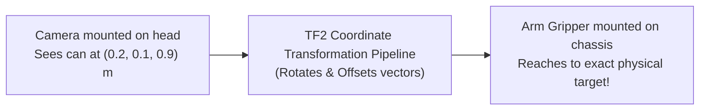
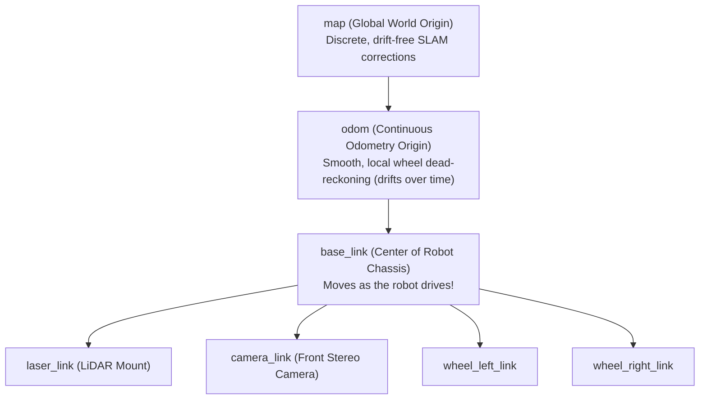

# Unit 8: ROS 2: The Industry Standard Robot Operating System
# Module 8.4: Spatial Relationships with TF2 (Transform Library)

> **Prerequisites**: Module 8.2 (Computational Graph), Unit 5 (Kinematics & Spatial Geometry)  
> **Estimated Time**: 55 minutes  
> **Interactive Activity**: Broadcasting and Querying 3D Spatial Transforms in Python using `tf2_ros`  
> **Target Audience**: High School & College Students (Zero Prior Advanced Spatial Math Background)  

---

## 1. Learning Objectives

By the end of this module, you will be able to:
- [ ] **Explain** why multi-sensor robots require coordinate transform trees to prevent spatial reference mismatch bugs [^1] [^2].
- [ ] **Navigate** the standard robotic coordinate frame hierarchy defined by **REP-105** (`map` $\to$ `odom` $\to$ `base_link` $\to$ sensor frames) [^1] [^2].
- [ ] **Differentiate** between **Static Transforms** (fixed sensor brackets) and **Dynamic Transforms** (moving robot chassis) [^1].
- [ ] **Implement** a TF2 Broadcaster and Transform Listener in Python using `tf2_ros` [^1].
- [ ] **Query** historical spatial transforms using time-travel lookup buffers without throwing extrapolation exceptions [^1] [^2].

---

## 2. Intuitive Big Picture: The Robotic Hand-Eye Coordination Problem

Imagine your friend points toward a table and says: *"Pass me that apple—it is $1\text{ meter}$ directly in front of my nose."*

If you reach $1\text{ meter}$ in front of *your own* nose, you grab empty air! To grasp the apple, your brain instantly calculates a geometric transformation:
1. Where is the apple relative to your friend's nose?
2. Where is your friend's head relative to your shoulder?
3. Where is your shoulder relative to your hand?



In robotics, every sensor and actuator lives in its own private coordinate frame:
- The camera reports targets relative to the camera lens (`camera_link`).
- The LiDAR reports obstacle dots relative to the laser mirror (`laser_link`).
- The robotic arm moves relative to the shoulder joint (`arm_base_link`).

Without a centralized spatial manager, engineers would have to write hundreds of messy matrix multiplication equations. The **TF2 Transform Library** solves this completely by managing a live, time-synchronized spatial tree (`tf2-transform-tree.svg`) [^1] [^2]!

---

## 3. The Core Concept Explained

### 3.1 The Standard Robotic Coordinate Tree (REP-105)

The ROS community standardized coordinate frame naming conventions under **REP-105 (Robot Coordinate Frames for Mobile Platforms)** [^1]:



1. **`map`**: The global reference frame of the building. Fixed to the physical room. Absolute position does not drift, but may jump discretely when a SLAM loop closure occurs (Unit 9).
2. **`odom`**: The dead-reckoning odometry reference frame. Origin is where the robot powered on. Smooth and continuous (never jumps), but slowly drifts over time due to wheel slip (Module 6.2).
3. **`base_link`**: Rigidly attached to the physical robot chassis (usually at the ground center between drive wheels).
4. **Sensor Frames (`camera_link`, `laser_link`)**: Attached to individual sensor brackets.

> [!IMPORTANT]
> **The Golden Rule of TF2 Trees:**  
> A TF2 structure must be a **Directed Acyclic Tree**.  
> - Every coordinate frame must have **exactly one parent**.  
> - Circular loops (Frame A $\to$ Frame B $\to$ Frame A) are strictly prohibited and will crash the transform engine [^1] [^2]!

---

### 3.2 Static vs. Dynamic Transforms

ROS 2 separates spatial transforms into two high-performance categories [^1]:

| Transform Type | Physical Meaning | Broadcast Frequency | Example |
| :--- | :--- | :--- | :--- |
| **Static Transform** (`tf_static`) | Rigid physical mounts that never change position during operation. | Broadcast once at startup; latched in memory with zero network overhead. | Camera bolted $20\text{ cm}$ above and $10\text{ cm}$ forward of `base_link`. |
| **Dynamic Transform** (`/tf`) | Frames that continuously move and rotate relative to their parent. | Broadcast continuously at high frequency ($20\text{ Hz} - 100\text{ Hz}$). | `odom` $\to$ `base_link` (updates as the robot drives across the room). |

---

### 3.3 The Time-Travel Transform Buffer

What happens when your camera captures a photograph at timestamp $t = 12.450\text{ s}$, but your heavy AI object detection node takes $100\text{ ms}$ to process it and finishes at $t = 12.550\text{ s}$?

If you transform the target coordinates using the robot's *current* position at $t = 12.550\text{ s}$, your measurement is wrong because the robot kept driving forward during those $100\text{ ms}$!

TF2 maintains a circular memory buffer (typically the last 10 seconds of spatial history). You can ask TF2:
> *"Transform this vector into the `map` frame using the exact robot position that existed at timestamp $t = 12.450\text{ s}$!"*

TF2 automatically interpolates between time steps using spherical linear interpolation (SLERP) on quaternions to give you the mathematically exact historical transform [^1] [^2]!

---

## 4. Practical Hands-On: Broadcasting & Listening with `tf2_ros`

Let's write a complete Python node demonstrating both a Static Transform Broadcaster and a Transform Listener [^1]:

```python
"""
Instructabot Module 8.4: TF2 Coordinate Broadcaster & Listener in Python
Demonstrates publishing camera offsets and transforming 3D vectors.
"""

import math
import rclpy
from rclpy.node import Node
from geometry_msgs.msg import TransformStamped, PointStamped
from tf2_ros.static_transform_broadcaster import StaticTransformBroadcaster
from tf2_ros.buffer import Buffer
from tf2_ros.transform_listener import TransformListener
import tf2_geometry_msgs  # Crucial for PointStamped transform support!

class SpatialCoordinateNode(Node):
    def __init__(self):
        super().__init__('spatial_coordinate_node')
        
        # 1. Initialize Static Broadcaster (Publishes camera mounting bracket)
        self.tf_static_broadcaster = StaticTransformBroadcaster(self)
        self.broadcast_camera_bracket()

        # 2. Initialize TF2 Buffer and Listener (Queries spatial relationships)
        self.tf_buffer = Buffer()
        self.tf_listener = TransformListener(self.tf_buffer, self)

        # 3. Create a periodic timer to query transform lookups at 2 Hz
        self.timer = self.create_timer(0.5, self.query_target_position)
        self.get_logger().info("📐 TF2 Spatial Coordinate Node online!")

    def broadcast_camera_bracket(self):
        """Broadcasts static transform: base_link -> camera_link."""
        t = TransformStamped()
        t.header.stamp = self.get_clock().now().to_msg()
        t.header.frame_id = 'base_link'        # Parent frame
        t.child_frame_id = 'camera_link'      # Child frame

        # Camera is mounted 15 cm forward (+X) and 25 cm up (+Z) from base center
        t.transform.translation.x = 0.15
        t.transform.translation.y = 0.0
        t.transform.translation.z = 0.25

        # Facing directly forward (Quaternion identity: w=1, x=0, y=0, z=0)
        t.transform.rotation.x = 0.0
        t.transform.rotation.y = 0.0
        t.transform.rotation.z = 0.0
        t.transform.rotation.w = 1.0

        self.tf_static_broadcaster.sendTransform(t)
        self.get_logger().info("📡 Broadcasted static transform: base_link -> camera_link")

    def query_target_position(self):
        """Simulates transforming a detected object from camera_link into base_link."""
        # Suppose camera detects an apple 1.0 meter in front of its lens
        apple_in_camera = PointStamped()
        apple_in_camera.header.frame_id = 'camera_link'
        apple_in_camera.header.stamp = self.get_clock().now().to_msg()
        apple_in_camera.point.x = 1.0  # 1.0m forward
        apple_in_camera.point.y = 0.0
        apple_in_camera.point.z = 0.0

        try:
            # Look up transform from camera_link to base_link
            # (Time(0) means 'get latest available transform')
            apple_in_base = self.tf_buffer.transform(apple_in_camera, 'base_link', timeout=rclpy.duration.Duration(seconds=0.1))
            
            self.get_logger().info(
                f"🍎 Target Coordinates Transformed!\n"
                f"   In camera_link: ({apple_in_camera.point.x:.2f}, {apple_in_camera.point.y:.2f}, {apple_in_camera.point.z:.2f})\n"
                f"   In base_link:   ({apple_in_base.point.x:.2f}, {apple_in_base.point.y:.2f}, {apple_in_base.point.z:.2f})"
            )
        except Exception as ex:
            self.get_logger().warn(f"TF2 lookup not ready yet: {str(ex)}")

def main(args=None):
    rclpy.init(args=args)
    node = SpatialCoordinateNode()
    try:
        rclpy.spin(node)
    except KeyboardInterrupt:
        pass
    finally:
        node.destroy_node()
        rclpy.shutdown()

if __name__ == '__main__':
    main()
```

Notice that the object at $X = 1.00\text{ m}$ in `camera_link` transforms automatically into $X = 1.15\text{ m}, Z = 0.25\text{ m}$ in `base_link`! The mathematics of translation and rotation are handled completely behind the scenes [^1] [^2].

---

## 5. Troubleshooting & TF2 Pitfalls

> [!WARNING]
> **Pitfall 1: Lookup Into The Future (`ExtrapolationException`)**  
> If you call `tf_buffer.lookup_transform(target, source, self.get_clock().now())`, and the broadcaster on another machine has a clock that is $5\text{ ms}$ behind your computer, TF2 will throw `Lookup would require extrapolation into the future`! To safely query the latest transform, pass `rclpy.time.Time()` (Time 0) instead of the current system clock [^1].

> [!WARNING]
> **Pitfall 2: Forgetting `import tf2_geometry_msgs`**  
> If you attempt to call `tf_buffer.transform(point_stamped, 'target_frame')` in Python without importing `tf2_geometry_msgs`, Python throws `TypeError: transform method not implemented for PointStamped`! Always import `tf2_geometry_msgs` to register the transformation methods for geometry messages [^1].

---

## 6. Real-World Applications & Next Steps

TF2 is the mathematical backbone of every robotics deployment:
- **Mobile Manipulators**: When a robot drives up to a dishwasher, TF2 transforms camera pixel detections into base coordinates, and then into 7-DOF arm joint angles to unload plates without colliding.
- **Autonomous Drones**: Quadcopters maintain transforms between GPS global coordinates, onboard visual-inertial odometry, and gimballed camera targets.
- **Humanoid Robotics**: Humanoids track over 30 coordinate frames simultaneously (feet, knees, pelvis, torso, neck, wrists) to calculate Center of Mass (CoM) stability polygons (Module 5.1).

Now that you master nodes, topics, introspection, and coordinate transforms, you are ready for **Lab 8: Building a Modular ROS 2 Robot Control Package**, where you will build a multi-node ROS 2 software package from scratch!

---

## 7. Sources & Media Provenance

### Cited References
[^1]: **Tully Foote**, *"tf: The Transform Library (Spatial Coordinate Frame Management in Robotics)"*, Open Source Robotics Foundation / IEEE Technologies for Practical Robot Applications. License: Creative Commons Attribution 3.0 / BSD-3-Clause. Available: [ROS 2 Official TF2 Documentation](https://docs.ros.org/en/humble/Tutorials/Intermediate/Tf2/Introduction-To-Tf2.html).  
[^2]: **Steven Macenski, Tully Foote, Brian Gerkey, Michael Carroll, Dirk Thomas**, *"Robot Operating System 2: Design, architecture, and uses in the wild"*, Science Robotics, Vol. 7, No. 66. Available: [Science Robotics ROS 2 Article](https://www.science.org/doi/10.1126/scirobotics.abm6074).  
[^3]: **Roland Siegwart, Illah R. Nourbakhsh, Davide Scaramuzza**, *"Introduction to Autonomous Mobile Robots (Chapter 3: Mobile Robot Kinematics & Coordinate Frames)"*, MIT Press. Available: [MIT Press Autonomous Mobile Robots](https://mitpress.mit.edu/9780262015356/introduction-to-autonomous-mobile-robots/).

### Media Manifest
| Asset Name | Media Type | Source / Repository | License | Attribution |
| :--- | :--- | :--- | :--- | :--- |
| `tf2-transform-tree.svg` | Vector Graphic / Architecture | Instructabot Educational Team | CC BY 3.0 | Instructabot Project [^1] [^2] |
| `ros2-computation-graph.svg` | Vector Graphic / Architecture | Instructabot Educational Team | CC BY 3.0 | Instructabot Project [^1] |
| `rviz2-interface.svg` | Vector Graphic / UI Mockup | Instructabot Educational Team | CC BY 3.0 | Instructabot Project [^1] |

---

## 🧭 Lesson Navigation

| ⬅️ Previous Lesson | 🗺️ Course Hub | ➡️ Next Lesson |
| :--- | :---: | ---: |
| [← Module 8.3: Introspection & Visualization Tools (CLI, rqt, RViz2)](03-introspection-rviz2.md) | [**Master Syllabus**](../../syllabus.md) • [**Getting Started**](../../getting_started.md) | [**Lab 8: Building a Modular ROS 2 Robot Control Package →**](lab-08-modular-ros2-package.md) |
