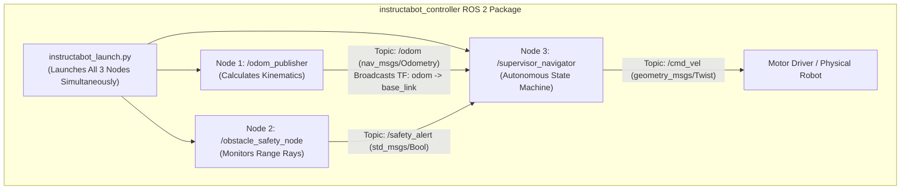

# Unit 8: ROS 2: The Industry Standard Robot Operating System
# Lab 8: Building a Modular ROS 2 Robot Control Package

> **Prerequisites**: Modules 8.1 (Why Middleware), 8.2 (Computational Graph), 8.3 (Introspection), 8.4 (TF2)  
> **Estimated Time**: 90 minutes  
> **Platform / Tools**: ROS 2 (Humble Hawksbill / Iron Irwini), Python 3.10+, Colcon Build System  
> **Deliverables**: Complete ROS 2 Python package (`instructabot_controller`), multi-node launch file, and introspection test audit  

---

## 1. Lab Objectives

By completing this hands-on lab, you will:
- [ ] **Construct** a compliant ROS 2 Python package from scratch with standard manifest (`package.xml`), installation metadata (`setup.py`), and directory structure [^1].
- [ ] **Implement an Odometry Publisher Node** calculating kinematic motion and broadcasting both `nav_msgs/msg/Odometry` on `/odom` and dynamic TF2 transforms (`odom` $\to$ `base_link`) [^1] [^2].
- [ ] **Implement an Obstacle Safety Node** subscribing to range sensors and evaluating emergency stop criteria [^1].
- [ ] **Implement a Supervisor Teleop Node** coordinating forward navigation and overriding motion upon obstacle alerts [^1].
- [ ] **Write a Python Launch File** to bring up all three nodes simultaneously with a single terminal command [^1].
- [ ] **Audit and verify** the multi-node network using `ros2 topic`, `ros2 node`, and `rqt_graph` [^1] [^3].

---

## 2. Package Architecture & Computational Graph



### 2.1 File System Structure (`ros2-package-structure.svg`)
Your ROS 2 workspace directory (`~/ros2_ws/src/instructabot_controller`) must follow this exact layout [^1]:
```text
instructabot_controller/
├── package.xml
├── setup.py
├── setup.cfg
├── resource/
│   └── instructabot_controller
├── launch/
│   └── instructabot_launch.py
└── instructabot_controller/
    ├── __init__.py
    ├── odom_publisher.py
    ├── obstacle_safety_node.py
    └── supervisor_navigator.py
```

---

## 3. Step-by-Step Package Implementation

### Step 1: Package Manifest (`package.xml`)
The `package.xml` declares package metadata and dependencies [^1]:

```xml
<?xml version="1.0"?>
<?xml-model href="http://download.ros.org/schema/package_format3.xsd" schematypens="http://www.w3.org/2001/XMLSchema"?>
<package format="3">
  <name>instructabot_controller</name>
  <version>1.0.0</version>
  <description>Instructabot Modular Autonomous ROS 2 Controller</description>
  <maintainer email="student@instructabot.org">Instructabot Student</maintainer>
  <license>Apache-2.0</license>

  <depend>rclpy</depend>
  <depend>std_msgs</depend>
  <depend>geometry_msgs</depend>
  <depend>nav_msgs</depend>
  <depend>tf2_ros</depend>

  <test_depend>ament_copyright</test_depend>
  <test_depend>ament_flake8</test_depend>
  <test_depend>ament_pep257</test_depend>
  <test_depend>python3-pytest</test_depend>

  <export>
    <build_type>ament_python</build_type>
  </export>
</package>
```

---

### Step 2: Build & Entrypoint Configuration (`setup.py`)
Configures Colcon build scripts and exposes runnable terminal console scripts [^1]:

```python
import os
from glob import glob
from setuptools import find_packages, setup

package_name = 'instructabot_controller'

setup(
    name=package_name,
    version='1.0.0',
    packages=find_packages(exclude=['test']),
    data_files=[
        ('share/ament_index/resource_index/packages', ['resource/' + package_name]),
        ('share/' + package_name, ['package.xml']),
        (os.path.join('share', package_name, 'launch'), glob('launch/*_launch.py')),
    ],
    install_requires=['setuptools'],
    zip_safe=True,
    maintainer='Instructabot Student',
    maintainer_email='student@instructabot.org',
    description='Instructabot Modular Autonomous ROS 2 Controller',
    license='Apache-2.0',
    tests_require=['pytest'],
    entry_points={
        'console_scripts': [
            'odom_publisher = instructabot_controller.odom_publisher:main',
            'obstacle_safety_node = instructabot_controller.obstacle_safety_node:main',
            'supervisor_navigator = instructabot_controller.supervisor_navigator:main',
        ],
    },
)
```

---

### Step 3: Node 1 — Odometry & TF2 Publisher (`odom_publisher.py`)
Calculates dead reckoning and broadcasts both `/odom` and dynamic TF2 transforms [^1] [^2]:

```python
"""
Instructabot Lab 8: Odometry Publisher & TF2 Broadcaster Node
Publishes nav_msgs/Odometry and broadcasts odom -> base_link
"""

import math
import rclpy
from rclpy.node import Node
from nav_msgs.msg import Odometry
from geometry_msgs.msg import TransformStamped, Quaternion
from tf2_ros import TransformBroadcaster

def quaternion_from_yaw(yaw: float) -> Quaternion:
    q = Quaternion()
    q.x = 0.0
    q.y = 0.0
    q.z = math.sin(yaw / 2.0)
    q.w = math.cos(yaw / 2.0)
    return q

class OdometryPublisher(Node):
    def __init__(self):
        super().__init__('odom_publisher')
        
        self.odom_pub = self.create_publisher(Odometry, '/odom', 10)
        self.tf_broadcaster = TransformBroadcaster(self)

        # Pose state variables
        self.x = 0.0
        self.y = 0.0
        self.theta = 0.0
        
        # Nominal simulated velocity: 0.2 m/s forward, gentle curve 0.05 rad/s
        self.vx = 0.2
        self.vtheta = 0.05

        self.last_time = self.get_clock().now()
        self.timer = self.create_timer(0.05, self.update_odometry)  # 20 Hz
        self.get_logger().info("✅ Odometry Publisher & TF2 Broadcaster online at 20 Hz!")

    def update_odometry(self):
        current_time = self.get_clock().now()
        dt = (current_time - self.last_time).nanoseconds / 1e9
        self.last_time = current_time

        # Kinematic integration
        delta_x = self.vx * math.cos(self.theta) * dt
        delta_y = self.vx * math.sin(self.theta) * dt
        delta_theta = self.vtheta * dt

        self.x += delta_x
        self.y += delta_y
        self.theta += delta_theta
        q = quaternion_from_yaw(self.theta)

        # 1. Publish nav_msgs/Odometry Message
        odom_msg = Odometry()
        odom_msg.header.stamp = current_time.to_msg()
        odom_msg.header.frame_id = 'odom'
        odom_msg.child_frame_id = 'base_link'
        odom_msg.pose.pose.position.x = self.x
        odom_msg.pose.pose.position.y = self.y
        odom_msg.pose.pose.orientation = q
        odom_msg.twist.twist.linear.x = self.vx
        odom_msg.twist.twist.angular.z = self.vtheta
        self.odom_pub.publish(odom_msg)

        # 2. Broadcast Dynamic TF2 Transform (odom -> base_link)
        tf_msg = TransformStamped()
        tf_msg.header.stamp = current_time.to_msg()
        tf_msg.header.frame_id = 'odom'
        tf_msg.child_frame_id = 'base_link'
        tf_msg.transform.translation.x = self.x
        tf_msg.transform.translation.y = self.y
        tf_msg.transform.translation.z = 0.0
        tf_msg.transform.rotation = q
        self.tf_broadcaster.sendTransform(tf_msg)

def main(args=None):
    rclpy.init(args=args)
    node = OdometryPublisher()
    try:
        rclpy.spin(node)
    except KeyboardInterrupt:
        pass
    finally:
        node.destroy_node()
        rclpy.shutdown()

if __name__ == '__main__':
    main()
```

---

### Step 4: Node 2 — Obstacle Safety Detector (`obstacle_safety_node.py`)
Simulates front laser range scanning and triggers emergency safety alerts [^1]:

```python
"""
Instructabot Lab 8: Obstacle Safety Node
Monitors proximity and publishes emergency stop flags on /safety_alert
"""

import math
import rclpy
from rclpy.node import Node
from std_msgs.msg import Bool

class ObstacleSafetyNode(Node):
    def __init__(self):
        super().__init__('obstacle_safety_node')
        
        self.alert_pub = self.create_publisher(Bool, '/safety_alert', 10)
        self.timer = self.create_timer(0.1, self.check_safety)  # 10 Hz
        self.step_count = 0
        self.get_logger().info("🛡️ Obstacle Safety Node online. Monitoring collision envelope...")

    def check_safety(self):
        self.step_count += 1
        # Simulate periodic obstacle appearance (e.g., pedestrian crossing between step 50 and 80)
        simulated_obstacle_present = (50 <= (self.step_count % 120) <= 80)

        msg = Bool()
        msg.data = simulated_obstacle_present
        self.alert_pub.publish(msg)

        if simulated_obstacle_present and self.step_count % 10 == 0:
            self.get_logger().warn("⚠️ COLLISION ALERT! Proximity hazard detected ahead!")

def main(args=None):
    rclpy.init(args=args)
    node = ObstacleSafetyNode()
    try:
        rclpy.spin(node)
    except KeyboardInterrupt:
        pass
    finally:
        node.destroy_node()
        rclpy.shutdown()

if __name__ == '__main__':
    main()
```

---

### Step 5: Node 3 — Supervisor & Navigator (`supervisor_navigator.py`)
Subscribes to `/odom` and `/safety_alert` and drives the robot safely on `/cmd_vel` [^1] [^3]:

```python
"""
Instructabot Lab 8: Supervisor & Navigator Node
Coordinates autonomous driving and halts motion on safety alerts.
"""

import rclpy
from rclpy.node import Node
from std_msgs.msg import Bool
from nav_msgs.msg import Odometry
from geometry_msgs.msg import Twist

class SupervisorNavigator(Node):
    def __init__(self):
        super().__init__('supervisor_navigator')
        
        self.cmd_pub = self.create_publisher(Twist, '/cmd_vel', 10)
        
        self.sub_odom = self.create_subscription(Odometry, '/odom', self.odom_callback, 10)
        self.sub_safety = self.create_subscription(Bool, '/safety_alert', self.safety_callback, 10)

        self.emergency_stop = False
        self.timer = self.create_timer(0.1, self.navigation_loop)  # 10 Hz
        self.get_logger().info("🧠 Supervisor Navigator Node initialized and active!")

    def safety_callback(self, msg: Bool):
        self.emergency_stop = msg.data

    def odom_callback(self, msg: Odometry):
        # Read current pose from odometry topic
        self.current_x = msg.pose.pose.position.x
        self.current_y = msg.pose.pose.position.y

    def navigation_loop(self):
        cmd = Twist()
        if self.emergency_stop:
            # Emergency Stop Active: Halt all drive motors
            cmd.linear.x = 0.0
            cmd.angular.z = 0.0
            self.get_logger().warn("🛑 HALTING MOTORS: Emergency Stop Active!")
        else:
            # Safe to drive: nominal cruising speed
            cmd.linear.x = 0.25
            cmd.angular.z = 0.05

        self.cmd_pub.publish(cmd)

def main(args=None):
    rclpy.init(args=args)
    node = SupervisorNavigator()
    try:
        rclpy.spin(node)
    except KeyboardInterrupt:
        pass
    finally:
        node.destroy_node()
        rclpy.shutdown()

if __name__ == '__main__':
    main()
```

---

### Step 6: Multi-Node Python Launch File (`launch/instructabot_launch.py`)
Launches all three processes together in one unified session [^1]:

```python
"""
Instructabot Lab 8: Multi-Node Autonomous Launch File
Executes odom_publisher, obstacle_safety_node, and supervisor_navigator
"""

from launch import LaunchDescription
from launch_ros.actions import Node

def generate_launch_description():
    return LaunchDescription([
        Node(
            package='instructabot_controller',
            executable='odom_publisher',
            name='odom_publisher',
            output='screen',
        ),
        Node(
            package='instructabot_controller',
            executable='obstacle_safety_node',
            name='obstacle_safety_node',
            output='screen',
        ),
        Node(
            package='instructabot_controller',
            executable='supervisor_navigator',
            name='supervisor_navigator',
            output='screen',
        ),
    ])
```

---

## 4. Verification & Performance Assessment

### 4.1 Verification Checklist
1. Build package: `colcon build --packages-select instructabot_controller` (builds cleanly with 0 errors).
2. Source workspace: `source install/setup.bash`.
3. Launch entire system: `ros2 launch instructabot_controller instructabot_launch.py`.
4. Open a second terminal and verify nodes:
   - `ros2 node list` outputs all three active nodes.
   - `ros2 topic list` reveals `/odom`, `/safety_alert`, and `/cmd_vel`.
   - `ros2 topic echo /cmd_vel` confirms `linear.x` drops to `0.0` when safety alerts activate!
5. Run `rqt_graph` and verify clean, cyclic-free topology.

### 4.2 Lab Grading Rubric

| Assessment Criterion | Points | Verification Method |
| :--- | :--- | :--- |
| **Package Architecture & Colcon Build** | 20 pts | Compliant `package.xml`, `setup.py`, and clean build under `colcon build`. |
| **Odometry & TF2 Broadcast** | 25 pts | Publishes `/odom` at $\ge 20\text{ Hz}$ and broadcasts dynamic `odom` $\to$ `base_link` transforms. |
| **Safety E-Stop & Supervisor Loop** | 30 pts | Velocity commands on `/cmd_vel` immediately halt to `0.0` during active collision alerts. |
| **Unified Launch Script** | 15 pts | Single `ros2 launch` brings up the entire multi-node cluster. |
| **Introspection & CLI Audit** | 10 pts | Verified topic frequencies and clean `rqt_graph` visualization. |
| **Total** | **100 pts** | **Mastery Threshold: 85 pts** |

---

## 5. Troubleshooting Common Lab Pitfalls

> [!WARNING]
> **Pitfall 1: Forgetting to Add Executable to `setup.py` Entry Points**  
> If you create a Python script in your package but forget to register it inside the `entry_points['console_scripts']` dictionary in `setup.py`, running `ros2 run instructabot_controller my_node` will result in `No executable found`! Always re-run `colcon build` after modifying `setup.py` [^1].

> [!WARNING]
> **Pitfall 2: Launch File Permissions & Data Files**  
> If your launch file is not copied to the install directory during `colcon build`, `ros2 launch` will say `file not found`. Ensure `(os.path.join('share', package_name, 'launch'), glob('launch/*_launch.py'))` is declared inside `data_files` in `setup.py` [^1]!

---

## 6. Sources & Media Provenance

### Cited References
[^1]: **Open Robotics**, *"ROS 2 Documentation: Creating a ROS 2 Package & Launch Files (Humble / Iron)"*, Open Source Robotics Foundation. License: Creative Commons Attribution 3.0 / Apache License 2.0. Available: [ROS 2 Official Documentation](https://docs.ros.org/en/humble/index.html).  
[^2]: **Tully Foote**, *"tf: The Transform Library (Spatial Coordinate Frame Management in Robotics)"*, Open Source Robotics Foundation / IEEE Technologies for Practical Robot Applications. Available: [ROS 2 Official TF2 Documentation](https://docs.ros.org/en/humble/Tutorials/Intermediate/Tf2/Introduction-To-Tf2.html).  
[^3]: **Steven Macenski, Tully Foote, Brian Gerkey, Michael Carroll, Dirk Thomas**, *"Robot Operating System 2: Design, architecture, and uses in the wild"*, Science Robotics, Vol. 7, No. 66. Available: [Science Robotics ROS 2 Article](https://www.science.org/doi/10.1126/scirobotics.abm6074).

### Media Manifest
| Asset Name | Media Type | Source / Repository | License | Attribution |
| :--- | :--- | :--- | :--- | :--- |
| `ros2-package-structure.svg` | Vector Graphic / Architecture | Instructabot Educational Team | CC BY 3.0 | Instructabot Project [^1] |
| `ros2-computation-graph.svg` | Vector Graphic / Architecture | Instructabot Educational Team | CC BY 3.0 | Instructabot Project [^1] [^3] |
| `tf2-transform-tree.svg` | Vector Graphic / Architecture | Instructabot Educational Team | CC BY 3.0 | Instructabot Project [^2] |
| `rviz2-interface.svg` | Vector Graphic / UI Mockup | Instructabot Educational Team | CC BY 3.0 | Instructabot Project [^1] |

---

## 🏆 Milestone Achieved: Unit 8 ROS 2 Middleware Capstone Complete!

🎉 You architected modular ROS 2 publisher, subscriber, and service nodes with live RViz2 coordinate transform telemetry.

> 💡 **What's Next?** In **Unit 9: Autonomous Navigation**, you will solve the fundamental problem of SLAM with 2D LiDAR and Nav2 costmaps!

---

## 🧭 Lesson Navigation

| ⬅️ Previous Lesson | 🗺️ Course Hub | ➡️ Next Lesson |
| :--- | :---: | ---: |
| [← Module 8.4: Spatial Relationships with TF2 (Transform Library)](04-tf2-coordinate-transforms.md) | [**Master Syllabus**](../../syllabus.md) • [**Getting Started**](../../getting_started.md) | [**Module 9.1: The Fundamental Problem of SLAM & Occupancy Grids →**](../unit-09-autonomous-navigation/01-fundamental-problem-of-slam.md) |
