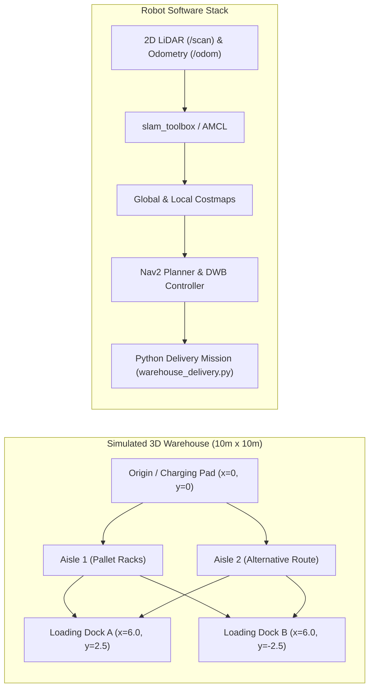

# Unit 9: Autonomous Navigation: SLAM & Path Planning
# Lab 9: Autonomous Warehouse Delivery Challenge

> **Prerequisites**: Modules 9.1 (Occupancy Grids), 9.2 (SLAM), 9.3 (Path Planning), 9.4 (Nav2 Stack), Unit 8 (ROS 2)  
> **Estimated Time**: 90 minutes  
> **Platform / Tools**: ROS 2 (Humble/Iron), Nav2, Webots / Gazebo Simulator, Python 3.10+  
> **Deliverables**: Saved warehouse map (`warehouse_map.yaml`/`pgm`), delivery script (`warehouse_delivery.py`), and obstacle navigation benchmark  

---

## 1. Lab Objectives

By completing this hands-on lab, you will:
- [ ] **Generate a high-resolution 2D occupancy grid map** of a simulated industrial warehouse using 2D LiDAR and `slam_toolbox` [^1] [^2].
- [ ] **Save and export** the spatial map artifacts (`warehouse_map.yaml` and `.pgm`) using the Nav2 Map Server CLI [^1].
- [ ] **Tune Costmap2D parameters** (inflation radius, robot footprint, and clearing thresholds) to prevent doorway wedging while maintaining safe wall clearance [^1] [^3].
- [ ] **Implement a multi-stop autonomous delivery mission** in Python navigating sequentially between Loading Docks A, B, and the Maintenance Bay [^1].
- [ ] **Validate dynamic obstacle avoidance**: Verify that the local controller successfully re-routes the robot through an alternate aisle when a corridor is physically blocked [^1] [^3].

---

## 2. Warehouse Environment & Hardware Topology



### 2.1 Mission Waypoint Specification
Your delivery AMR (Autonomous Mobile Robot) must service three stations [^1]:
1. **Home Base / Charging Bay**: $(x = 0.0\text{ m}, y = 0.0\text{ m}, \text{Yaw} = 0^\circ)$
2. **Loading Dock A**: $(x = 5.5\text{ m}, y = 2.0\text{ m}, \text{Yaw} = 0^\circ)$
3. **Loading Dock B**: $(x = 5.5\text{ m}, y = -2.0\text{ m}, \text{Yaw} = 180^\circ)$

---

## 3. Step-by-Step Implementation Guide

### Step 1: Mapping the Warehouse with `slam_toolbox`
1. Launch the warehouse simulation environment and robot base:
   ```bash
   ros2 launch warehouse_sim robot_warehouse_launch.py
   ```
2. In a separate terminal, launch the online synchronous SLAM node:
   ```bash
   ros2 launch slam_toolbox online_sync_launch.py
   ```
3. Open RViz2 and teleoperate the robot slowly through all aisles to paint the occupancy grid (`occupancy-grid.svg`):
   ```bash
   ros2 run teleop_twist_keyboard teleop_twist_keyboard
   ```
4. Complete a full loop around the warehouse perimeter to trigger **Loop Closure** (Module 9.2).
5. Save the generated map to disk:
   ```bash
   ros2 run nav2_map_server map_saver_cli -f ~/maps/warehouse_map
   ```
   This generates two files: `warehouse_map.pgm` (greyscale image) and `warehouse_map.yaml` (metadata: resolution, origin coordinates).

---

### Step 2: Nav2 Costmap & Controller Configuration (`nav2_params.yaml`)

Configure your footprint and inflation layers inside `nav2_params.yaml` [^1] (`a-star-costmap.svg`):

```yaml
global_costmap:
  global_costmap:
    ros__parameters:
      update_frequency: 1.0
      publish_frequency: 1.0
      global_frame: map
      robot_base_frame: base_link
      robot_radius: 0.22  # Physical robot radius in meters
      resolution: 0.05
      plugins: ["static_layer", "obstacle_layer", "inflation_layer"]
      inflation_layer:
        plugin: "nav2_costmap_2d::InflationLayer"
        cost_scaling_factor: 3.0
        inflation_radius: 0.55  # 55 cm safety bubble around obstacles
      static_layer:
        plugin: "nav2_costmap_2d::StaticLayer"
        map_subscribe_transient_local: True

local_costmap:
  local_costmap:
    ros__parameters:
      update_frequency: 5.0
      publish_frequency: 2.0
      global_frame: odom
      robot_base_frame: base_link
      robot_radius: 0.22
      resolution: 0.05
      plugins: ["obstacle_layer", "inflation_layer"]
      obstacle_layer:
        plugin: "nav2_costmap_2d::ObstacleLayer"
        enabled: True
        observation_sources: scan
        scan:
          topic: /scan
          max_obstacle_height: 2.0
          clearing: True   # Crucial: Clears dynamic obstacles when they move away!
          marking: True
          data_type: "LaserScan"
```

---

### Step 3: Autonomous Multi-Stop Delivery Script (`warehouse_delivery.py`)

Here is the complete Python mission commander using the `BasicNavigator` API [^1] [^2]:

```python
"""
Instructabot Lab 9: Autonomous Warehouse Delivery Mission
Coordinates multi-stop waypoint delivery and monitors dynamic obstacle avoidance.
"""

import time
import math
import rclpy
from geometry_msgs.msg import PoseStamped
from nav2_simple_commander.robot_navigator import BasicNavigator, TaskResult

def create_pose(nav, x, y, yaw_deg):
    """Helper to construct a timestamped PoseStamped object."""
    pose = PoseStamped()
    pose.header.frame_id = 'map'
    pose.header.stamp = nav.get_clock().now().to_msg()
    pose.pose.position.x = float(x)
    pose.pose.position.y = float(y)
    
    # Convert yaw degrees to quaternion
    yaw_rad = math.radians(yaw_deg)
    pose.pose.orientation.z = math.sin(yaw_rad / 2.0)
    pose.pose.orientation.w = math.cos(yaw_rad / 2.0)
    return pose

def main():
    rclpy.init()
    nav = BasicNavigator()

    # 1. Set Initial Robot Pose Estimate (Dock / Home Bay)
    initial_pose = create_pose(nav, 0.0, 0.0, 0.0)
    nav.setInitialPose(initial_pose)

    # 2. Wait for Nav2 Stack Activation
    print("⏳ Waiting for Nav2 stack lifecycle activation...")
    nav.waitUntilNav2Active()
    print("✅ Nav2 is active! Commencing Warehouse Delivery Route.")

    # 3. Define Delivery Waypoints
    delivery_stops = [
        {"name": "Loading Dock A", "x": 5.5, "y":  2.0, "yaw": 0.0},
        {"name": "Loading Dock B", "x": 5.5, "y": -2.0, "yaw": 180.0},
        {"name": "Home Charging Bay", "x": 0.0, "y":  0.0, "yaw": 0.0},
    ]

    for stop in delivery_stops:
        target_name = stop["name"]
        target_pose = create_pose(nav, stop["x"], stop["y"], stop["yaw"])
        
        print(f"\n📦 Dispatching to {target_name} at ({stop['x']}, {stop['y']})...")
        nav.goToPose(target_pose)

        while not nav.isTaskComplete():
            feedback = nav.getFeedback()
            if feedback:
                dist = feedback.distance_remaining
                print(f"   [Progress] En route to {target_name}: {dist:.2f}m remaining...", end='\r')
            time.sleep(0.5)

        result = nav.getResult()
        if result == TaskResult.SUCCEEDED:
            print(f"\n✅ Arrived at {target_name}! Unloading freight (simulating 3s dwell)...")
            time.sleep(3.0)
        else:
            print(f"\n❌ Delivery to {target_name} failed or was preempted! Result code: {result}")
            break

    print("\n🎉 Entire Warehouse Delivery Challenge Completed Successfully!")
    rclpy.shutdown()

if __name__ == '__main__':
    main()
```

---

## 4. Verification & Performance Assessment

### 4.1 Verification Checklist
- [ ] SLAM map possesses crisp, straight walls with zero ghost double-walls.
- [ ] Map metadata (`warehouse_map.yaml`) correctly specifies resolution ($0.05\text{ m/cell}$) and origin.
- [ ] Robot initializes AMCL localization cleanly inside $\pm 10\text{ cm}$ of true ground truth.
- [ ] Global planner computes an $A^*$ path staying strictly outside the inflated obstacle buffer.
- [ ] During transit to Dock A, placing a physical obstacle in Aisle 1 causes Nav2 to dynamically divert through Aisle 2 without colliding.
- [ ] Robot arrives at all three waypoints with final positioning tolerance $< 0.15\text{ m}$ and angular tolerance $< 10^\circ$.

### 4.2 Lab Grading Rubric

| Assessment Criterion | Points | Verification Method |
| :--- | :--- | :--- |
| **SLAM Map Quality & Resolution** | 25 pts | Saved map is fully closed, sharp, and correctly captures all racks and walls. |
| **Costmap Configuration & Inflation** | 25 pts | Correct inflation radius ($0.55\text{ m}$) preventing doorway wedging. |
| **Multi-Waypoint Mission Execution** | 30 pts | Sequentially services Dock A, Dock B, and Home Bay autonomously. |
| **Dynamic Obstacle Re-Routing** | 20 pts | Successfully detours around a newly blocked aisle without getting stuck in local minima. |
| **Total** | **100 pts** | **Mastery Threshold: 85 pts** |

---

## 5. Troubleshooting Common Lab Pitfalls

> [!WARNING]
> **Pitfall 1: Teleoperating Too Fast During SLAM**  
> If you drive the robot faster than $0.4\text{ m/s}$ or spin rapidly while mapping, the laser scan-matching algorithm cannot find sufficient point overlap between scans! The map will tear and twist. Drive slowly, especially around corners, to give the particle filter time to converge [^1] [^2].

> [!WARNING]
> **Pitfall 2: Tolerance Stalling at Goal Pose**  
> If `xy_goal_tolerance` is set unrealistically tight (e.g., $1\text{ cm}$), the robot will arrive at the destination, oscillate back and forth trying to achieve sub-millimeter precision, and never declare mission complete! Set `xy_goal_tolerance: 0.15` ($15\text{ cm}$) and `yaw_goal_tolerance: 0.20` ($\sim 11^\circ$) [^1].

---

## 6. Sources & Media Provenance

### Cited References
[^1]: **Steven Macenski, Nav2 Working Group**, *"Nav2 (ROS 2 Navigation Framework) Official Documentation: Full Navigation Tutorial"*, Open Navigation LLC / Open Robotics. License: Apache License 2.0. Available: [Nav2 Documentation](https://navigation.ros.org/).  
[^2]: **Sebastian Thrun, Wolfram Burgard, Dieter Fox**, *"Probabilistic Robotics (Chapter 9: Occupancy Grid Mapping, Chapter 10: Graph SLAM)"*, MIT Press. Available: [MIT Press Probabilistic Robotics](https://mitpress.mit.edu/9780262015356/probabilistic-robotics/).  
[^3]: **Steven Macenski, Tully Foote, Brian Gerkey, Michael Carroll, Dirk Thomas**, *"Robot Operating System 2: Design, architecture, and uses in the wild"*, Science Robotics, Vol. 7, No. 66. Available: [Science Robotics ROS 2 Article](https://www.science.org/doi/10.1126/scirobotics.abm6074).

### Media Manifest
| Asset Name | Media Type | Source / Repository | License | Attribution |
| :--- | :--- | :--- | :--- | :--- |
| `occupancy-grid.svg` | Vector Graphic / Map Schematic | Instructabot Educational Team | CC BY-SA 4.0 | Instructabot Project [^2] |
| `a-star-costmap.svg` | Vector Graphic / Architecture | Instructabot Educational Team | CC BY-SA 4.0 | Instructabot Project [^1] |
| `nav2-architecture.svg` | Vector Graphic / Architecture | Instructabot Educational Team | CC BY-SA 4.0 | Instructabot Project [^1] [^3] |
| `loop-closure-graph.svg` | Vector Graphic / Pose Graph | Instructabot Educational Team | CC BY-SA 4.0 | Instructabot Project [^2] [^3] |

---

## 🏆 Milestone Achieved: Unit 9 SLAM & Navigation Capstone Complete!

🎉 You mapped an unfamiliar warehouse with 2D LiDAR SLAM and commanded obstacle-aware waypoint navigation via Nav2.

> 💡 **What's Next?** In **Unit 10: Modern AI & Sim2Real**, you will complete the grand capstone: YOLO object detection, 3D point clouds, and mobile manipulation!

---

## 🧭 Lesson Navigation

| ⬅️ Previous Lesson | 🗺️ Course Hub | ➡️ Next Lesson |
| :--- | :---: | ---: |
| [← Module 9.4: The ROS 2 Navigation Stack (Nav2 Architecture)](04-nav2-stack-architecture.md) | [**Master Syllabus**](../../syllabus.md) • [**Getting Started**](../../getting_started.md) | [**Module 10.1: Classical Control vs. Machine Learning in Robotics →**](../unit-10-modern-ai-sim2real/01-classical-vs-ai-robotics.md) |
